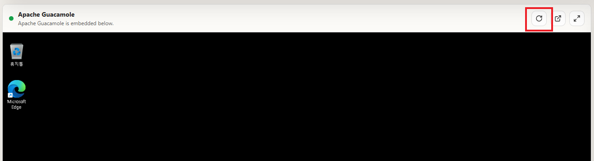
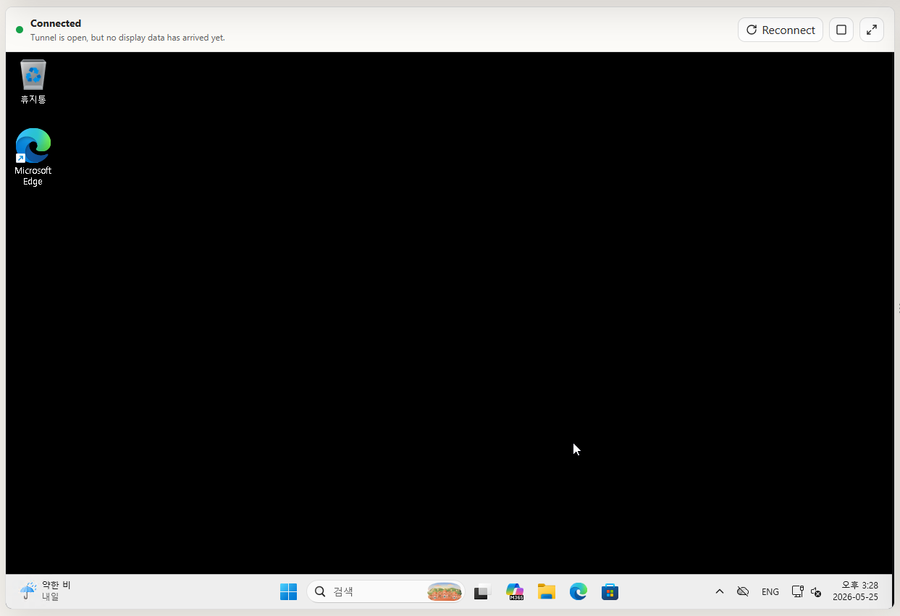

# L01. 준비 — VM 연결 & 계정
{: .no_toc }

안녕하세요! 이 핸즈온 랩은 MCP 서버를 활용하는 고급 에이전트의 다양한 기술 방법을 체험하기 위해 고안되었습니다. 각 수강생마다 할당된 VM과 라이선스를 사용합니다. 먼저 원격으로 VM에 접속하는 방법을 배워보겠습니다.

---

## VM 연결

- 왼쪽 VM 패널에 Apache Guacamole 세션이 표시될 때까지 기다립니다.

{: .note }
> 최초 접속에는 보안 구성을 위한 시간이 약간 소요될 수 있습니다. 수차례 반복해서 시도해야 할 수도 있습니다.

- 접속에 성공하여 아래와 같이 Windows 바탕화면이 보이면 성공입니다.

{: .highlight }
> 이후 접속에 문제가 생기면, 왼쪽 VM 패널의 새로고침 버튼을 클릭하면 다시 로드됩니다.

---

## M365 계정 정보

이 핸즈온에서는 강사가 제공하는 M365 계정 정보를 사용합니다.

| 항목 | 내용 |
|:-----|:-----|
| 계정 | 강사가 제공한 계정 |
| 비번 | 강사가 제공한 비밀번호 |

{: .warning }
> 이 계정은 핸즈온 랩에서만 사용되는 임시 계정입니다. 랩이 끝난 뒤에는 더 이상 사용할 수 없습니다.
