# L02. 처음 MCP 에이전트 만들어 보기 (로우코드)
{: .no_toc }

이번 단계에서는 Microsoft Copilot Studio에서 간단한 에이전트를 만들어 보고, MCP 도구를 추가해서 테스트해보는 과정을 진행합니다.

---

## Step 1. Copilot Studio 접속하기

1. Edge 브라우저를 열고, 주소창에 `https://copilotstudio.microsoft.com` 을 입력해서 Copilot Studio에 접속합니다.
2. Microsoft 계정으로 로그인합니다.

   | 항목 | 내용 |
   |:-----|:-----|
   | 주소 | `https://copilotstudio.microsoft.com` |
   | 계정 | 강사가 제공한 계정 |
   | 비번 | 강사가 제공한 비밀번호 |

3. 로그인한 후, 계정 정보를 저장하면 이후 진행에 도움이 됩니다.

   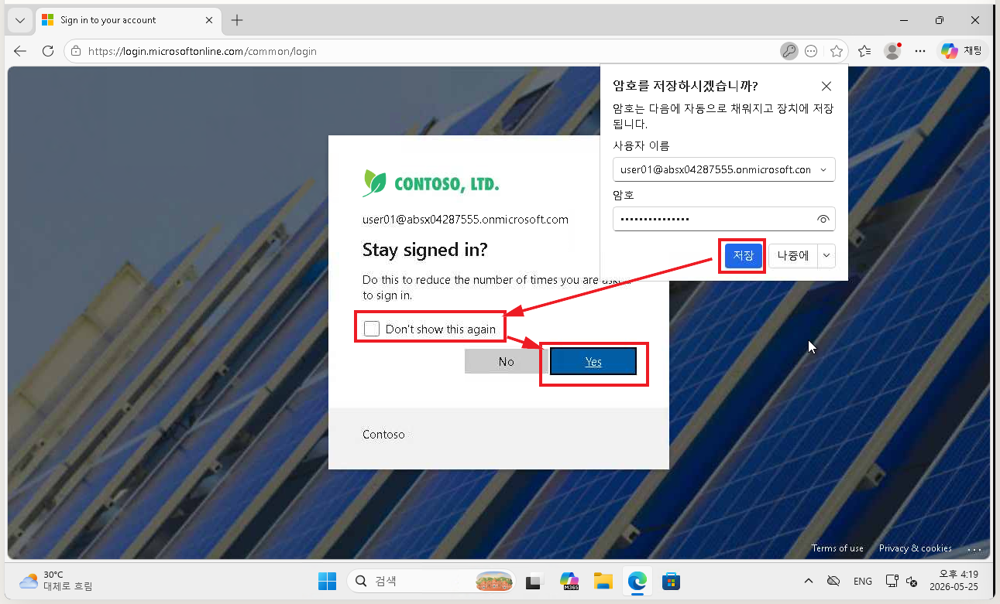

4. 최초 접속 시 시간이 좀 걸릴 수 있습니다. 대시보드가 보이면 정상적으로 접속된 것입니다.

   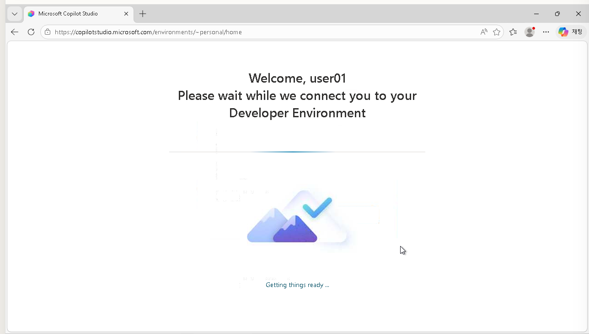

5. "Get Started" 버튼을 클릭해서 창을 닫습니다.

   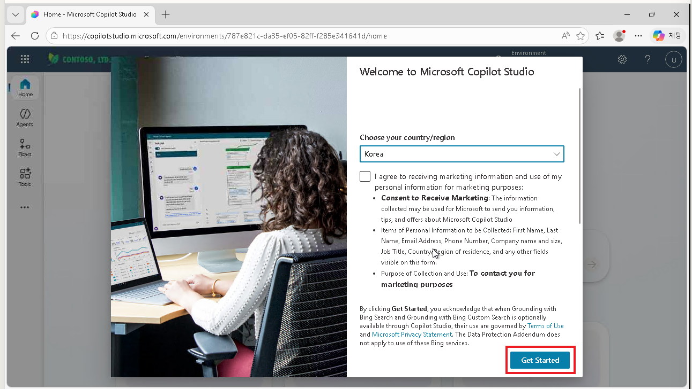

6. "Skip"을 클릭합니다.

   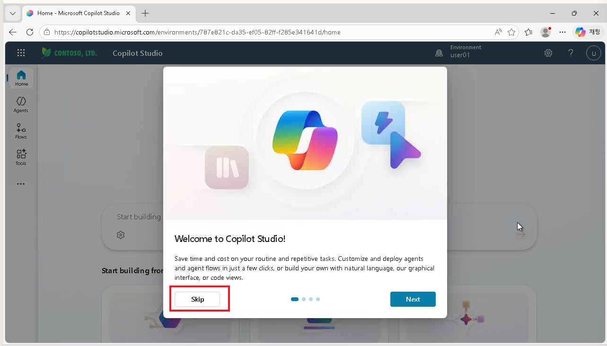

---

## Step 2. 파워플랫폼 환경 확인하기

1. 이제 Copilot Studio에 접속이 완료되었습니다.

   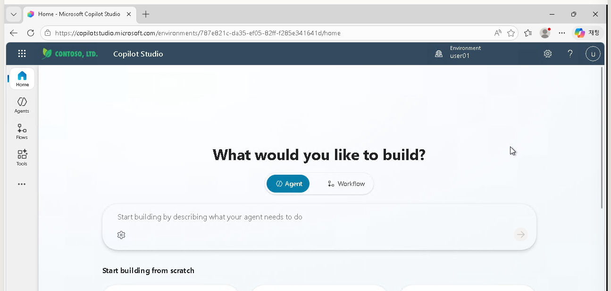

2. 우측 상단에서 Environment 드롭다운을 클릭해서 "Default"가 아닌 **내 계정의 이름과 동일한 환경**이 선택되어 있는지 확인합니다.

   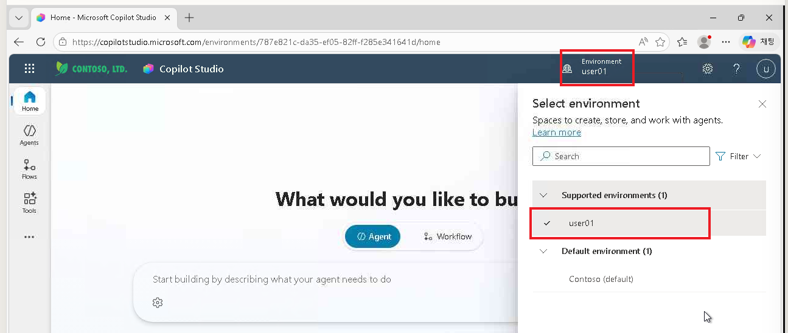

---

## Step 3. 에이전트 만들기

1. Copilot Studio 대시보드에서 **Create blank Agent** 버튼을 클릭합니다.
2. 에이전트 이름을 입력하고, 필요한 설정(한국어)을 선택한 뒤 **Create** 버튼을 클릭합니다.

   `mcptest1`

   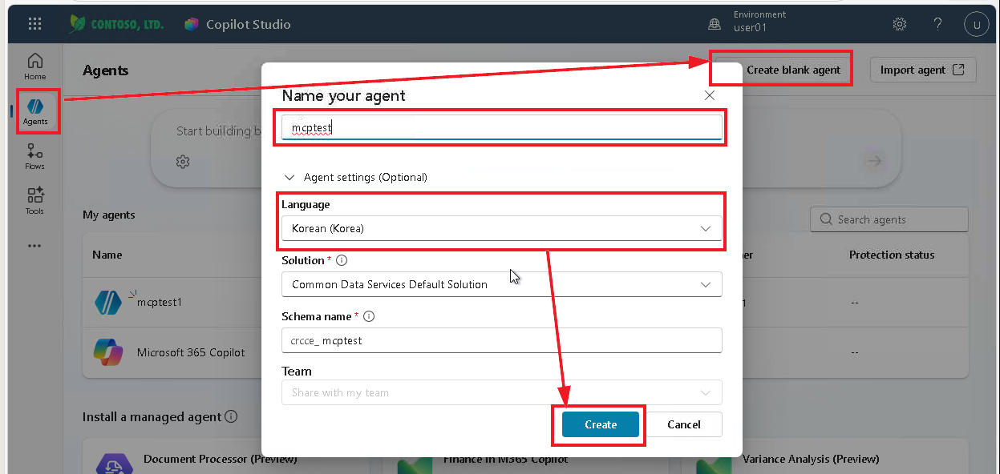

3. 에이전트가 생성되면, "Your agent has been provisioned" 메시지가 나타납니다.

   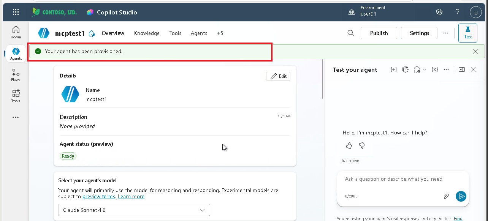

---

## Step 4. MCP 도구 추가하기

1. 생성된 에이전트의 Tools 페이지로 이동하여, "Add a Tool" 버튼을 클릭합니다.

   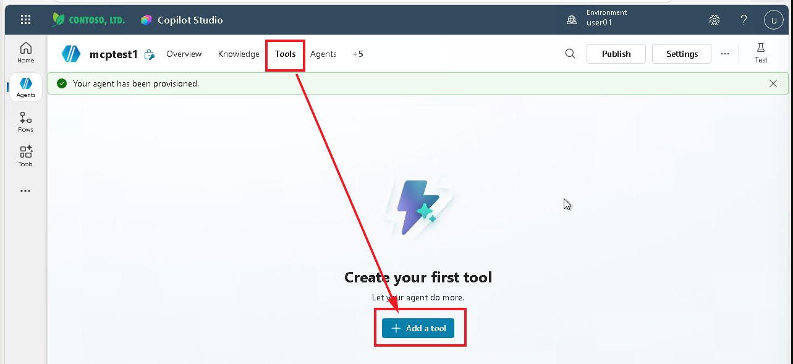

2. 도구 추가 팝업창에서 "MCP"를 찾아 클릭합니다.

   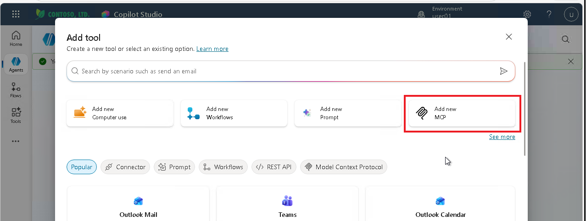

3. MCP 서버 추가 페이지에서 아래의 내용을 입력합니다.

   | 항목 | 내용 |
   |:-----|:-----|
   | Server name | `Microsoft-Learn` |
   | Server description | `Microsoft 기술 주제에 관한 다양한 정보를 제공하는 서버입니다.` |
   | Server URL | `https://learn.microsoft.com/api/mcp` |

4. "Create" 버튼을 클릭해서 MCP 도구를 추가합니다.

   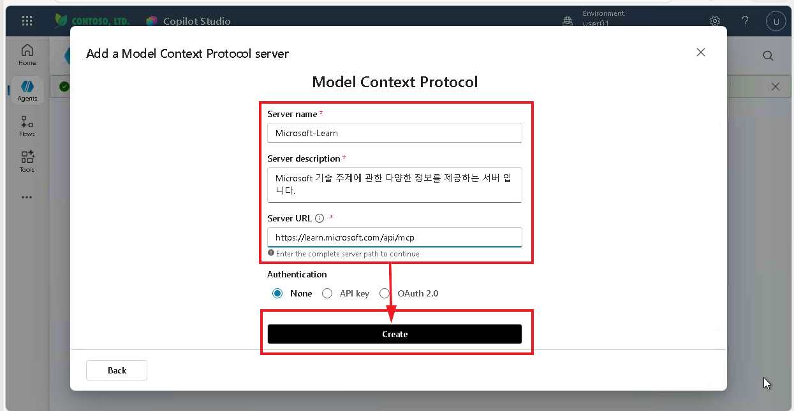

5. 처음 이 도구를 추가한 것이기 때문에, 아직 연결이 없을 것입니다. 연결을 추가합니다.

   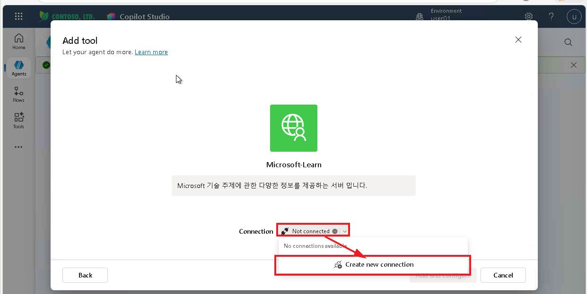

6. 연결을 만듭니다.

   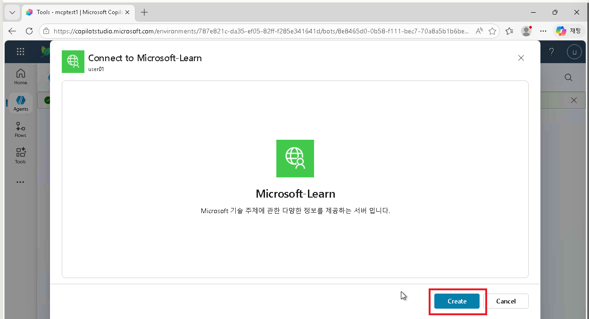

7. 연결이 만들어지면 녹색 아이콘을 볼 수 있습니다. "Add and Configure" 버튼을 클릭해서 추가합니다.

   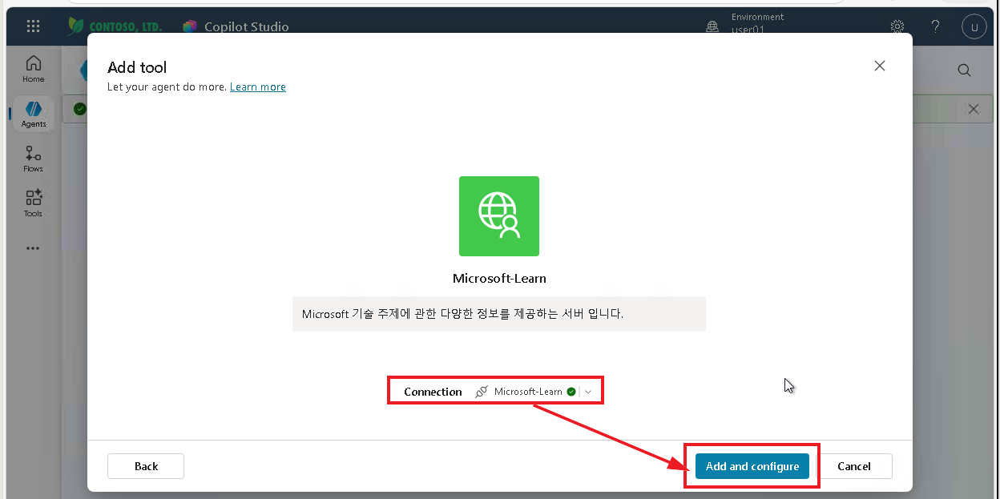

8. MCP 도구가 추가된 후 Tools 페이지에서 MCP 도구가 보이는지 확인합니다.

   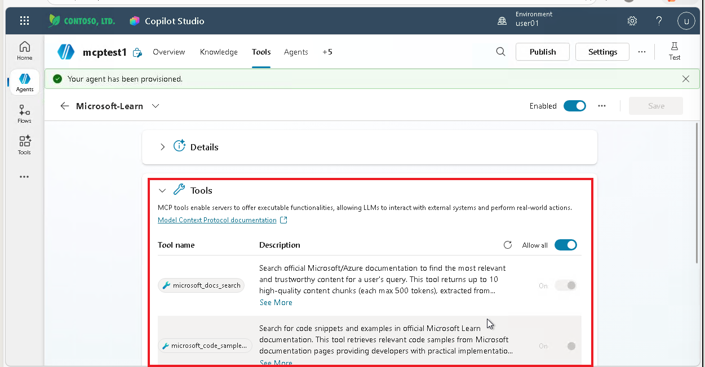

9. 마지막으로 Details 하위 항목 중 **Credentials to use**의 선택값을 "Maker-provided credentials"로 바꿔줍니다. 이렇게 하면 에이전트를 사용할 때 사용자 인증을 묻지 않습니다. "Save" 버튼을 클릭해서 저장합니다.

   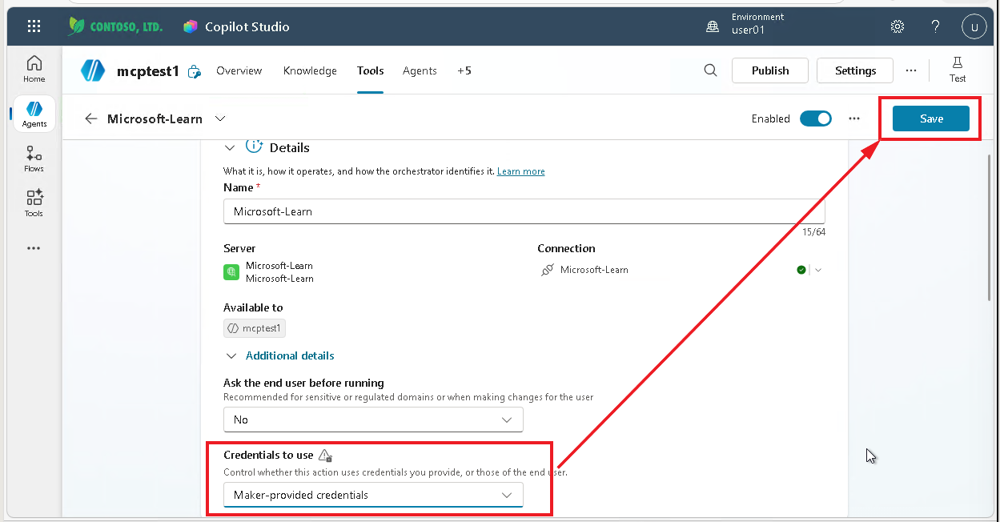

---

## Step 5. 에이전트 테스트하기

1. 에이전트 개요 페이지에서 **Test** 버튼을 클릭합니다.
2. 테스트 창에서 MCP 도구를 사용하여 간단한 명령을 실행해봅니다.

   ```
   코파일럿 에이전트를 만드는 방법들을 소개해줘요.
   ```

   ```
   Azure 클라우드에 로그인이 실패하는데 어떻게 해결할 수 있을까요?
   ```

   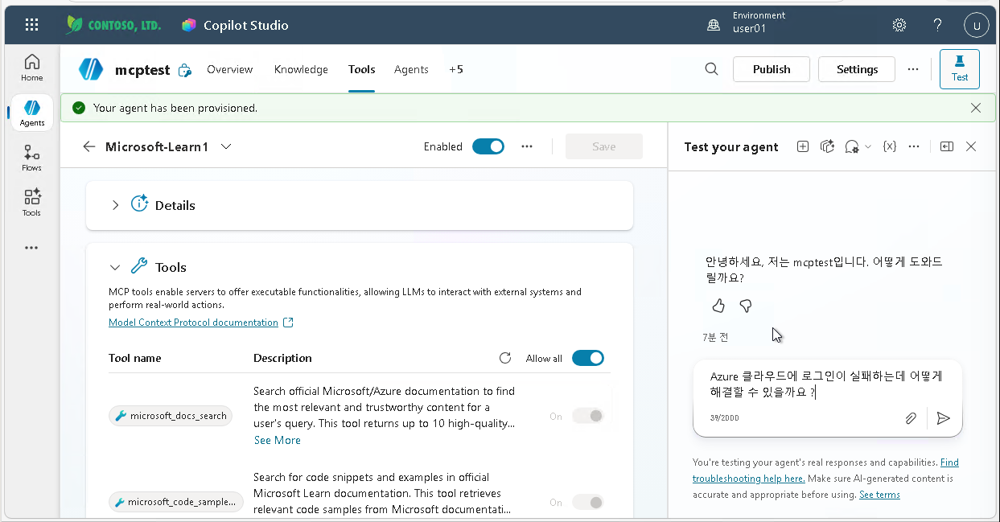

3. 명령이 실행되고, 결과가 나타나는 것을 확인합니다.

   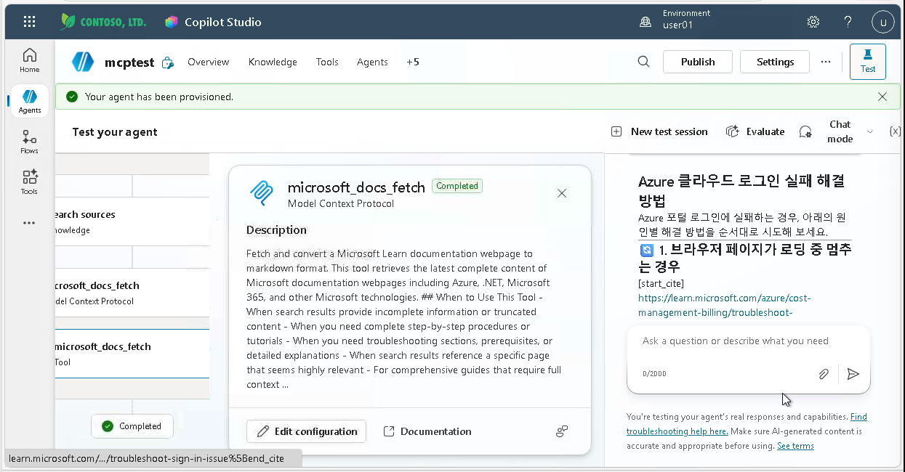
