# L03. 바이브 코딩으로 MCP 서버 만들자
{: .no_toc }

이제 이 핸즈온 랩의 진짜 목적인 MCP 서버를 만들어보는 단계에 들어왔습니다. 이 단계에서는 **바이브 코딩**을 활용해서 MCP 서버를 만들어보겠습니다.

바이브 코딩이란, AI가 코드를 작성하는 것을 실시간으로 보여주는 방법론입니다. 이를 통해 AI가 코드를 작성하는 과정을 관찰하고 이해할 수 있으며, 코드 작성 과정에서 발생하는 문제점이나 개선점을 실시간으로 파악하여 코드 품질을 높일 수 있습니다.

---

## Step 1. 바이브 코딩 환경 구성

우리는 오늘의 바이브 코딩을 위해 VS Code를 사용할 것입니다. 그리고 둘 중 하나의 방법을 골라 바이브 코딩을 시작할 것입니다.

{: .warning }
> 바이브 코딩을 사용하려면 유료 구독이 필요한데, 본 핸즈온에서는 그 부분을 제공해 드리지 못합니다. **각자 자신이 사용할 수 있는 GitHub Copilot 계정이나 ChatGPT 계정을 사용해서 바이브 코딩을 진행해 주시기 바랍니다.**

### 방법 1: GitHub Copilot 사용하기

{: .highlight }
> VS Code의 Copilot 기능을 활용해서 바이브 코딩을 진행할 수 있습니다. 개인이나 조직이 가진 GitHub 계정으로 로그인한 후, Copilot 기능을 활성화하면 됩니다.
> 추가 대안으로 BYOK 방식으로 OpenAI의 API 키를 활용해서 Codex 모델을 사용할 수도 있습니다.
> - <https://docs.github.com/en/copilot/how-tos/copilot-cli/customize-copilot/use-byok-models>
> - <https://code.visualstudio.com/docs/copilot/customization/language-models#_bring-your-own-language-model-key>

1. VS Code에서 GitHub Copilot 확장 프로그램을 설치합니다. (이미 설치되어 있습니다.)
2. VS Code 우측 상단에서 Sign In 아이콘을 클릭하여 로그인합니다.

   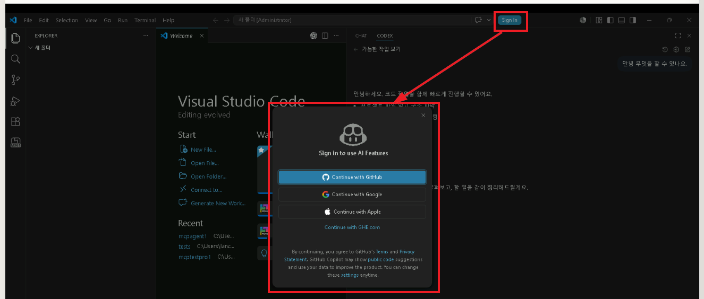

3. 구성이 완료되면 아래와 같이 기본적인 질문에 응답하는 것을 볼 수 있습니다.

   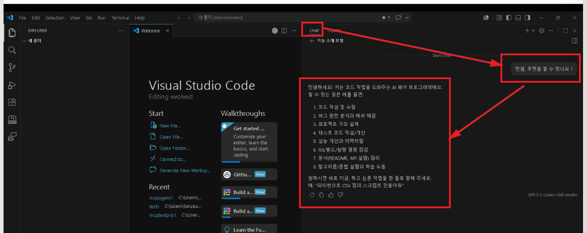

### 방법 2: OpenAI Codex 사용하기

{: .highlight }
> OpenAI의 Codex 모델을 활용해서 바이브 코딩을 진행할 수 있습니다. Codex 모델을 사용하려면 OpenAI 계정과 API 키가 필요합니다.

1. VS Code에서 OpenAI Codex 확장 프로그램을 설치합니다. (이미 설치되어 있습니다.)
2. VS Code 우측 상단에서 Codex 아이콘을 클릭합니다.

   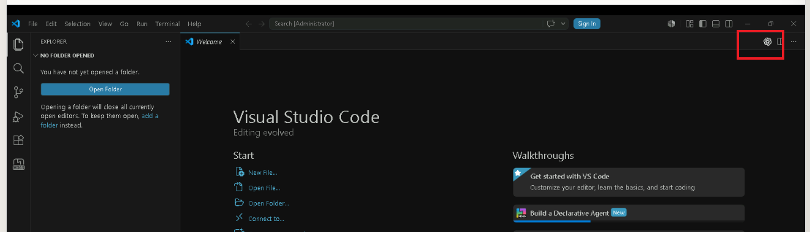

3. VS Code에서 ChatGPT로 로그인하거나, API 키를 입력해서 Codex 모델을 사용할 수 있도록 설정합니다.

   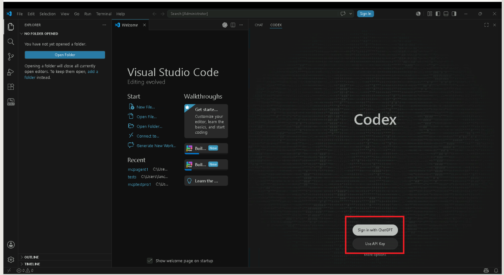

4. 구성이 완료되면 아래와 같이 기본적인 질문에 응답하는 것을 볼 수 있습니다.

   {: .highlight }
   > Codex 챗봇이 동작하려면 프로젝트가 필요합니다. "Open Folder"를 클릭해서 빈 폴더를 만들어 열어 주세요.

   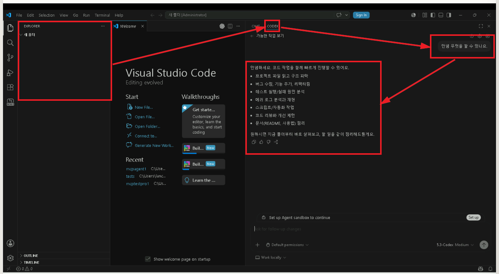

---

## Step 2. MCP 서버 만들기

{: .warning }
> 이후 랩에서는 Codex를 기준으로 진행하겠습니다. GitHub Copilot을 사용하는 경우, Codex 챗봇과 동일한 방식으로 질문을 입력해서 바이브 코딩을 진행할 수 있습니다.

1. VS Code를 New Window로 열어서, 빈 폴더를 하나 만들어 주세요. (File &gt; New Window &gt; File &gt; Open Folder)

   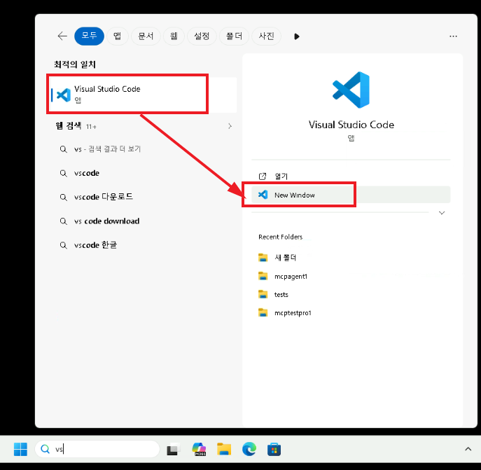

   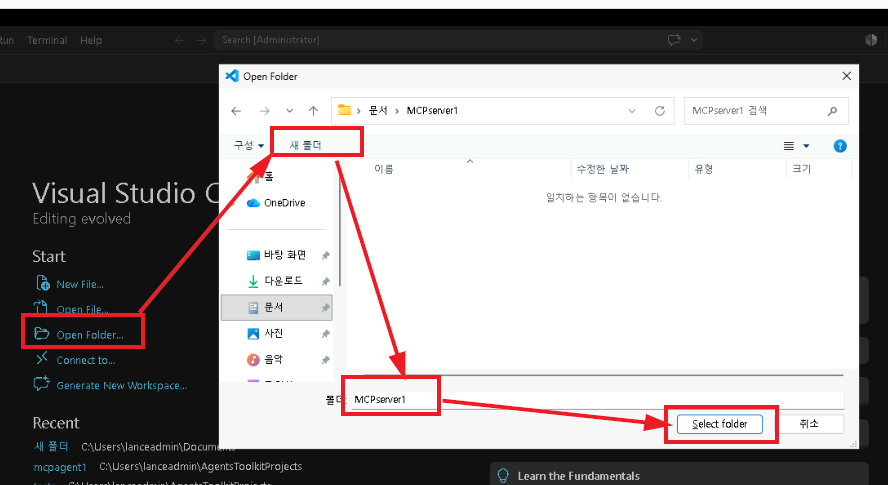

2. 열리는 폴더에 대해 신뢰한다고 표시해 주세요. 그래야 Codex 챗봇이 이 폴더에 파일을 생성하고 코드를 작성할 수 있습니다.

   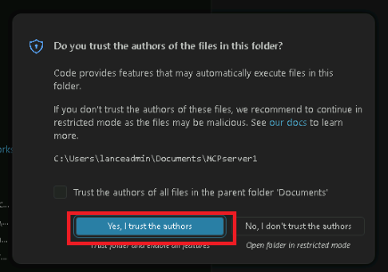

3. 새로 열린 VS Code에서 ChatGPT 아이콘을 클릭해서 챗봇을 활성화해 주세요.
4. 챗봇에게 프롬프트를 입력해서 MCP 서버를 만들어 달라고 요청해 보세요.
5. 아래 프롬프트는 예시입니다. 실제로는 나만의 프롬프트를 입력하고 그걸 기반으로 바이브 코딩을 해보는 경험이 중요합니다. 아래 두 가지 프롬프트 중 하나를 선택해서 입력해 보세요.

   ```
   MCP 서버를 만들어줘.
   내가 필요한 MCP 서버는 코파일럿 스튜디오에 연결할 수 있어야 해.
   여기에 필요한 기술적인 요구사항은 알아서 리서치 해서 적용해줘.
   이 MCP 서버가 제공할 도구는 메아리야. 사용자의 텍스트를 받아 세 번 반복해 출력하는 것이지.
   이 MCP 서버는 Python으로 작성해줘.
   그리고 내가 이 MCP 서버를 내 컴퓨터에서 실행할 수 있도록, 필요한 패키지 설치는 알아서 수행해줘.
   ```

   ```
   Python으로 MCP(Model Context Protocol) 서버를 만들어줘. 이 서버는 Microsoft Copilot Studio에 연결되어 실제로 도구가 호출되는 것까지 검증되어야 해. 아래 요구사항을 빠짐없이 충족해줘.

   ## 1. 서버가 제공할 도구
   - 도구 이름: echo
   - 동작: 사용자가 입력한 텍스트(text: string)를 받아 세 번 반복해서 반환한다.
   - 출력 예: 입력이 "안녕"이면 "안녕\n안녕\n안녕" 형태로 반환.
   - 도구에는 LLM이 이해할 수 있도록 명확한 영어/한국어 docstring과 파라미터 설명을 달아줘.

   ## 2. 필수 기술 제약 (Copilot Studio 호환 - 반드시 준수)
   - 전송 방식은 반드시 **Streamable HTTP**여야 한다. stdio나 SSE는 절대 사용하지 마라. (Copilot Studio는 Streamable HTTP만 지원하며 SSE는 2025년 8월부로 폐기됨)
   - Python MCP SDK(`mcp[cli]`)의 FastMCP를 사용하고, **stateless_http=True**로 생성해라. (Copilot Studio 연결에는 stateless 모드가 안정적이다)
   - HTTP 엔드포인트 경로는 **/mcp** 로 노출하고, 포트는 8000으로 고정해라.
   - 서버는 0.0.0.0에 바인딩해서 외부 터널에서 접근 가능하게 해라.

   ## 3. 환경 및 실행 (Windows, 알아서 끝까지 수행)
   - 가상환경(venv)을 만들고 활성화한 뒤 필요한 패키지(`mcp[cli]` 등)를 pip로 설치까지 직접 실행해라.
   - requirements.txt 와 README.md(실행법/연결법 포함)도 생성해라.
   - 서버 실행 명령을 README에 명확히 적고, 실제로 백그라운드로 실행해서 기동을 확인해라.

   ## 4. 자체 검증 (이 단계를 통과해야 "완료"로 간주)
   - 별도의 Python MCP 클라이언트 테스트 스크립트를 작성해 실행해라.
   - 테스트는 (1) 서버에 연결, (2) tools/list로 echo 도구가 보이는지 확인, (3) echo를 "테스트" 입력으로 호출해 결과가 3번 반복되는지 검증해야 한다.
   - 테스트가 통과한 실제 출력 로그를 보여줘. 실패하면 원인을 고쳐서 통과할 때까지 반복해라.

   ## 5. Copilot Studio 연결 안내 (Copilot Studio는 클라우드라 localhost에 접근 불가)
   - 로컬 서버를 외부에 공개하기 위한 방법을 README에 적어줘:
     Windows에 내장된 dev tunnel(`devtunnel`) 사용법 또는 ngrok 대안 둘 중 하나를 단계별 명령어로 안내. (예: `devtunnel host -p 8000 --allow-anonymous`)
   - 공개 URL이 https://<tunnel>/mcp 형태가 됨을 명시해라.
   - Copilot Studio 연결 절차를 정확한 필드값과 함께 적어줘:
     1) 에이전트에서 generative orchestration(생성형 오케스트레이션)을 켠다.
     2) Tools > Add a tool > Model Context Protocol 선택.
     3) Server name, Server description 입력, Server URL = 공개 터널 URL + /mcp.
     4) 인증은 None(인증 없음)으로 설정 (이 데모는 인증 불필요).
     5) Create 후 도구 추가, echo 도구가 노출되는지 확인.

   ## 6. 산출물 정리
   - 최종적으로 프로젝트 파일 트리, 각 파일 역할, 실행 명령, 검증 결과, Copilot Studio 연결 단계를 요약해서 보여줘.
   ```

   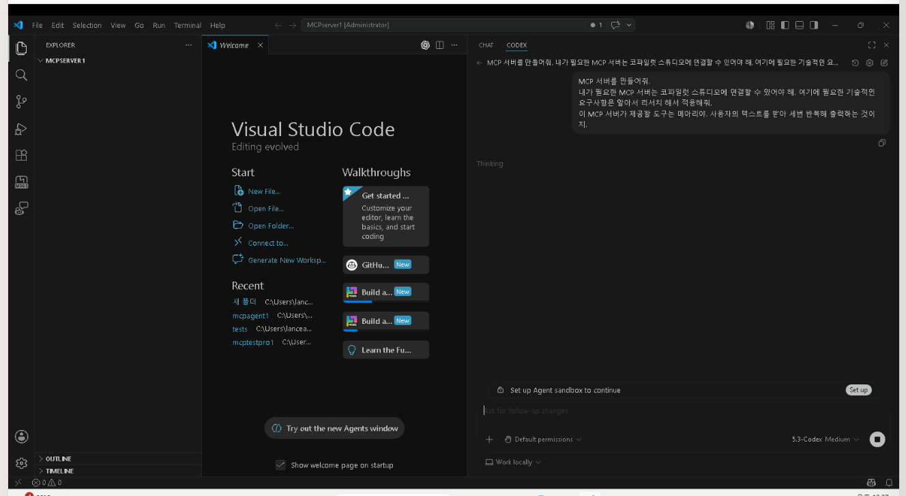

6. 챗봇이 코드를 작성하는 과정을 실시간으로 관찰해 보세요. ("응, 알아서 해줘.")

   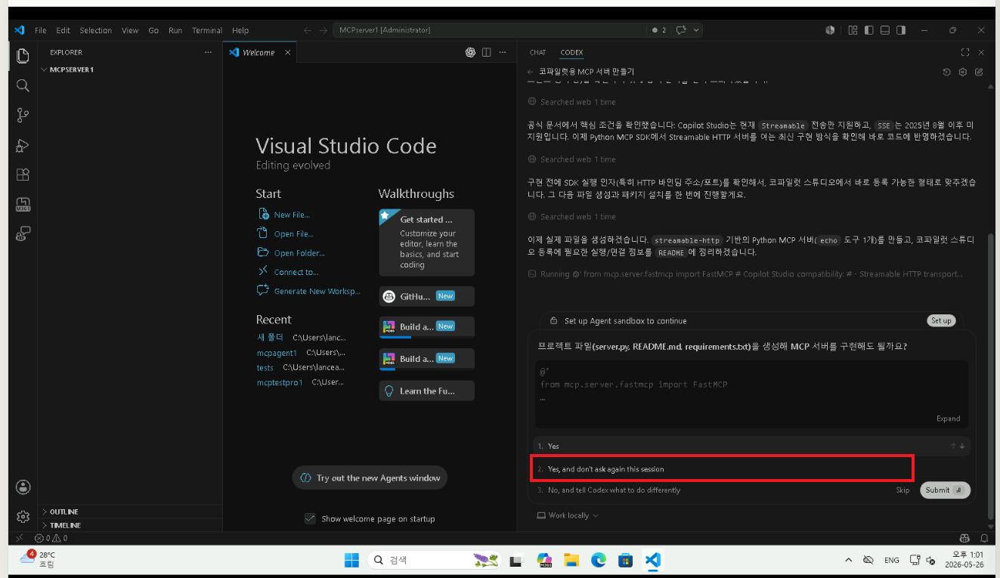

   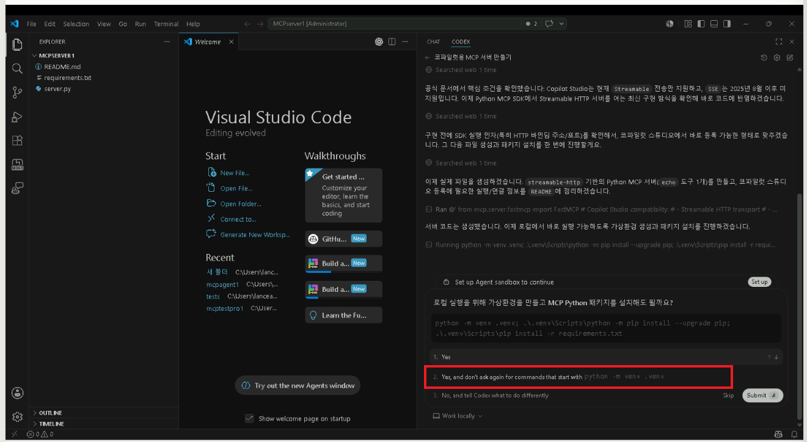

7. 작업이 완료되었다고 합니다.

   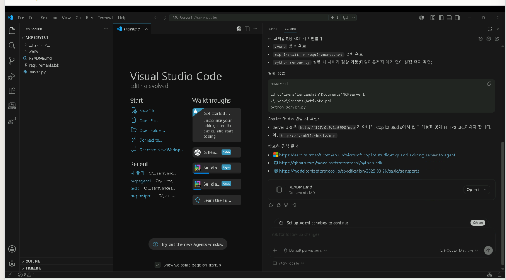

{: .highlight }
> 어떤 느낌인지 아시겠죠. **AI가 일하고 나는 결과를 검수한다.**

---

## Step 3. MCP 서버 검수하기

1. **구동 중인가?** 현재 Codex가 작업을 수행하고 서버도 실행 중입니다. 브라우저에서 아래 주소를 입력해보면

   `http://127.0.0.1:8000/mcp`

   아래와 같이 MCP 서버가 구동 중인 것을 확인할 수 있습니다. 다만 정상적인 구동 결과를 볼 수는 없지요.

   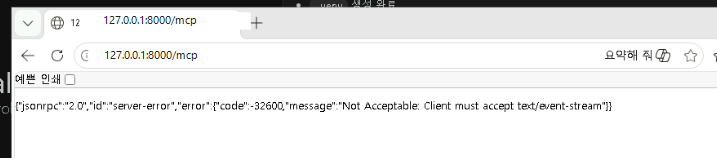

2. 이제 MCP를 위한 검사 도구인 **MCP Inspector**를 활용해서, 이 MCP 서버가 Copilot Studio의 요구사항을 충족하는지 검수해 보겠습니다.
3. PowerShell에서 아래 명령어를 입력해서 MCP Inspector를 실행합니다.

   `npx @modelcontextprotocol/inspector`

   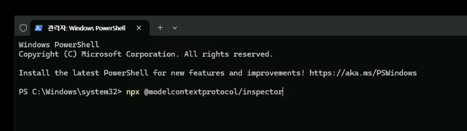

   {: .highlight }
   > MCP Inspector는 MCP 서버의 API를 호출해서, 이 서버가 Copilot Studio의 요구사항을 충족하는지 검수해 주는 도구입니다. 구동에 필요한 Node.js는 이미 설치되어 있습니다.

   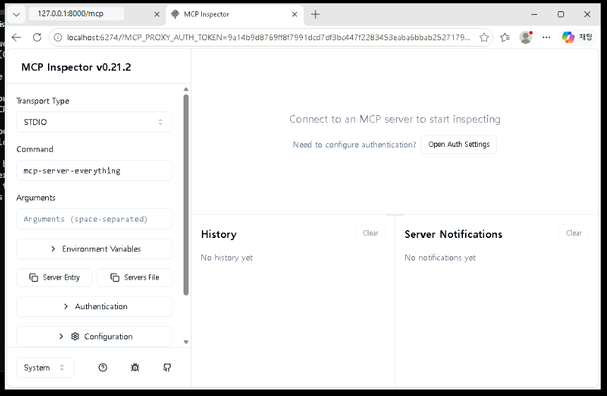

4. MCP Inspector에서 아래와 같이 설정합니다.

   - Transport Type: `Streamable HTTP`
   - URL: `http://127.0.0.1:8000/mcp`
   - Connection Type: `Via Proxy`

   이렇게 설정하고 "Connect" 버튼을 클릭하면, MCP Inspector가 이 MCP 서버에 연결을 시도합니다.

   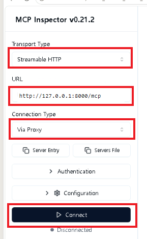

   {: .warning }
   > 연결이 실패할 수도 있습니다. 이 경우, Codex 챗봇에게 에러 메시지를 보여주면서 왜 연결이 실패하는지 물어보고, 문제를 해결할 수 있도록 요청해 보세요.
   > 예: "MCP Inspector로 연결을 시도했는데 실패했어. 에러 메시지는 'Connection refused'야. 이게 무슨 뜻이고 어떻게 해결할 수 있을까?"
   > VM 안에 있는 "Snipping Tool"을 활용해서 에러 메시지를 캡처해 보여주는 것도 좋습니다.

5. 연결이 성공하면 Tools 탭에서 메아리 도구가 보이고, 테스트 입력에 텍스트를 입력해서 "Run" 버튼을 클릭하면 이 MCP 서버가 정상적으로 동작하는지 확인할 수 있습니다.

   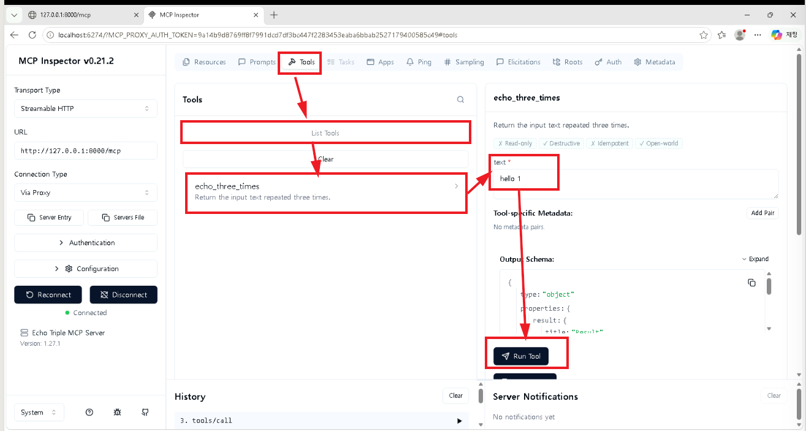

   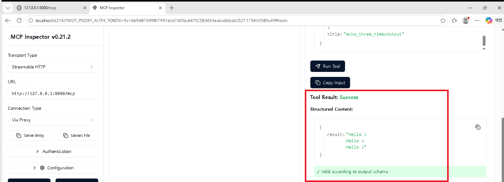

---

## Step 4. 바이브 코딩으로 기능 추가하기

이번에는 바이브 코딩을 활용해서 이 MCP 서버에 새로운 기능을 추가해 보겠습니다. 예를 들어, 메아리 도구 대신 공개 접속 가능한 환율 API를 활용해서 사용자가 입력한 통화 쌍의 환율을 출력하는 기능을 추가해 보죠.

1. 챗봇에게 아래와 같이 입력해서 MCP 서버에 새로운 기능을 추가해 달라고 요청해 보세요.

   ```
   이 MCP 서버는 잘 동작하고 있어.
   이제 새로운 기능을 추가해 보자.
   새로운 기능은 환율 조회 기능이야.
   바로 사용 가능한 API가 있어. https://frankfurter.dev/ 이 API를 활용해서, 사용자가 입력한 통화 쌍의 환율을 출력하는 기능을 추가해줘.
   ```

   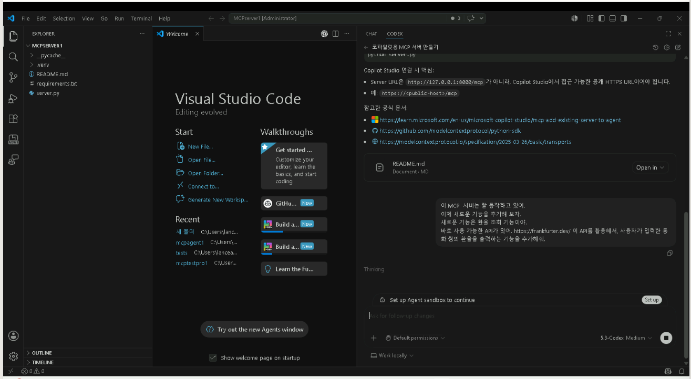

   작업이 끝났다고 하는군요.

   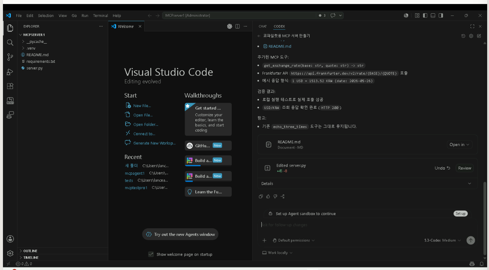

2. 작업이 끝났으면 우리가 검수해야지요. MCP Inspector에서 이 새로운 기능이 추가된 것을 확인할 수 있습니다. 만약 창을 닫았다면 PowerShell에서 다시 실행하세요.

   `npx @modelcontextprotocol/inspector`

   {: .note }
   > 제 경우는 인스펙터에서 추가된 도구가 처음엔 보이지 않았습니다.
   >
   > 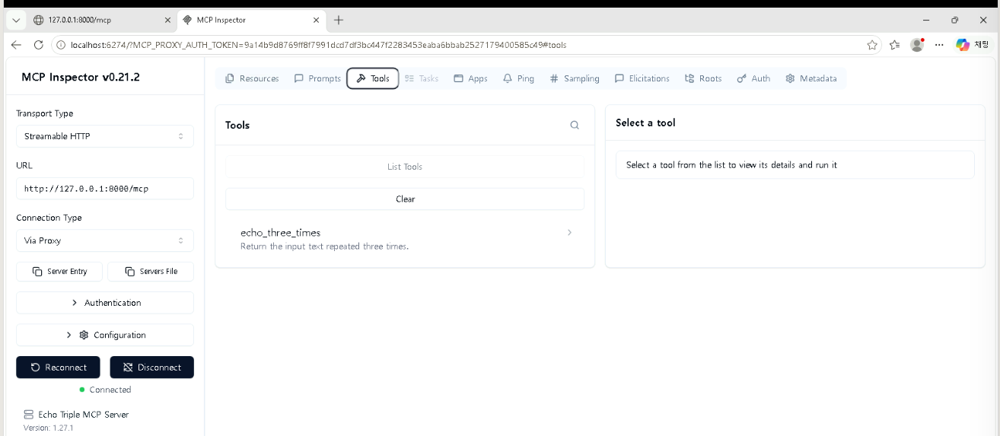
   >
   > 그래서 챗봇에게 물어봤죠.
   >
   > 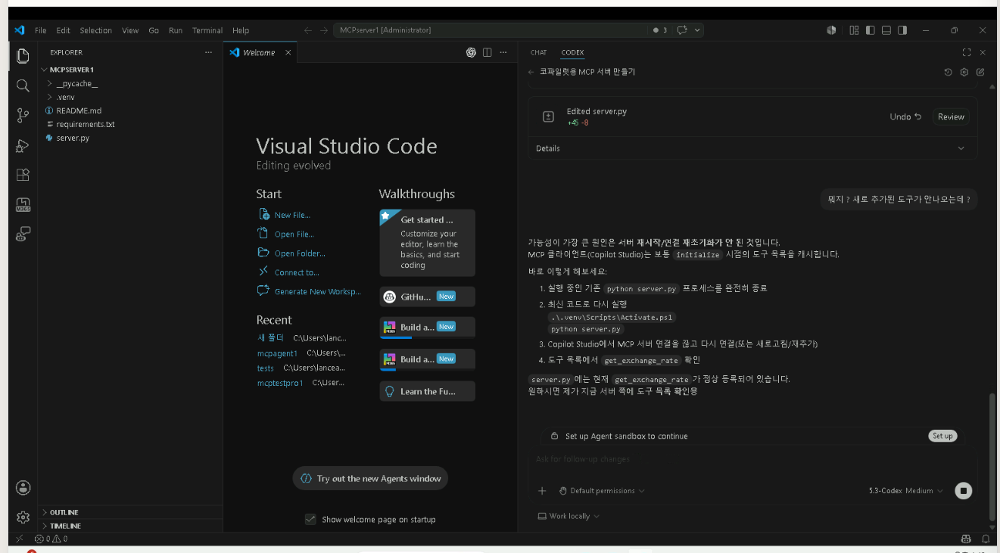
   >
   > 서버를 재시작해야 한다고 합니다.
   >
   > 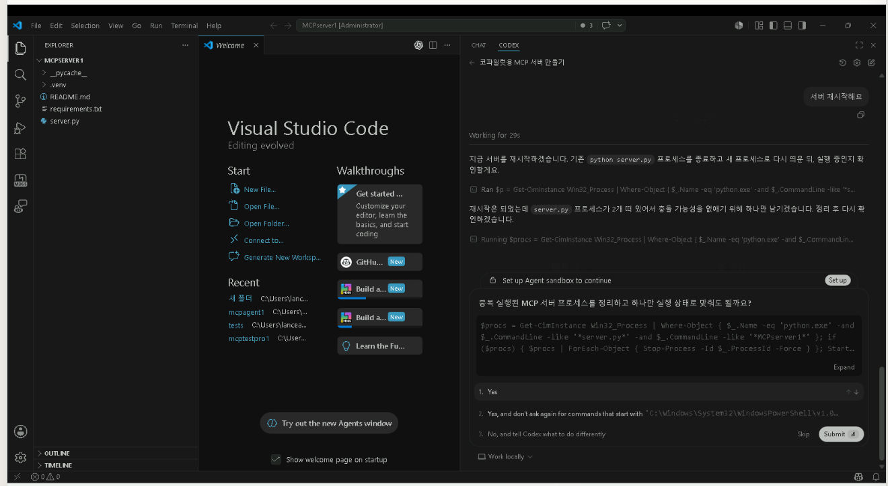
   >
   > 서버를 재시작한 후 다시 연결해 보니, 추가된 도구가 보이네요.
   >
   > 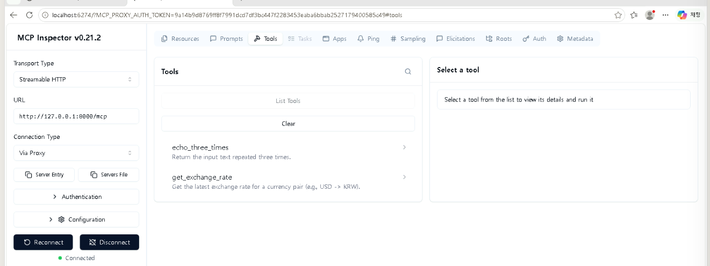

3. 환율 API를 이용해 환율 조회 기능이 잘 동작하는지 테스트해 보겠습니다.

   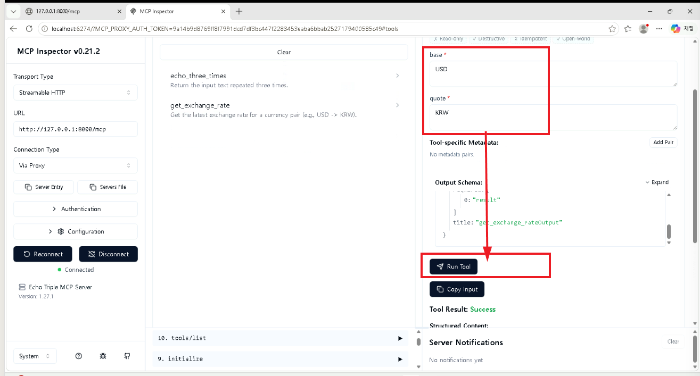

   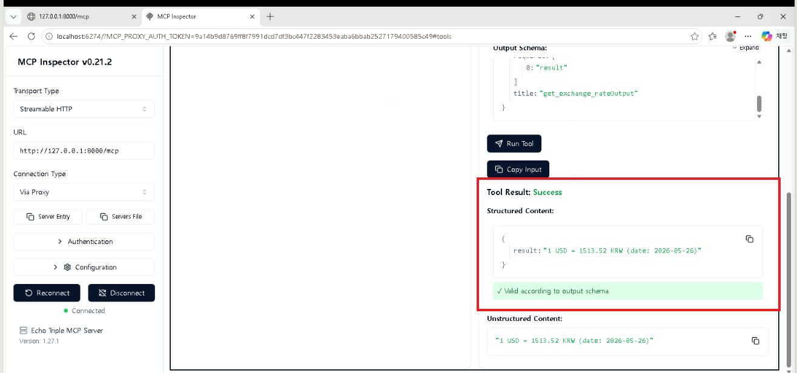
