# L04. 나만의 MCP 서버를 Copilot Studio에 연결해보자
{: .no_toc }

이제 나만의 MCP 서버가 만들어졌으니 이 서버를 에이전트에 연결해보겠습니다.

---

## Step 1. 외부 연결 주소 확보

MCP 서버가 외부에서 접근 가능하려면 외부 연결 주소가 필요합니다. 우리는 VS Code의 **Dev Tunnel** 기능을 사용해서 외부 연결 주소를 확보할 것입니다.

1. VS Code 상단 메뉴에서 View &gt; Terminal을 클릭해서 터미널 창을 엽니다.

   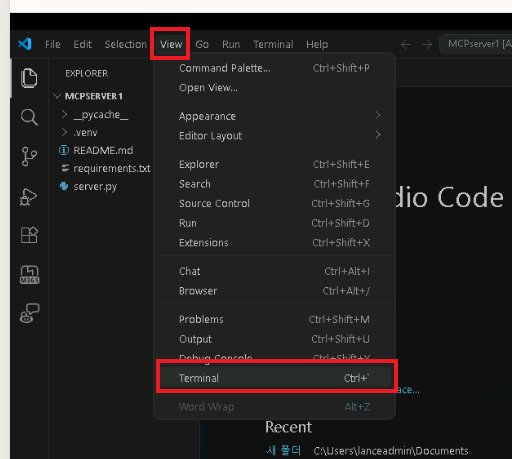

2. 터미널 창의 탭 중 "PORTS" 탭으로 이동한 후, "Forward a Port" 버튼을 클릭합니다.

   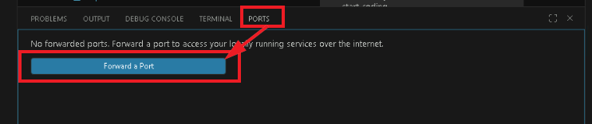

3. Port number 입력창이 뜨면, MCP 서버가 사용하는 포트 번호인 `8000`을 입력하고 Enter를 누릅니다.

   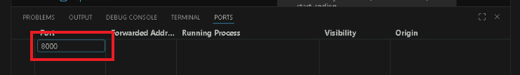

4. GitHub 인증을 하라고 뜹니다. 무료로 제공하는 기능이지만 GitHub 계정은 필요합니다. GitHub 계정으로 로그인해서 인증을 완료해 주세요.

   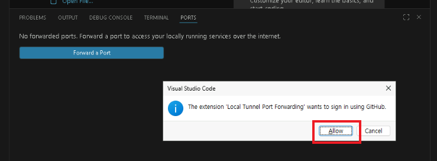

5. 포트 포워딩이 생성되고 외부 연결 주소가 만들어진 것을 볼 수 있습니다. 이 주소는 `https://<random-string>.dev.tunnels.ms` 형태입니다. 나중에 Copilot Studio에서 에이전트를 설정할 때 필요합니다.

   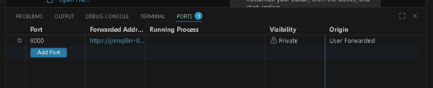

6. 아직 끝나지 않았습니다! Visibility가 "Private"으로 되어 있는데, 이는 외부에서 접근이 불가능하다는 뜻입니다. 이제 이 포트의 Visibility를 "Public"으로 변경합니다. (마우스 오른쪽 클릭)

   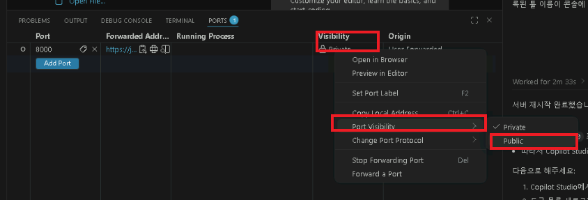

   겁주는 경고가 나오면 "Continue"!

   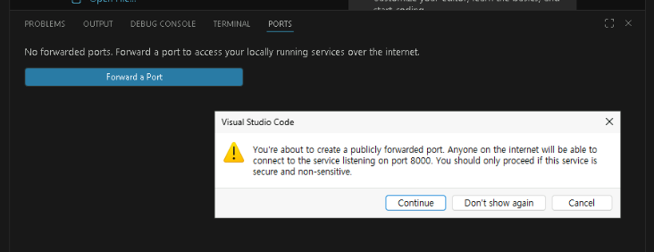

7. 작업이 끝났습니다.

   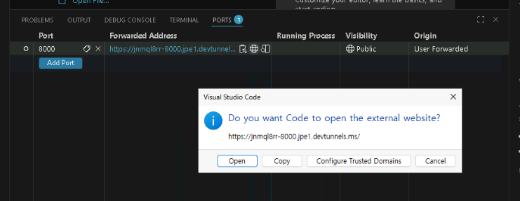

8. 이 주소는 실습자마다 다릅니다. **메모장에라도 적어두세요.** 다음 실습에서 이 주소가 필요합니다.

   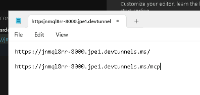

---

## Step 2. 외부 주소를 MCP Inspector로 검사하기

이 주소가 제대로 연결되는지 MCP Inspector로 검사해봅시다. 잘 됩니다.

{: .note }
> 검사하는 주소 끝에 `/mcp` 가 있어야 하는 거 잊지 않으셨죠? 예시에서는 `https://<random-string>.dev.tunnels.ms/mcp` 가 됩니다.

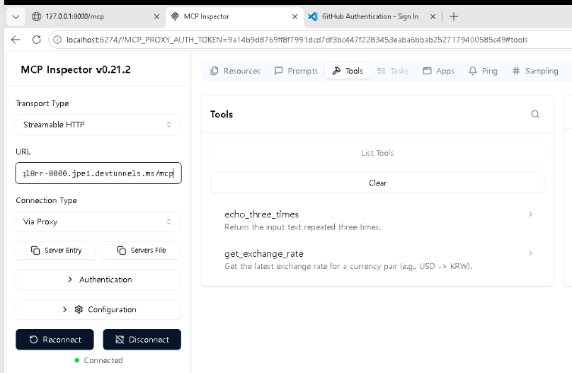

---

## Step 3. 이 주소를 에이전트에 연결하기

1. Copilot Studio에 접속합니다.

   `https://copilotstudio.microsoft.com/`

2. 처음 만들었던 에이전트가 보입니다. 이 에이전트를 클릭해서 들어갑니다.

   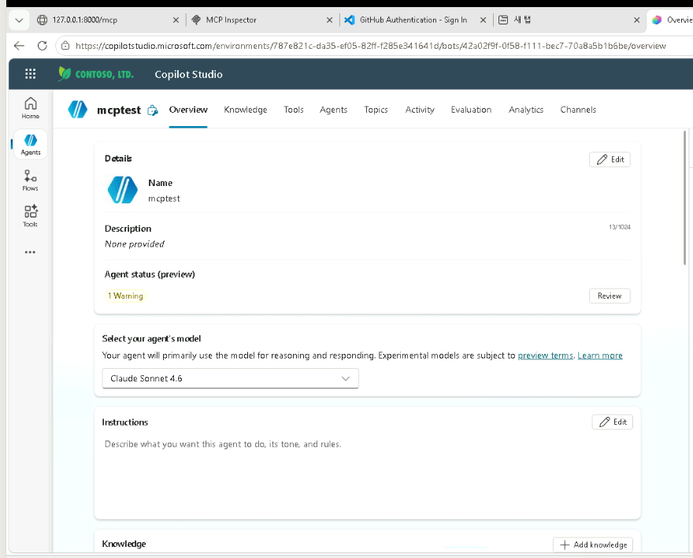

3. "Add tool" 버튼을 클릭해서 도구 추가 화면으로 이동합니다.
4. "MCP" 도구를 선택합니다.

   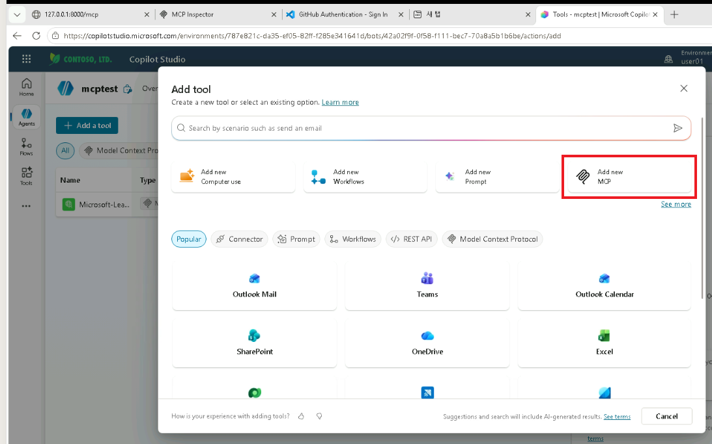

5. 도구 설정 화면에서 아래와 같이 입력하고 "Save" 버튼을 클릭해서 저장합니다.

   | 항목 | 내용 |
   |:-----|:-----|
   | Server name | `My MCP Server` |
   | Server description | `내가 만든 첫 번째 MCP 서버에요. 환율 정보를 제공합니다.` |
   | Server URL | 메모장에 적어둔 외부 연결 주소 (`.../mcp`) |

   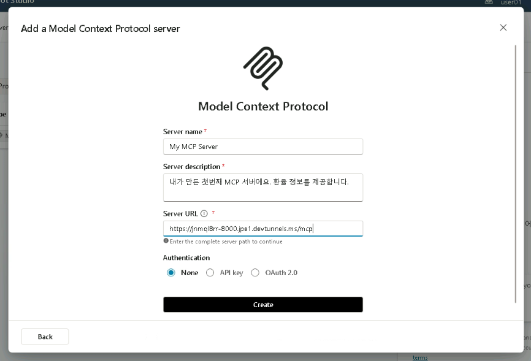

6. Create 버튼을 눌러서 에이전트에 MCP 서버 도구를 추가하는 흐름은 이전과 동일합니다.

   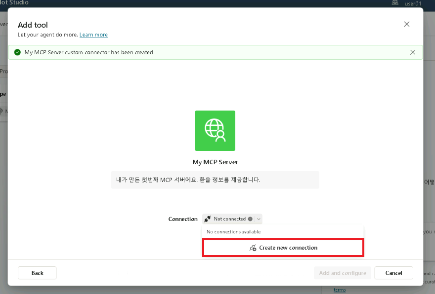

   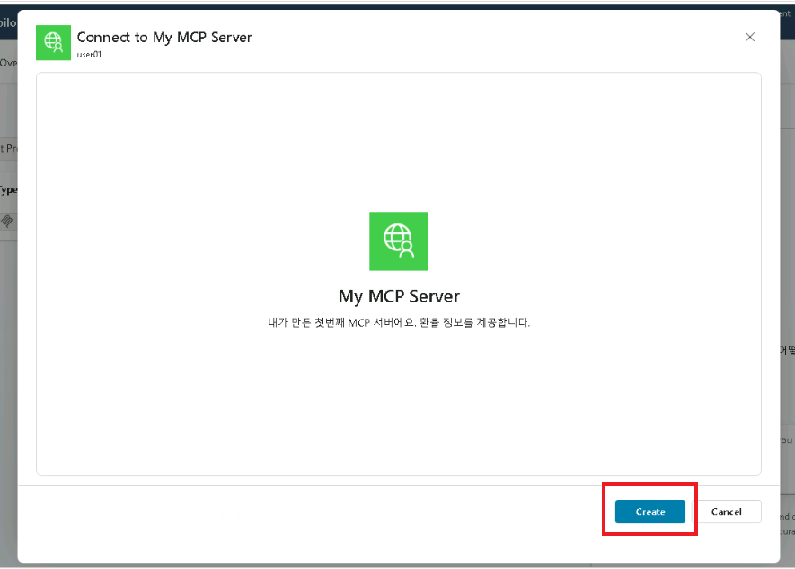

   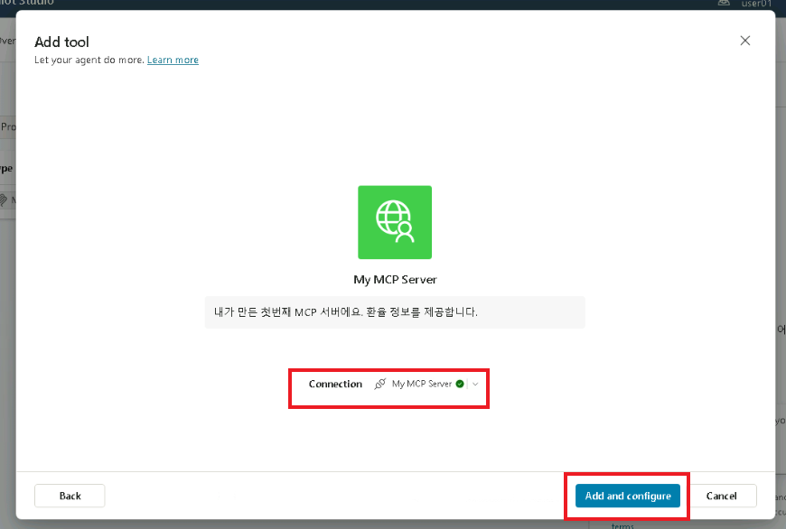

   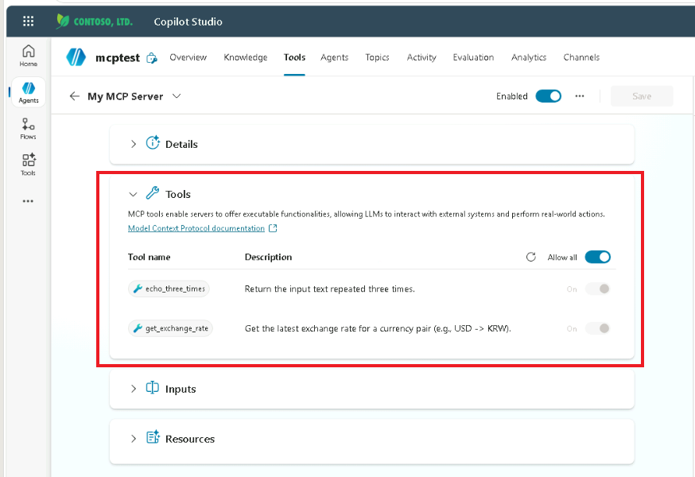

   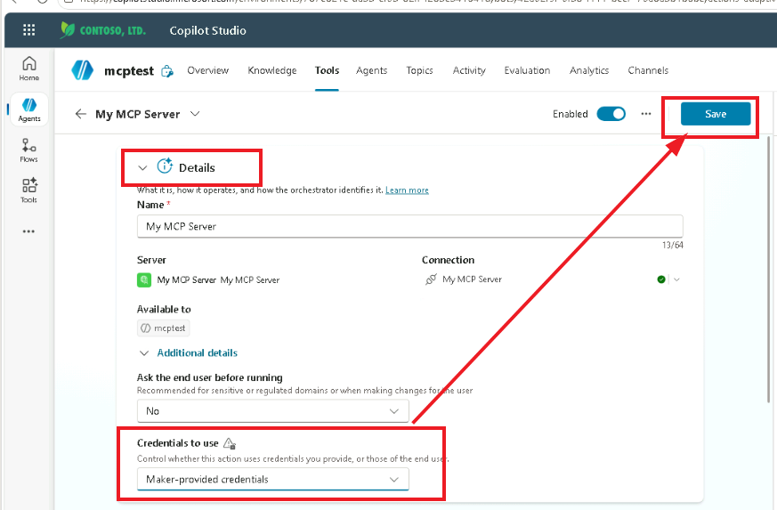

7. 이제 테스트할 시간입니다.

   ```
   내가 USD 123 달러를 가지고 있는데, 이걸 KRW로 환전하면 얼마야? 또는 엔화로 환전하면 얼마야?
   ```

8. MCP 서버의 도구를 이용하는 걸 볼 수 있습니다.

   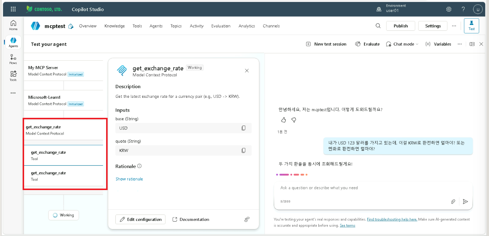

9. 답변도 잘 나옵니다. 성공!

   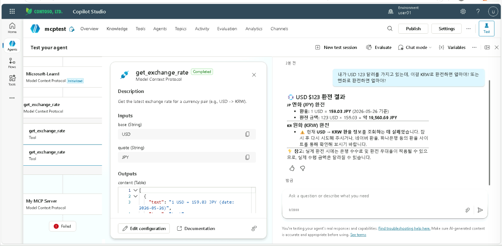
