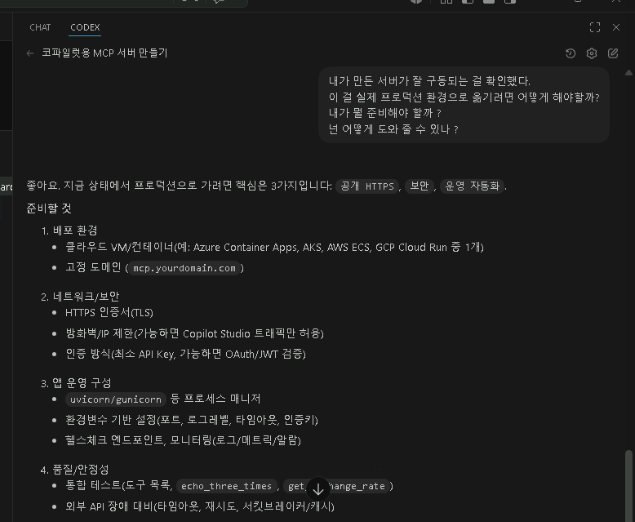

# L05. 좀 더 생각해 보기
{: .no_toc }

지금까지 우리가 한 작업을 좀 더 깊이 생각해봅시다.

{: .note }
> 우리는 VS Code의 바이브 코딩을 사용해서 MCP 서버를 만들었습니다.
>
> 그런데 이건 현재 내 로컬 PC에서 구동되고 있어요. 그리고 포트 포워딩(Dev Tunnel)을 사용해서 외부에서 접근할 수 있도록 했죠.
>
> 이렇게 하면 내가 만든 MCP 서버를 외부에서 접근할 수 있게 되긴 하지만, 내 PC가 켜져 있어야 하고, 네트워크 상태도 좋아야 하고, 포트 포워딩도 잘 되어 있어야 하는 등 여러 제약이 있습니다.
>
> 만약 내가 만든 MCP 서버를 24시간 안정적으로 운영하려면 어떻게 해야 할까요? 클라우드 서비스(예: Azure, AWS, GCP)에 가상머신을 만들어서 그 위에 MCP 서버를 설치하면 어떨까요?
>
> 클라우드에 가상머신을 만들어서 MCP 서버를 설치하면, 내 PC가 꺼져 있어도, 네트워크 상태가 안 좋아도, 포트 포워딩이 안 되어도, MCP 서버가 24시간 안정적으로 운영될 수 있겠죠?

그건 "알아서~~~"는 아니고, 역시나 AI와 상담을.

```
내가 만든 서버가 잘 구동되는 걸 확인했다.
이걸 실제 프로덕션 환경으로 옮기려면 어떻게 해야 할까?
내가 뭘 준비해야 할까?
넌 어떻게 도와줄 수 있나?
```

뭐, 역시나 그렇다고 합니다. 사실 **Azure 구독**만 있으면 그 다음은 AI가 다 알아서 해줍니다.


