# L06. MCP 서버를 프로코드 에이전트에 연결해보자
{: .no_toc }

이왕 만든 MCP 서버, Copilot Studio의 프로코드 에이전트에도 연결해봅시다.

---

## Step 1. MCP 서버는 그대로 유지

- 지금까지 만든 MCP 서버는 그대로 유지합니다.
- 이 서버는 지금도 잘 구동되고 있어야 합니다. 아직 끄거나 삭제하지 마세요.

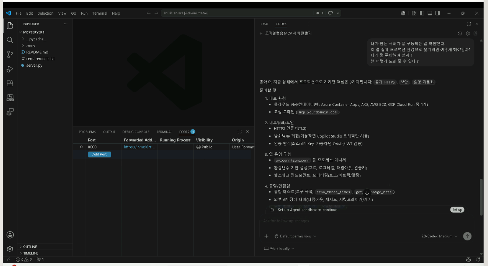

{: .highlight }
> 만약 VS Code를 종료했다면… 당황하지 말고
> 1. VS Code를 다시 켜고,
> 2. MCP 서버가 있던 워크스페이스 폴더를 다시 열고,
> 3. MCP 서버를 다시 실행해 주세요. (터미널에서 `python -m mcp.server` 명령 — AI에게 "서버 실행해줘"라고 해도 됩니다.)
> 4. 서버가 잘 구동되는지 확인하세요. (MCP Inspector로 검사해보면 됩니다.)
> 5. 마지막으로 포트 포워딩도 다시 해주세요. (VS Code의 PORTS 탭에서 Forward a Port)

---

## Step 2. 새 프로젝트 시작하기

1. 작업 표시줄의 VS Code 아이콘을 오른쪽 클릭하여 "New Window"를 클릭해서 새 VS Code 창을 엽니다.

   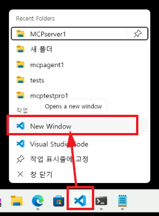

2. VS Code 왼쪽 메뉴에서 M365 아이콘을 클릭하여 "Microsoft 365 Agent Toolkit" 패널로 이동한 후, "Create New Agent/App" 버튼을 클릭합니다.

   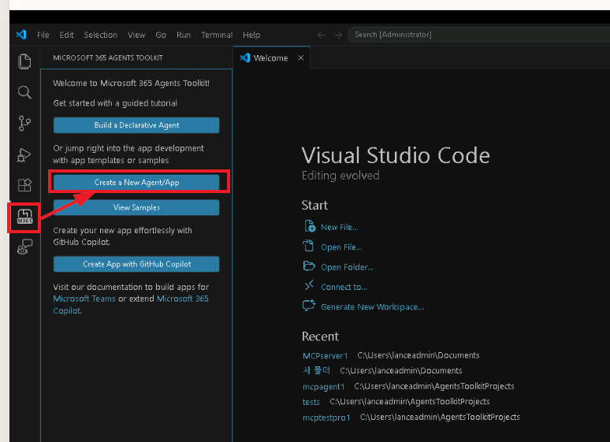

3. 프로젝트 만들기를 시작하면 아래 구성으로 에이전트를 만듭니다.

   - Declarative Agent

     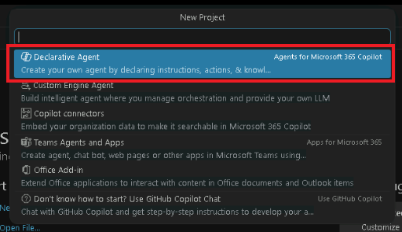

   - Add an Action

     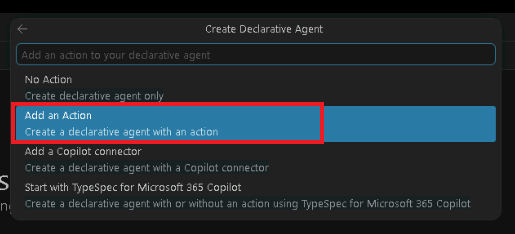

   - Start with an MCP server

     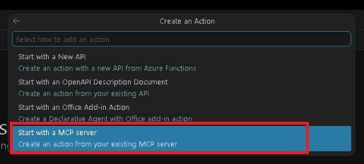

   - 주소는 현재 다른 VS Code 인스턴스에서 구동 중인 MCP 서버의 주소를 입력합니다. (예: `https://<random-string>.dev.tunnels.ms/mcp`)

     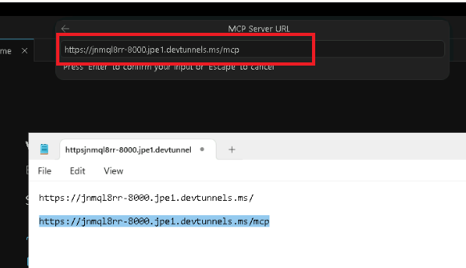

   - 프로젝트 위치를 정하고

     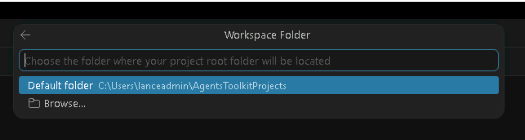

   - 프로젝트 이름을 정합니다. (예: My ProCode Agent)

     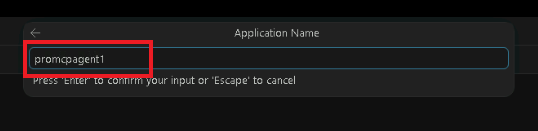

   - 폴더를 신뢰합니다.

     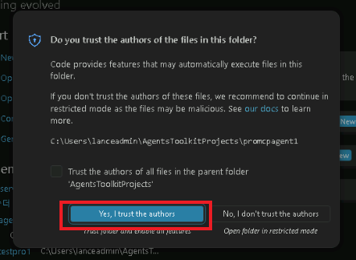

4. 프로젝트가 생성되고 필요한 파일들이 만들어집니다.

   {: .note }
   > 프로젝트 생성 후, MCP 서버가 가진 도구 목록을 자동으로 에이전트 내용에 반영하는 기능이 있습니다. 하지만 가끔 이 과정이 매끄럽지 않을 수 있습니다. 만약 에이전트의 `ai-plugin.json` 파일에 MCP 서버의 도구들이 제대로 반영되지 않았다면, 걱정하지 마시고 AI에게 아래와 같이 말해보세요.
   >
   > 실제로 우리가 만든 MCP 서버는 별도의 discovery 엔드포인트를 제공하지 않아서 도구 목록을 자동으로 가져오지 못합니다. 가이드에서는 이런 경우 수동으로 하라고 안내합니다만, 우리에게는 AI가 있지요.

   ```
   내가 이 에이전트 템플릿에 mcp 서버를 추가했는데, 그 MCP 서버의 도구 목록을 조사해서 ai-plugin.json 파일을 업데이트 해줘
   ```

   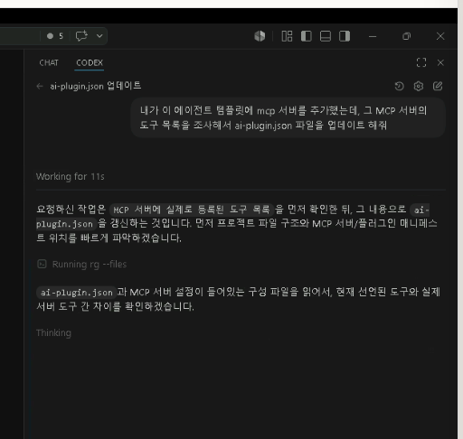

5. 바이브 코딩으로 `ai-plugin.json` 파일도 자동으로 작성되었습니다. 이제 이 에이전트를 실행할 준비가 되었습니다.

   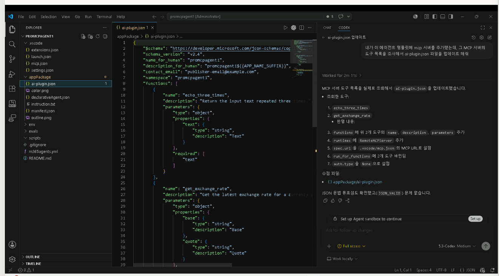

---

## Step 3. 에이전트 배포 전 구성

1. 이 에이전트를 실제로 배포해 테스트하기 전에 한 가지 구성을 해봐야 합니다.
2. M365 Agent Toolkit 패널을 클릭하고, 가장 위에 있는 "Sign in to Microsoft 365" 버튼을 클릭하여 M365 계정으로 로그인합니다. (이 계정은 랩에서 제공된 계정 사용)

   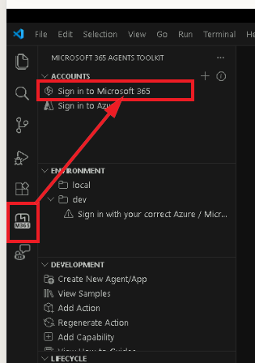

   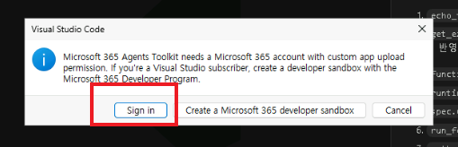

   | 항목 | 내용 |
   |:-----|:-----|
   | 계정 | 강사가 제공한 계정 |
   | 비번 | 강사가 제공한 비밀번호 |

3. 로그인에 성공하면 VS Code로 돌아와 로그인된 계정 하위에 두 개의 녹색 아이콘이 생겼는지 확인해 주세요.

   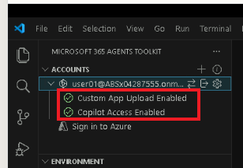

4. 이제 에이전트를 배포할 준비가 되었습니다. LifeCycle &gt; "Provision"을 클릭해서 에이전트를 프로비저닝 해봅시다.

   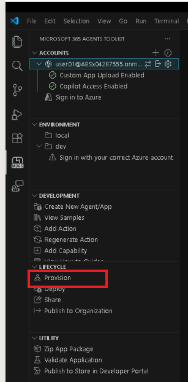

5. 오류 없이 끝난다면, 축하합니다! 에이전트가 성공적으로 프로비저닝되었습니다.

   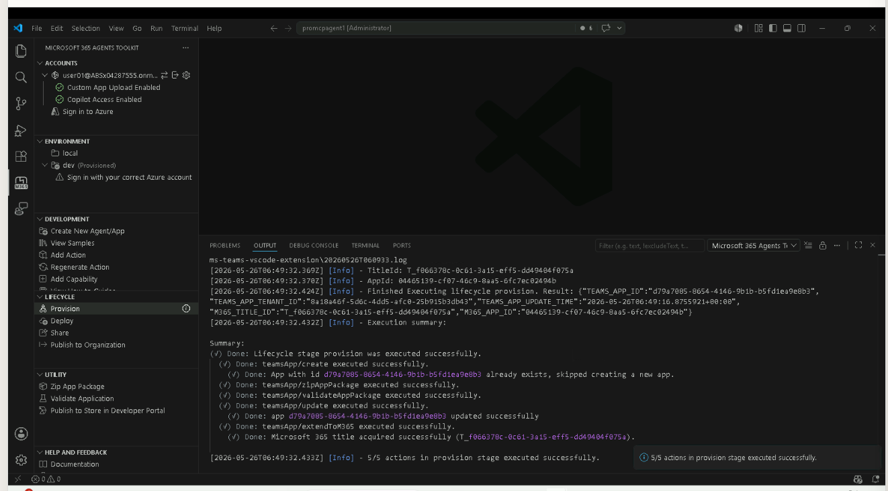

---

## Step 4. 에이전트 테스트해보기

1. Copilot을 열어보면 방금 만들어서 배포한 프로코드 에이전트가 보입니다. 이 에이전트를 클릭해서 열어봅시다.

   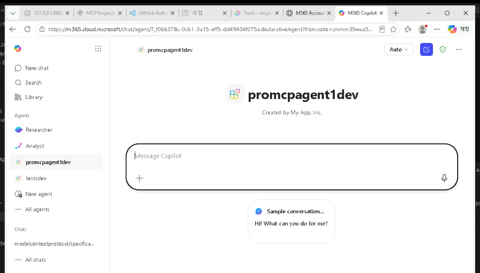

   {: .note }
   > 웹 브라우저에서 Copilot에 접속해 보는 것이 가장 빠르게 변경사항을 확인할 수 있습니다.
   > `https://m365.cloud.microsoft/chat`

2. 에이전트와 대화를 시작해봅시다.

   ```
   내가 USD 123 달러를 가지고 있는데, 이걸 유로화로 환전하면 얼마야? 또는 중국돈으로 환전하면 얼마야?
   ```

3. MCP 서버의 도구를 이용하는 걸 볼 수 있습니다. 데이터의 외부 전송이 필요해서 사용자의 확인을 요청합니다.

   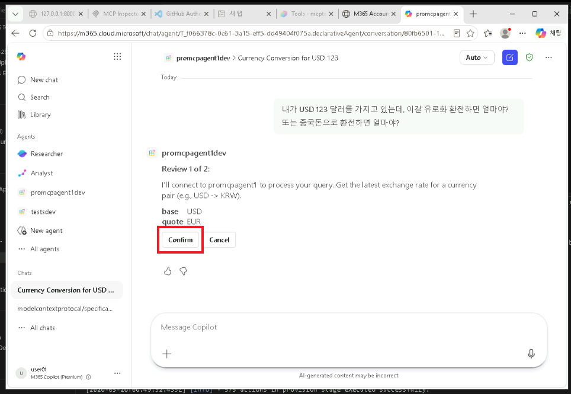

4. 허용을 누르면 잠시 후 답변이 나오는 걸 볼 수 있습니다. 성공!

   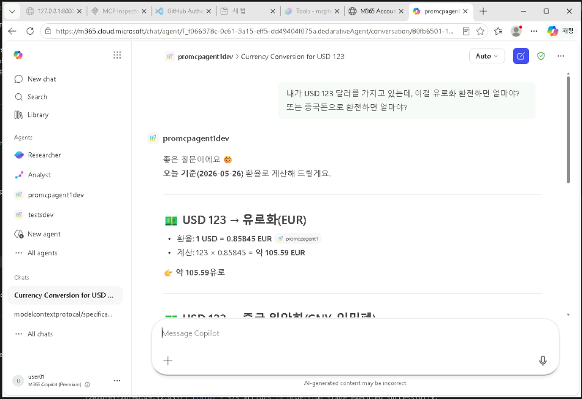
