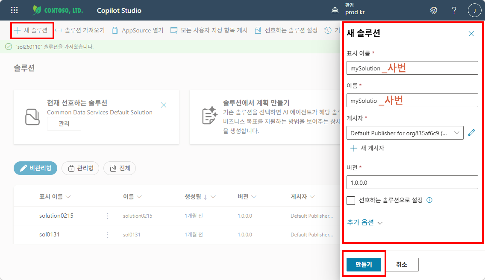

# 실습 ②: 솔루션 만들기
{: .no_toc }

| 시간 | 소요 | 수강생 역할 |
|:-----|:-----|:-----------|
| 10:20 | 5분 | 🟢 직접 만들기 |

## 목차
{: .no_toc .text-delta }

1. TOC
{:toc}

---

에이전트를 독립된 솔루션에 넣으면 나중에 내보내기(Export)나 이동이 편리합니다.  
실습 ③에서 에이전트를 만들기 전에, **솔루션을 먼저 준비**해 둡니다.

{: .tip }
> 솔루션은 에이전트·흐름·커넥터 등을 묶는 **컨테이너**입니다. 실무에서도 솔루션 단위로 관리하면 환경 간 이동이 깔끔합니다.

## Step 1 — Copilot Studio 접속 및 환경 확인

1. [Copilot Studio](https://copilotstudio.microsoft.com) 접속
2. 왼쪽 상단의 **환경(Environment)** 이 올바른지 확인
   - 강사가 지정한 환경이 있으면 해당 환경으로 전환

## Step 2 — 솔루션 만들기

1. 왼쪽 메뉴에서 **솔루션** 선택
2. **+ 새 솔루션** 클릭
3. 이름: `HR 도우미 솔루션` (또는 원하는 이름)
4. 게시자: 기본 게시자 선택
5. **만들기** 클릭

아래 스크린샷을 참고하여 각 단계를 진행하세요.

**① 살펴보기 메뉴 → 솔루션 선택**

**② + 새 솔루션 → 이름 입력 후 "만들기" 클릭**

솔루션의 이름은 'HR_Solution_{이름,사번}'과 같이 중복되지 않는 유니크한 이름으로 짓는 것을 추천합니다.

**③ 솔루션 생성 완료 (빈 솔루션 화면)**

---

실습을 완료했으면 [M3 본문으로 돌아가세요](m03-agent-builder).
