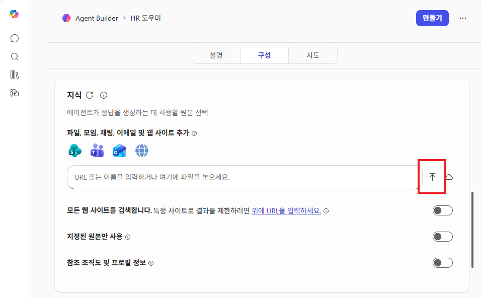
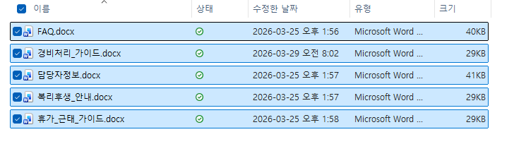
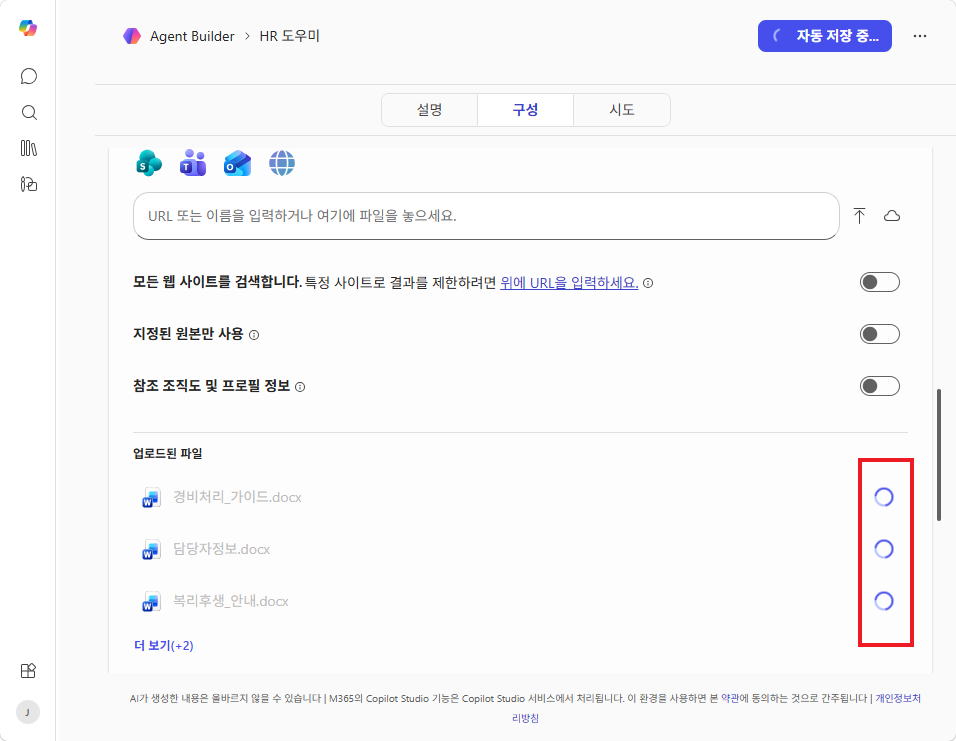
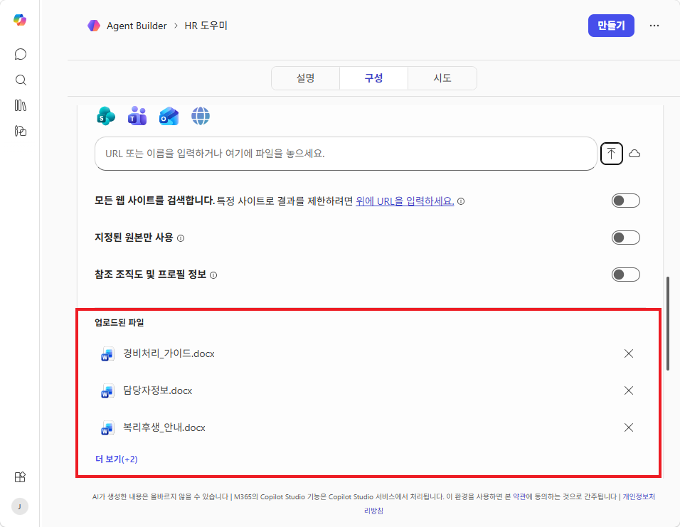
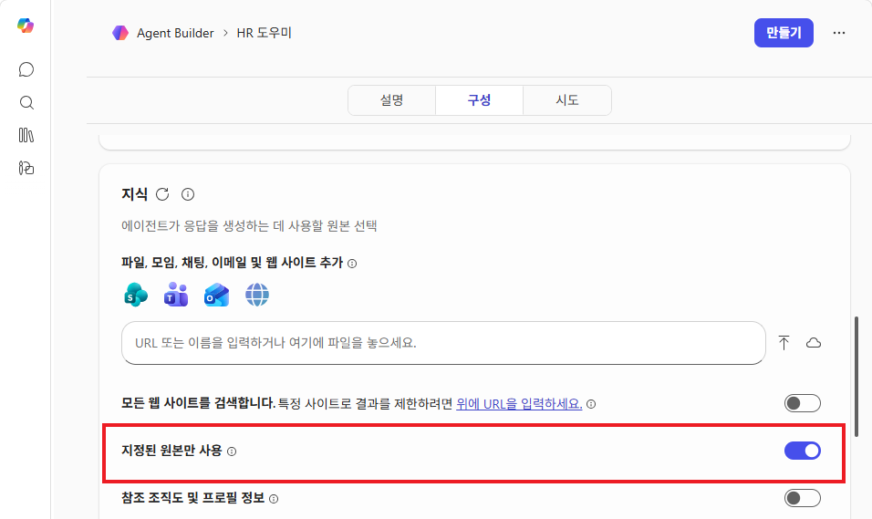
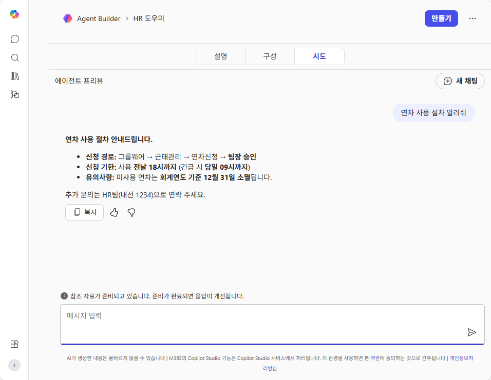
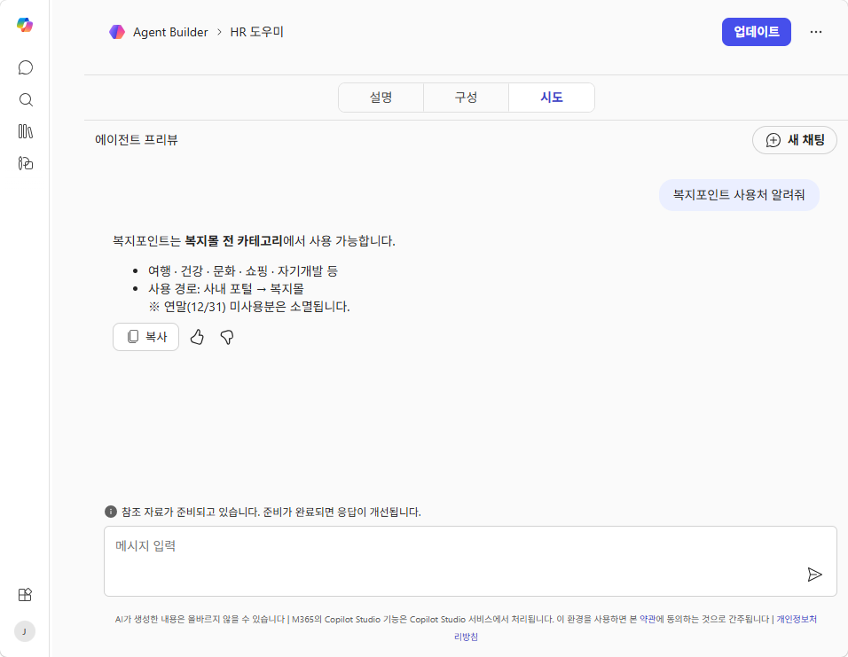

# 실습 ②: 에이전트 빌더에서 파일 업로드 및 테스트
{: .no_toc }

| 시간 | 소요 | 수강생 역할 |
|:-----|:-----|:-----------|
| 10:15 | 10분 | 🟢 직접 만들기 |

## 목차
{: .no_toc .text-delta }

1. TOC
{:toc}

---

## 이 실습에서 하는 것

- 오리엔테이션에서 다운로드한 **실습 파일을 에이전트 빌더에 업로드**
- 업로드한 파일을 기반으로 에이전트가 **정확하게 답변하는지 테스트**
- 에이전트 빌더에서도 파일 업로드가 가능하다는 것을 직접 확인

{: .highlight }
> 에이전트 빌더에서도 파일을 업로드하여 지식(교과서)으로 사용할 수 있습니다. 실습 파일을 올려서 에이전트가 문서 기반으로 답변하는 모습을 확인해 보세요.

---

## Step 1 — 지식 소스에 파일 업로드

1. 실습 ①에서 만든 **HR 도우미** 에이전트의 편집 화면에서 **구성** 탭 클릭
2. **지식** 영역에서 파일 업로드 버튼(↑)을 클릭

3. 오리엔테이션에서 다운로드한 파일 **5개를 모두 선택**하여 업로드:

4. 업로드가 진행됩니다. 완료될 때까지 잠시 기다려 주세요.

5. 업로드가 완료되면 **업로드된 파일** 목록에 5개 파일이 표시됩니다.

6. **"지정된 원본만 사용"** 토글을 **켜기**로 설정합니다. 이렇게 하면 에이전트가 업로드한 문서만을 기반으로 답변합니다.

---

## Step 2 — 테스트하기

파일 업로드가 완료되면, **시도** 탭에서 에이전트와 대화하여 문서 기반 답변이 되는지 확인합니다.

### 테스트 질문 예시

| 질문 | 기대 답변 소스 |
|:-----|:------------|
| "연차 사용 절차 알려줘" | 휴가_근태_가이드.docx |
| "복지포인트 사용처 알려줘" | 복리후생_안내.docx |
| "경비처리 어떻게 해요?" | 경비처리_가이드.docx |
| "경비처리 담당자 누구예요?" | 담당자정보.docx |

"연차 사용 절차 알려줘"를 입력하면, 업로드한 문서를 기반으로 정확한 절차를 안내합니다.

"복지포인트 사용처 알려줘"를 입력하면, 복리후생 안내 문서를 참조하여 답변합니다.

{: .tip }
> 실습 ①에서는 지식 없이 **그럴듯한 추측만** 했던 에이전트가, 파일을 업로드하자 **정확한 사내 정보를 답변**합니다. 이것이 **지식(교과서)**의 힘입니다.

---

## 확인 포인트

- ✅ 5개 파일이 모두 업로드되었는가?
- ✅ 에이전트가 업로드한 문서를 기반으로 답변하는가?
- ✅ 답변에 출처(참조 문서)가 표시되는가?

---

실습을 완료했으면 [M3 본문으로 돌아가세요](m03-agent-builder).
