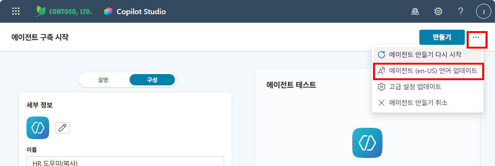
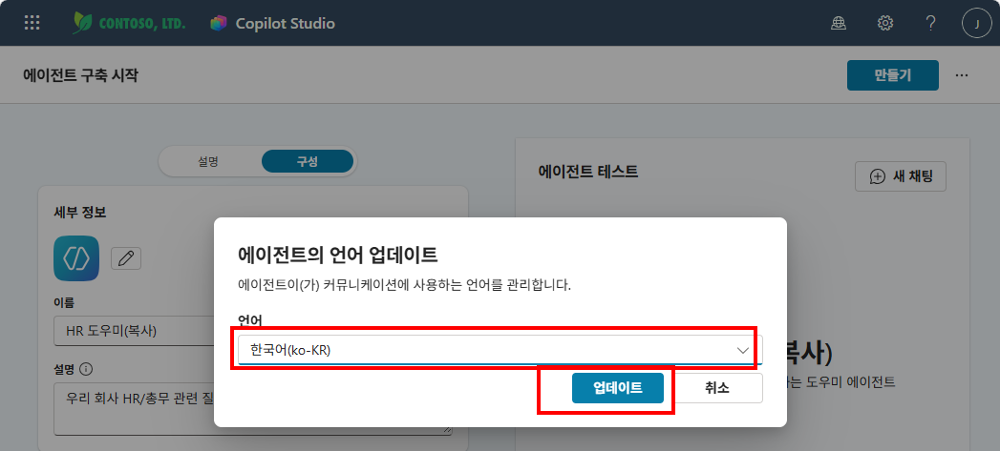
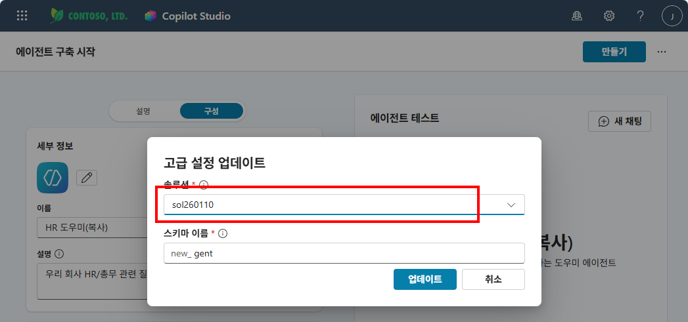
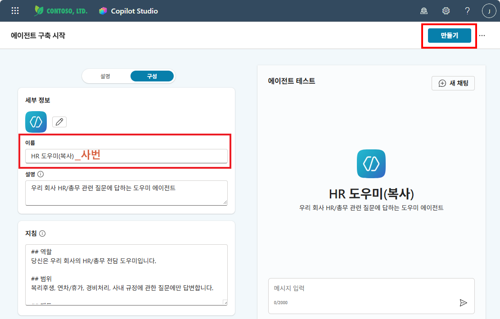
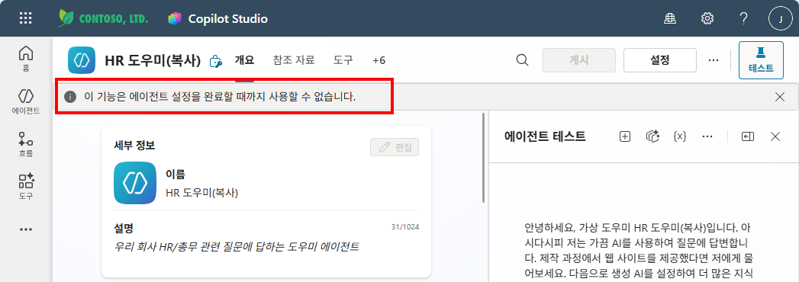
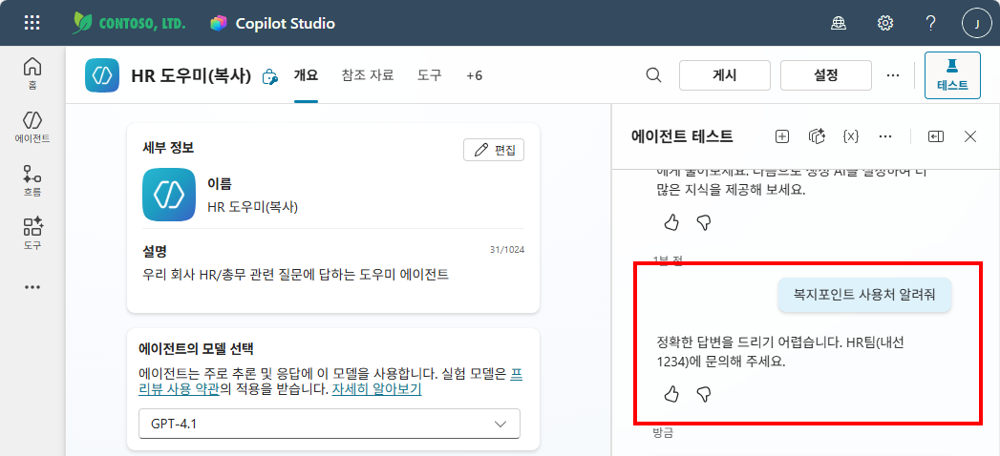

# 실습 ③: Copilot Studio로 가져오기
{: .no_toc }

| 시간 | 소요 | 수강생 역할 |
|:-----|:-----|:-----------|
| 10:25 | 10분 | 🟢 직접 만들기 |

## 목차
{: .no_toc .text-delta }

1. TOC
{:toc}

---

에이전트 빌더로 만든 HR 도우미를 **Copilot Studio로 복사**한 뒤, **언어를 한국어로**, **솔루션을 실습 ②에서 만든 솔루션으로** 설정합니다.

{: .highlight }
> 같은 에이전트인데, **편집 도구만 바뀌었습니다.**  
> 스마트폰 카메라(에이전트 빌더)로 찍은 사진을 포토샵(Copilot Studio)에서 보정하는 것과 같습니다.

## Step 1 — Copilot Studio로 복사

좌측 에이전트 목록에서 "..."를 클릭하여 나오는 메뉴에서 "편집"을 클릭합니다.

에이전트의 편집 화면에서 상단의 "..." 메뉴를 클릭하여 나오는 메뉴에서 "Copilot Studio에 복사"를 클릭합니다.

Copilot Studio 에 복사되는 내용과 복사되지 않는 내용을 확인할 수 있습니다. "시작" 버튼을 클릭합니다.

어떤 파워플랫폼 환경에 복사할지 묻는 창이 뜹니다. 강사가 지정한 환경이 있으면 해당 환경을 선택하고, 그렇지 않으면 기본 환경(Default Environment)을 선택합니다.

---

## Step 2 — 언어 및 솔루션 설정

에이전트가 복사되면 기본 언어가 **영어(en-US)**로 설정되어 있습니다. 상단 "..." 메뉴를 클릭하면 언어와 고급 설정을 변경할 수 있습니다.

**① 언어 변경 — "에이전트 (en-US) 언어 업데이트" 클릭**

**② 한국어(ko-KR) 선택 후 "업데이트" 클릭**

**③ 솔루션 변경 — "..." 메뉴에서 "고급 설정 업데이트" 클릭 → 실습 ②에서 만든 솔루션 선택 후 "업데이트" 클릭**

---

## Step 3 — 에이전트 저장 및 확인

언어와 솔루션을 변경했으면 상단의 **"만들기"** 버튼을 클릭하여 저장합니다.

에이전트의 이름 또한 "HR 도우미 {이름,사번}"으로 변경하는 것을 추천드립니다.  

에이전트가 최초 만들어 질 때 "이 기능은 에이전트 설정을 완료할 때까지 사용할 수 없습니다"라는 메시지가 보입니다. 잠시 기다리면 메시지가 사라지고, 에이전트가 정상적으로 작동하는 것을 확인할 수 있습니다.

에이전트가 만들어 졌고, 테스트도 정상적으로 작동하는 것을 확인할 수 있습니다.

{: .highlight }
> **이후 실습에서는 이 에이전트를 계속 사용합니다.**  
> M6 지침 → M7 지식 → M9 토픽 → M12 흐름까지 이 에이전트에 기능을 추가해 나갑니다.

---

실습을 완료했으면 [M3 본문으로 돌아가세요](m03-agent-builder).
