# 실습 ①: 메아리(Echo) Topic 만들기
{: .no_toc }

| 시간 | 소요 | 수강생 역할 |
|:-----|:-----|:-----------|
| 14:10 | 10분 | 🟢 직접 실습 |

---

| 항목 | 내용 |
|:-----|:-----|
| **Topic 이름** | Echo Topic |
| **역할** | 토픽의 동작 원리를 이해하기 위한 간단한 메아리 토픽 — 사용자의 입력을 그대로 돌려보내서 **토픽이 채택되어 실행되는 과정**을 눈으로 확인 |

{: .highlight }
> 이 실습의 목적은 토픽의 **동작 원리**를 체험하는 것입니다.  
> 토픽의 **설명(Description)**을 오케스트레이터가 읽고 "이 토픽을 실행할지 말지"를 자동으로 판단합니다.  
> 간단한 메아리 토픽을 만들면, **"아, 설명에 맞는 질문이 들어오면 자동으로 이 토픽이 채택되어 동작하는 구나"**를 직접 느낄 수 있습니다.

## Step-by-Step

### 1. 새 토픽 생성

Copilot Studio → 에이전트 → 좌측 **"토픽"** 클릭 → **"+ 토픽 추가"** → **"새로 시작"**

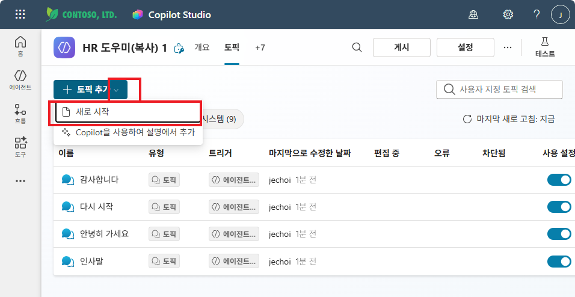

---

### 2. 이름 & 트리거 설명 입력

- Topic 이름: `Echo Topic`
- **토픽이 수행하는 작업 설명**: `이 토픽은 사용자가 메아리 테스트를 요청할 때 실행됩니다. 사용자의 말을 그대로 돌려보냅니다.`

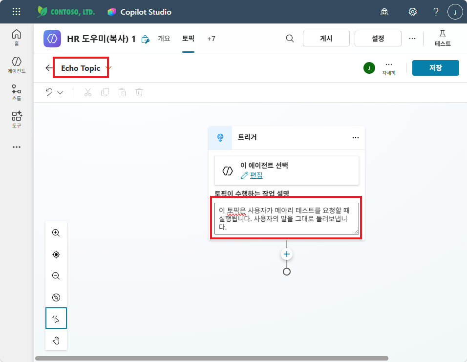

{: .tip }
> 트리거의 **Description**이 핵심입니다. 오케스트레이터가 이 설명을 보고 "Echo Topic을 쓸지 말지"를 판단합니다.

---

### 3. 메시지 보내기 노드 추가 — 인사 메시지

트리거 아래 **"+"** 클릭 → **"메시지 보내기"** 선택

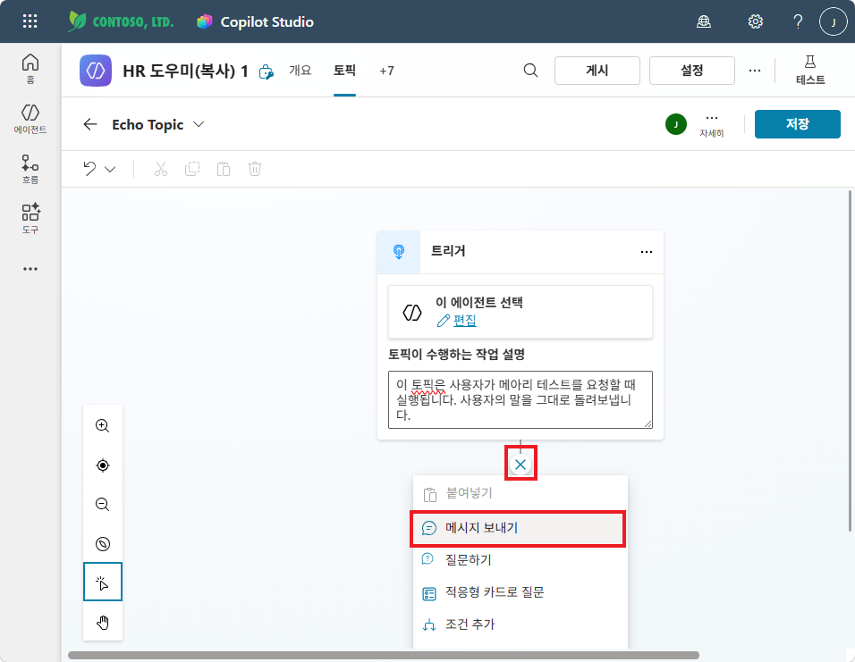

메시지 노드에 인사 메시지를 입력합니다. `안녕하세요` 를 입력한 뒤, **{x}** 버튼을 클릭하여 변수를 삽입합니다.

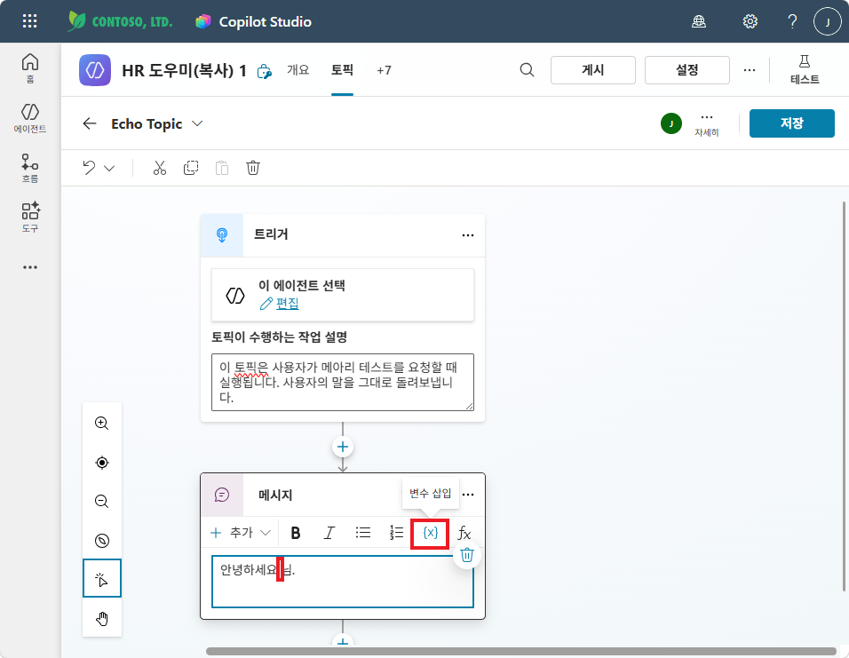

변수 선택 팝업에서 **시스템** 탭 → **Activity.Text**를 선택합니다.

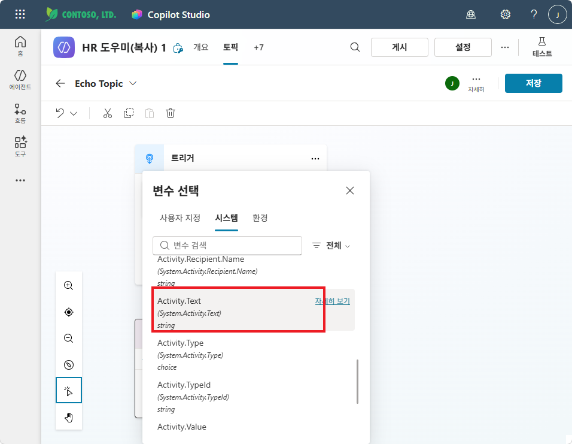

같은 방식으로 **User.DisplayName** 변수도 삽입하여, 사용자 이름을 포함한 인사 메시지를 완성합니다.

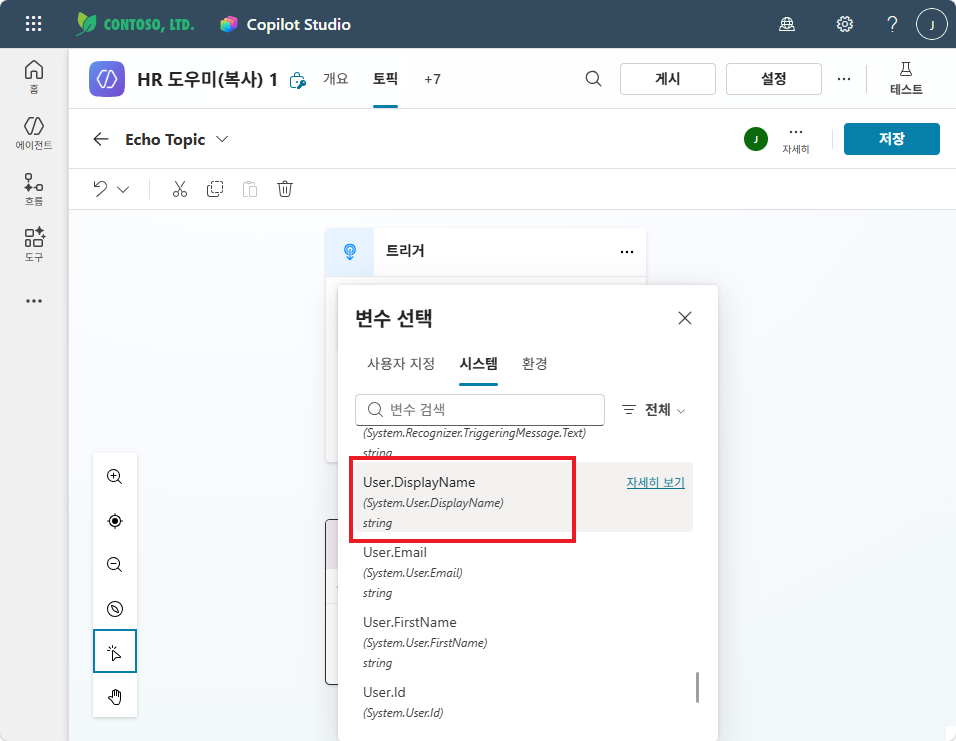

완성된 첫 번째 메시지: `안녕하세요 {User.DisplayName}님.`

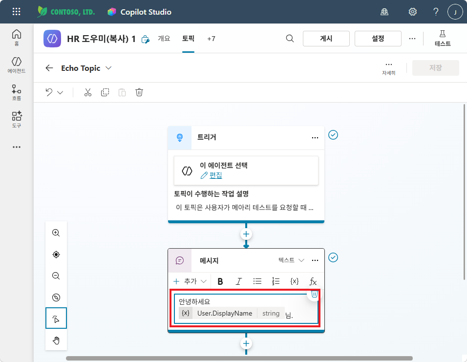

---

### 4. 두 번째 메시지 보내기 노드 추가 — 메아리

첫 번째 메시지 아래 **"+"** 클릭 → **"메시지 보내기"** 추가

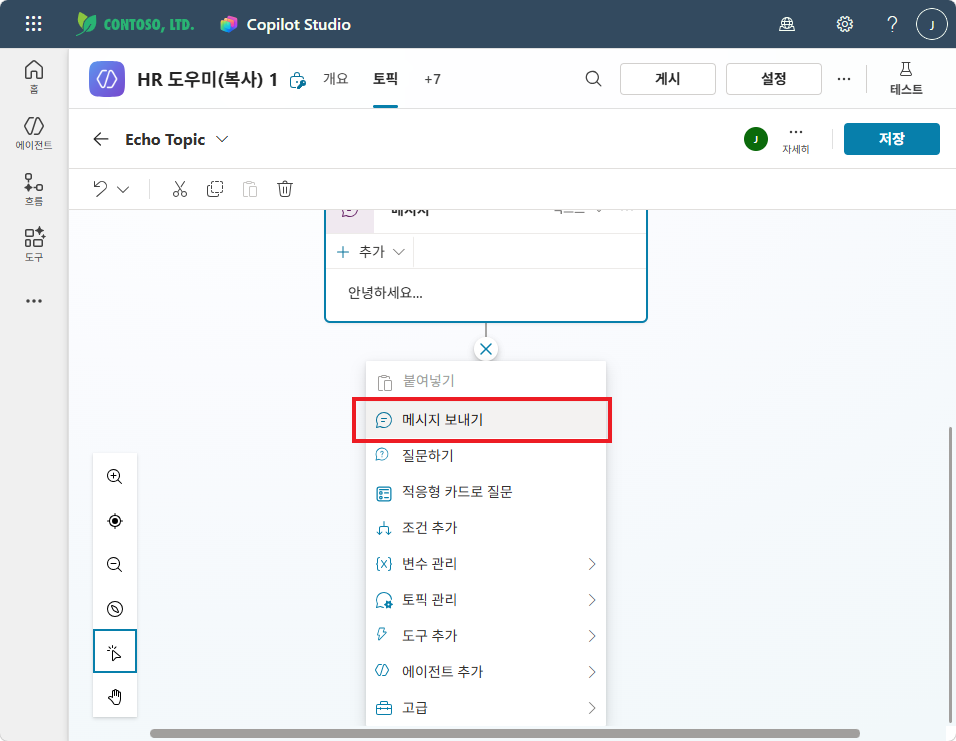

변수 선택에서 **Activity.Text**를 선택하여 사용자의 입력을 그대로 돌려보내는 메아리 메시지를 만듭니다.

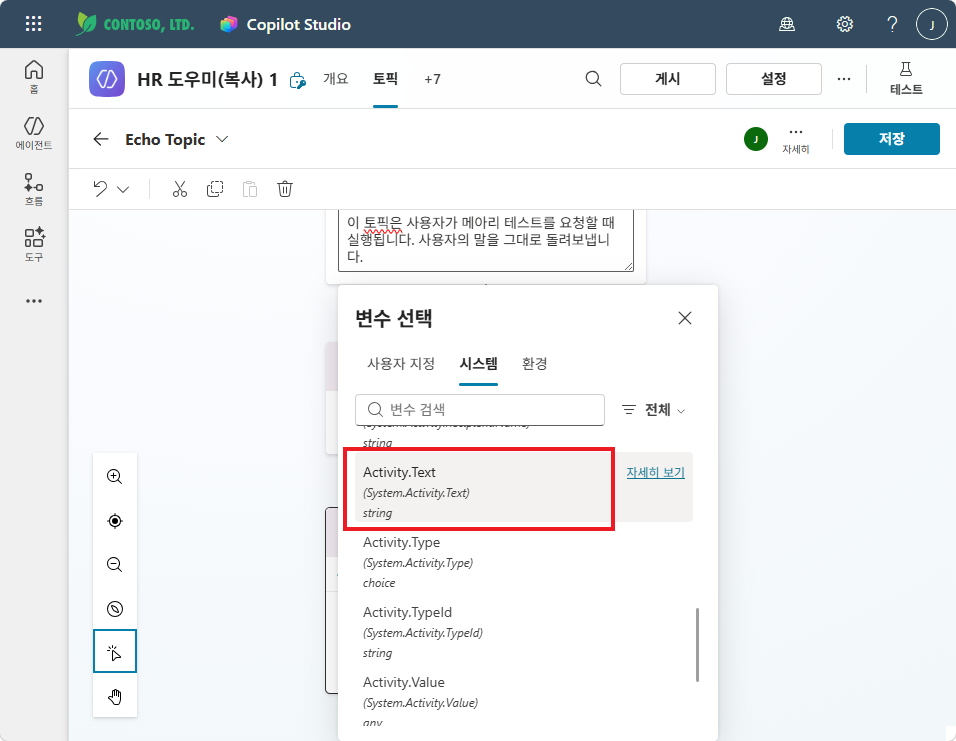

Activity.Text를 여러 번 반복 삽입하면 메아리처럼 반복되는 효과를 줄 수 있습니다.

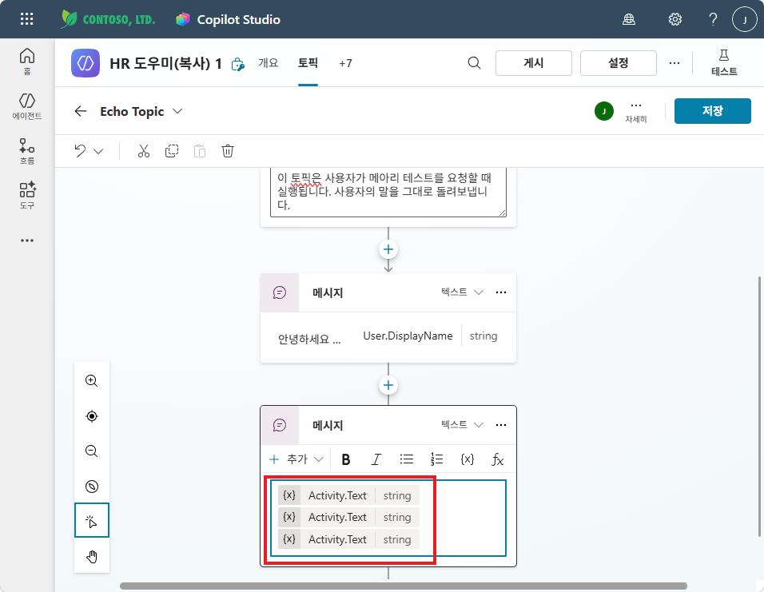

---

### 5. 저장 및 테스트

오른쪽 상단 **저장** 클릭 후, **테스트** 패널에서 "메아리 해줘. 야호~"와 같이 입력해 보세요.

Echo Topic이 **자동으로 채택**되어:
1. 첫 번째 메시지: "안녕하세요 {사용자이름}님."
2. 두 번째 메시지: 사용자의 입력이 메아리처럼 반복

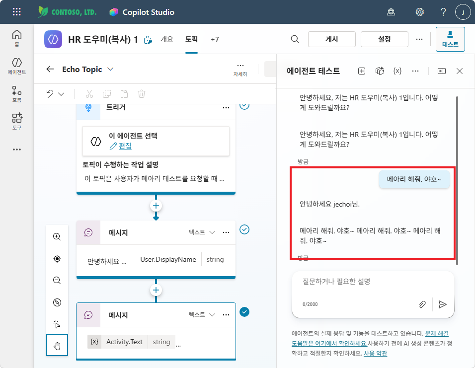

{: .highlight }
> 테스트 패널에서 Topic이 호출되는 과정을 보면, **오케스트레이터가 설명을 읽고 자동으로 토픽을 선택한다**는 것을 직접 확인할 수 있습니다. "아, 토픽의 설명으로 채택되어 동작하는 구나!"

---

실습을 완료했으면 [M10 본문으로 돌아가세요](m10-topic-variables).
