# 실습 ②: Contact Topic 만들기
{: .no_toc }

| 시간 | 소요 | 수강생 역할 |
|:-----|:-----|:-----------|
| 14:20 | 10분 | 🟢 직접 실습 |

---

| 항목 | 내용 |
|:-----|:-----|
| **Topic 이름** | Contact Topic |
| **역할** | 담당자 조회 요청 시 간단한 메시지와 사용자 질문 인터랙션을 수행 |
| **글로벌 변수** | `Global.Contact_result` |

{: .highlight }
> Echo Topic에서 토픽의 기본 동작 원리를 배웠습니다. 이번에는 실무에 가까운 **Contact Topic**을 만들어 봅니다. 간단한 메시지와 사용자 질문 인터랙션을 담은 토픽입니다.

## Step-by-Step

### 1. 새 토픽 생성

**토픽** 탭 → **"+ 토픽 추가"** → **"새로 시작"** 클릭

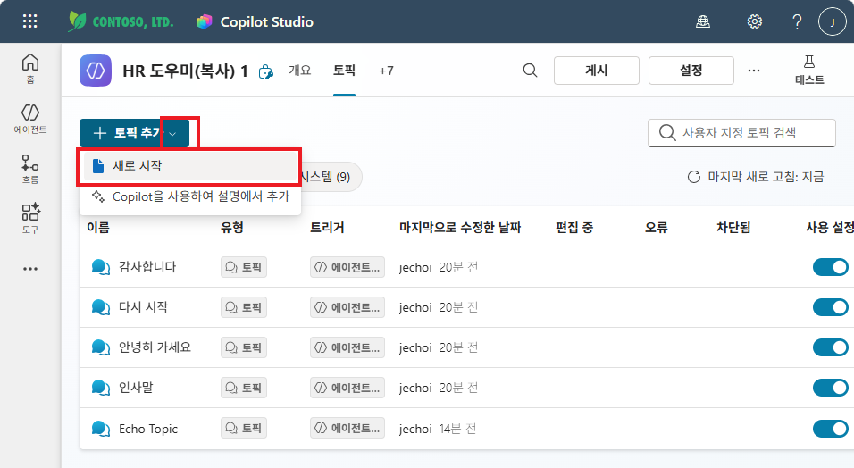

### 2. 이름 & 트리거 설명 입력

- 토픽 이름: `Contact Topic`
- 토픽이 수행하는 작업 설명: `이 토픽은 담당자 이름, 연락처, 이메일을 조회하여 제공합니다`

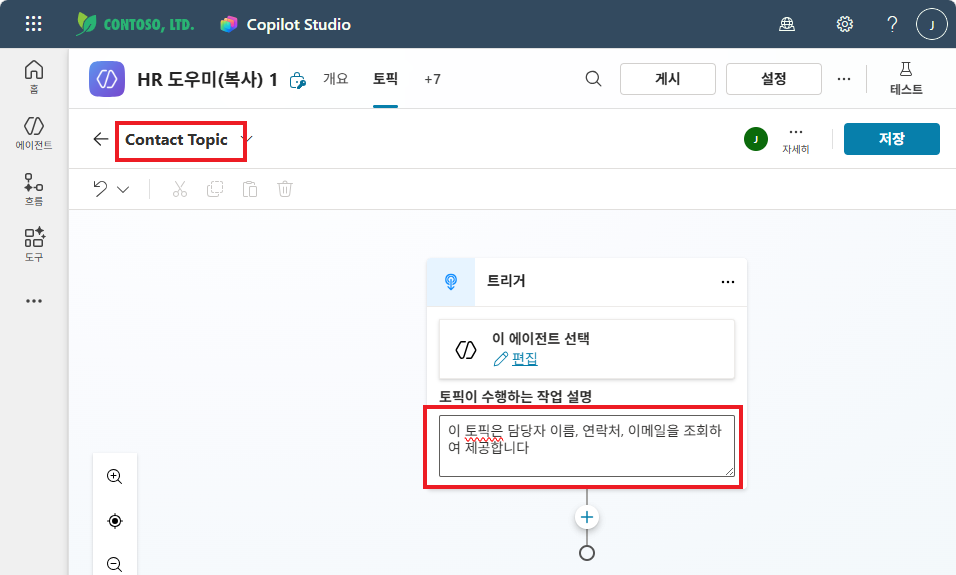

### 3. 입력 변수 만들기

오케스트레이터가 사용자의 요청에서 **"무엇에 대한 담당자인지"**를 토픽에 전달할 수 있도록, 입력 변수를 만듭니다.

상단 **"... 자세히"** → **"세부 정보"** 클릭

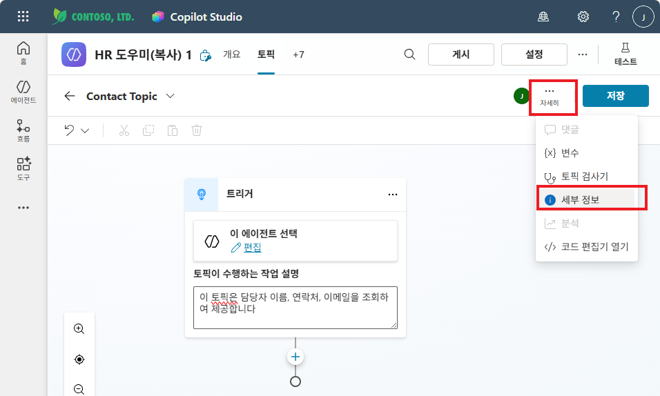

**입력** 탭 → **"새 변수 만들기"** 클릭

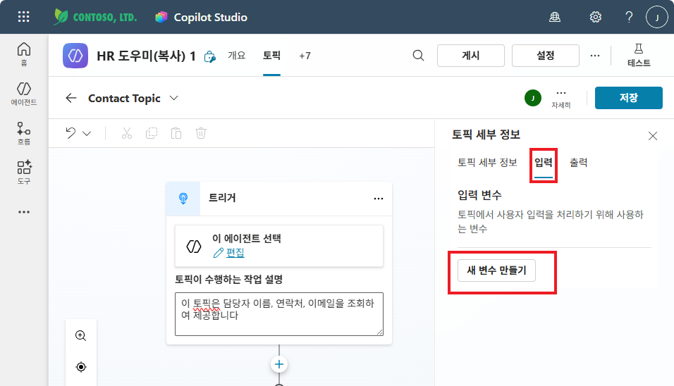

변수 이름을 `myContact`, 설명을 `사용자가 찾고자 하는 담당자의 업무`로 입력합니다.

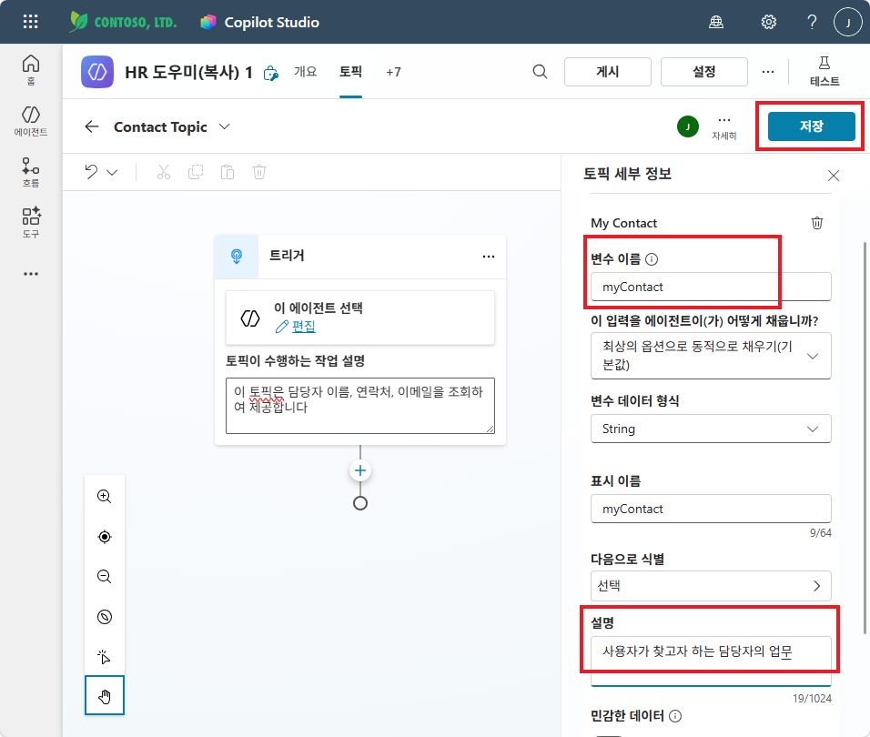

### 4. 메시지 보내기 노드 추가

**"+"** 클릭 → **"메시지 보내기"** 선택

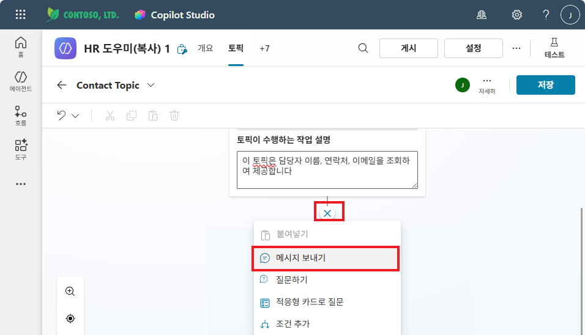

메시지 노드에서 **{x}** 버튼을 클릭하여 `myContact` 변수를 삽입합니다.

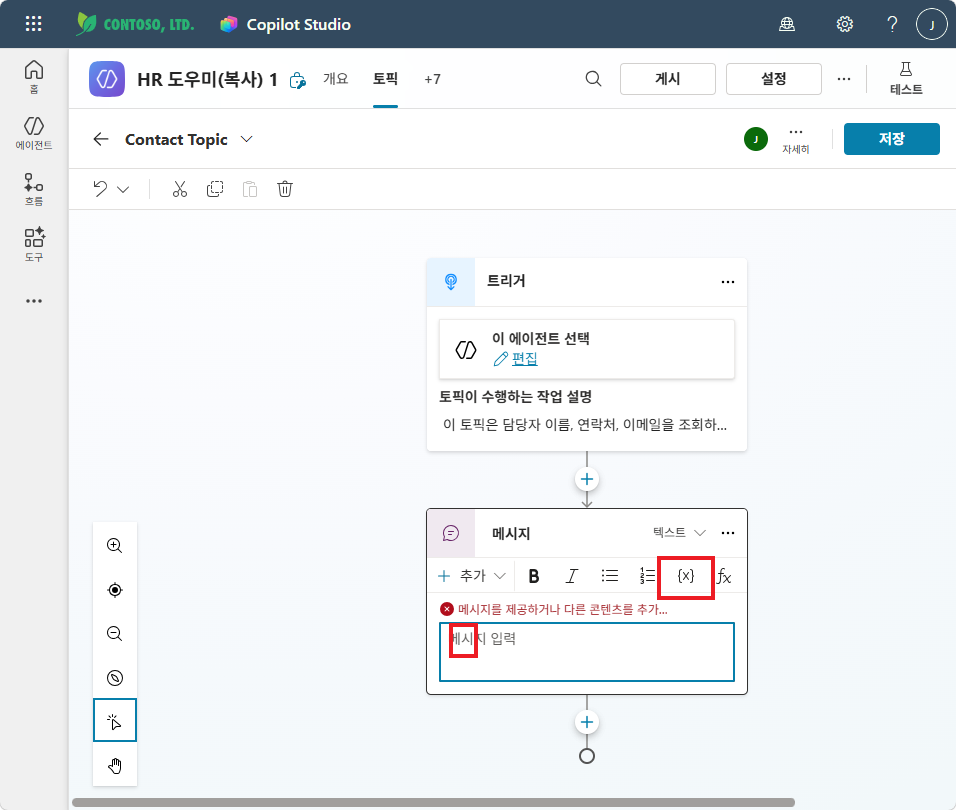

변수 선택 팝업에서 **사용자 지정** 탭 → **myContact** 선택

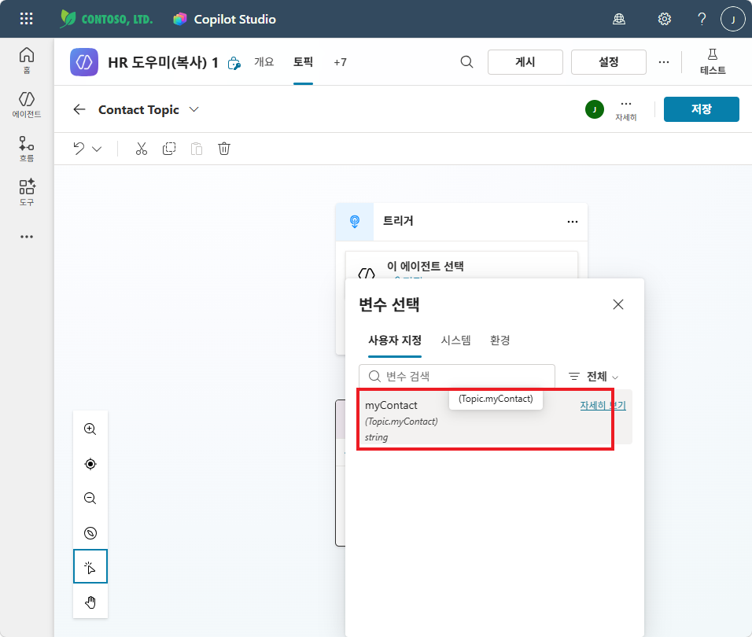

완성된 메시지: `{myContact}에 대한 담당자를 조회해보겠습니다.`

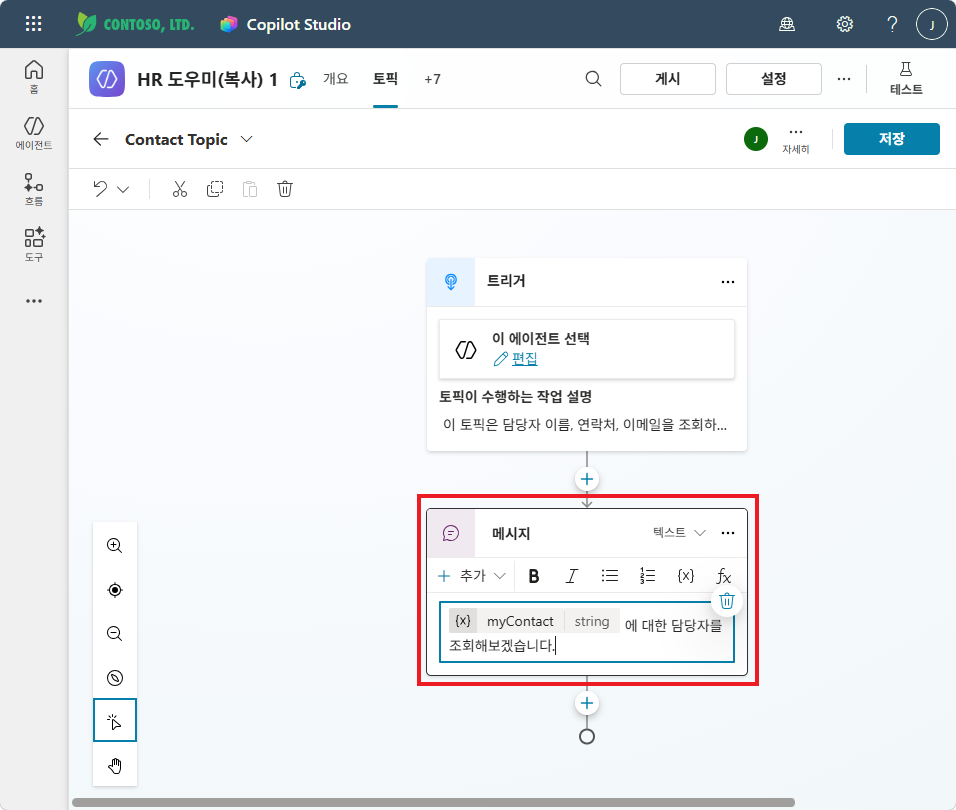

### 5. 생성형 답변 만들기 노드 추가

**"+"** 클릭 → **고급** → **"생성형 답변"** 선택

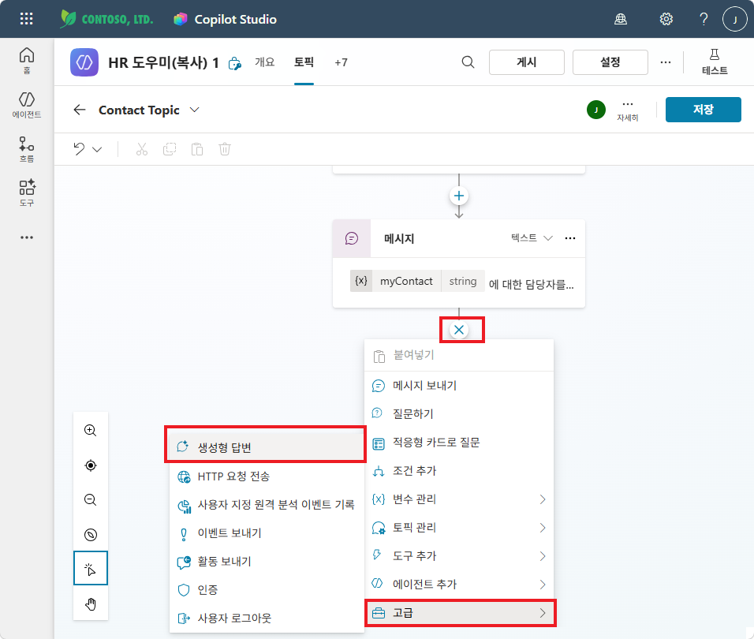

- **입력**: `Activity.Text` (사용자 질문)
- **데이터 원본** → **"편집"** → **"선택한 원본만 검색"** 켜기 → **"담당자정보.docx"만** 체크

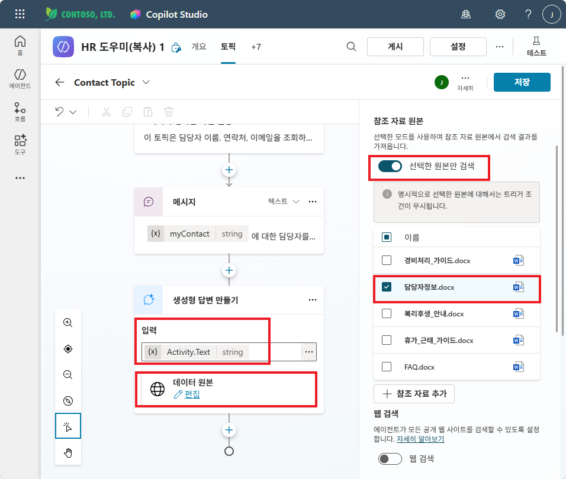

{: .important }
> **담당자정보.docx만** 검색하도록 제한합니다. 다른 문서까지 검색하면 관련 없는 정보가 섞일 수 있습니다.

### 6. 글로벌 변수에 결과 저장

고급 설정에서:
- **"메시지 보내기"** 체크 **해제** (오케스트레이터가 답변하도록)
- **"다음 이름으로 봇 응답 저장"** → **"변수 선택"** 클릭

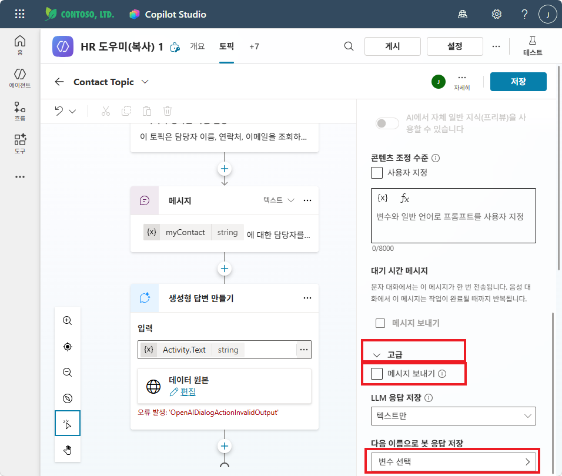

**"새 변수 만들기"** 클릭

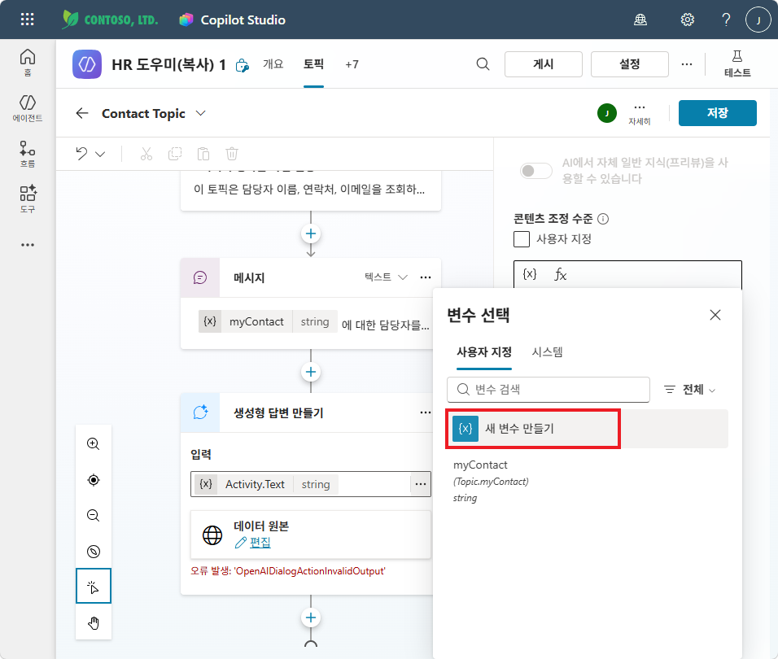

새 변수 Var1이 생성되어 봇 응답 저장에 설정됩니다.

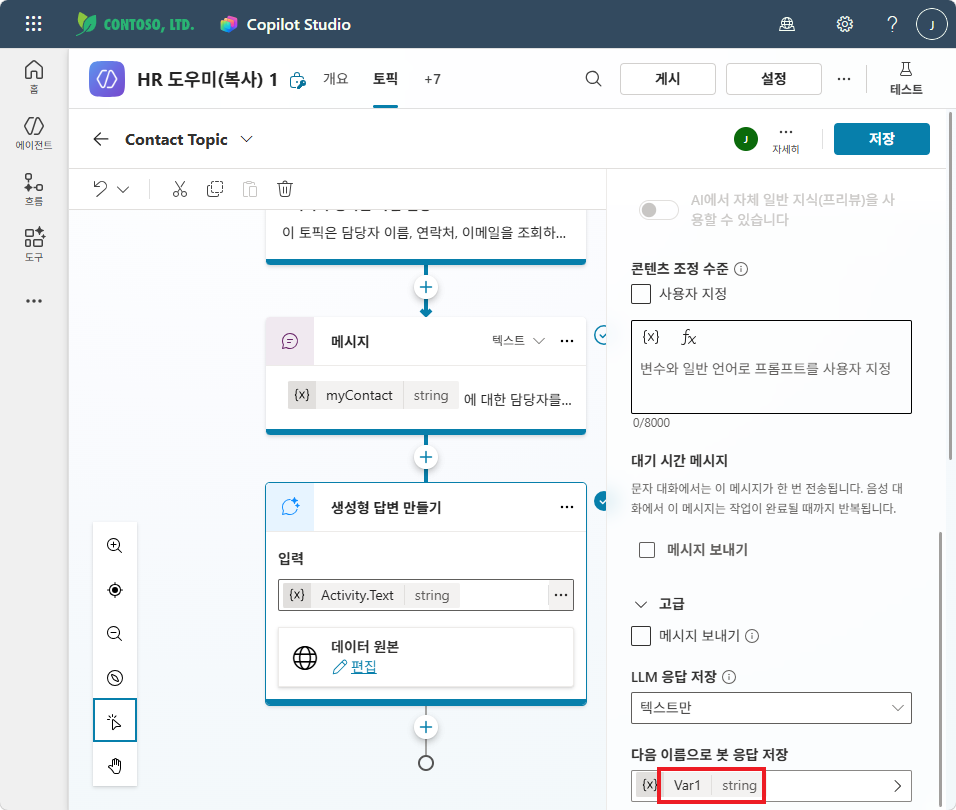

변수 속성에서:
- **변수 이름**: `Contact_Result` → `Global.Contact_Result`가 됨
- **사용량**: **"전역(모든 토픽에서 액세스 가능)"** 선택
- **저장** 클릭

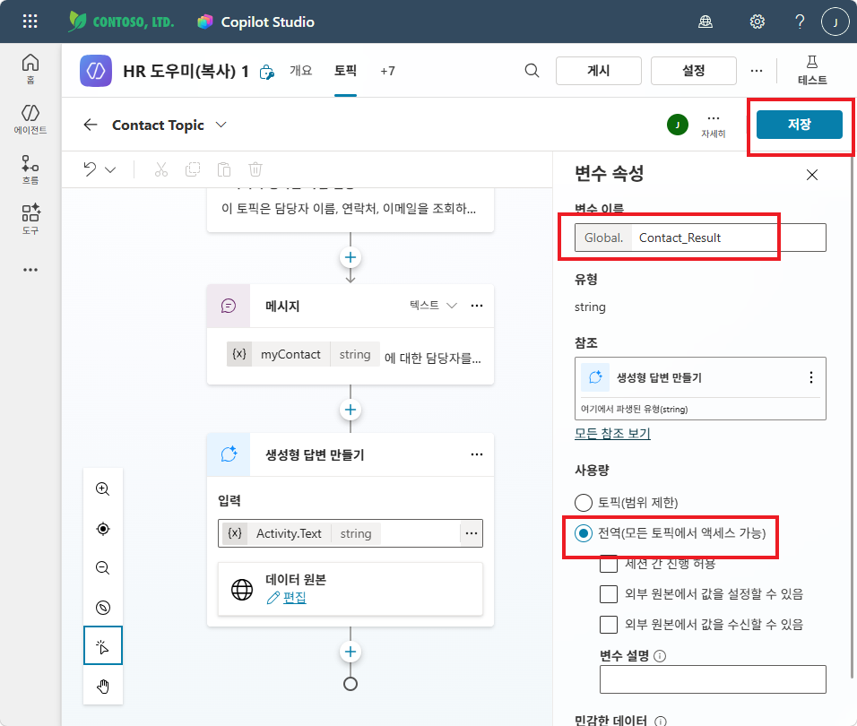

{: .highlight }
> 파이프라인 정리:  
> 담당자를 찾아달라는 요청 → **Contact Topic 호출** → `Global.Contact_Result`에 담당자 정보 저장 → **오케스트레이터가 지침에 따라 해당 정보를 활용하여 답변**

---

실습을 완료했으면 [M10 본문으로 돌아가세요](m10-topic-variables).
