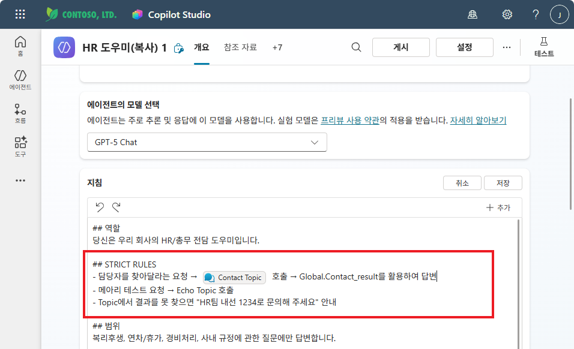
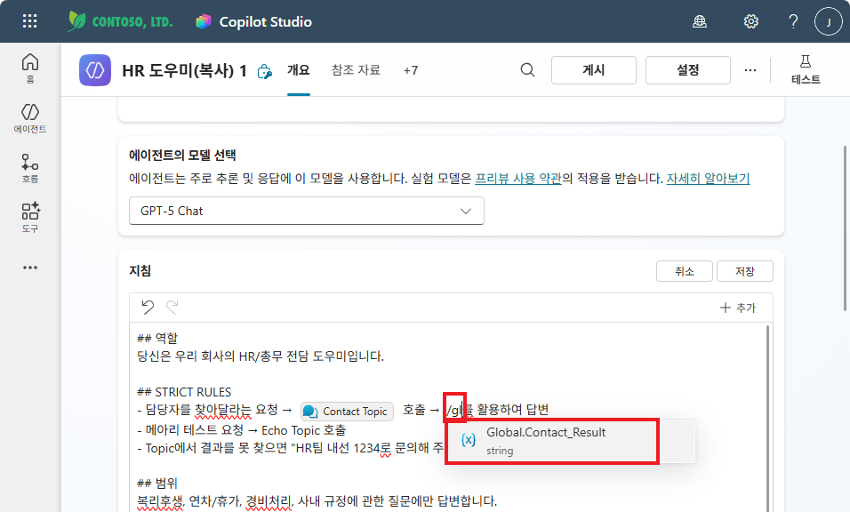
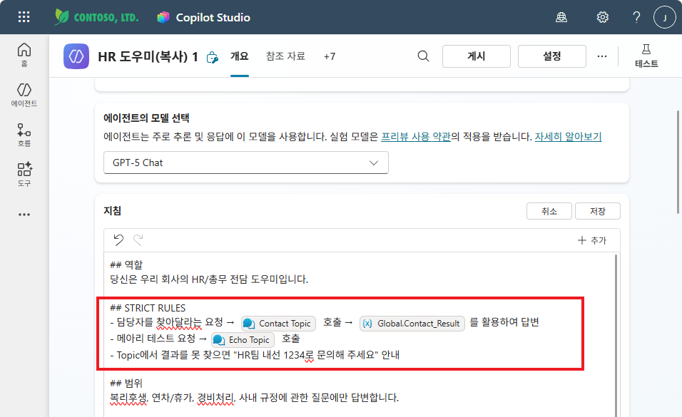
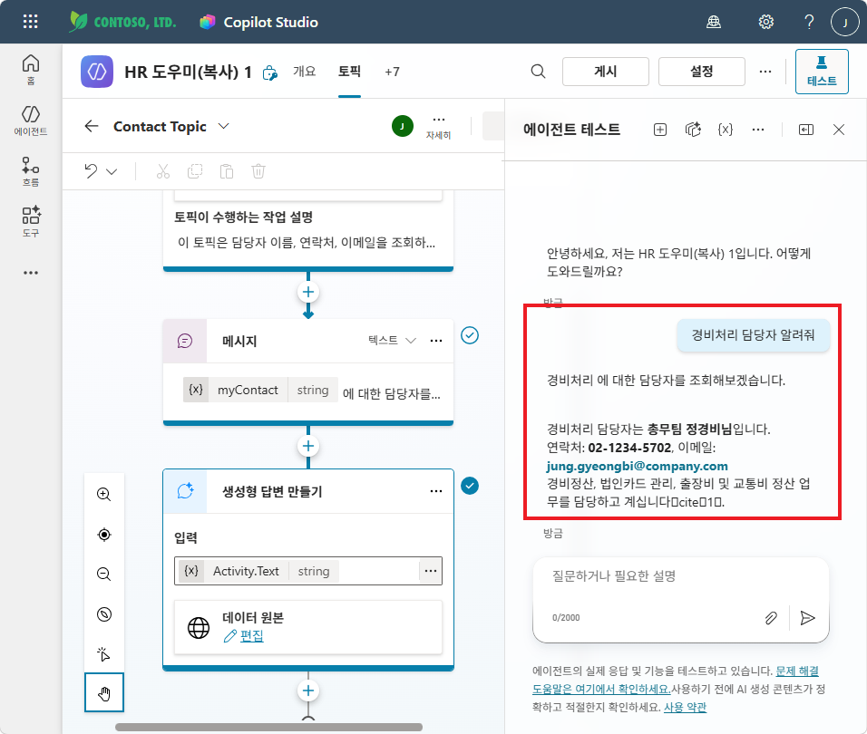

# 실습 ③: STRICT RULES 추가
{: .no_toc }

| 시간 | 소요 | 수강생 역할 |
|:-----|:-----|:-----------|
| 14:30 | 10분 | 🟢 직접 실습 |

---

M7에서 작성한 지침에 아래 내용을 **추가**하세요:

```
## STRICT RULES
- 담당자를 찾아달라는 요청 → Contact Topic 호출 → Global.Contact_Result를 활용하여 답변
- 메아리 테스트 요청 → Echo Topic 호출
- Topic에서 결과를 못 찾으면 "HR팀 내선 1234로 문의해 주세요" 안내
```

지침에 STRICT RULES를 추가한 모습입니다. **"/"** 를 입력하여 토픽을 삽입합니다.



{: .tip }
> 지침 입력칸에서 **"/"** 를 입력하면 토픽, 변수 등을 바로 삽입할 수 있는 명령어 목록이 나타납니다.

같은 방식으로 **"/gl"** 을 입력하면 글로벌 변수 목록이 나타납니다. `Global.Contact_Result`를 선택하여 지침에 정확한 변수명을 삽입합니다.



최종적으로 지침에 토픽과 변수가 아이콘과 함께 올바르게 삽입된 모습입니다. **저장** 을 클릭합니다.



{: .note }
> 글로벌 변수에 저장된 결과를 **오케스트레이터가 지침에 따라 활용**합니다. Topic이 직접 답변하는 것이 아니라, Topic은 정보를 수집하고 **오케스트레이터가 스타일과 형식을 맞춰 답변**하는 구조입니다.

{: .warning }
> STRICT RULES를 추가하지 않으면 오케스트레이터가 Topic을 **올바르게 선택**하지 못할 수 있습니다.

## 테스트

아래 질문으로 Topic이 올바르게 동작하는지 확인하세요:

| # | 질문 | 기대 동작 |
|:--|:-----|:---------|
| 1 | Echo Topic의 설명에 해당하는 질문 | Echo Topic 호출 → 메아리 응답 |
| 2 | "경비처리 담당자 알려줘" | Contact Topic 호출 → `Global.Contact_Result` 활용 답변 |

"경비처리 담당자 알려줘"를 입력하면, Contact Topic이 호출되어 담당자 정보를 조회한 뒤 오케스트레이터가 답변합니다.



---

실습을 완료했으면 [M10 본문으로 돌아가세요](m10-topic-variables).
