# 실습 ①: MSN 날씨 커넥터로 커넥터 체험하기
{: .no_toc }

| 시간 | 소요 | 수강생 역할 |
|:-----|:-----|:-----------|
| 15:20 | 10분 | 🟢 직접 실습 |

## 목차
{: .no_toc .text-delta }

1. TOC
{:toc}

---

## 이 실습에서 하는 것

- **MSN 날씨 커넥터**를 에이전트에 추가하여 커넥터가 동작하는 원리를 체험
- 커넥터가 추가되면 에이전트가 **외부 서비스의 데이터를 직접 가져올 수 있다**는 것을 확인
- 커넥터의 기본 사용법을 익히고, 이후 실습(Excel 커넥터)에 대한 자신감 확보

{: .highlight }
> 이 실습은 커넥터의 기본 동작을 이해하기 위한 **워밍업 실습**입니다. MSN 날씨 커넥터는 별도의 인증이나 설정 없이 바로 사용할 수 있어 커넥터 체험에 적합합니다.

---

## Step 1 — MSN 날씨 커넥터 추가

1. Copilot Studio → 에이전트 → 상단 **"도구"** 탭 클릭
2. **"+ 도구 추가"** 클릭

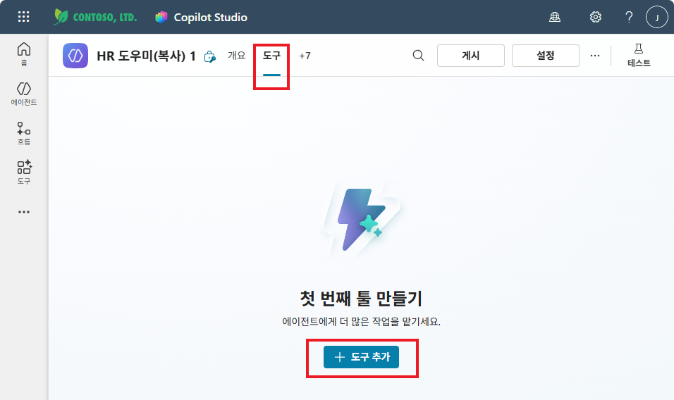

3. 검색창에 **"msn"** 입력 → **커넥터** 필터 선택
4. **MSN 날씨** 에서 **"현재 날씨 가져오기"** 선택

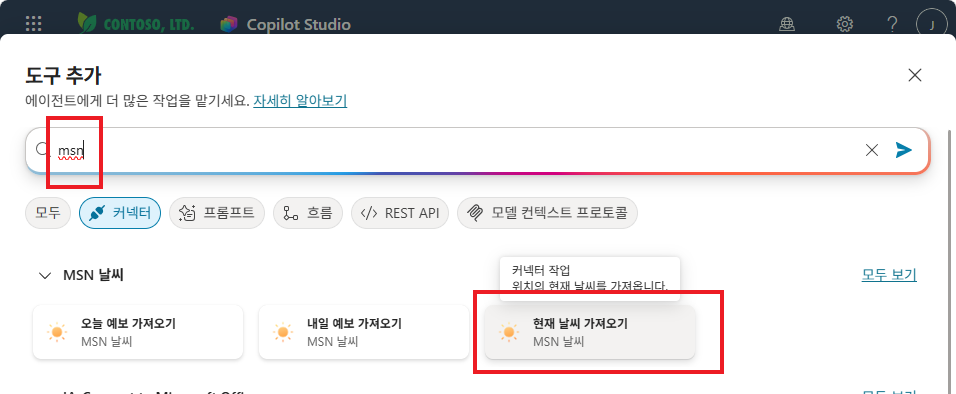

5. 연결 설정 화면에서 기존 연결을 선택하거나 **"새 연결 만들기"** 클릭

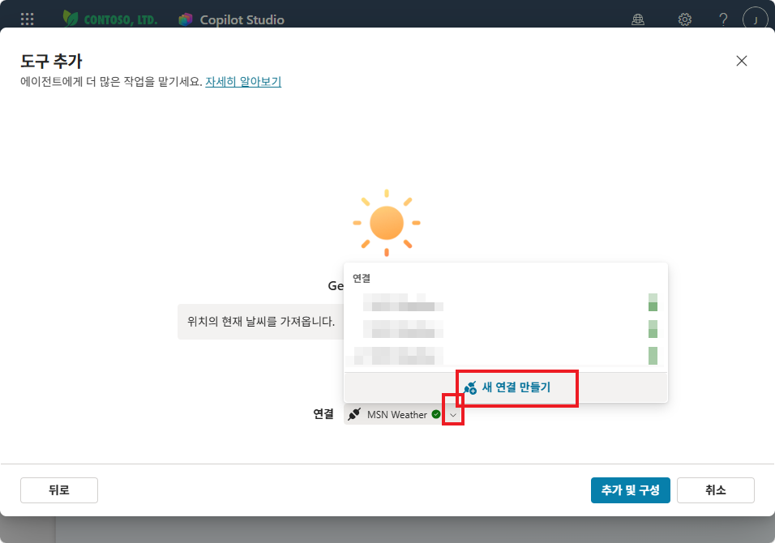

6. **MSN 날씨에 연결** 화면에서 **"만들기"** 클릭

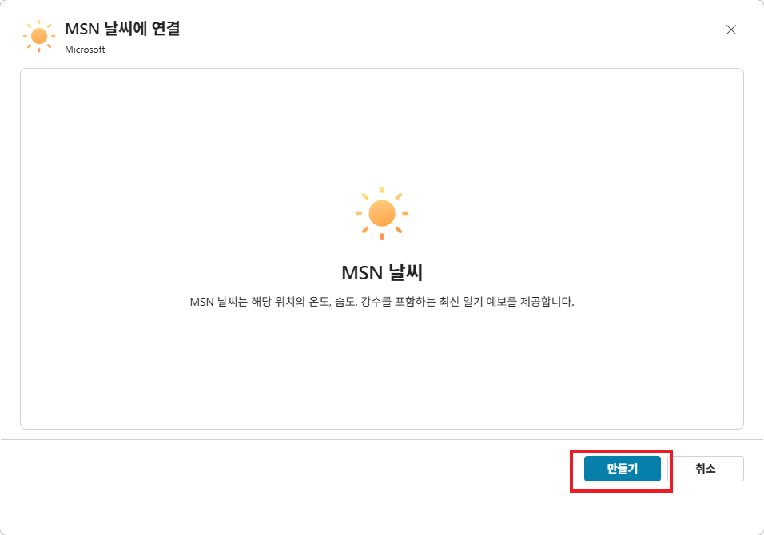

7. 연결이 완료되면 **"추가 및 구성"** 클릭

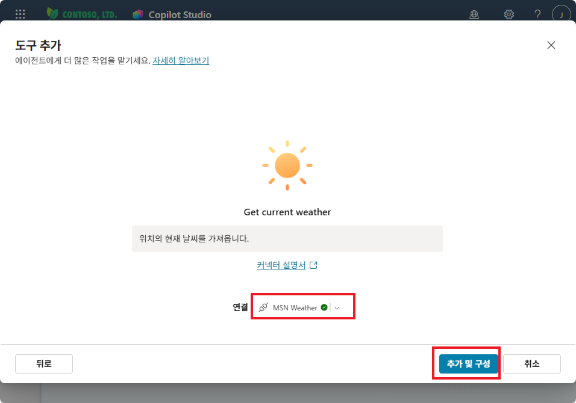

---

## Step 2 — 커넥터 구성

세부 정보 화면에서 이름과 설명을 확인합니다.

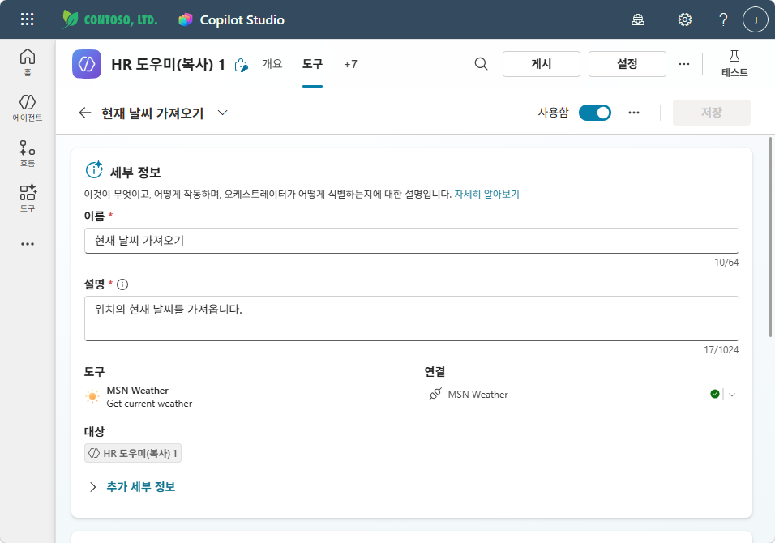

**추가 세부 정보**를 펼쳐서 설정합니다:
- **사용할 자격 증명**: **"최종 사용자 자격 증명"** 또는 **"작성자가 제공한 자격 증명"** 선택

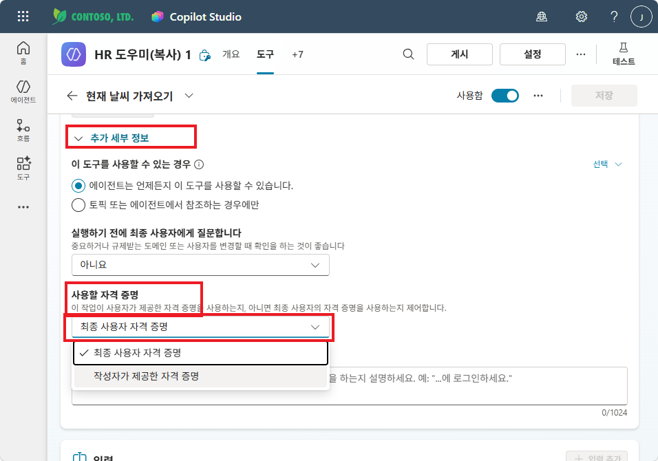

{: .tip }
> **"작성자가 제공한 자격 증명"**을 선택하면 사용자에게 별도 인증을 요구하지 않아 더 편리합니다.

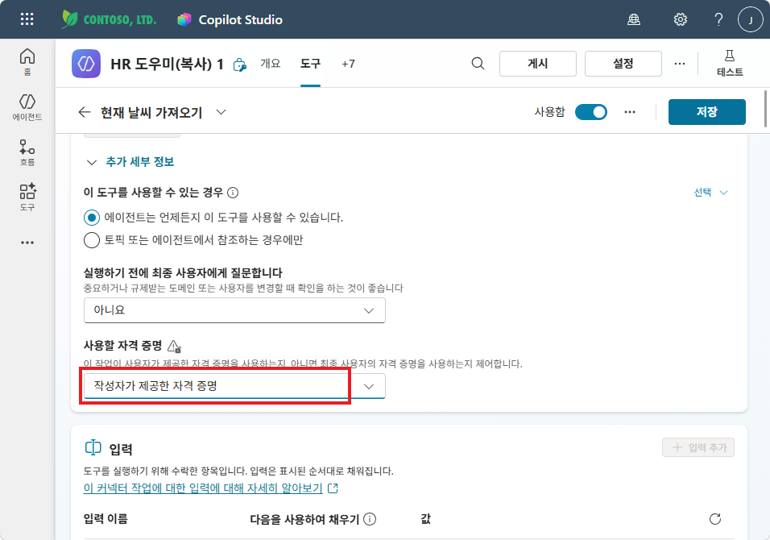

입력 설정에서 **Units**를 **"Metric"**으로 선택한 뒤 **저장**을 클릭합니다.

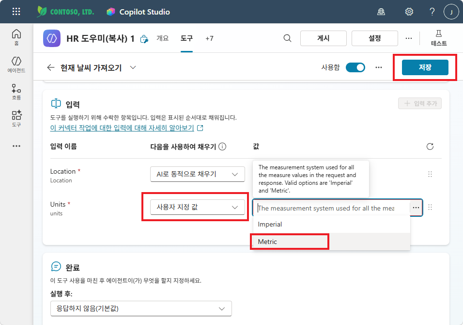

---

## Step 3 — 테스트하기

커넥터가 추가되면, **테스트** 패널에서 날씨 관련 질문을 해봅니다.

"런던의 날씨 날려줘요"를 입력하면, MSN 날씨 커넥터가 호출되어 실제 날씨 데이터를 반환합니다.

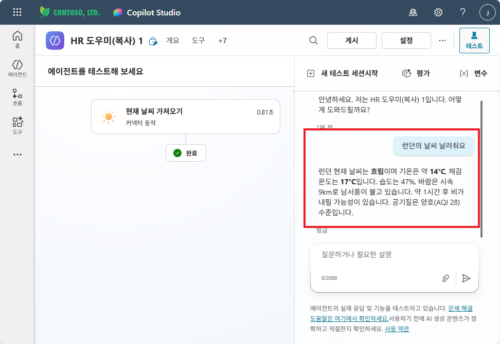

"뉴욕은?"을 입력하면, 커넥터가 다시 호출됩니다. 좌측에서 커넥터 동작의 입력(Location)과 출력을 상세히 확인할 수 있습니다.

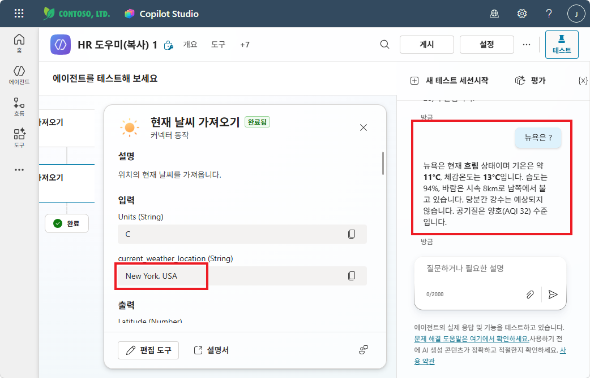

{: .tip }
> 테스트 패널에서 커넥터 동작을 클릭하면 **입력값과 출력값**을 상세히 볼 수 있습니다. 이것이 바로 커넥터의 동작 원리입니다.

---

## 확인 포인트

- ✅ MSN 날씨 커넥터가 도구로 추가되었는가?
- ✅ 날씨 질문에 에이전트가 실제 날씨 데이터로 답변하는가?
- ✅ 테스트 패널에서 커넥터 호출 과정이 보이는가?

{: .highlight }
> 커넥터 하나로 에이전트에 **외부 데이터 접근 능력**을 부여했습니다. 이제 다음 실습에서는 실무에서 자주 쓰는 **Excel 행 추가 커넥터**를 연결합니다.

---

실습을 완료했으면 [M12 본문으로 돌아가세요](m12-connector).
