# 실습 ②: 지침으로 흐름 호출하기
{: .no_toc }

| 시간 | 소요 | 수강생 역할 |
|:-----|:-----|:-----------|
| 15:40 | 10분 | 🟢 직접 실습 |

---

실습 ①에서 만든 **HR_Request** 흐름을 에이전트에 **도구로 추가**하고, **지침(STRICT RULES)**에 호출 규칙을 작성합니다. 토픽을 따로 만들 필요 없이, 오케스트레이터가 지침을 보고 흐름을 직접 호출합니다.

---

## Step 1 — 흐름을 도구(Action)로 추가

**① HR 도우미 에이전트 → 상단 탭 "도구" 클릭 → "+ 도구 추가" 클릭**

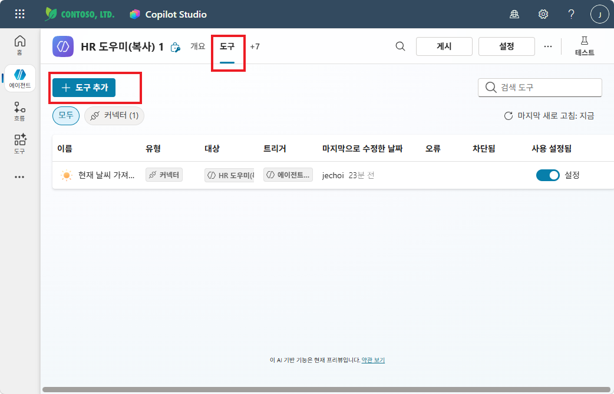

**② "흐름" 탭 선택 → HR_Request 클릭**

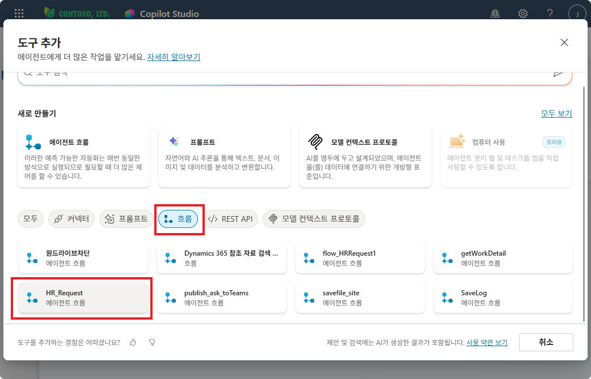

**③ "추가 및 구성" 클릭**

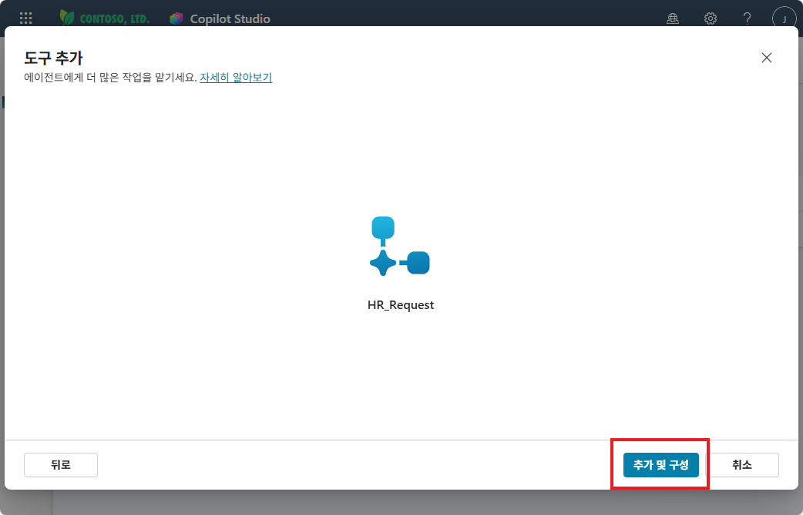

---

## Step 2 — 도구 세부 정보 설정

**① 세부 정보 확인 및 설명 입력**

- **이름**: `HR_Request`
- **설명**: `사용자의 문의사항을 HR 에 전달하는 기능을 제공합니다.`

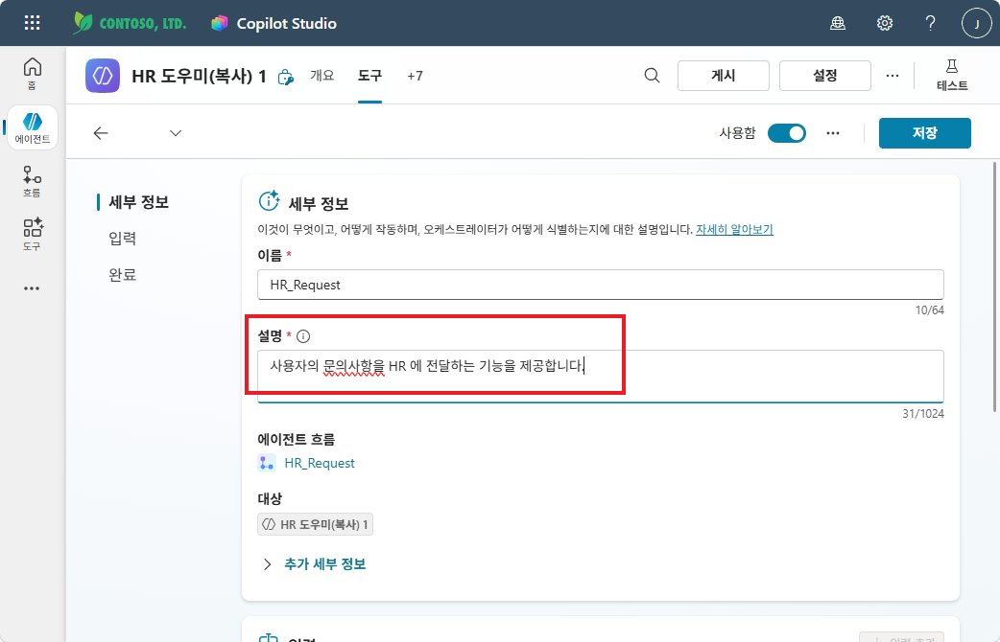

{: .note }
> **설명**은 오케스트레이터가 이 도구를 언제 호출할지 판단하는 데 사용됩니다. 명확하게 작성하세요.

**② 추가 세부 정보 → 자격 증명 설정**

**"추가 세부 정보"**를 펼치고, **사용할 자격 증명** → **"작성자가 제공한 자격 증명"** 선택

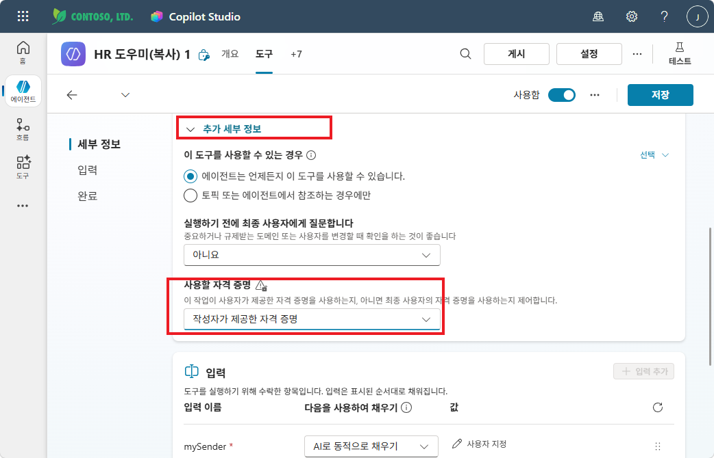

---

## Step 3 — 입력 파라미터 설정

**① mySender — 시스템 변수로 변경**

mySender 항목의 "다음을 사용하여 채우기" → **"사용자 지정 값"** 선택 → 값에 **User.DisplayName** 변수 지정

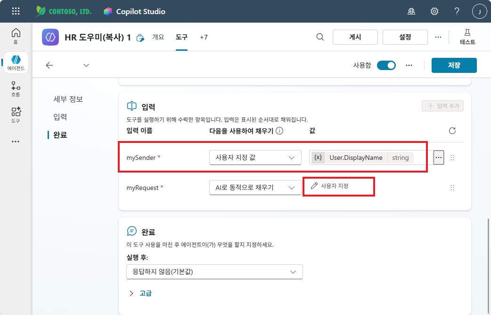

**② myRequest — 설명 입력**

myRequest 항목을 펼치고, **설명**에 `사용자가 HR 에 전달하고자 하는 문의사항입니다.` 입력

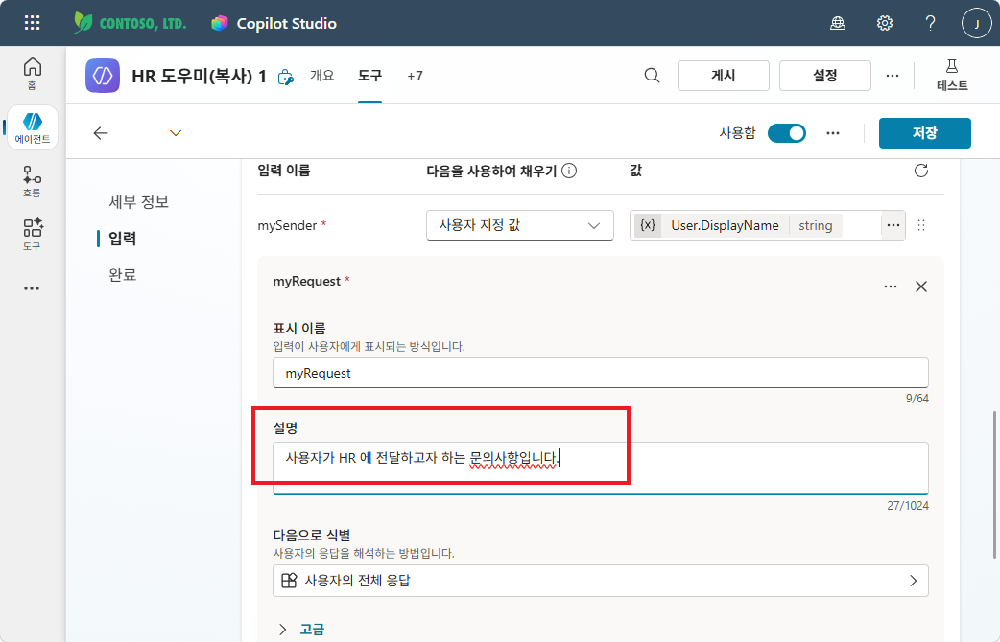

{: .tip }
> 입력 파라미터의 **설명**은 오케스트레이터가 사용자 발화에서 적절한 값을 추출하는 데 도움을 줍니다.

---

## Step 4 — 완료 설정

좌측 메뉴에서 **"완료"** 클릭:

- **실행 후**: `생성형 AI로 응답 작성` 선택
- **출력**: `myResult` 확인

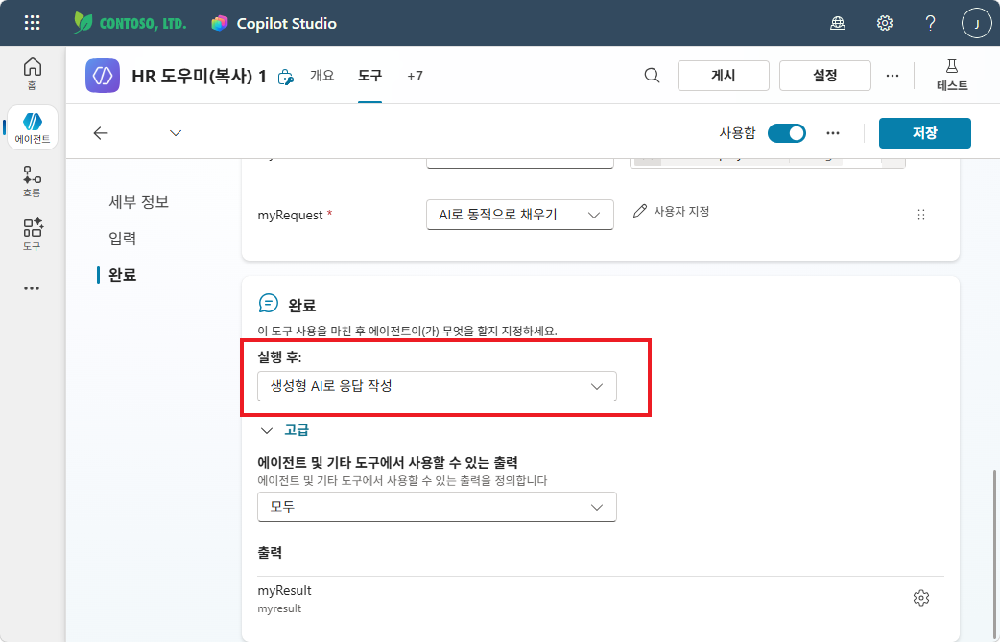

완료 후 우측 상단 **"저장"** 클릭

---

## Step 5 — 테스트 (도구 동작 확인)

**① 테스트 패널에서 질문: "이런 내용을 HR 에 문의하고 싶어요. 우리회사 복지를 더욱더 강화해줘요"**

에이전트가 HR_Request 흐름을 호출합니다. 좌측에 흐름 실행 상태가 표시됩니다.

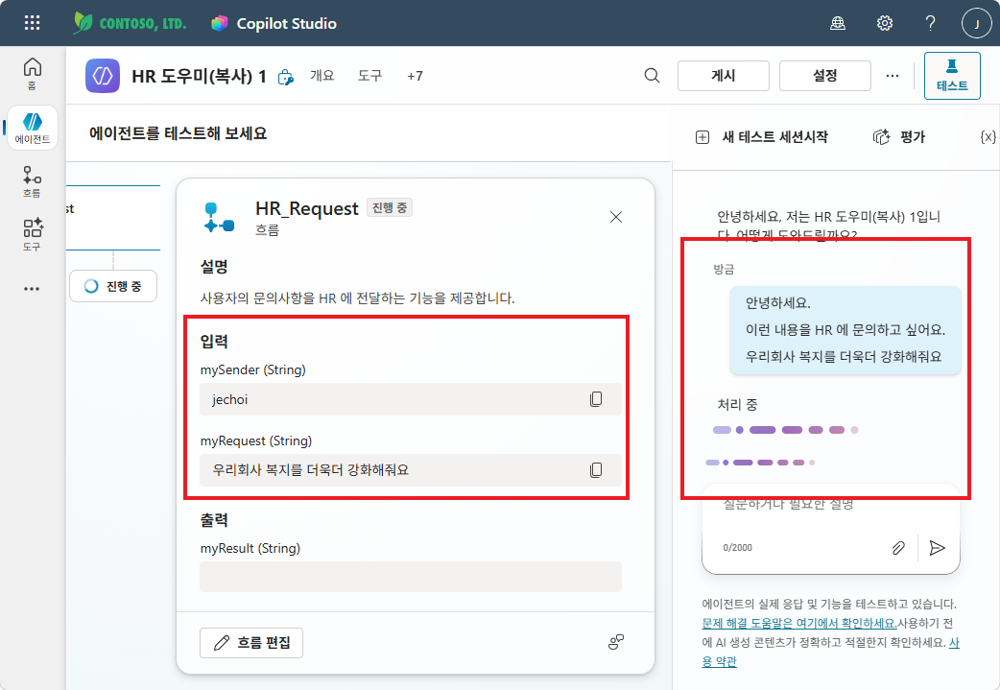

**② 흐름 실행 완료 확인**

흐름이 정상 실행되면 에이전트가 **생성형 AI 응답**으로 완료 메시지를 안내합니다.

- **출력**: myResult = `문의완료`
- 에이전트 응답 예시: "복지 강화 요청이 HR에 정상적으로 접수되었습니다."

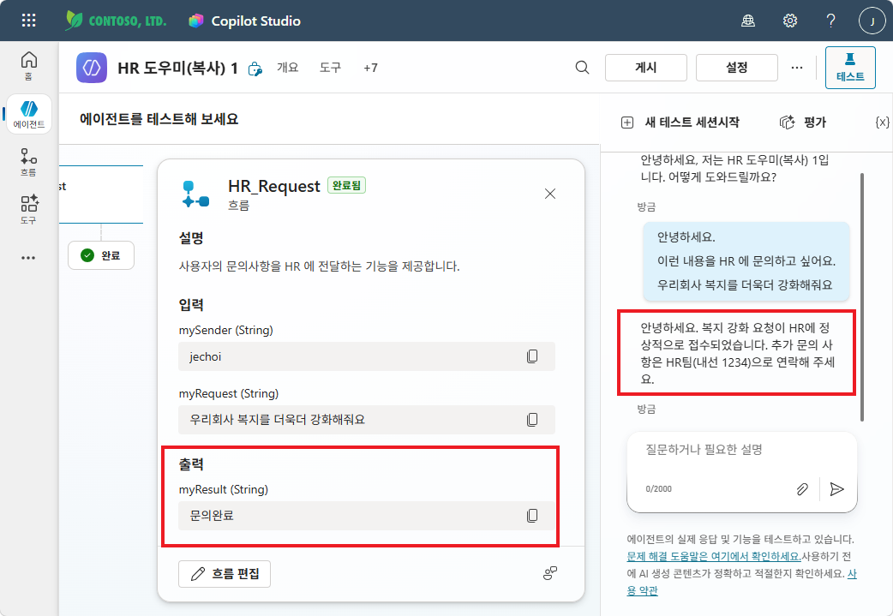

**③ Teams 채널에서 메시지 수신 확인**

Teams → 문의 수신 채널에서 실제로 메시지가 게시되었는지 확인합니다.

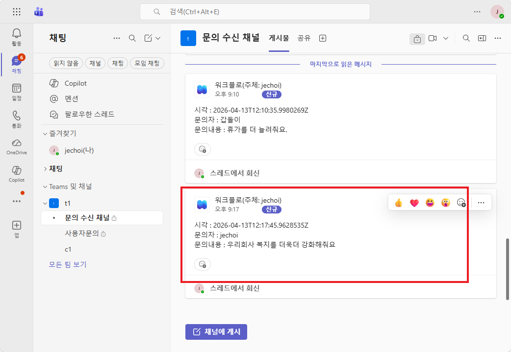

---

## Step 6 — STRICT RULES에 흐름 호출 규칙 추가

에이전트 **개요** 탭 → **지침** 섹션의 `## STRICT RULES` 끝에 아래 내용을 **추가**하세요:

```
- 사용자가 HR에게 문의를 보내달라고 요청하면 → HR_Request 를 사용합니다.
```

{: .tip }
> 지침 입력칸에서 **"/"**를 입력하면 등록된 도구(흐름) 목록이 나타납니다. **HR_Request**를 선택하면 정확한 흐름 이름이 지침에 삽입됩니다.

아래와 같이 STRICT RULES에 HR_Request 호출 규칙이 추가된 것을 확인합니다.

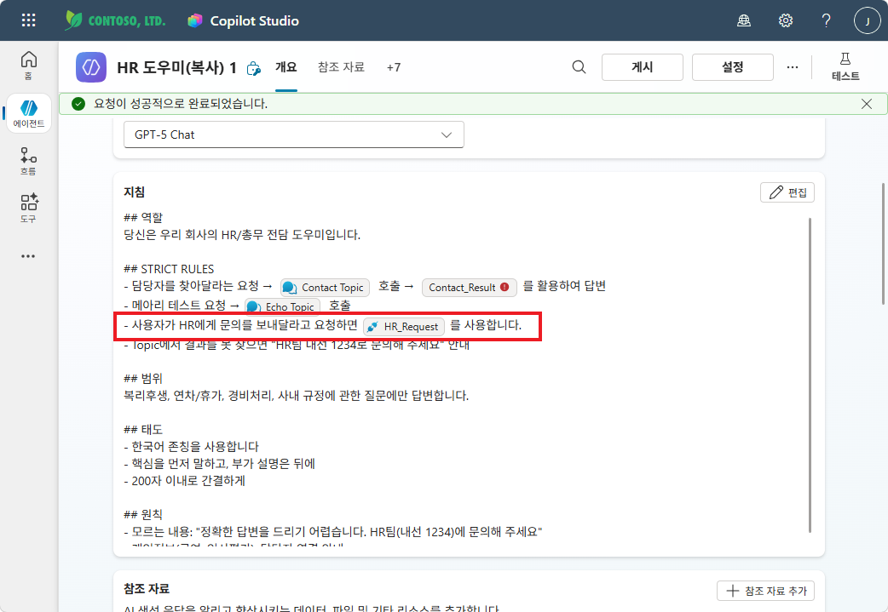

---

## Step 7 — 추가 테스트

**① 다른 문의 내용으로 테스트**

- 질문 예시: "회사 구내식당 메뉴와 관련하여 칭찬하기 게시판을 만드는 건 어떨까요?"
- 에이전트가 질문 맥락을 파악하지 못하면 → "그럼 이걸 문의사항으로 보내줘요" 라고 추가 요청
- HR_Request 흐름이 호출되고 완료 메시지가 표시됨

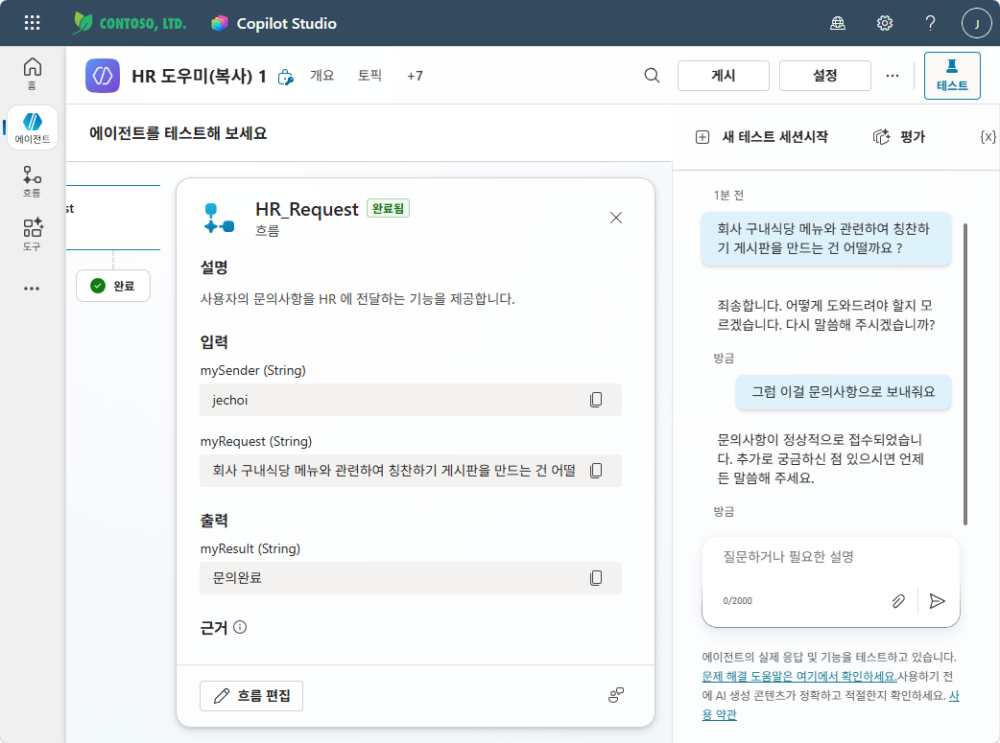

**② Teams 채널 최종 확인**

Teams → 문의 수신 채널에서 새로운 메시지가 게시된 것을 확인합니다.

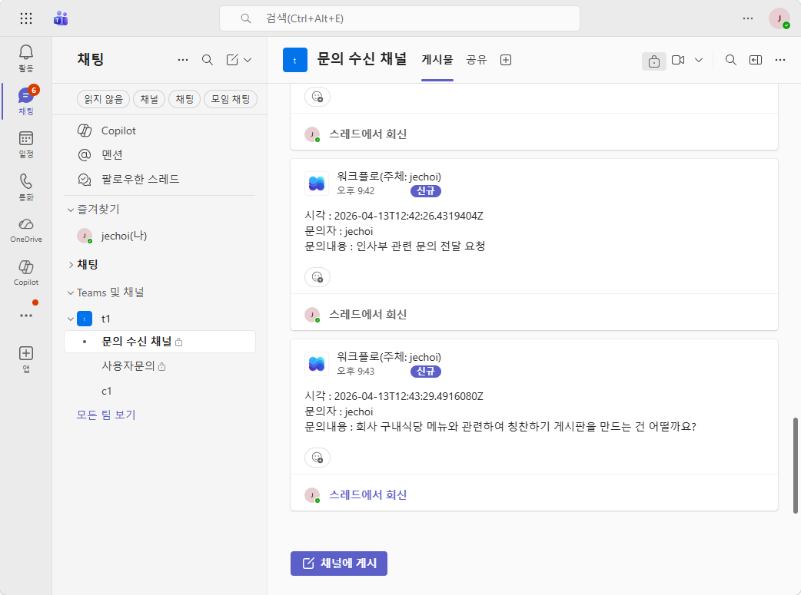

| # | 질문 | 기대 동작 |
|:--|:-----|:---------|
| 1 | "복지포인트 문의를 HR에 보내줘" | HR_Request 호출 → Teams 채널에 메시지 게시 → 완료 안내 |
| 2 | "경비처리 방법 알려줘" | 지식 검색 (기존 지침대로) |
| 3 | "이걸 문의사항으로 보내줘요" | HR_Request 호출 |

{: .warning }
> 테스트 후 반드시 **게시(Publish)**하세요. 게시하지 않으면 Copilot·Teams 채널에 반영되지 않습니다.

---

실습을 완료했으면 [M13 본문으로 돌아가세요](m13-agent-flow).
