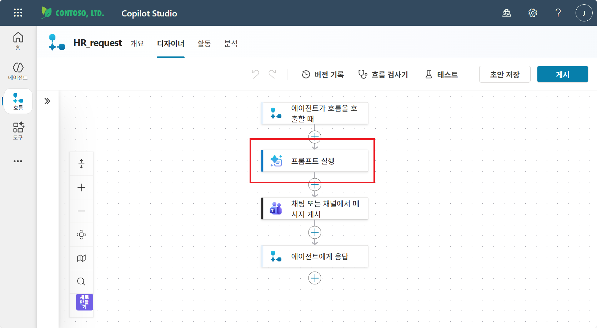
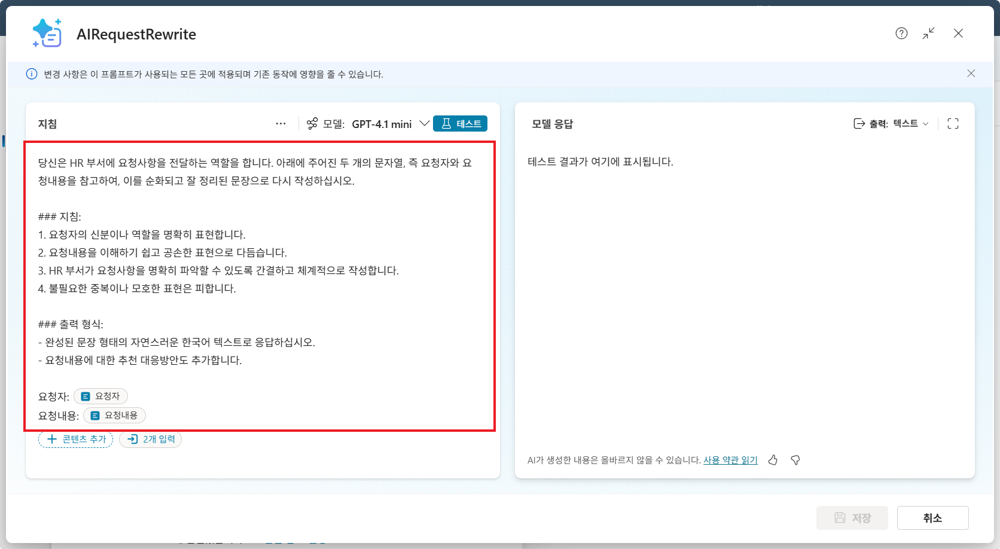
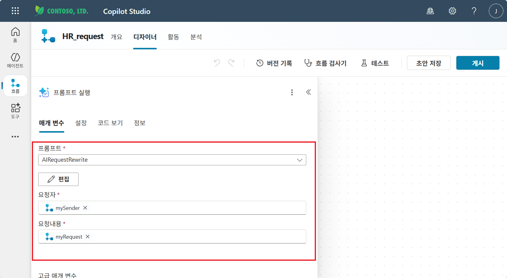
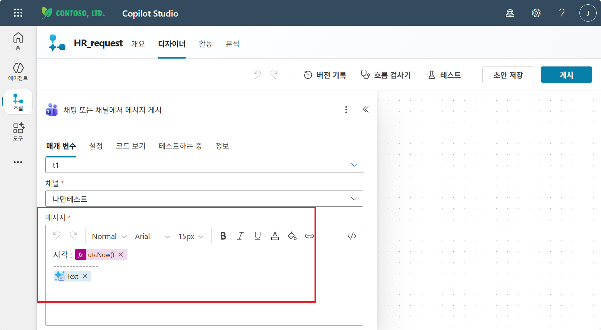
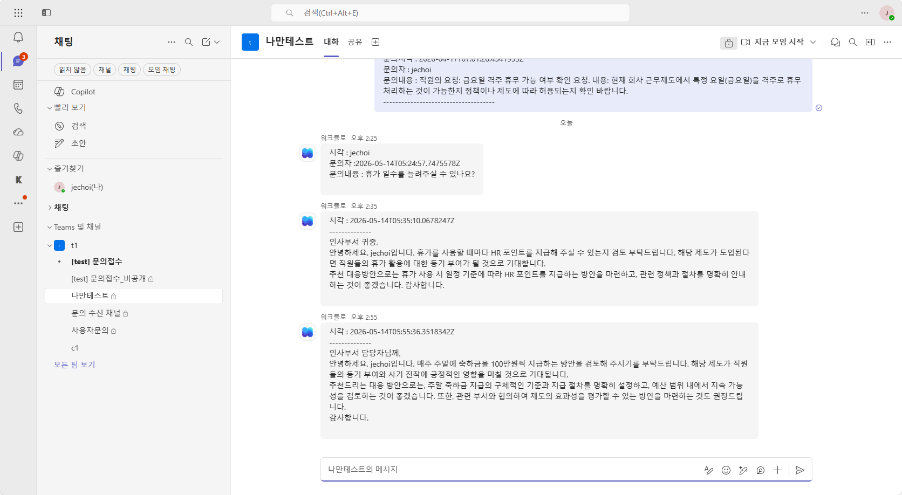

# 실습 ③: 흐름 안에 AI 프롬프트 심기
{: .no_toc }

| 시간 | 소요 | 수강생 역할 |
|:-----|:-----|:-----------|
| 15:50 | 15분 | 🟢 직접 실습 |

## 목차
{: .no_toc .text-delta }

1. TOC
{:toc}

---

실습 ①에서 만든 **HR_Request** 흐름은 사용자의 문의 내용을 **있는 그대로** Teams에 게시합니다. 이번 실습에서는 그 사이에 **AI 프롬프트 실행** 노드를 한 단계 끼워 넣어, 거친 문의 문장을 **인사부에 보낼 만한 정중한 문장**으로 다시 써서 게시합니다.

{: .highlight }
> M14에서 학습할 **AI 프롬프트** 개념을 한발 먼저 흐름에 직접 심어보는 실습입니다. 흐름의 성격이 _규칙 기반 자동화_ → _판단하는 자동화_ 로 바뀌는 지점을 직접 확인합니다.

---

## 완성 흐름 구조

| 단계 | 노드 | 역할 |
|:-----|:-----|:-----|
| ① | 에이전트가 흐름을 호출할 때 | `mySender`, `myRequest` 수신 |
| ② **(NEW)** | 프롬프트 실행 (AIRequestRewrite) | 거친 요청을 정중하게 다시 작성 |
| ③ | 채팅 또는 채널에서 메시지 게시 | AI가 다듬은 문장을 Teams 채널에 게시 |
| ④ | 에이전트에게 응답 | `myResult = 문의완료` |

---

## Step 1 — 흐름 디자이너 열기 & 프롬프트 실행 노드 추가

**① Copilot Studio → 좌측 "흐름" → `HR_request` 클릭 → "디자이너" 탭**

**② 트리거(에이전트가 흐름을 호출할 때) 와 "채팅 또는 채널에서 메시지 게시" 사이의 ⊕ 버튼 클릭**

**③ 작업 추가 → AI 기능 → "프롬프트 실행" 선택**

아래와 같이 트리거와 Teams 메시지 게시 노드 **사이**에 **프롬프트 실행** 노드가 추가됩니다.



{: .note }
> **프롬프트 실행** 노드는 Power Automate 흐름 안에서 **AI가 한 단계 수행**하도록 만드는 노드입니다. 자세한 개념은 M14에서 다룹니다.

---

## Step 2 — 새 프롬프트 만들기 (AIRequestRewrite)

**① 프롬프트 실행 노드 클릭 → "프롬프트" 드롭다운 옆 "새 프롬프트 만들기" 또는 "편집"**

**② 프롬프트 이름**: `AIRequestRewrite`  
**모델**: `GPT-4.1 mini` (기본값 사용 가능)

**③ 지침 영역에 아래 내용을 입력합니다.** (요청자, 요청내용 두 입력 변수는 본문에서 토큰으로 삽입)

```
당신은 HR 부서에 요청사항을 전달하는 역할을 합니다. 아래에 주어진 두 개의 문자열, 즉 요청자와 요청내용을 참고하여, 이를 순화되고 잘 정리된 문장으로 다시 작성하십시오.

### 지침:
1. 요청자의 신분이나 역할을 명확히 표현합니다.
2. 요청내용을 이해하기 쉽고 공손한 표현으로 다듬습니다.
3. HR 부서가 요청사항을 명확히 파악할 수 있도록 간결하고 체계적으로 작성합니다.
4. 불필요한 중복이나 모호한 표현은 피합니다.

### 출력 형식:
- 완성된 문장 형태의 자연스러운 한국어 텍스트로 응답하십시오.
- 요청내용에 대한 추천 대응방안도 추가합니다.

요청자: [요청자]
요청내용: [요청내용]
```

**④ "+ 콘텐츠 추가" 또는 "입력" 버튼으로 텍스트 입력 변수 2개 추가**

| 입력 변수 | 유형 | 본문 내 토큰 위치 |
|:---------|:-----|:----------------|
| `요청자` | 텍스트 | `요청자: [요청자]` |
| `요청내용` | 텍스트 | `요청내용: [요청내용]` |

지침의 `[요청자]`, `[요청내용]` 자리에 각각 **입력 변수 토큰**(파란색 알약 모양)을 끼워 넣습니다.



**⑤ 우측 하단 "저장" 클릭 → 프롬프트 편집 화면 닫기**

{: .tip }
> 우측 **테스트 패널**에서 실제 값을 넣고 AI 응답을 미리 볼 수 있습니다. 한번 시험 출력해 보면 지침이 의도대로 동작하는지 빠르게 확인할 수 있습니다.

---

## Step 3 — 프롬프트 실행 노드에 입력값 매핑

다시 디자이너로 돌아오면, 프롬프트 실행 노드의 **매개 변수** 탭에 방금 만든 프롬프트와 입력 변수 칸이 노출됩니다.

| 필드 | 매핑할 값 | 매핑 방법 |
|:-----|:----------|:----------|
| **프롬프트** | `AIRequestRewrite` | 드롭다운에서 선택 |
| **요청자** | `mySender` | 동적 콘텐츠(번개 ⚡) → mySender |
| **요청내용** | `myRequest` | 동적 콘텐츠(번개 ⚡) → myRequest |



{: .note }
> 입력 변수 이름(`요청자`/`요청내용`)은 프롬프트의 **변수 이름**이고, 매핑되는 값(`mySender`/`myRequest`)은 **흐름의 트리거 변수**입니다. 이름이 비슷해 보여도 다른 계층이라는 점에 유의하세요.

---

## Step 4 — Teams 메시지 본문을 AI 출력으로 교체

이제 메시지 본문을 단순화합니다. 더 이상 `mySender` / `myRequest`를 직접 표시하지 않고, **AI가 다듬은 결과 한 덩어리**를 그대로 게시합니다.

**① "채팅 또는 채널에서 메시지 게시" 노드 클릭**

**② 메시지 영역의 기존 본문(`시각:` / `문의자:` / `문의내용:` 3줄)을 모두 지운 뒤 아래 형식으로 다시 작성**

| 줄 | 내용 |
|:---|:-----|
| 1 | `시각 : ` 뒤에 fx → `utcNow()` 삽입 |
| 2 | `---------------` (구분선) |
| 3 | 동적 콘텐츠(번개 ⚡) → **`Text`** (프롬프트 실행 노드의 출력) 삽입 |



{: .warning }
> 동적 콘텐츠 목록에 **`Text`**가 보이지 않으면, Step 3에서 프롬프트 실행 노드의 매개 변수 매핑이 저장되지 않은 것입니다. 디자이너 캔버스를 한 번 클릭해 노드 상태를 새로 고친 뒤 다시 시도하세요.

**③ 우측 상단 "초안 저장" → "게시" 클릭**

---

## Step 5 — 에이전트에서 테스트

이미 실습 ②에서 STRICT RULES에 `HR_Request` 호출 규칙이 등록되어 있으므로, 에이전트 테스트 패널에서 자연어로 문의를 보내면 자동으로 흐름이 실행됩니다.

**① 에이전트 테스트 패널에서 질문**: `휴가 일수를 늘려주실 수 있나요? 이걸 HR에 문의해줘요`

**② Teams → 문의 수신 채널 확인**

AI가 다듬은 **정중한 인사부 문의 메시지**가 게시됩니다.



| 보낸 사람 입력 | 채널에 게시된 결과 |
|:---------------|:------------------|
| "휴가 일수를 늘려주실 수 있나요?" | "인사부 귀중, 안녕하세요. jechoi입니다. 휴가를 사용할 때마다 HR 포인트를 지급해 주실 수 있는지 검토 부탁드립니다 …" + 추천 대응방안 |
| "주말에 축하금 100만원씩 줘요" | "인사부 담당자님께, 안녕하세요. jechoi입니다. 매주 주말에 축하금을 100만원씩 지급하는 방안을 검토해 주시기를 부탁드립니다 …" + 추천 대응방안 |

{: .tip }
> 같은 흐름이지만 거친 입력 → 정중한 출력으로 **품질이 한 단계 올라간 것**을 확인할 수 있습니다. 이것이 _Flow에 AI를 한 단계 심는다_ 의 효과입니다.

---

## 핵심 정리

1. **프롬프트 실행** 노드를 흐름 중간에 끼워 넣으면, 규칙 기반 흐름 안에 **AI 판단 단계**가 들어옵니다.
2. 프롬프트의 **입력 변수**(`요청자`/`요청내용`)는 **흐름 트리거 변수**(`mySender`/`myRequest`)와 매핑해서 연결합니다.
3. 후속 노드(Teams 메시지)는 더 이상 원본을 직접 쓰지 않고, **프롬프트 출력 `Text`** 한 덩어리를 그대로 사용합니다.
4. M14에서는 이 AI 프롬프트의 **4가지 유형**(텍스트·멀티모달·코드 인터프리터·Word 출력)과 확장 사례를 다룹니다.

---

실습을 완료했으면 [M13 본문으로 돌아가세요](m13-agent-flow).
