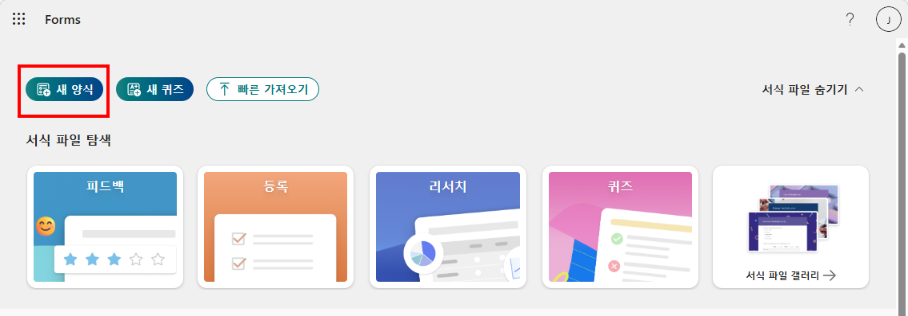
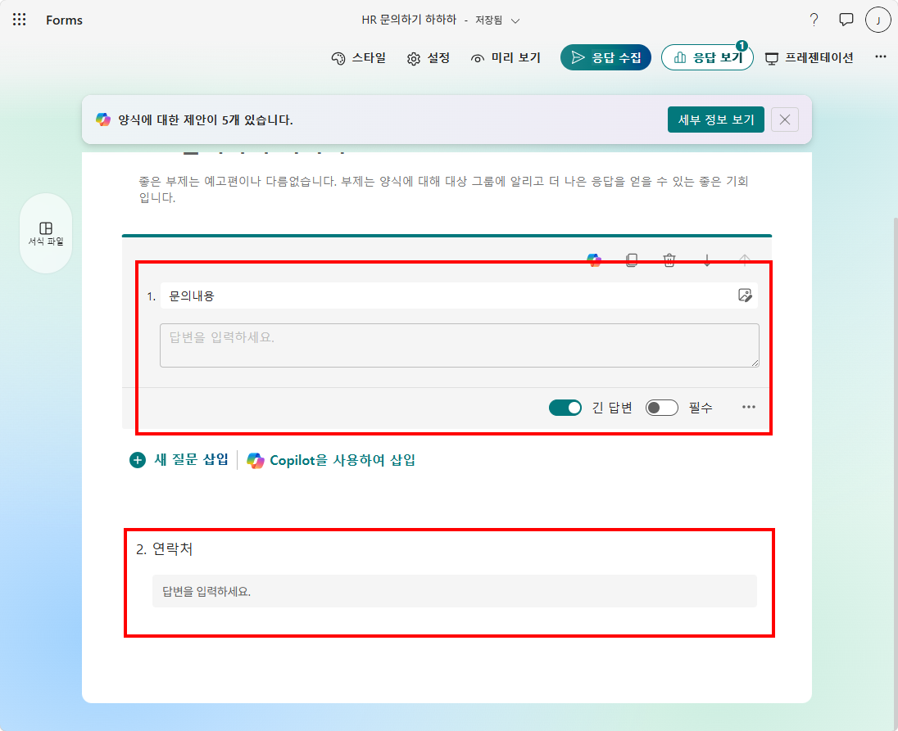
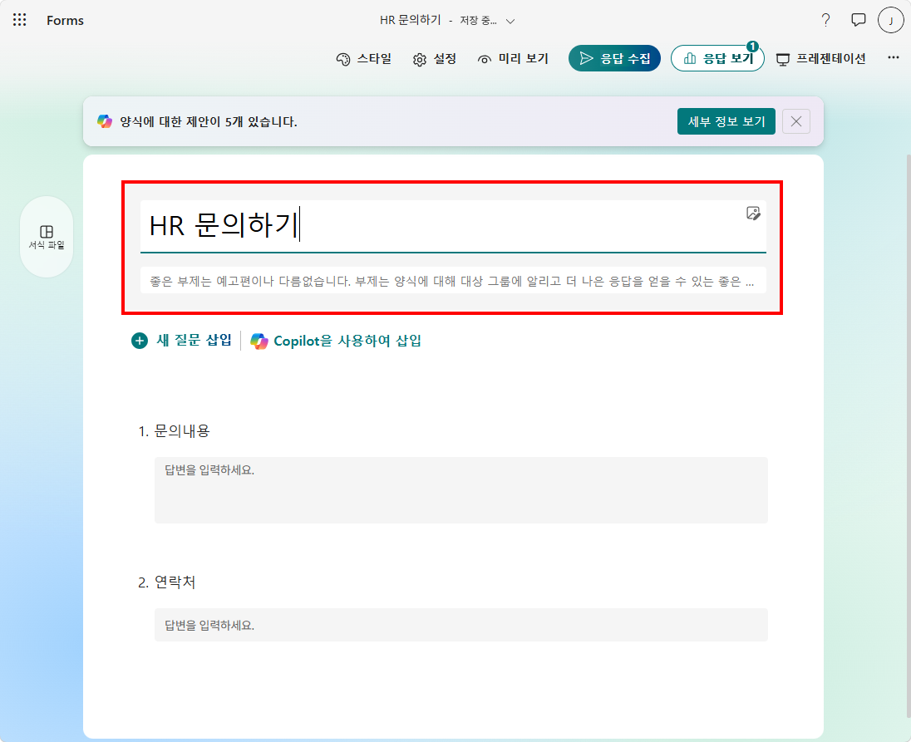

# 실습 ①: Forms 설문 만들기
{: .no_toc }

| 시간 | 소요 | 수강생 역할 |
|:-----|:-----|:-----------|
| 17:25 | 5분 | 🟢 직접 실습 |

---

사용자에게 HR 문의 내용을 수집할 **Forms 설문**을 만듭니다. 이 폼에 응답이 제출되면 에이전트가 자동으로 깨어나는 트리거로 활용합니다.

---

## Step 1 — 새 양식 만들기

[Microsoft Forms](https://forms.office.com)에 접속하여 **+ 새 양식**을 클릭합니다.

## Step 2 — 초간단 설문양식 생성

> 사용자들의 HR 관련 문의 사항을 받기 위한 설문입니다

**문의 내용**과 **연락 가능한 이메일** 질문 두개만을 포함한 양식을 생성합니다. 

## Step 3 — 설문 이름 지정

설문에 **이름**을 지정해줍니다. 자동저장됩니다.

---

실습을 완료했으면 [실습② — 트리거 추가하기](m16-2-add-trigger)로 이동하세요.
