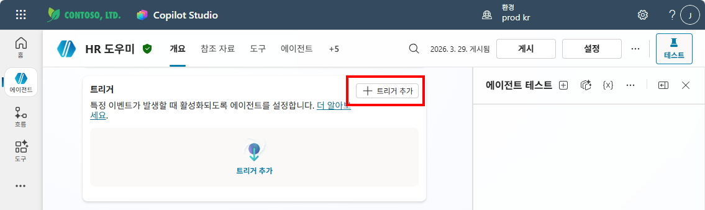
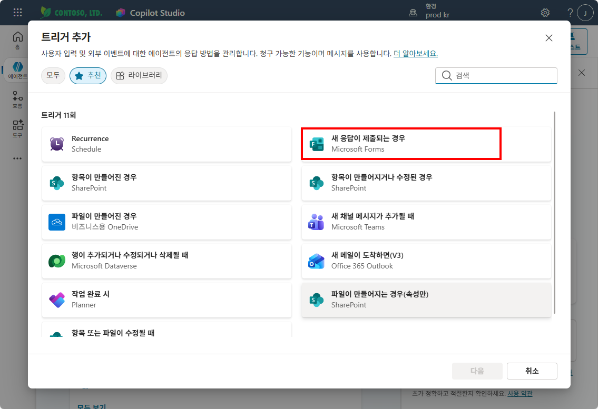
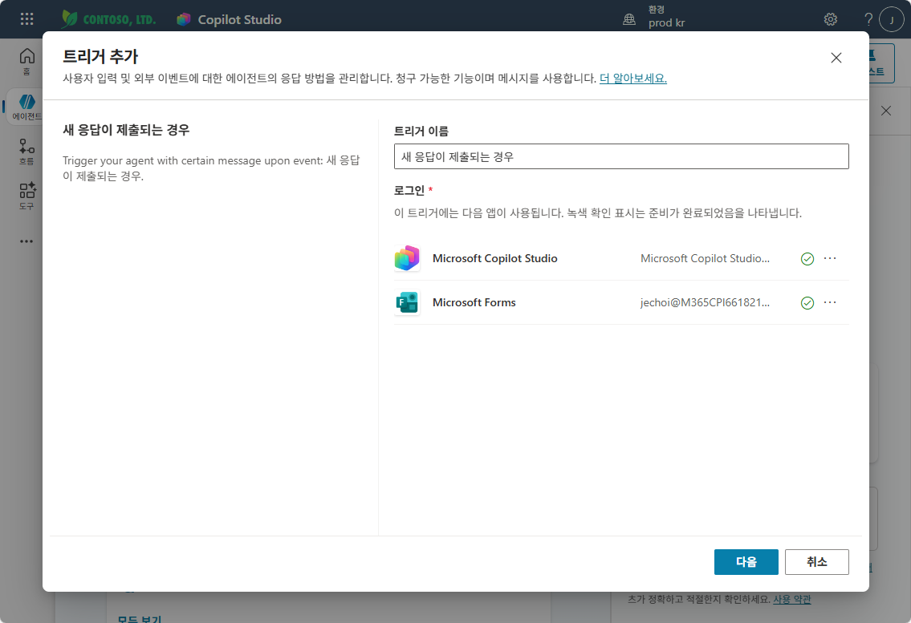
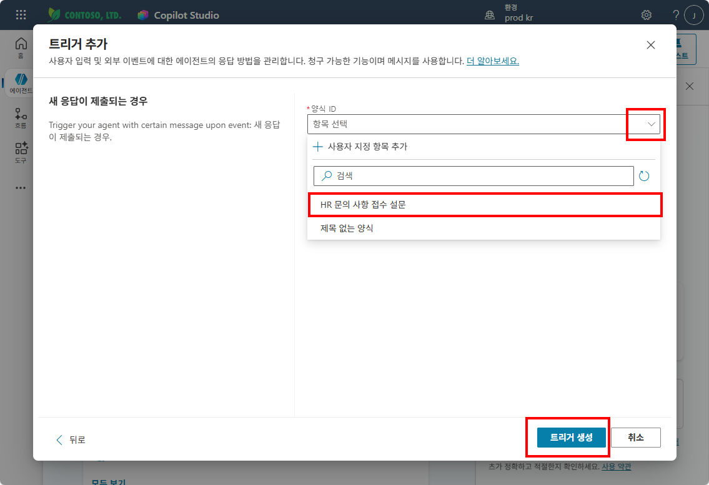
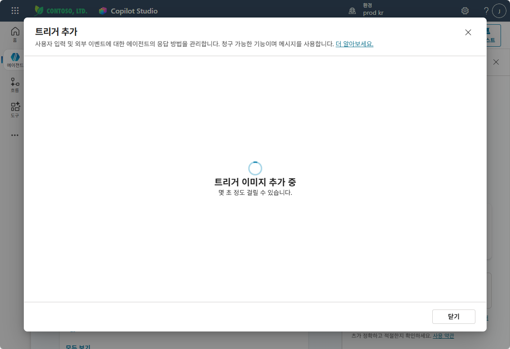
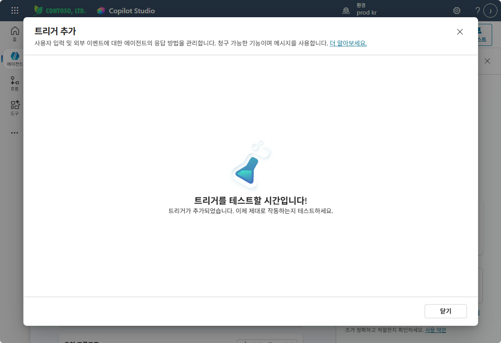

# 실습 ②: 트리거 추가하기
{: .no_toc }

| 시간 | 소요 | 수강생 역할 |
|:-----|:-----|:-----------|
| 17:30 | 5분 | 🟢 직접 실습 |

---

실습 ①에서 만든 Forms 설문을 Copilot Studio 에이전트의 **트리거**로 연결합니다. 설문에 새 응답이 제출되면 에이전트가 자동으로 실행됩니다.

---

## Step 1 — 트리거 추가 시작

**HR 도우미** 에이전트 → **개요** 탭에서 **"+ 트리거 추가"** 버튼을 클릭합니다.

## Step 2 — 트리거 유형 선택

**트리거 추가** 다이얼로그에서 **"새 응답이 제출되는 경우"** (Microsoft Forms)를 선택합니다.

## Step 3 — 연결 확인

트리거 이름이 **"새 응답이 제출되는 경우"**로 설정되어 있는지 확인합니다. **로그인** 섹션에서 **Microsoft Copilot Studio**와 **Microsoft Forms** 연결이 녹색 체크(✅)인지 확인한 후 **"다음"**을 클릭합니다.

## Step 4 — 양식 선택 및 트리거 생성

**양식 ID** 드롭다운을 클릭하여 **"HR 문의 사항 접수 설문"**을 선택합니다. 선택 후 **"트리거 생성"** 버튼을 클릭합니다.

트리거 이미지 추가가 진행됩니다. 잠시 기다려 주세요.

## Step 5 — 완료 확인

**"트리거를 테스트할 시간입니다!"** 메시지가 나타나면 트리거가 정상적으로 추가된 것입니다. **"닫기"**를 클릭합니다.

**개요** 탭에서 트리거 **"새 응답이 제출되는 경우"**가 등록되어 있는지 확인합니다.

---

실습을 완료했으면 [실습③ — 트리거 워크플로우 업데이트](m16-3-trigger-workflow)로 이동하세요.
