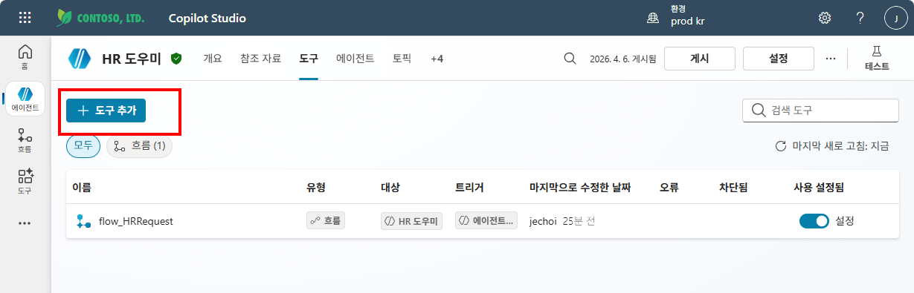
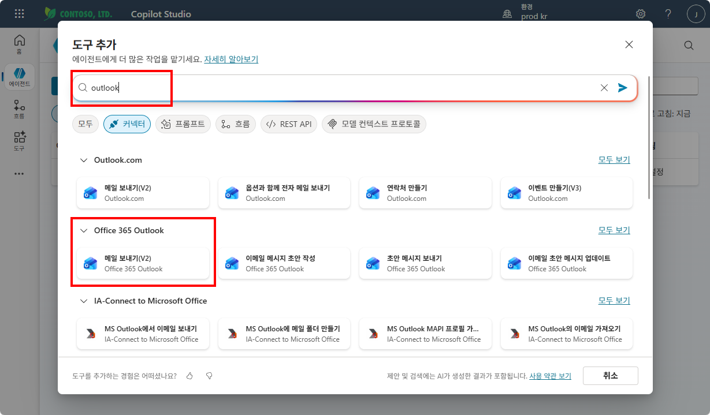
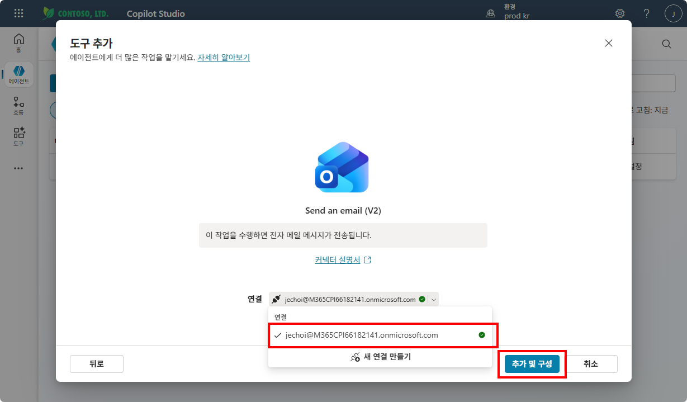
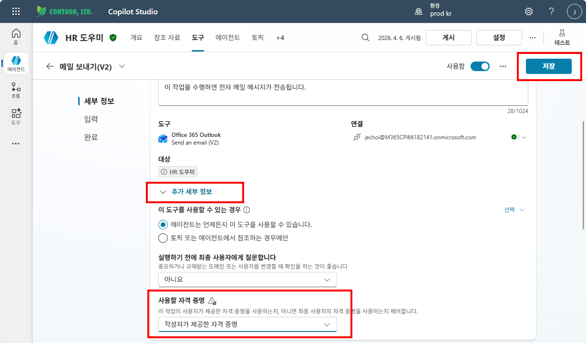
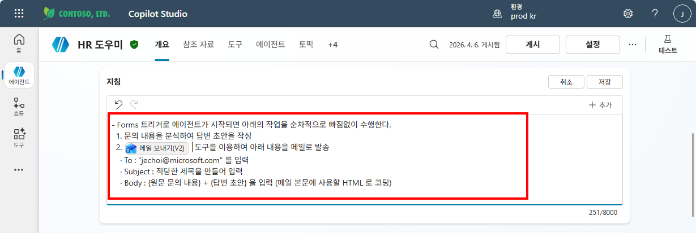
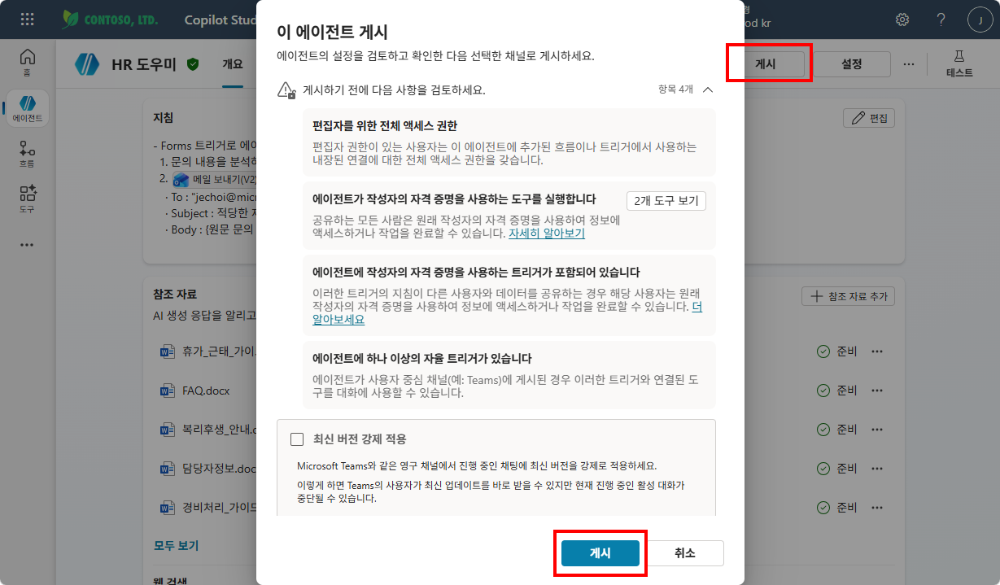
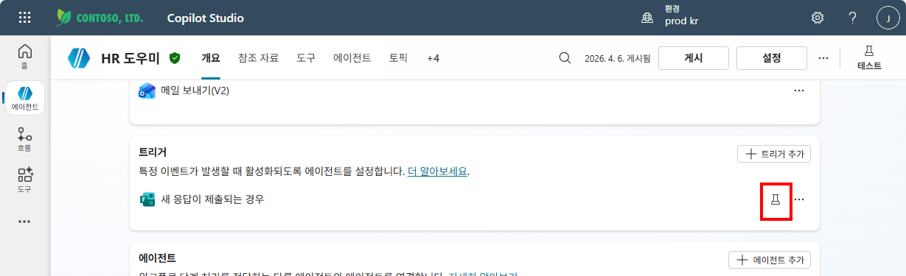
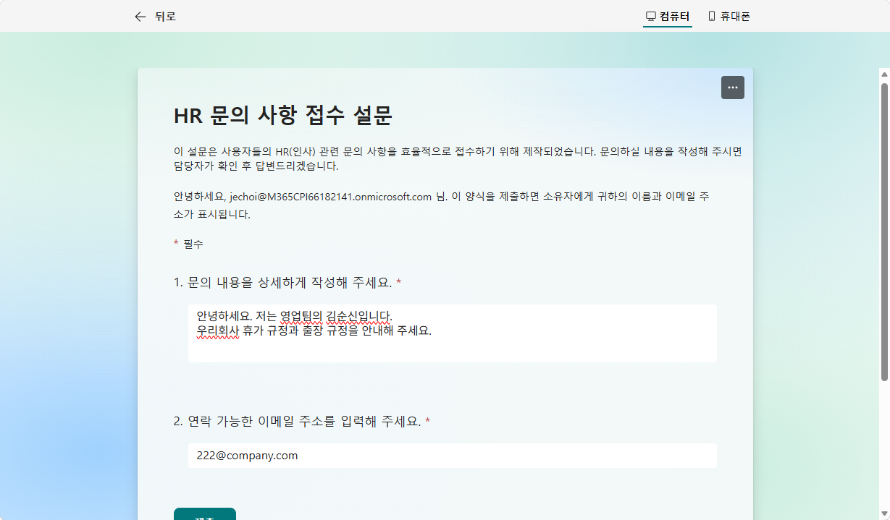
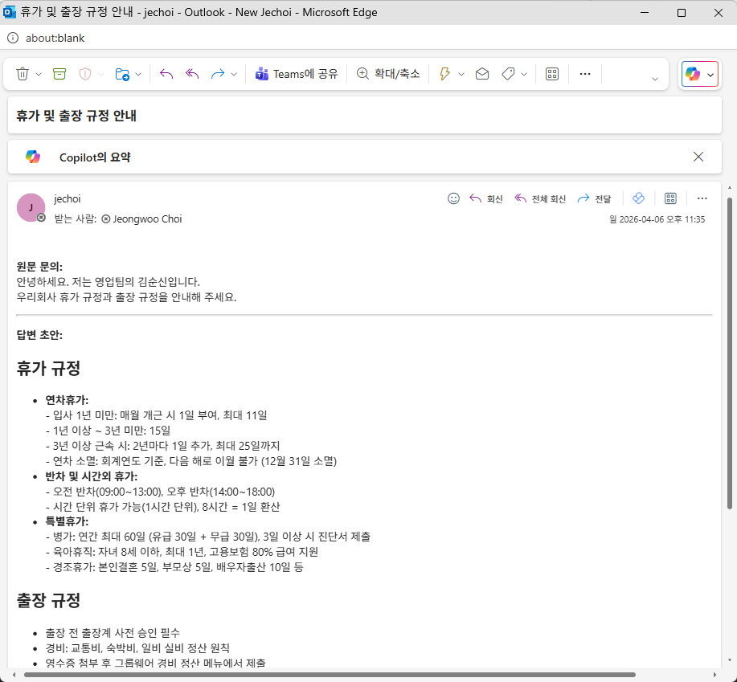
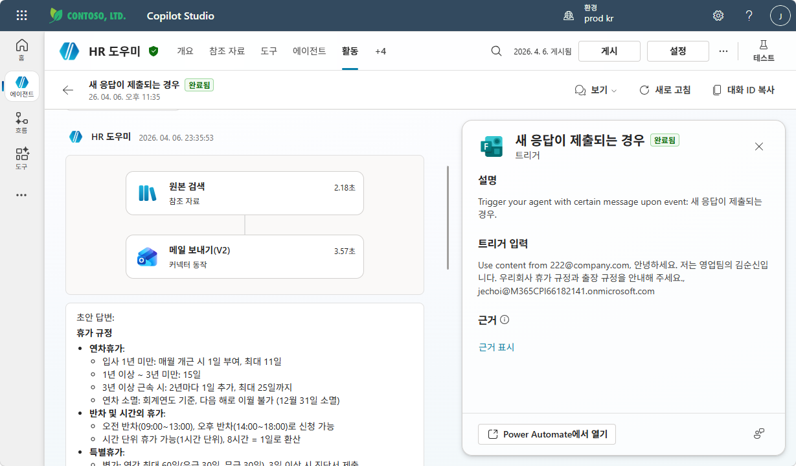

# 실습 ③: 트리거 결과 테스트
{: .no_toc }

| 시간 | 소요 | 수강생 역할 |
|:-----|:-----|:-----------|
| 17:45 | 10분 | 🟢 직접 실습 |

---

에이전트에 **메일 보내기 도구**를 추가하고, **지침에 트리거 동작 규칙**을 작성한 뒤, Forms 설문을 제출하여 전체 흐름이 정상 작동하는지 테스트합니다.

---

## Step 1 — 메일 보내기 도구 추가

**① HR 도우미 에이전트 → 도구 탭 → "+ 도구 추가" 클릭**



**② "outlook" 검색 → 커넥터 탭 → Office 365 Outlook → "메일 보내기(V2)" 선택**



**③ 연결 확인 → "추가 및 구성" 클릭**



**④ 세부 정보 설정**

**"추가 세부 정보"**를 펼치고 아래 항목을 확인합니다:

| 필드 | 값 |
|:-----|:--|
| **이 도구를 사용할 수 있는 경우** | 에이전트는 언제든지 이 도구를 사용할 수 있습니다 |
| **실행하기 전에 최종 사용자에게 질문합니다** | 아니요 |
| **사용할 자격 증명** | **작성자가 제공한 자격 증명** |

설정 완료 후 **저장**을 클릭합니다.



---

## Step 2 — 지침에 트리거 동작 규칙 추가

**지침** 섹션의 `## STRICT RULES` 끝에 아래 내용을 **추가**하세요:

```
- Forms 트리거로 에이전트가 시작되면 아래의 작업을 순차적으로 빠짐없이 수행한다.
  1. 문의 내용을 분석하여 답변 초안을 작성
  2. 메일 보내기(V2) 도구를 이용하여 아래 내용을 메일로 발송
     · To : "jechoi@microsoft.com" 를 입력
     · Subject : 적당한 제목을 만들어 입력
     · Body : {원문 문의 내용} + {답변 초안} 을 입력 (메일 본문에 사용할 HTML 로 코딩)
```

아래와 같이 지침에 트리거 동작 규칙이 추가된 것을 확인합니다.



---

## Step 3 — 게시

상단 **"게시"** 버튼을 클릭합니다. 게시 확인 팝업에서 내용을 검토하고 **"게시"**를 클릭합니다.



---

## Step 4 — 트리거 테스트

**① 개요 탭 → 트리거 "새 응답이 제출되는 경우" → 테스트 아이콘(🧪) 클릭**



**② Forms 설문을 미리보기로 열어 테스트 데이터 입력 후 제출**



---

## Step 5 — 결과 확인

**① Outlook에서 메일 수신 확인**

담당자 메일함에서 에이전트가 작성한 **원문 문의 + 답변 초안** 메일이 도착했는지 확인합니다.



**② Copilot Studio 활동 탭에서 실행 결과 확인**

활동 탭에서 트리거 실행 내역을 클릭하면, **원본 검색** → **메일 보내기(V2)** 순서로 작업이 수행되고, 트리거 입력 내용과 답변 초안을 확인할 수 있습니다.



| # | 확인 항목 | 기대 결과 |
|:--|:---------|:---------|
| 1 | 트리거 상태 | 완료됨 |
| 2 | 원본 검색 | 참조 자료에서 관련 정보 검색 완료 |
| 3 | 메일 보내기(V2) | 담당자에게 메일 발송 완료 |
| 4 | 메일 내용 | 원문 문의 + AI 답변 초안 포함 |

{: .warning }
> 테스트가 완료되면 **게시** 상태를 유지하세요. 게시하지 않으면 트리거가 실제 환경에서 작동하지 않습니다.

---

실습을 완료했으면 [M16 본문으로 돌아가세요](m16-trigger).
