# 실습 ③: 트리거 워크플로우 업데이트
{: .no_toc }

| 시간 | 소요 | 수강생 역할 |
|:-----|:-----|:-----------|
| 17:30 | 15분 | 🟢 직접 실습 |

---

실습 ①에서 만든 트리거의 **Power Automate 워크플로우**를 업데이트합니다. Forms 응답 데이터를 가져와 변수로 조합한 뒤, 에이전트에게 전달하는 흐름을 구성합니다.

---

## Step 1 — 트리거 워크플로우 확인

Copilot Studio → **HR 도우미** 에이전트 → **개요** 탭에서 트리거 **"새 응답이 제출되는 경우"**가 등록되어 있는지 확인합니다.

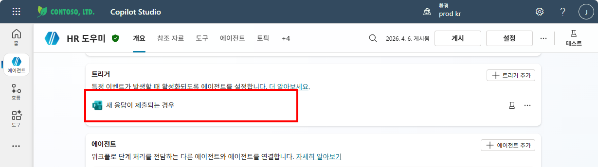

트리거 항목의 **⋯** 메뉴 또는 링크를 클릭하여 **Power Automate** 워크플로우 디자이너를 엽니다. 기본 구조는 **"새 응답이 제출되는 경우"** → **"Sends a prompt to the specified copilot for processing"** 두 단계입니다.

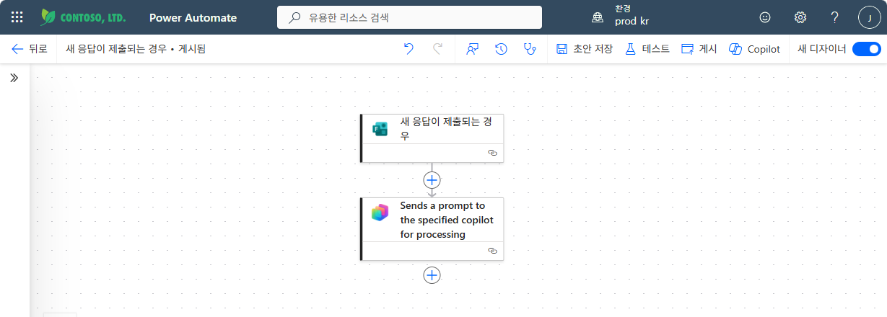

---

## Step 2 — 응답 세부 정보 가져오기 추가

트리거와 Copilot 프롬프트 사이의 **+** 버튼을 클릭합니다. **작업 추가** 패널에서 `응답`을 검색하고, **Microsoft Forms** → **"응답 세부 정보 가져오기"**를 선택합니다.

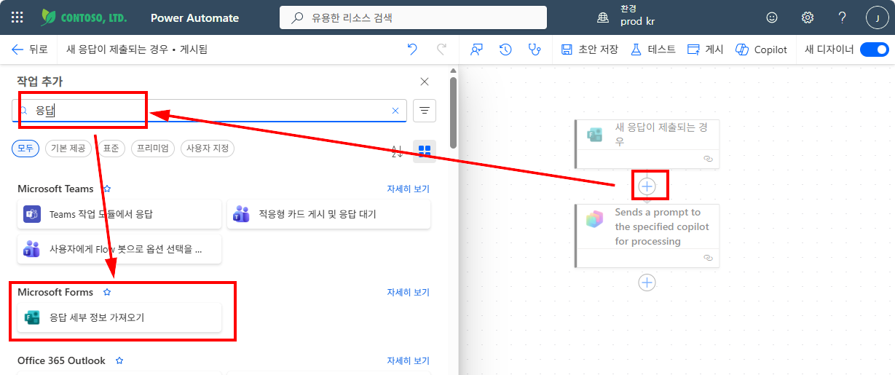

**양식 ID** 드롭다운에서 **"HR 문의 사항 접수 설문"**을 선택합니다.

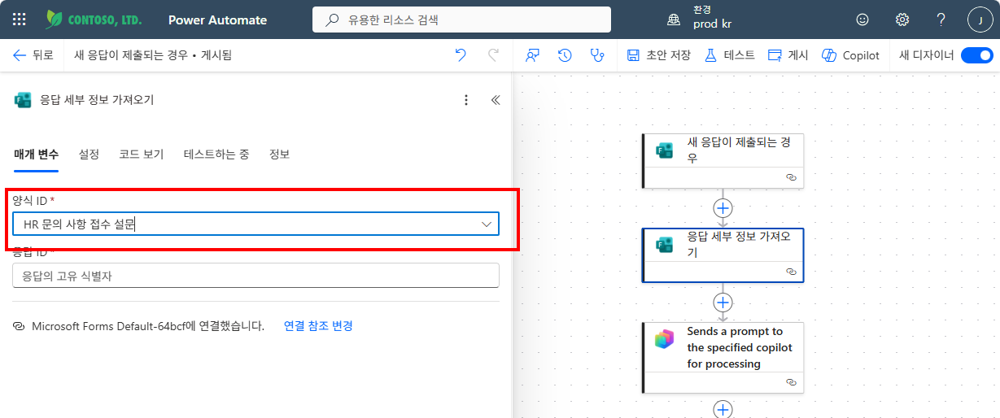

**응답 ID** 필드 클릭 → **번개(⚡)** 아이콘 → 동적 콘텐츠에서 **"응답 알림 목록 응답 ID"**를 선택합니다.

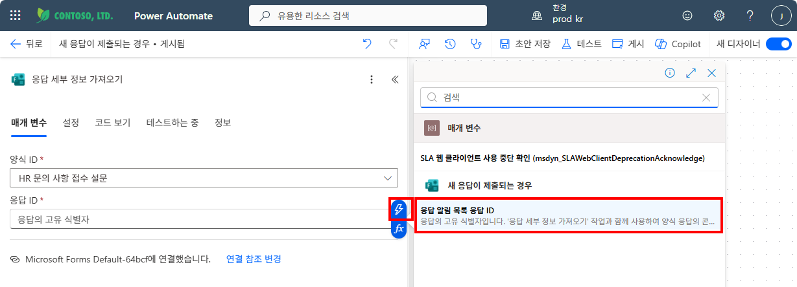

응답 ID에 동적 콘텐츠를 넣으면 **For each** 루프가 자동 생성되어 응답 세부 정보 가져오기를 감쌉니다.

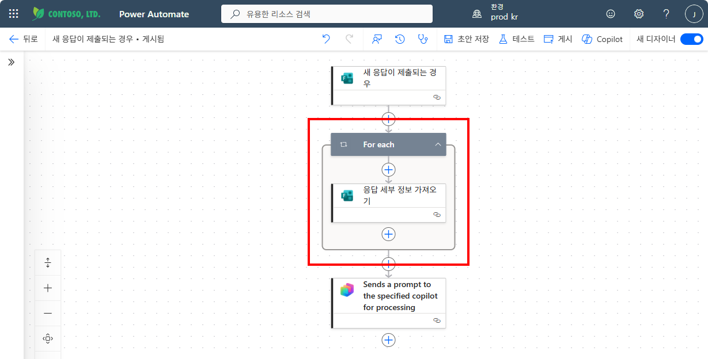

---

## Step 3 — 변수 초기화

Forms 응답 데이터를 하나의 문자열로 조합하기 위해 변수를 준비합니다.

**For each 루프 위** (트리거 바로 아래)의 **+** 버튼을 클릭합니다. `변수`를 검색하고 **"변수 초기화"**를 선택합니다.

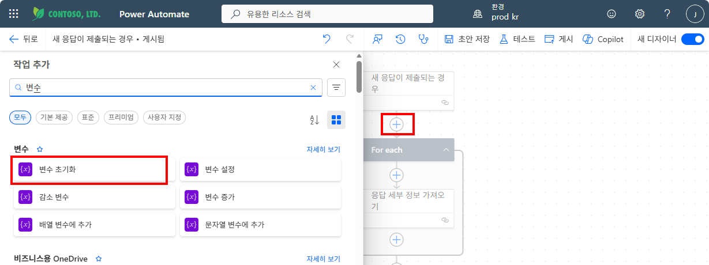

변수 초기화 카드에서 아래와 같이 설정합니다:

| 필드 | 값 |
|:-----|:--|
| **이름** | `myBody` |
| **유형** | `문자열` |

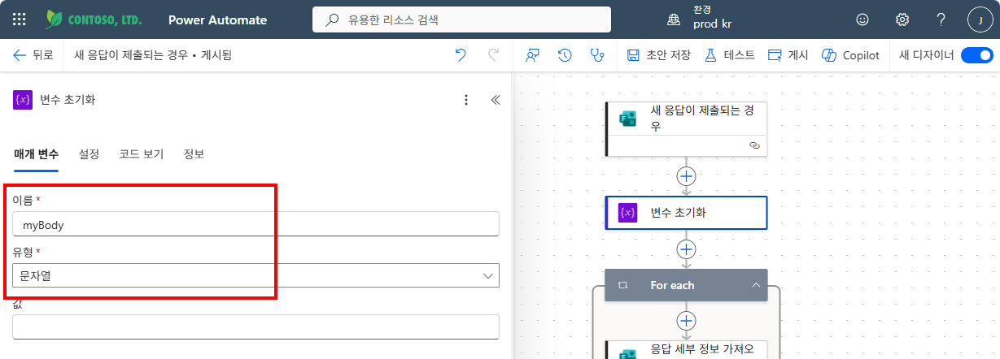

---

## Step 4 — 변수 설정 (응답 데이터 조합)

**For each** 루프 안, 응답 세부 정보 가져오기 아래의 **+** 버튼을 클릭합니다. `변수`를 검색하고 **"변수 설정"**을 선택합니다.

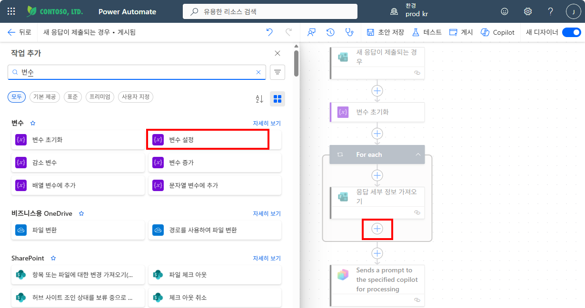

변수 설정 카드에서 아래와 같이 구성합니다:

| 필드 | 값 |
|:-----|:--|
| **이름** | `myBody` |
| **값** | `[연락처]` + **연락 가능한 이메일 주소** (동적 콘텐츠) + `, [문의내용]` + **문의 내용을 상세하게 작성해 주세요.** (동적 콘텐츠) |

**번개(⚡)** 아이콘을 클릭하여 **응답 세부 정보 가져오기** 섹션에서 동적 콘텐츠를 선택합니다.

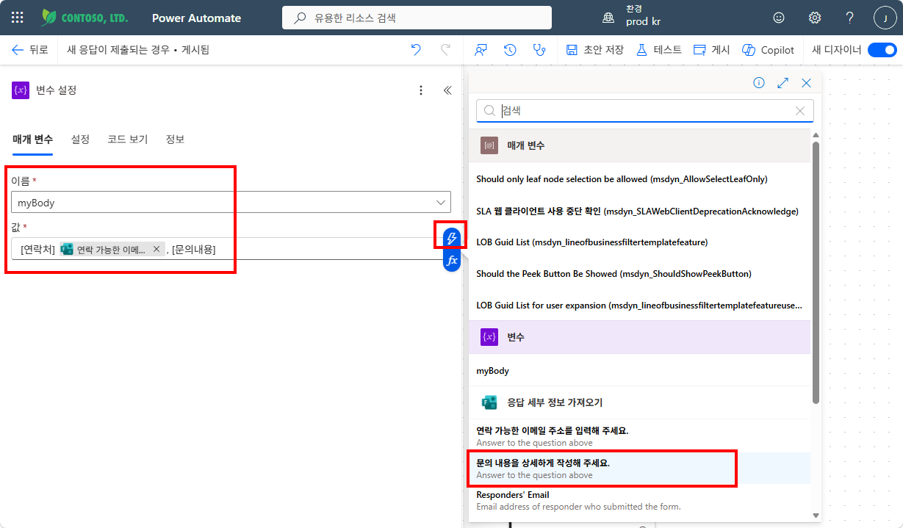

완성된 변수 설정과 전체 흐름 구조를 확인합니다.

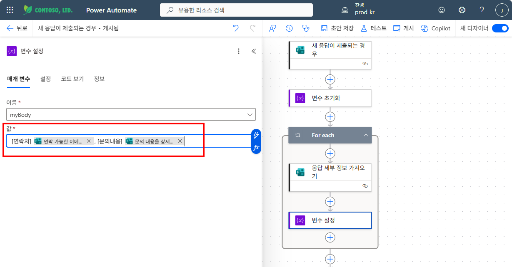

---

## Step 5 — Copilot 프롬프트에 변수 연결

**"Sends a prompt to the specified copilot for processing"** 카드를 클릭합니다. **에이전트**가 **HR 도우미**로 설정되어 있는지 확인하고, **Body/message** 필드에 `myBody` 변수를 연결합니다.

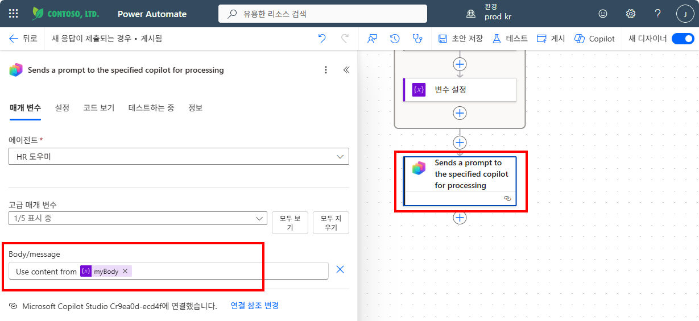

---

## Step 6 — 게시

우측 상단 **"게시"** 버튼을 클릭하여 워크플로우를 게시합니다.

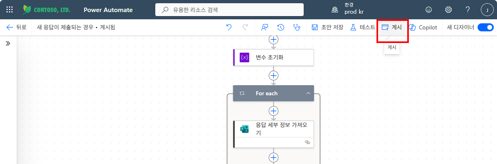

{: .warning }
> 워크플로우를 게시해야 트리거 실행 시 업데이트된 흐름이 적용됩니다.

---

실습을 완료했으면 [실습④: 트리거 결과 테스트](m16-4-trigger-result)로 이동하세요.
