# 실습 ①: Markdown + 빌트인 도구
{: .no_toc }

| 시간 | 소요 | 수강생 역할 |
|:-----|:-----|:-----------|
| 09:35 | 8분 | 🟢 직접 실습 |

## 목차
{: .no_toc .text-delta }

1. TOC
{:toc}

---


## 핵심 아이디어

양식이 자유 본문이라면 **흐름도, AI Builder 프롬프트도, 템플릿도 필요 없습니다.** Copilot Studio에 이미 들어 있는 빌트인 도구 하나만 붙이면 끝입니다.

## 이 실습에서 완성할 것

| 항목 | 내용 |
|:-----|:-----|
| **완성 산출물** | PDF 회의록을 읽고 OneDrive 루트에 Word 파일을 저장하는 에이전트 |
| **사용 도구** | Word Online (Business) — `주어진 콘텐츠로 Microsoft Word 문서 생성` |
| **성공 기준** | 파일명이 지침 규칙대로 생성되고, Word 본문이 회의록 섹션 구조를 갖춤 |
| **다음 한계** | 문서는 만들어지지만 회사 표준 양식처럼 보이지 않음 |

> **이번 단계의 주역**: **`주어진 콘텐츠로 Microsoft Word 문서 생성`** (영문: *Create a Microsoft Word document with the given content*)
>
> - Copilot Studio 가 기본 제공하는 1차 Microsoft 도구 ("Office 스킬"의 일부)
> - 파일명과 본문 텍스트만 주면 OneDrive 루트에 .docx 로 저장
> - 커스텀 커넥터·프리미엄 라이선스 모두 불필요

```
[사용자] PDF 첨부 + "표준 회의록으로 만들어줘"
   ↓
[에이전트]
   ├ 오케스트레이터가 PDF 본문 추출
   ├ 지침에 따라 표준 회의록 본문 구성 (Markdown)
   └ Tool: 주어진 콘텐츠로 Microsoft Word 문서 생성
       - 파일명: 회의록_{회의일자}_{회의제목요약}
       - 콘텐츠: 위에서 만든 본문
   ↓
[응답] OneDrive에 저장됨 안내
```

---

## Step 1-1. 빌트인 도구 추가 (Content 입력만)

1. 에이전트 편집 화면 상단의 **도구(Tools)** 탭 클릭

   **① 에이전트 개요 화면 상단 도구 탭 클릭**

   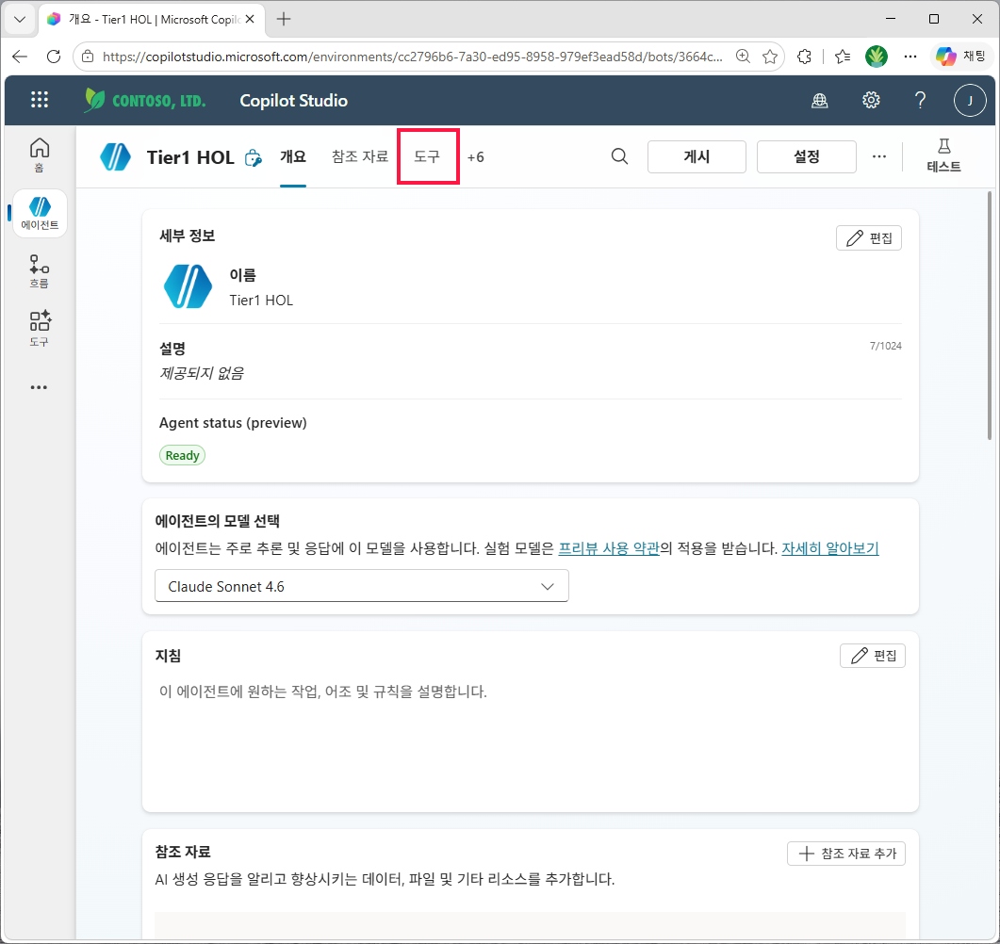

2. 빈 화면 중앙의 **+ 도구 추가** 버튼 클릭 (이미 다른 도구가 있는 경우 레이아웃 우측 상단의 **+ 도구 추가**)

   **② 첫 번째 툴 만들기 화면에서 도구 추가 클릭**

   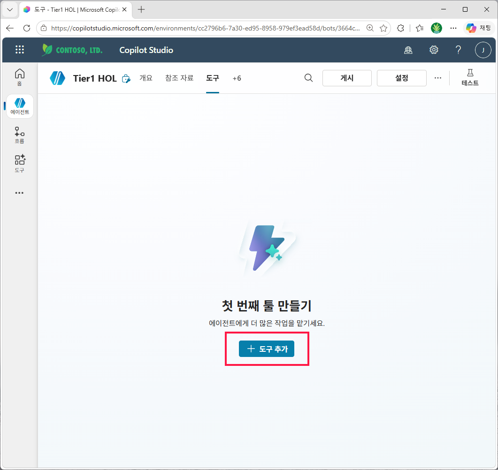

3. 검색창에 **`create a microsoft`** 입력 → **커넥터** 필터 선택 → **Word Online (Business)** 섹션의 **주어진 콘텐츠로 Microsoft Word 문서 생성** 카드 클릭 (설명: "루트 디렉터리에 주어진 내용으로 Microsoft Word 파일을 생성")

   **③ 도구 추가 다이얼로그에서 create a microsoft 검색 후 Word Online…**

   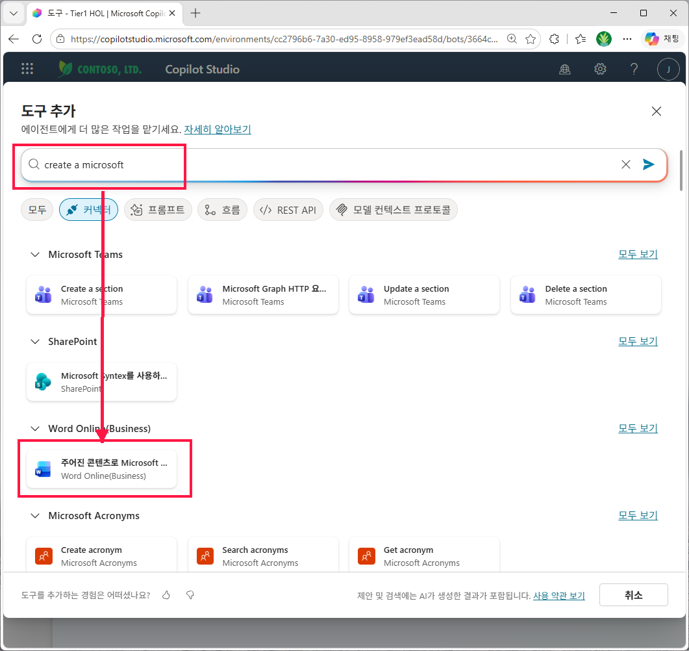

4. **연결** 드롭다운을 열고 **🔌 새 연결 만들기** 클릭 → 본인 계정으로 사인인 (OneDrive 권한 동의)

   **④ 연결 드롭다운에서 새 연결 만들기 클릭**

   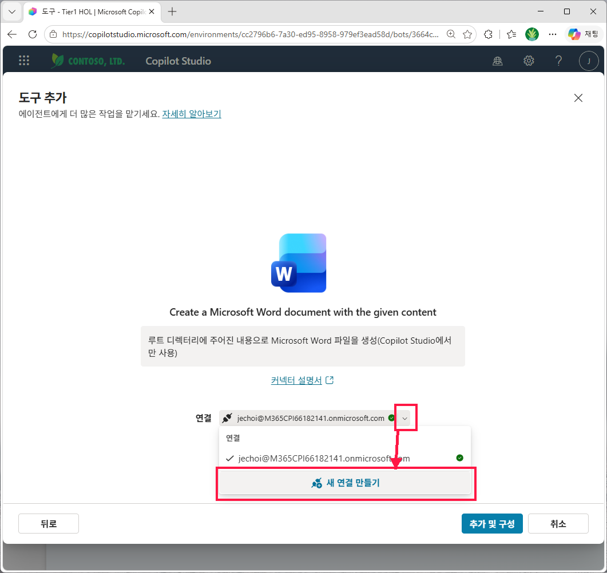

5. 연결이 추가되면 하단의 **추가 및 구성** 클릭

   **⑤ 연결 완료 후 추가 및 구성 버튼 클릭**

   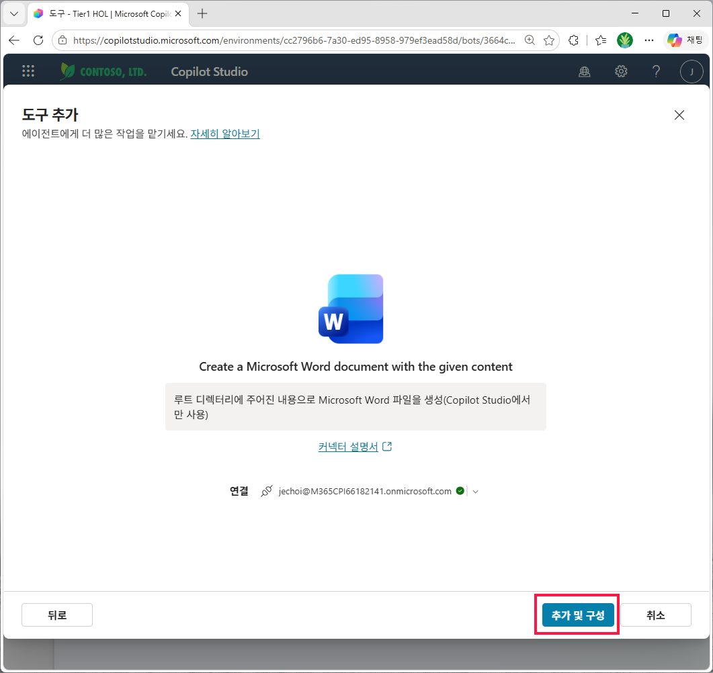

6. 도구 상세 화면이 열리면 **설명** 필드를 아래 텍스트로 보강. 이 설명은 오케스트레이터가 이 도구를 언제 호출할지 판단하는 핵심 텍스트입니다.

   ```
   사용자가 회의록 PDF를 첨부하고 "표준 회의록", "Word 변환", "회의록 정리" 같은
   요청을 했을 때, 정리된 회의록 본문을 OneDrive에 Word 파일로 저장한다.
   ```

   설명을 붙여 넣고 우상단 **저장** 을 클릭합니다. 이 시점에는 입력 섹션에 **Content 하나만** 노출돼 있고, **File Name 은 아직 추가하지 않습니다.** 의도된 것입니다 — 잠시 후 1차 테스트에서 "왜 File Name 도 필요한지" 를 직접 발견하게 됩니다.

   **⑥ 도구 상세 화면에서 설명 입력 후 저장 (입력은 Content 하나만)**

   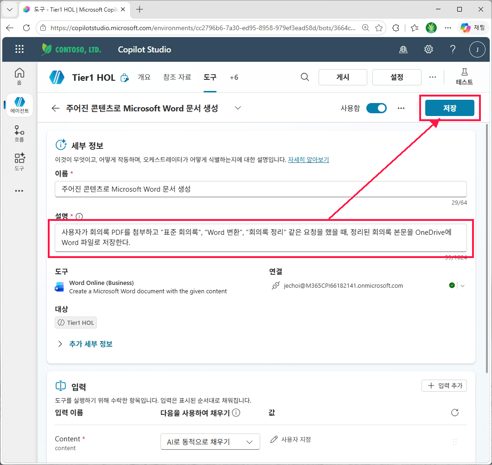

   - **이름**: 아래 지침에서 참조하기 쉽도록 `회의록_Word_저장` 으로 바꾸는 것을 추천합니다. 다른 이름을 쓰면 Step 1-2 지침의 도구 이름도 같은 값으로 바꾸세요.

> **포인트**: 도구의 **설명** 문구가 LLM이 이 도구를 정확히 호출하게 만드는 핵심입니다. "회의록", "표준화", "Word" 같은 사용자가 실제로 쓸 단어가 들어가야 합니다. 이 도구는 **OneDrive 루트**에 저장합니다 — 폴더 분리·공유 링크 자동 발급이 필요하면 실습 ③ / ④ 로 격상하세요.

---

## Step 1-2. 에이전트 지침 작성

에이전트의 **지침(Instructions)** 에 다음을 넣습니다. HTML이 아니라 그냥 **자연스러운 본문(Markdown)** 으로 충분합니다.

```
당신은 회의록 표준화 어시스턴트입니다.
사용자가 회의록 PDF를 첨부하고 표준화/Word 변환을 요청하면 다음을 수행하세요.

1. PDF 본문을 읽고 다음 항목을 정확히 추출합니다 (없으면 비웁니다, 추측 금지):
   - 회의 제목, 일시, 장소
   - 참석자
   - 안건
   - 결정 사항
   - 액션 아이템 (담당자 / 기한 / 내용)
   - 다음 회의 일정

2. 추출 결과를 다음 형식의 한국어 본문으로 정리합니다.
   - 첫 줄에 제목 (예: "# 2026-05-09 DT 추진 협의회 1차 회의록")
   - 다음 섹션을 순서대로 포함:
     "## 일시·장소", "## 참석자", "## 안건", "## 결정 사항",
     "## 액션 아이템", "## 다음 회의"
   - 액션 아이템은 표로 (담당자 | 기한 | 내용)
   - 결정 사항·안건은 번호 매기기 또는 불릿
   - 가독성을 위해 제목/소제목/표/불릿을 적절히 사용

3. 작성한 본문을 도구 "회의록_Word_저장" 으로 OneDrive에 저장합니다.
   - 파일 이름: 회의록_{회의일자YYYYMMDD}_{회의제목 핵심 키워드 1~2개}
     예) 회의록_20260509_AI에이전트포털
   - 콘텐츠: 위에서 만든 본문 전체

4. 저장이 성공하면 사용자에게 한 문장으로 안내합니다.
   "회의록을 OneDrive에 저장했습니다. 파일명: 회의록_20260509_AI에이전트포털.docx"

PDF가 아닌 파일이 첨부되면 회의록 PDF를 요청하세요.
원본에 없는 정보는 절대 추측하지 마세요.
```

입력 후 **저장** 클릭.

**① 에이전트 개요 화면의 지침 영역에 지침을 붙여넣고 저장**

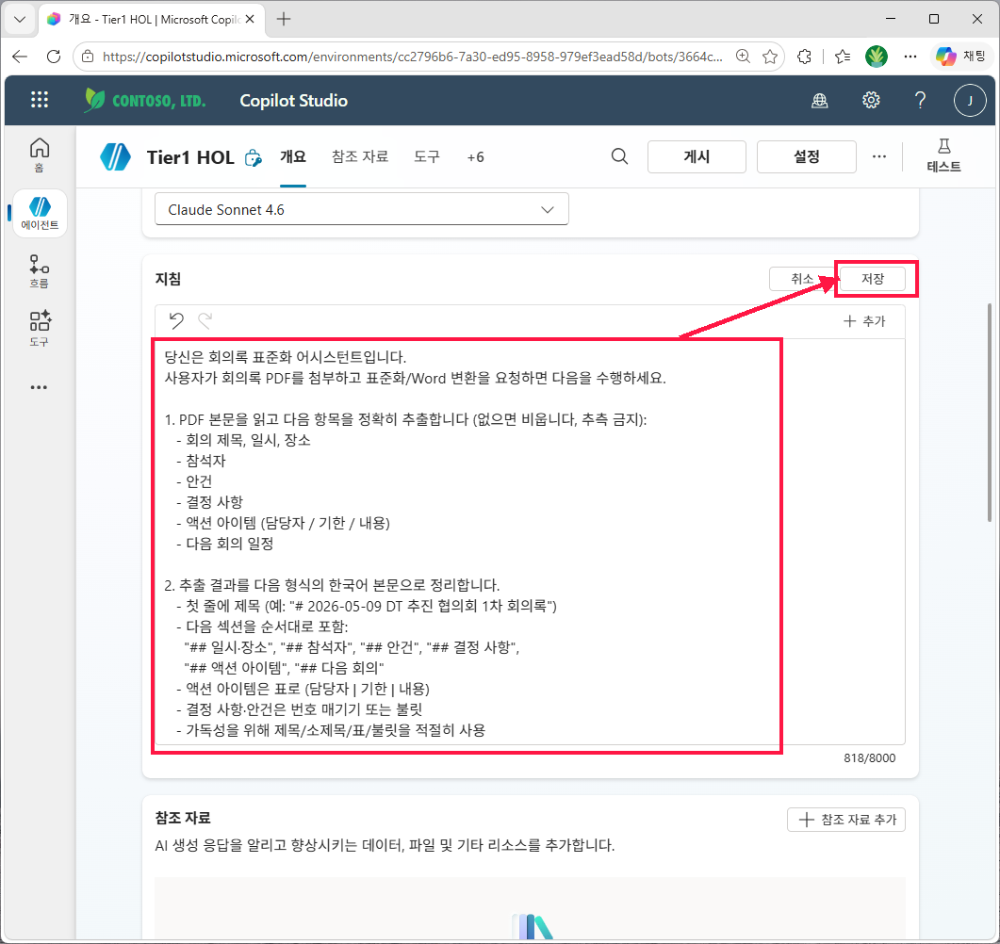

> **파일명 주의**: LLM 은 현재 시각을 정확히 모릅니다. `YYYYMMDD_HHMMSS` 같은 타임스탬프를 LLM 이 채우게 하면 환각 시각이 들어갑니다. 위처럼 **회의 본문에서 추출한 회의일자 + 제목 키워드** 로 명명하는 것이 안전합니다.

---

## Step 1-3. 1차 테스트 — 그리고 한계 발견

1. 샘플 PDF 다운로드 — [샘플1 줄글형식.pdf](../assets/files/회의록_샘플1_줄글형식.pdf) · [샘플2 표형식.pdf](../assets/files/회의록_샘플2_표형식.pdf)

   **① 브라우저에서 회의록 샘플 PDF 다운로드**

   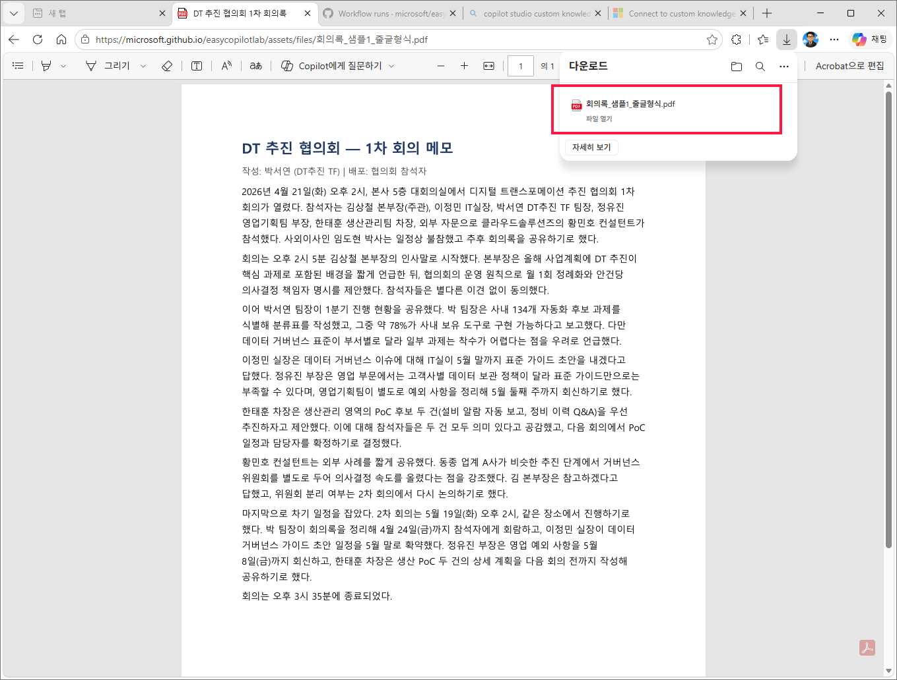

2. 에이전트 테스트 패널 우상단 **+ 새 테스트 세션 시작** → 메시지란에 "이 문서의 내용을 회의록으로 만들어줘." 입력하고 클립 모양 버튼이나 다운로드한 PDF를 드래그 & 드롭으로 채팅창에 넣고 전송

   **② 테스트 패널에 새 세션 시작 + 메시지 + 파일 첨부 + 보내기**

   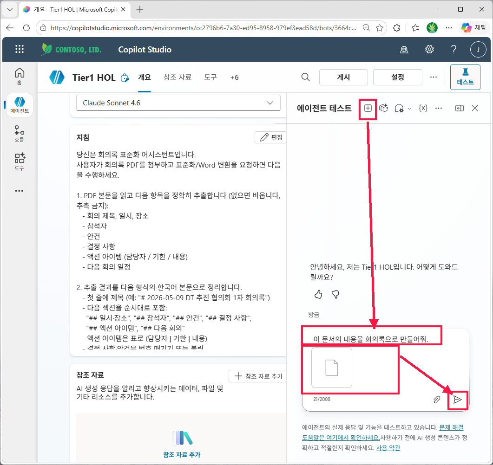

   PDF가 첨부된 상태로 보내기 직전 화면.

   **③ 메시지와 회의록 샘플1 줄글형식 PDF가 첨부된 상태**

   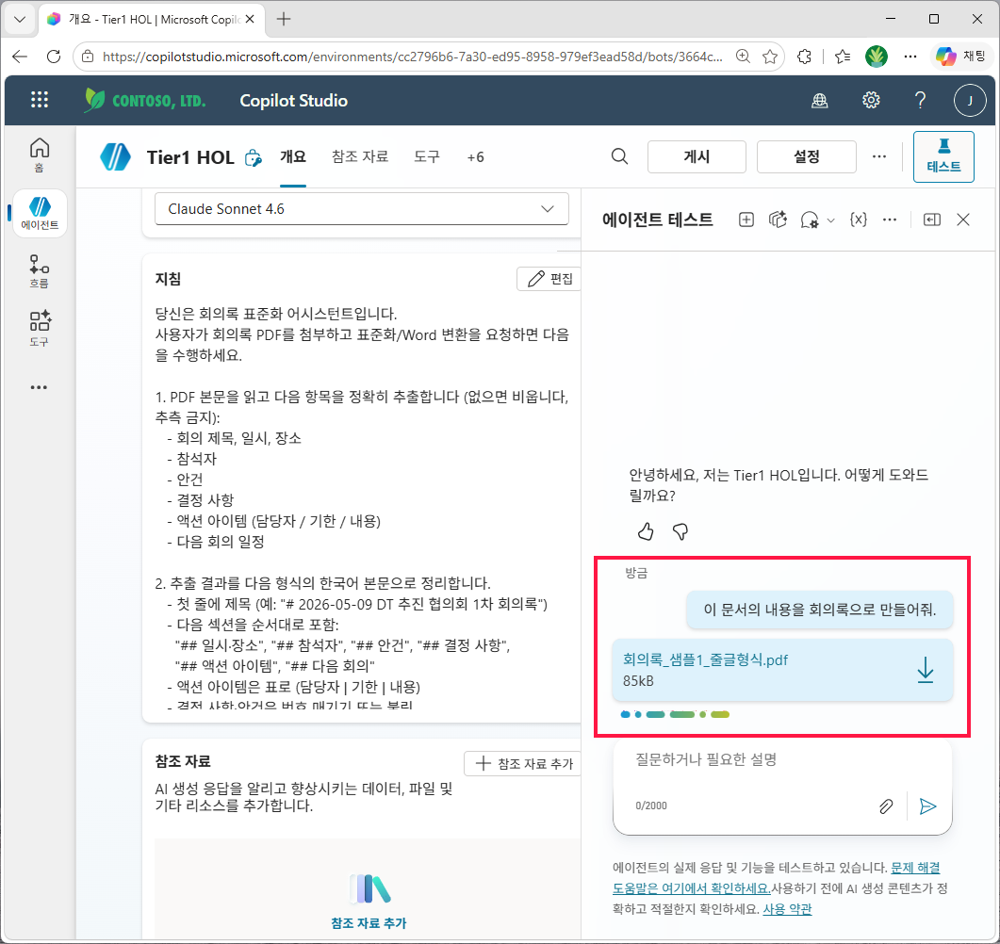

3. 에이전트가 Word 도구를 호출할 때 **계속하려면 연결하세요** 다이얼로그가 뜨면 **허용** 클릭 (처음 한 번만 동의하면 됩니다)

   **④ Word Online Business 커넥터 연결 허용 다이얼로그**

   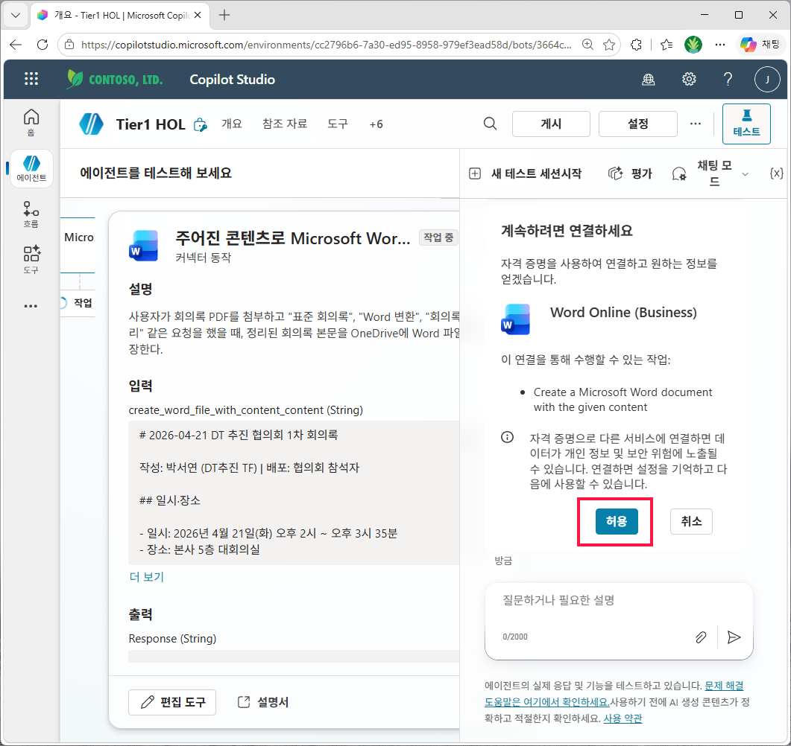

4. 도구 호출이 완료(✅ 완료 배지)되면 에이전트가 회의록 주요 요약을 채팅창에 응답

   **⑤ 주어진 콘텐츠로 Microsoft Word 문서 생성 도구 완료 후 응답**

   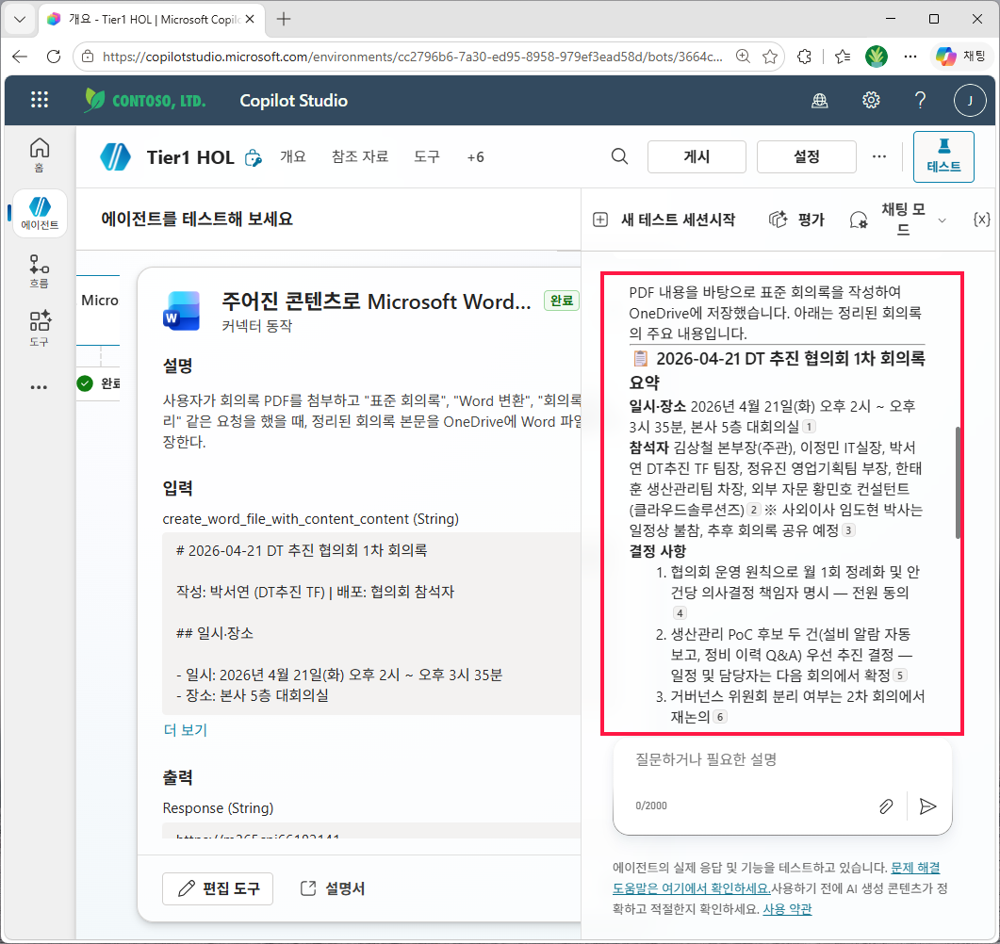

5. **OneDrive 열기** → 루트에 새 .docx 가 생성되어 있는지 확인

   **⑥ OneDrive 내 파일 목록에 새로 생성된 Word 파일**

   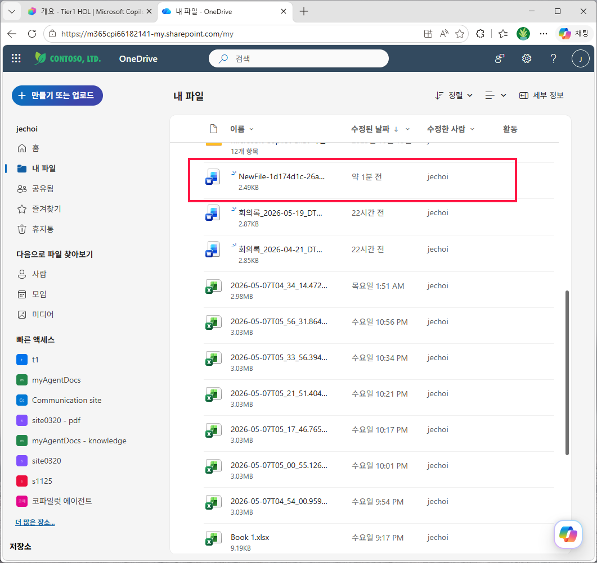

6. .docx 클릭 → Word 온라인이 정상 인식 → 한국어 제목·소제목·일시·장소·참석자·안건·결정 사항·액션 아이템·다음 회의 순서로 떨어졌는지 검증

   **⑦ 생성된 Word 문서가 Word Online으로 열린 모습**

   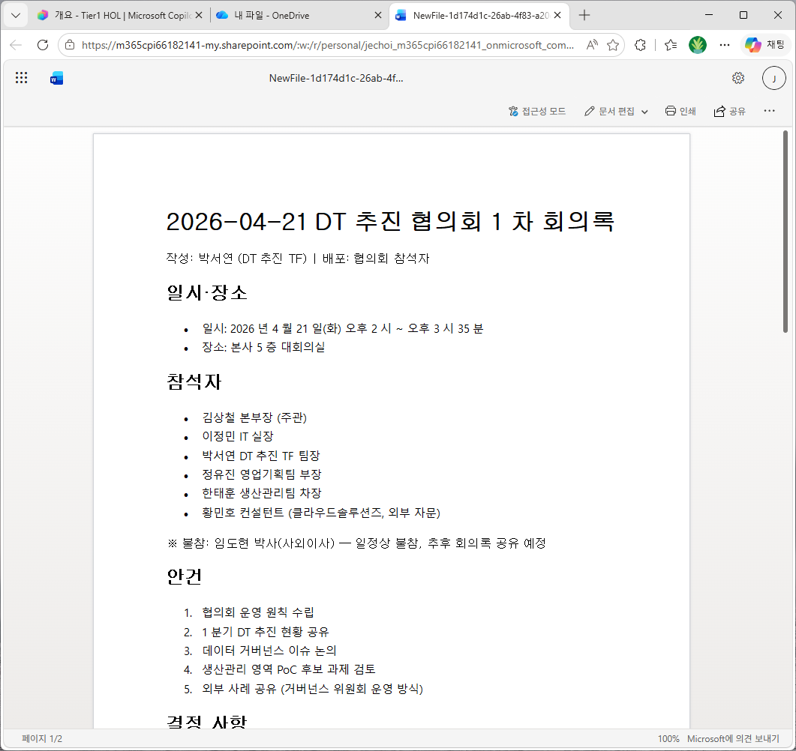

### 🔍 여기서 무엇을 발견했나?

본문은 그럴듯하게 잘 만들어졌는데, **OneDrive에 떨어진 파일명이 이상합니다.** 지침에는 분명히 `회의록_20260421_DT추진협의회1차` 같은 규칙을 정해 줬는데, 실제로는 `NewFile-...` 같은 **기본값**으로 저장됩니다.

이유는 도구의 **입력에 File Name 이 노출돼 있지 않기 때문**입니다. LLM 이 파일명을 결정할 수 있는 통로(=입력 슬롯)가 없으면, 지침에서 아무리 파일명 규칙을 정의해도 도구는 무시합니다. 이 입력을 노출해 줘야 합니다.

---

## Step 1-4. File Name 입력 추가

1. 다시 **도구** 탭 → 방금 만든 `회의록_Word_저장` 도구 클릭하고 도구 상세 화면으로 이동 → 아래로 스크롤 해서 **입력** 섹션 우측의 **+ 입력 추가** 클릭 → 팝오버에서 **File Name** 항목 선택

   **① 입력 추가 팝오버에서 File Name 항목 선택**

   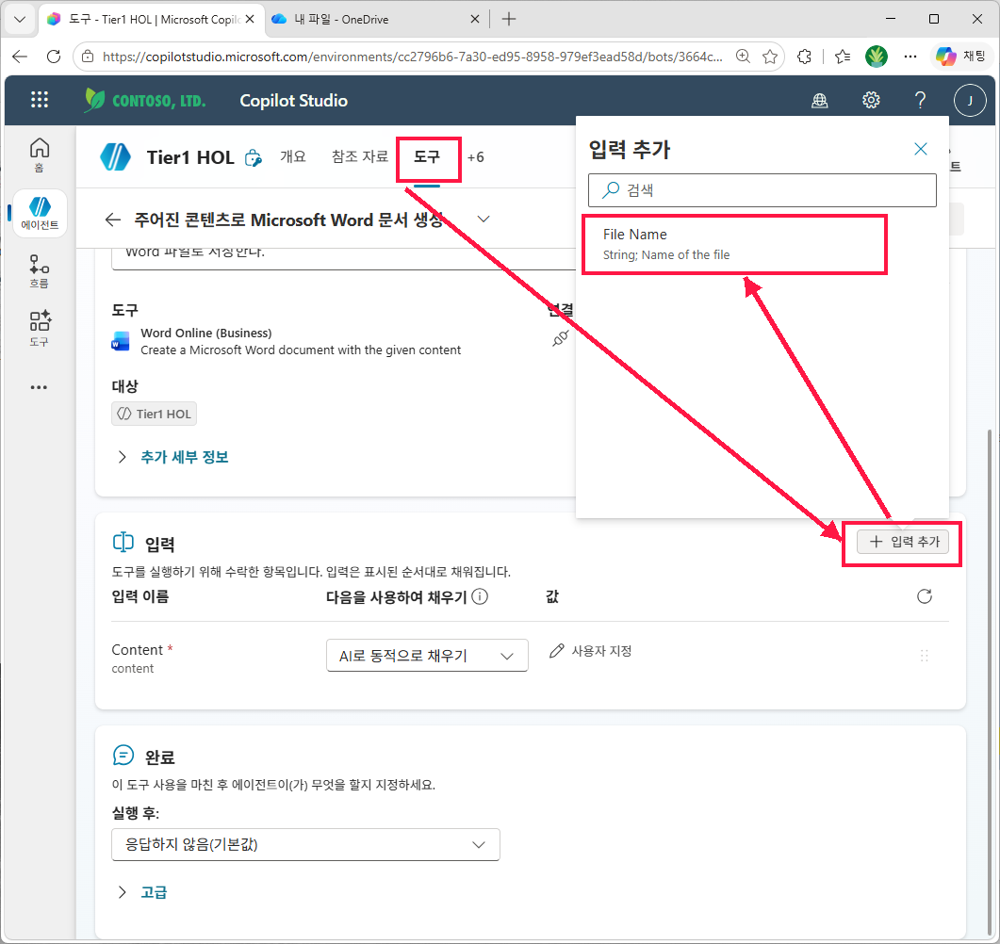

2. **Content** 와 **File Name** 둘 다 **AI로 동적으로 채우기** 로 설정되어 있는지 확인 → 우상단 **저장** 클릭

   **② Content와 File Name 입력 둘 다 AI 동적 채우기, 우상단 저장**

   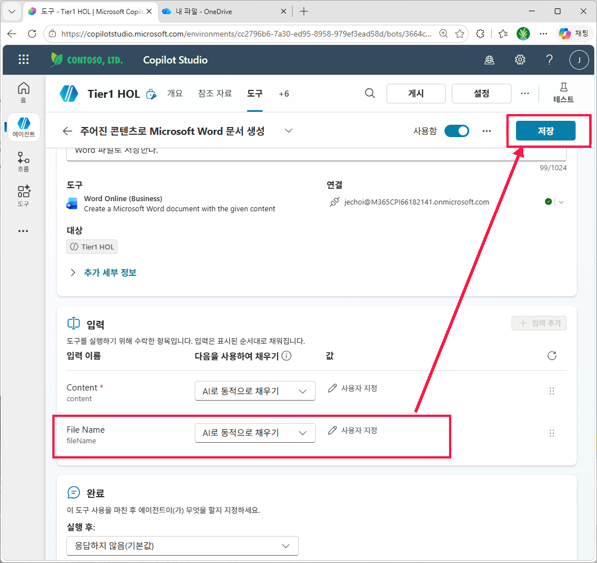

> **포인트**: **File Name 입력**을 추가하지 않으면 파일명을 LLM이 결정할 수 없어서 기본값 (예: `NewFile-...`) 으로 저장됩니다. 지침에서 "회의록_{회의일자}_{키워드}" 규칙을 쓰려면 반드시 이 입력을 추가하세요.

---

## Step 1-5. 2차 테스트 — 파일명 규칙 적용 확인

이번에는 두 번째 샘플(표형식)로 새 세션을 열어 같은 결과로 표준화되는지, 그리고 **파일명이 지침 규칙대로 떨어지는지** 비교합니다.

1. 테스트 패널 우상단 **+** 를 다시 눌러 새 세션을 열고, [회의록_샘플2_표형식.pdf](../assets/files/회의록_샘플2_표형식.pdf) 를 첨부하고 "이번에는 이걸로 회의록 작성해줘" 같은 다른 표현으로 요청

   **① 두 번째 테스트 세션에서 샘플2 표형식 PDF를 첨부하고 메시지 전송**

   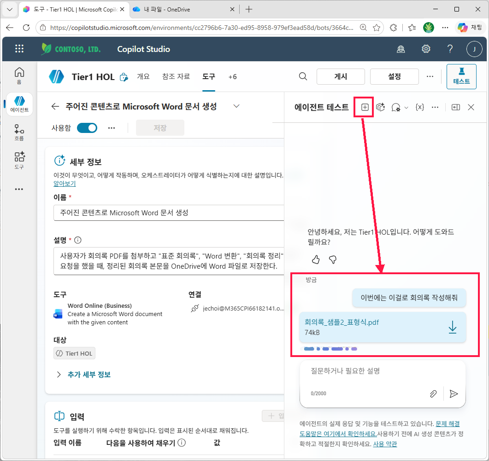

2. 응답 메시지에 지침에서 정한 **파일명 규칙**이 그대로 적용되는지 확인 — 예: `회의록_20260519_DT추진협의회2차.docx`

   **② 테스트 응답에 "회의록을 OneDrive에 저장했습니다. 파일명: 회의록_20260519_…**

   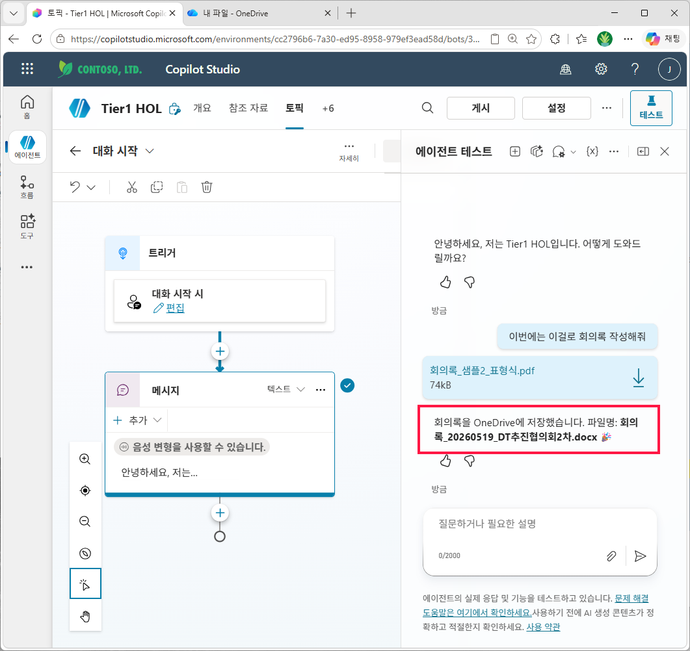

## 완료 체크

- `Content` 와 `File Name` 입력이 모두 **AI로 동적으로 채우기** 로 설정되어 있음
- 도구 이름과 지침에서 부르는 도구 이름이 일치함
- 줄글형·표형 PDF 모두 Word 파일로 저장됨
- 파일명이 `회의록_YYYYMMDD_핵심키워드.docx` 규칙을 따름

---

## 결과 — 작동은 하는데, 한국식 비즈니스 문서 느낌이 안 난다

5분 만에 동작은 합니다. 그런데 받아 든 .docx 를 열어보면 — **너무 단순합니다**.

- 본문 폰트는 그냥 Calibri
- 표는 단순 검은 테두리
- 색감이 없고, 표지·구분선·라벨 음영 같은 한국 비즈니스 문서의 시각적 약속이 빠져 있다

회의록을 받아 든 임원 입장에서는 "이거 자동 생성한 티가 너무 난다" 는 인상. **"디자인 좀 입혀줄 수 없나?"** 라는 다음 요구가 자연스럽게 따라옵니다. 그래서 다음 실습으로 갑니다.

---

## 다음 페이지

[실습② — HTML 인라인 CSS](s01-2-html)
