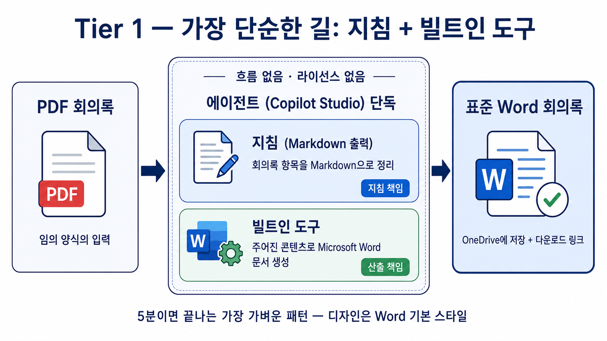

---
title: "실습① — Tier 1·2: 빌트인 도구"
parent: "S1. 문서 자동화 5-Tier"
grand_parent: "📗 심화과정"
nav_order: 1
---

# 실습 ①: Tier 1 (Markdown) → Tier 2 (HTML 인라인 CSS)
{: .no_toc }

| 시간 | 소요 | 수강생 역할 |
|:-----|:-----|:-----------|
| 09:35 | 23분 (Tier 1 8분 + Tier 2 15분) | 🟢 직접 실습 |

## 목차
{: .no_toc .text-delta }

1. TOC
{:toc}

---

## Tier 1 — Markdown + 빌트인 도구 (5분, No Flow)



### 핵심 아이디어

양식이 자유 본문이라면 **흐름도, AI Builder 프롬프트도, 템플릿도 필요 없습니다.** Copilot Studio에 이미 들어 있는 빌트인 도구 하나만 붙이면 끝입니다.

> **이번 단계의 주역**: **`주어진 콘텐츠로 Microsoft Word 문서 생성`** (영문: *Create a Microsoft Word document with the given content*)
>
> - Copilot Studio 가 기본 제공하는 1차 Microsoft 도구 ("Office 스킬"의 일부)
> - 파일명과 본문 텍스트만 주면 OneDrive 루트에 .docx 로 저장
> - 커스텀 커넥터·프리미엄 라이선스 모두 불필요

```
[사용자] PDF 첨부 + "표준 회의록으로 만들어줘"
   ↓
[에이전트]
   ├ 오케스트레이터가 PDF 본문 추출
   ├ 지침에 따라 표준 회의록 본문 구성 (Markdown)
   └ Tool: 주어진 콘텐츠로 Microsoft Word 문서 생성
       - 파일명: 회의록_{회의일자}_{회의제목요약}
       - 콘텐츠: 위에서 만든 본문
   ↓
[응답] OneDrive에 저장됨 안내
```

### Step 1-1. 빌트인 도구 추가

1. 에이전트 편집 화면 → **도구(Tools)** → **+ 추가**
2. 검색창에 **`Microsoft Word`** 입력
3. **주어진 콘텐츠로 Microsoft Word 문서 생성** 카드 선택
   (설명: "루트 디렉터리에 주어진 내용으로 Microsoft Word 파일을 생성")
4. **연결** 항목에서 **+** 클릭 → 본인 계정으로 사인인 (OneDrive 권한 동의)
5. **추가 및 구성** → 도구 카드 열기
   - **이름** (선택): `회의록_Word_저장` 으로 변경하면 지침에서 참조하기 편함
   - **설명** 보강 (오케스트레이터가 호출 여부를 판단하는 핵심 텍스트):
     ```
     사용자가 회의록 PDF를 첨부하고 "표준 회의록", "Word 변환", "회의록 정리" 같은
     요청을 했을 때, 정리된 회의록 본문을 OneDrive에 Word 파일로 저장한다.
     ```
   - **입력 파라미터**: 모두 모델이 채우게 둠 (파일명·본문 모두 LLM이 결정)

> **포인트 1**: 도구의 **설명** 문구가 LLM이 이 도구를 정확히 호출하게 만드는 핵심입니다. "회의록", "표준화", "Word" 같은 사용자가 실제로 쓸 단어가 들어가야 합니다.
>
> **포인트 2**: 이 도구는 **OneDrive 루트**에 저장합니다 (현재 사양). 폴더 분리·공유 링크 자동 발급이 필요하면 Tier 3 / 4 로 격상하세요.

### Step 1-2. 에이전트 지침 작성

에이전트의 **지침(Instructions)** 에 다음을 넣습니다. HTML이 아니라 그냥 **자연스러운 본문(Markdown)** 으로 충분합니다.

```
당신은 회의록 표준화 어시스턴트입니다.
사용자가 회의록 PDF를 첨부하고 표준화/Word 변환을 요청하면 다음을 수행하세요.

1. PDF 본문을 읽고 다음 항목을 정확히 추출합니다 (없으면 비웁니다, 추측 금지):
   - 회의 제목, 일시, 장소
   - 참석자
   - 안건
   - 결정 사항
   - 액션 아이템 (담당자 / 기한 / 내용)
   - 다음 회의 일정

2. 추출 결과를 다음 형식의 한국어 본문으로 정리합니다.
   - 첫 줄에 제목 (예: "# 2026-05-09 DT 추진 협의회 1차 회의록")
   - 다음 섹션을 순서대로 포함:
     "## 일시·장소", "## 참석자", "## 안건", "## 결정 사항",
     "## 액션 아이템", "## 다음 회의"
   - 액션 아이템은 표로 (담당자 | 기한 | 내용)
   - 결정 사항·안건은 번호 매기기 또는 불릿
   - 가독성을 위해 제목/소제목/표/불릿을 적절히 사용

3. 작성한 본문을 도구 "회의록_Word_저장" 으로 OneDrive에 저장합니다.
   - 파일 이름: 회의록_{회의일자YYYYMMDD}_{회의제목 핵심 키워드 1~2개}
     예) 회의록_20260509_AI에이전트포털
   - 콘텐츠: 위에서 만든 본문 전체

4. 저장이 성공하면 사용자에게 한 문장으로 안내합니다.
   "회의록을 OneDrive에 저장했습니다. 파일명: 회의록_20260509_AI에이전트포털.docx"

PDF가 아닌 파일이 첨부되면 회의록 PDF를 요청하세요.
원본에 없는 정보는 절대 추측하지 마세요.
```

> **파일명 주의**: LLM 은 현재 시각을 정확히 모릅니다. `YYYYMMDD_HHMMSS` 같은 타임스탬프를 LLM 이 채우게 하면 환각 시각이 들어갑니다. 위처럼 **회의 본문에서 추출한 회의일자 + 제목 키워드** 로 명명하는 것이 안전합니다.

### Step 1-3. 테스트

- 회의록 샘플 PDF 둘(줄글형 / 표형) 각각 첨부
- "표준 회의록으로 만들어줘"
- 에이전트가 도구 호출 → OneDrive 루트에 `회의록_*.docx` 생성 → 응답에 파일명
- OneDrive 에서 .docx 열기 → Word 가 정상 인식 → 같은 양식으로 떨어졌는지 확인
- 두 양식의 PDF 가 같은 결과로 표준화되는지 비교

### 결과 — 작동은 하는데, 한국식 비즈니스 문서 느낌이 안 난다

5분 만에 동작은 합니다. 그런데 받아 든 .docx 를 열어보면 — **너무 단순합니다**.

- 본문 폰트는 그냥 Calibri
- 표는 단순 검은 테두리
- 색감이 없고, 표지·구분선·라벨 음영 같은 한국 비즈니스 문서의 시각적 약속이 빠져 있다

회의록을 받아 든 임원 입장에서는 "이거 자동 생성한 티가 너무 난다" 는 인상. **"디자인 좀 입혀줄 수 없나?"** 라는 다음 요구가 자연스럽게 따라옵니다. 그래서 Tier 2 로 갑니다.

---

## Tier 2 — HTML(인라인 CSS) + 빌트인 도구 (15분, No Flow)


### 핵심 아이디어

빌트인 도구는 사실 **HTML 도 받습니다.** 본문 자리에 HTML 마크업 + 인라인 CSS 를 넣으면 Word 가 그걸 그대로 임포트해 디자인된 문서를 만듭니다. 흐름 없이 그대로 Tier 1 의 구조를 유지하면서 결과만 한국 비즈니스 양식으로 격상.

```
[사용자] PDF 첨부 + "표준 회의록으로 만들어줘"
   ↓
[에이전트]
   ├ 오케스트레이터가 PDF 본문 추출
   ├ 지침에 따라 정해진 HTML 템플릿의 {{}} 자리만 추출값으로 채움
   └ Tool: 주어진 콘텐츠로 Microsoft Word 문서 생성
       - 콘텐츠: 완성된 HTML 본문
   ↓
[응답] OneDrive에 저장됨 안내 (디자인된 .docx)
```

### Step 2-1. 빌트인 도구 추가

**Tier 1 의 Step 1-1 과 동일.** 도구는 같습니다. 이름은 `회의록_Word_저장` 그대로 재사용해도 무방합니다.

### Step 2-2. 디자인 약속

이 가이드의 V3 디자인 핵심 스펙:

- 폰트: `'Malgun Gothic','맑은 고딕',sans-serif`, 본문 11pt, 행간 1.5
- 메인 컬러: `#1F3864` (네이비), 보조 보더: `#B4C7E7`, 라벨 셀 배경: `#EAF1FB`
- 표지: `<hr>` + `<h1>` (36pt, letter-spacing:12px) + `<hr>` 패턴
- 섹션 헤더: `<p style="margin:24px 0 8px 0;color:#1F3864;font-size:18pt;font-weight:bold;">N. 제목</p>`
- 콘텐츠 박스: `<table style="width:100%;border:1px solid #B4C7E7;border-collapse:collapse;border-spacing:0;">`
- 액션 아이템 표: 헤더 셀 `#EAF1FB` 배경, 셀 보더 `#B4C7E7`

> **왜 인라인 CSS 만 쓰나**: Word 의 HTML 임포터는 `<style>` 블록·외부 스타일시트를 일관되게 적용하지 못합니다. **모든 스타일을 각 태그의 `style="..."` 속성으로 박아 넣으면** Word 가 그대로 받아들입니다. `border-collapse:collapse` 만 적용해도 셀 사이 공백이 생기는 케이스가 있어 `border-spacing:0` 도 함께 명시해 두는 것이 안전합니다.

### Step 2-3. 에이전트 지침 작성 (강화 지침)

이 지침은 Tier 1 보다 훨씬 길고 엄격합니다. 이유는 **LLM 이 HTML 템플릿을 "예시"로 해석하고 무시하는 경향**이 있기 때문입니다. 아래 패턴들이 그 회피책입니다.

- 첫 줄에 임무를 좁게 정의: "정해진 HTML 을 만들어 도구에 넘기는 것이 유일한 임무"
- "★★★ 절대 규칙" 으로 강하게 못박기
- "예시가 아니라 LITERAL OUTPUT" 명시
- 반례를 적기: "Markdown / 평문 / 요약본을 도구에 넘기면 실패"

지침 골격:

```
당신은 회의록 표준화 에이전트입니다. 당신의 유일한 임무는 정해진 HTML 본문의
{{}} 자리만 추출값으로 채워 도구 "회의록_Word_저장" 에 그대로 넘기는 것입니다.

★★★ 절대 규칙 (어기면 실패)
1. 도구에 넘기는 콘텐츠는 아래 [HTML 템플릿] 그대로의 HTML 이어야 합니다.
   {{}} 자리만 채우고, 그 외 한 글자도 변경하지 마세요.
2. 아래 [HTML 템플릿] 은 예시가 아닙니다. LITERAL OUTPUT 입니다.
   Markdown, 평문, 요약본, 일부만 발췌한 텍스트를 도구에 넘기면 실패입니다.
3. 도구 호출 전후에 자유 서술을 하지 마세요. 결과 안내만 한 줄.
4. 원본에 없는 정보는 절대 추측하지 마세요. 빈 항목은 빈 문자열 또는
   "(해당 없음)" 으로 채우되, 구조(태그/스타일)는 그대로 유지합니다.

[수행 순서]
1. PDF 본문에서 다음 항목을 추출:
   - 회의 제목, 일시, 장소, 참석자, 안건(배열), 결정사항(배열),
     액션아이템(배열: 담당자/기한/내용), 다음 회의 일정
2. 아래 [HTML 템플릿] 의 {{}} 부분을 추출값으로 치환.
   - 안건/결정사항 같은 배열은 <li>...</li> 를 항목 수만큼 반복
   - 액션아이템 표 행은 항목 수만큼 <tr> 반복 (마지막 행은 border-bottom 제거)
3. 완성된 HTML 전체를 도구 "회의록_Word_저장" 의 콘텐츠 인자로 전달.
4. 사용자에게 한 줄 안내: "회의록을 저장했습니다. 파일명: ..."

[HTML 템플릿]
... (V3 디자인 인라인 CSS HTML 전체) ...
```

> **8000자 제한 주의**: Copilot Studio 에이전트 지침은 약 8000자 제한이 있습니다. 위 지침은 약 7500자로 한계에 가깝습니다. 실제 적용 시 화이트스페이스 정리, 인라인 CSS 약어화 등으로 여유를 만들어 두세요.

### Step 2-4. 테스트

- Tier 1 과 동일한 PDF 둘 첨부
- 결과 .docx 를 열어 V3 디자인 (네이비 표지, 라벨 셀 음영, 액션 아이템 표) 이 그대로 나오는지 확인
- HTML 이 그대로 텍스트로 남아 있다면 → 지침의 "★★★ 절대 규칙" 강도가 부족한 것. "LITERAL OUTPUT" 문구를 더 강조하거나 도구 호출 전후 자유 서술 금지 문구를 추가

### 결과 — 디자인은 됐다. 그런데 지침이 너무 무겁다

V3 디자인이 그대로 떨어집니다. 임원에게 보내도 손색없는 한국식 비즈니스 회의록.

그러나 만든 사람 입장에서 보면:

- 지침이 8000자 한계까지 차 있다 — 다른 시나리오를 같은 에이전트에 추가하기 어렵다
- 디자인을 살짝 바꾸려면 지침 전체를 고쳐야 한다
- LLM 이 가끔 HTML 을 무시하고 평문을 도구로 보낸다 — 일관성이 100% 가 아니다

**"디자인을 박는 일은 LLM 의 일이 아니라 흐름의 일이지 않을까?"** — 이 의문이 Tier 3 로 가는 동기입니다. LLM 은 추출만, 디자인은 Word 템플릿이 책임지도록 분리합니다.

---

## 다음 페이지

[실습② — Tier 3: 책임 분리 + Word 콘텐츠 컨트롤](s01-2-word-output)
