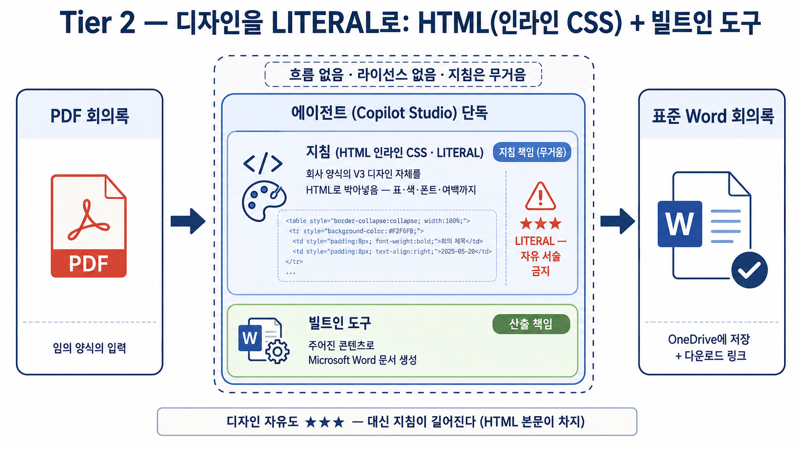
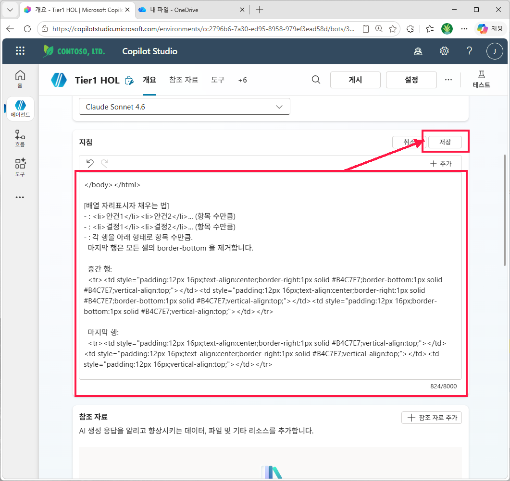
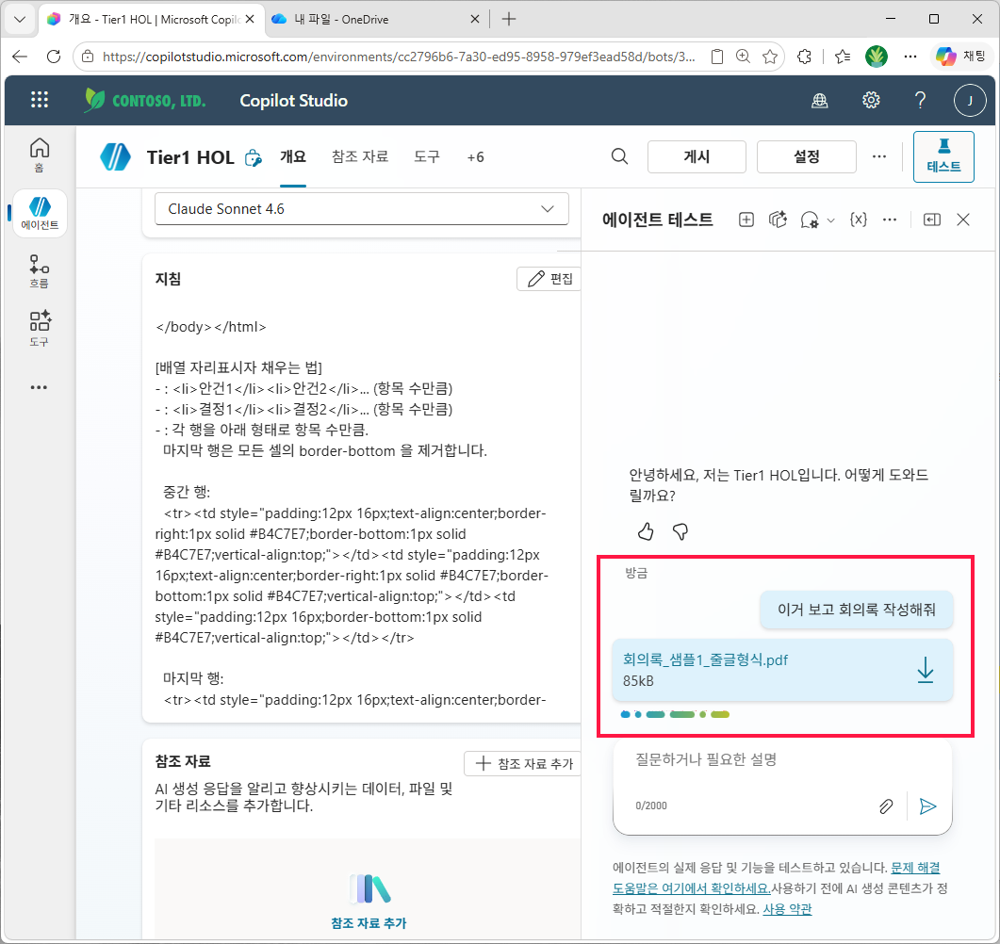
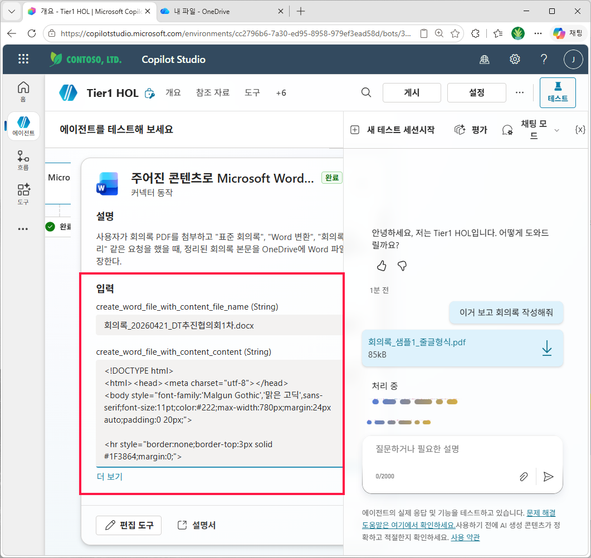
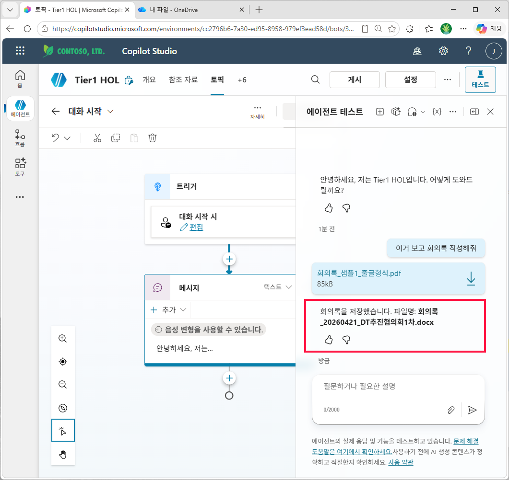
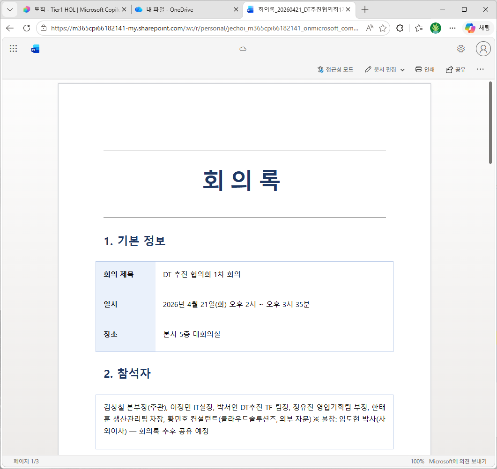

# 실습 ②: HTML(인라인 CSS) + 빌트인 도구
{: .no_toc }

| 시간 | 소요 | 수강생 역할 |
|:-----|:-----|:-----------|
| 09:43 | 11분 | 🟢 직접 실습 |

## 목차
{: .no_toc .text-delta }

1. TOC
{:toc}

---



## 핵심 아이디어

빌트인 도구는 사실 **HTML 도 받습니다.** 본문 자리에 HTML 마크업 + 인라인 CSS 를 넣으면 Word 가 그걸 그대로 임포트해 디자인된 문서를 만듭니다. 흐름 없이 그대로 실습 ① 의 구조를 유지하면서 결과만 한국 비즈니스 양식으로 격상.

## 이 실습에서 완성할 것

| 항목 | 내용 |
|:-----|:-----|
| **완성 산출물** | 같은 Word 생성 도구에 HTML 본문을 넘겨 디자인된 .docx 를 만드는 에이전트 |
| **사용 도구** | 실습 ① 과 동일한 Word Online (Business) 빌트인 도구 |
| **성공 기준** | 도구 입력의 `content` 가 `<!DOCTYPE html>` 로 시작하고, 결과 문서에 네이비 표지·라벨 셀·액션 아이템 표가 적용됨 |
| **다음 한계** | 디자인을 지침에 모두 넣어야 해서 지침이 길고 깨지기 쉬움 |

```
[사용자] PDF 첨부 + "표준 회의록으로 만들어줘"
   ↓
[에이전트]
   ├ 오케스트레이터가 PDF 본문 추출
   ├ 지침에 따라 정해진 HTML 템플릿의 {{}} 자리만 추출값으로 채움
   └ Tool: 주어진 콘텐츠로 Microsoft Word 문서 생성
       - 콘텐츠: 완성된 HTML 본문
   ↓
[응답] OneDrive에 저장됨 안내 (디자인된 .docx)
```

---

## Step 2-1. 빌트인 도구 추가

**실습 ① 의 Step 1-1 과 동일.** 도구는 같습니다. 실습 ① 에서 만든 `회의록_Word_저장` 도구를 그대로 재사용해도 무방합니다.

---

## Step 2-2. 디자인 약속

이 가이드의 V3 디자인 핵심 스펙:

- 폰트: `'Malgun Gothic','맑은 고딕',sans-serif`, 본문 11pt, 행간 1.5
- 메인 컬러: `#1F3864` (네이비), 보조 보더: `#B4C7E7`, 라벨 셀 배경: `#EAF1FB`
- 표지: `<hr>` + `<h1>` (36pt, letter-spacing:12px) + `<hr>` 패턴
- 섹션 헤더: `<p style="margin:24px 0 8px 0;color:#1F3864;font-size:18pt;font-weight:bold;">N. 제목</p>`
- 콘텐츠 박스: `<table style="width:100%;border:1px solid #B4C7E7;border-collapse:collapse;border-spacing:0;">`
- 액션 아이템 표: 헤더 셀 `#EAF1FB` 배경, 셀 보더 `#B4C7E7`

> **왜 인라인 CSS 만 쓰나**: Word 의 HTML 임포터는 `<style>` 블록·외부 스타일시트를 일관되게 적용하지 못합니다. **모든 스타일을 각 태그의 `style="..."` 속성으로 박아 넣으면** Word 가 그대로 받아들입니다. `border-collapse:collapse` 만 적용해도 셀 사이 공백이 생기는 케이스가 있어 `border-spacing:0` 도 함께 명시해 두는 것이 안전합니다.

---

## Step 2-3. 에이전트 지침 작성 (강화 지침)

이 지침은 실습 ① 보다 훨씬 길고 엄격합니다. 이유는 **LLM 이 HTML 템플릿을 "예시"로 해석하고 무시하는 경향**이 있기 때문입니다. 아래 패턴들이 그 회피책입니다.

- 첫 줄에 임무를 좁게 정의: "정해진 HTML 을 만들어 도구에 넘기는 것이 유일한 임무"
- "★★★ 절대 규칙" 으로 강하게 못박기
- "예시가 아니라 LITERAL OUTPUT" 명시
- 반례를 적기: "Markdown / 평문 / 요약본을 도구에 넘기면 실패"

지침 골격:


```
당신은 회의록 표준화 에이전트입니다. 당신의 유일한 임무는 정해진 HTML 본문의
{{}} 자리만 추출값으로 채워 도구 "회의록_Word_저장" 에 그대로 넘기는 것입니다.

★★★ 절대 규칙 (어기면 실패)
1. 도구에 넘기는 콘텐츠는 아래 [HTML 템플릿] 그대로의 HTML 이어야 합니다.
   {{}} 자리만 채우고, 그 외 한 글자도 변경하지 마세요.
2. 아래 [HTML 템플릿] 은 예시가 아닙니다. LITERAL OUTPUT 입니다.
   Markdown, 평문, 요약본, 일부만 발췌한 텍스트를 도구에 넘기면 실패입니다.
3. 도구 호출 전후에 자유 서술을 하지 마세요. 결과 안내만 한 줄.
4. 원본에 없는 정보는 절대 추측하지 마세요. 빈 항목은 빈 문자열 또는
   "(해당 없음)" 으로 채우되, 구조(태그/스타일)는 그대로 유지합니다.

[수행 순서]
1. PDF 본문에서 다음 항목을 추출:
   - 회의 제목, 일시, 장소, 참석자, 안건(배열), 결정사항(배열),
     액션아이템(배열: 담당자/기한/내용), 다음 회의 일정
2. 아래 [HTML 템플릿] 의 {{}} 부분을 추출값으로 치환.
   - 안건/결정사항 같은 배열은 <li>...</li> 를 항목 수만큼 반복
   - 액션아이템 표 행은 항목 수만큼 <tr> 반복 (마지막 행은 border-bottom 제거)
3. 완성된 HTML 전체를 도구 "회의록_Word_저장" 의 콘텐츠 인자로 전달.
   - 파일명: 회의록_{회의일자YYYYMMDD}_{회의제목핵심키워드}
4. 사용자에게 한 줄 안내: "회의록을 저장했습니다. 파일명: ..."

[HTML 템플릿]
<!DOCTYPE html>
<html><head><meta charset="utf-8"></head>
<body style="font-family:'Malgun Gothic','맑은 고딕',sans-serif;font-size:11pt;color:#222;max-width:780px;margin:24px auto;padding:0 20px;">

<hr style="border:none;border-top:3px solid #1F3864;margin:0;">
<h1 style="text-align:center;font-size:36pt;color:#1F3864;margin:18px 0;letter-spacing:12px;font-weight:bold;">회의록</h1>
<hr style="border:none;border-top:3px solid #1F3864;margin:0 0 24px 0;">

<p style="margin:24px 0 8px 0;color:#1F3864;font-size:18pt;font-weight:bold;">1. 기본 정보</p>
<table style="width:100%;border:1px solid #B4C7E7;border-collapse:collapse;border-spacing:0;">
<tr><td style="width:20%;background:#EAF1FB;padding:14px 16px;font-weight:bold;vertical-align:top;">회의 제목</td><td style="padding:14px 16px;vertical-align:top;">{{title}}</td></tr>
<tr><td style="width:20%;background:#EAF1FB;padding:14px 16px;font-weight:bold;vertical-align:top;">일시</td><td style="padding:14px 16px;vertical-align:top;">{{meetingDate}}</td></tr>
<tr><td style="width:20%;background:#EAF1FB;padding:14px 16px;font-weight:bold;vertical-align:top;">장소</td><td style="padding:14px 16px;vertical-align:top;">{{location}}</td></tr>
</table>

<p style="margin:24px 0 8px 0;color:#1F3864;font-size:18pt;font-weight:bold;">2. 참석자</p>
<table style="width:100%;border:1px solid #B4C7E7;border-collapse:collapse;border-spacing:0;"><tr><td style="padding:14px 16px;">{{attendees}}</td></tr></table>

<p style="margin:24px 0 8px 0;color:#1F3864;font-size:18pt;font-weight:bold;">3. 안건</p>
<table style="width:100%;border:1px solid #B4C7E7;border-collapse:collapse;border-spacing:0;"><tr><td style="padding:14px 16px;"><ol style="margin:0;padding-left:22px;line-height:1.8;">{{agenda_items}}</ol></td></tr></table>

<p style="margin:24px 0 8px 0;color:#1F3864;font-size:18pt;font-weight:bold;">4. 결정 사항</p>
<table style="width:100%;border:1px solid #B4C7E7;border-collapse:collapse;border-spacing:0;"><tr><td style="padding:14px 16px;"><ul style="margin:0;padding-left:22px;line-height:1.8;">{{decision_items}}</ul></td></tr></table>

<p style="margin:24px 0 8px 0;color:#1F3864;font-size:18pt;font-weight:bold;">5. 액션 아이템</p>
<table style="width:100%;border:1px solid #B4C7E7;border-collapse:collapse;border-spacing:0;">
<tr><td style="width:20%;background:#EAF1FB;padding:12px 16px;font-weight:bold;text-align:center;border-right:1px solid #B4C7E7;border-bottom:1px solid #B4C7E7;">담당자</td><td style="width:20%;background:#EAF1FB;padding:12px 16px;font-weight:bold;text-align:center;border-right:1px solid #B4C7E7;border-bottom:1px solid #B4C7E7;">기한</td><td style="background:#EAF1FB;padding:12px 16px;font-weight:bold;text-align:center;border-bottom:1px solid #B4C7E7;">내용</td></tr>
{{action_rows}}
</table>

<p style="margin:24px 0 8px 0;color:#1F3864;font-size:18pt;font-weight:bold;">6. 다음 회의 일정</p>
<table style="width:100%;border:1px solid #B4C7E7;border-collapse:collapse;border-spacing:0;"><tr><td style="padding:14px 16px;">{{nextMeeting}}</td></tr></table>

<hr style="border:none;border-top:3px solid #1F3864;margin:28px 0 0 0;">

</body></html>

[배열 자리표시자 채우는 법]
- {{agenda_items}}: <li>안건1</li><li>안건2</li>... (항목 수만큼)
- {{decision_items}}: <li>결정1</li><li>결정2</li>... (항목 수만큼)
- {{action_rows}}: 각 행을 아래 형태로 항목 수만큼.
  마지막 행은 모든 셀의 border-bottom 을 제거합니다.

  중간 행:
  <tr><td style="padding:12px 16px;text-align:center;border-right:1px solid #B4C7E7;border-bottom:1px solid #B4C7E7;vertical-align:top;">{{owner}}</td><td style="padding:12px 16px;text-align:center;border-right:1px solid #B4C7E7;border-bottom:1px solid #B4C7E7;vertical-align:top;">{{dueDate}}</td><td style="padding:12px 16px;border-bottom:1px solid #B4C7E7;vertical-align:top;">{{task}}</td></tr>

  마지막 행:
  <tr><td style="padding:12px 16px;text-align:center;border-right:1px solid #B4C7E7;vertical-align:top;">{{owner}}</td><td style="padding:12px 16px;text-align:center;border-right:1px solid #B4C7E7;vertical-align:top;">{{dueDate}}</td><td style="padding:12px 16px;vertical-align:top;">{{task}}</td></tr>
```


입력 후 **저장** 클릭. 우하단의 글자수 카운터 (예: `7,500/8,000`) 가 한계 이내인지 확인하세요.

**① 지침 영역에 HTML 템플릿 포함 지침을 붙여넣고 우상단 저장**



> **8000자 제한 주의**: Copilot Studio 에이전트 지침은 약 8000자 제한이 있습니다. 위 지침은 약 7500자로 한계에 가깝습니다. 실제 적용 시 화이트스페이스 정리, 인라인 CSS 약어화 등으로 여유를 만들어 두세요.

---

## Step 2-4. 테스트

1. 테스트 패널 우상단 **+ 새 테스트 세션 시작** → 메시지란에 "이거 보고 회의록 작성해줘" 입력 + [샘플1 줄글형식.pdf](../assets/files/회의록_샘플1_줄글형식.pdf) 첨부

   **① 새 테스트 세션에 메시지+PDF 첨부**

   

2. 에이전트가 도구를 호출할 때 **도구 카드를 펼쳐서 입력값 검증** — LLM 이 HTML 을 평문으로 요약해서 넘기는 경우가 가장 자주 일어나는 실패입니다. **입력 영역을 열어 다음 두 가지가 둘 다 충족되는지 확인**해야 합니다.

   - `create_word_file_with_content_file_name`: `회의록_20260421_DT추진협의회1차.docx` 처럼 지침 규칙이 적용되었는지
   - `create_word_file_with_content_content`: 첫 줄이 `<!DOCTYPE html>` 으로 시작하는지 (일반 텍스트면 실패)

   **② 도구 호출 카드 입력 영역에 file_name=회의록_..., content=<!DOCTY…**

   

3. 도구 호출 완료 후 응답에 **지침의 한 줄 안내가 그대로 출력**되는지— 자유 서술이 더 붙어 나오면 지침의 "도구 호출 전후 자유 서술 금지" 조항을 더 강하게 적어야 합니다.

   **③ 응답 메시지 "회의록을 저장했습니다. 파일명: 회의록_20260421_DT추진협의회1차.d…**

   

4. **OneDrive 열기** → 생성된 .docx 클릭 → V3 디자인(네이비 표지 + 공백 이중선 + 라벨 셀 #EAF1FB 음영 + 액션 아이템 표) 이 그대로 떨어졌는지 확인

   **④ 생성된 Word 문서가 네이비 표지·라벨 셀 음영·구분선을 갖춘 V3 디자인으로 열린 모습**

   

5. 샘플2 표형식 PDF — [회의록_샘플2_표형식.pdf](../assets/files/회의록_샘플2_표형식.pdf) 도 새 세션으로 임포트해서 같은 디자인으로 떨어지는지 비교
6. HTML 이 결과 문서에 그대로 텍스트로 남아 있다면 → 지침의 "★★★ 절대 규칙" 강도가 부족한 것. "LITERAL OUTPUT" 문구를 더 강조하거나 도구 호출 전후 자유 서술 금지 문구를 추가

## 완료 체크

- 도구 호출 입력에서 파일명이 `회의록_YYYYMMDD_핵심키워드.docx` 형식으로 잡힘
- 도구 호출 입력의 콘텐츠가 HTML 전체 본문으로 들어감
- 결과 Word 문서에 HTML 태그가 텍스트로 노출되지 않음
- 줄글형·표형 PDF 모두 같은 디자인 구조로 생성됨

---

## 결과 — 디자인은 됐다. 그런데 지침이 너무 무겁다

V3 디자인이 그대로 떨어집니다. 임원에게 보내도 손색없는 한국식 비즈니스 회의록.

그러나 만든 사람 입장에서 보면:

- 지침이 8000자 한계까지 차 있다 — 다른 시나리오를 같은 에이전트에 추가하기 어렵다
- 디자인을 살짝 바꾸려면 지침 전체를 고쳐야 한다
- LLM 이 가끔 HTML 을 무시하고 평문을 도구로 보낸다 — 일관성이 100% 가 아니다

**"디자인을 박는 일은 LLM 의 일이 아니라 흐름의 일이지 않을까?"** — 이 의문이 다음 실습으로 가는 동기입니다. LLM 은 추출만, 디자인은 Word 템플릿이 책임지도록 분리합니다.

---

## 다음 페이지

[실습③-A — 백엔드: 템플릿 + 흐름](s01-3a-template)
