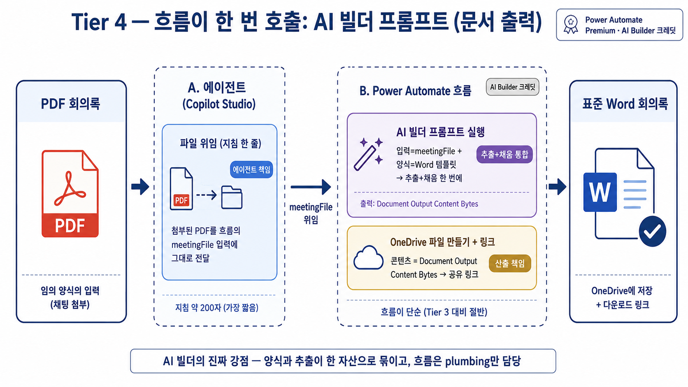
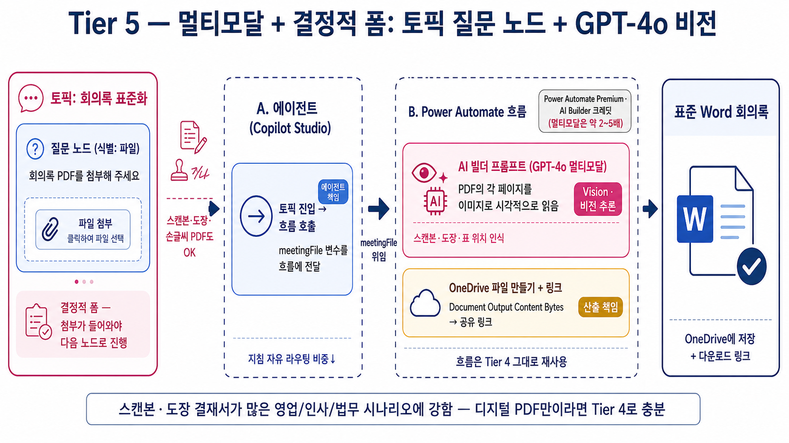

---
title: "실습③ — Tier 4·5: AI 빌더 문서 출력"
parent: "S1. 문서 자동화 5-Tier"
grand_parent: "📗 심화과정"
nav_order: 3
---

# 실습 ③: Tier 4 (AI 빌더 문서 출력) → Tier 5 (멀티모달)
{: .no_toc }

| 시간 | 소요 | 수강생 역할 |
|:-----|:-----|:-----------|
| 10:20 | 8분 (Tier 4 본문 4분 + Tier 5 변형 4분) | 🟡 따라보기 |

## 목차
{: .no_toc .text-delta }

1. TOC
{:toc}

---

## Tier 4 — 파일 → 흐름 → AI 빌더 프롬프트 (문서 출력)



### 핵심 아이디어

AI 빌더 프롬프트의 **"문서 출력 (Document output, 미리 보기)"** 기능을 사용합니다. 이 기능은:

- **입력**: 텍스트 또는 파일 (PDF · 이미지 등)
- **양식**: 미리 업로드한 Word 양식 (`{{필드명}}` 텍스트 플레이스홀더)
- **동작**: AI 가 입력에서 정보를 추출 + 양식의 `{{}}` 자리를 채움 (한 번의 호출)
- **출력**: `Document Output Content Bytes` (완성된 .docx 바이너리)

Tier 3 에서는 **에이전트가 추출 → 흐름이 채우기** 의 두 단계였는데, Tier 4 에서는 **흐름이 AI 빌더 프롬프트 한 번 호출하면** 추출+채우기가 동시에 일어납니다. 흐름이 더 단순해집니다.

```
[사용자] PDF 첨부 + "표준 회의록으로 만들어줘"
   ↓
[에이전트] 첨부 파일을 흐름에 그대로 넘김 (추출은 안 함)
   ↓
[흐름]  AI 빌더: 프롬프트 실행 (입력=파일, 양식=Word 템플릿)
        → OneDrive: 새 파일 만들기 (콘텐츠 = Document Output Content Bytes)
        → 공유 링크 반환
   ↓
[응답] 다운로드 링크 안내
```

> **참고 문서**: [Generate document output from a prompt — Microsoft Learn](https://learn.microsoft.com/en-us/microsoft-copilot-studio/generate-document-output-prompt)

### Step 4-1. Word 템플릿 — `회의록_템플릿_Tier4.docx`

**Tier 3 와 디자인은 같지만 자리표시자 형식이 다릅니다.**

| | Tier 3 (Word Online 채우기) | Tier 4 (AI 빌더 문서 출력) |
|---|---|---|
| 자리표시자 형식 | **콘텐츠 컨트롤** (SDT, 태그 = 변수명) | **`{{필드명}}` 텍스트** |
| 반복 섹션 | 반복 섹션 컨트롤 | 표 셀에 `{{actionItems.owner}}` 형식 |

> 두 양식은 **호환되지 않습니다.** Tier 3 에 Tier 4 양식을 넣으면 빈 .docx 가 떨어지고, 그 반대도 마찬가지. 반드시 두 파일을 따로 둡니다.

직접 만들 때 순서 (Tier 4):

1. Word 데스크톱에서 새 문서 → V3 디자인으로 양식 작성
2. 각 자리에 **그냥 텍스트로** `{{title}}`, `{{meetingDate}}`, ... 입력 (콘텐츠 컨트롤 아님)
3. 액션 아이템 표는 한 행만 두고, 셀에 `{{actionItems.owner}}` `{{actionItems.dueDate}}` `{{actionItems.task}}` 입력
4. 저장 → 20MB 이하 (한도)

### Step 4-2. AI 빌더 프롬프트 — `회의록_표준화_프롬프트`

1. Power Apps · Power Automate 화면 좌측 **AI 허브 → 프롬프트 → 새 프롬프트**
2. 프롬프트 본문 입력:
   ```
   첨부된 회의록 PDF 에서 정보를 추출해 회의록 양식을 채워주세요.
   - 원본에 없는 정보는 추측하지 말고 빈 칸으로 두세요.
   - 일시는 "YYYY-MM-DD HH:mm" 형식으로 정리.
   - 액션 아이템은 담당자/기한/내용으로 분리.
   ```
3. **입력 추가** → 종류: **파일** → 이름: `meetingFile`
4. **출력 형식** → **문서 (Document)** 선택
5. **양식 업로드** → Step 4-1 의 `회의록_템플릿_Tier4.docx` 업로드
6. **테스트** 탭에서 회의록 PDF 한 번 올려 동작 확인 → 저장

> **제약**: 솔루션 이동 시 양식 재업로드 필요. 5MB 이상 양식은 저장-재오픈 후에야 테스트 가능.

### Step 4-3. Power Automate 흐름 — `회의록_생성_흐름_Tier4`

- 트리거: **Copilot Studio (V2)**
- 입력: `meetingFile` (파일 콘텐츠)

작업 순서:

1. **AI Builder → 프롬프트 실행 (Run a prompt)**
   - 프롬프트: `회의록_표준화_프롬프트`
   - `meetingFile` ← 트리거 입력 `meetingFile`
2. **OneDrive → 파일 만들기**
   - 폴더: `/Apps/회의록/생성결과/`
   - 파일 이름: `회의록_AI빌더_@{utcNow('yyyyMMdd_HHmmss')}.docx`
   - 콘텐츠: 1번 단계의 `Document Output Content Bytes`
3. **OneDrive → 항목 링크 가져오기**
4. **Copilot Studio 에 응답**: `다운로드링크`, `파일이름`

### Step 4-4. 에이전트 지침 — 파일을 흐름에 위임

```
당신은 회의록 표준화 에이전트입니다.
사용자가 회의록 PDF 를 첨부하면 첨부된 파일을 그대로 흐름
"회의록_생성_흐름_Tier4" 의 meetingFile 매개변수에 전달합니다.
PDF 본문 추출은 AI 빌더 프롬프트가 처리하므로 LLM 추출은 하지 않습니다.

흐름 결과의 다운로드 링크를 사용자에게 한 줄로 안내합니다.
"회의록 저장 완료: <다운로드 링크>"
```

> **포인트**: 추출 책임이 LLM(에이전트) 에서 **AI 빌더 프롬프트** 로 옮겨졌습니다. 같은 프롬프트를 다른 부서·다른 흐름에서도 재사용할 수 있는 추출 자산이 됩니다.

### 결과 — AI 빌더가 진짜 일을 한다

이제 AI 빌더 프롬프트가 추출+채우기를 한 번에 처리합니다. 부수 효과:

- 프롬프트가 **추출 자산** 으로 독립 — 다른 흐름·다른 부서에서도 재사용
- 양식 변경 시 .docx 만 다시 업로드
- 흐름이 단순해짐 (AI 빌더 한 번 호출 + OneDrive 저장)

다만 한계가 남습니다.

- **채팅 첨부 의존** — 사용자가 PDF 첨부를 잊거나 잘못된 파일을 올리면 처리 실패
- **텍스트 위주 추출** — 스캔본·도장이 찍힌 결재 문서·표 위주 PDF 처리는 약함

이 두 가지를 해결하는 것이 Tier 5 입니다.

---

## Tier 5 — 토픽 질문 노드 + 멀티모달 프롬프트 (변형, 4분)



### 핵심 아이디어 — Tier 4 의 두 가지 변형만

Tier 5 는 Tier 4 의 골격을 그대로 두고 **두 가지만 변경**합니다.

#### (A) 입구를 토픽 질문 노드로 — 결정적 폼

- 채팅 첨부에 의존하면 사용자가 잊거나 잘못된 파일을 올림
- 토픽에 **질문 노드**를 두고 "회의록 PDF 를 첨부하세요" 로 명시적으로 받기
- 첨부가 없으면 다음 단계로 진행 못 함 — 결정적 입력 보장

```
[토픽: 회의록 표준화]
  → 질문 노드: "회의록 PDF 를 첨부해 주세요" (입력 = file)
  → 흐름 호출: meetingFile = 질문 노드의 file
  → 응답: 다운로드 링크 안내
```

#### (B) 프롬프트를 멀티모달로 — 비전 활용

- AI 빌더 프롬프트의 입력 종류를 **이미지** 도 받도록 확장
- 또는 프롬프트 본문에 **"비전을 사용해 표/도장/스탬프도 인식하세요"** 명시
- 스캔본 PDF, 도장 결재서, 표 위주 PDF 도 정확도 ↑

이 둘만 적용하면 Tier 4 의 두 한계가 동시에 해소됩니다.

### Tier 4 → Tier 5 변경 요약

| 항목 | Tier 4 | Tier 5 |
|:--|:--|:--|
| 입구 | 채팅 첨부 (자유) | **토픽 질문 노드** (결정적 폼) |
| AI 빌더 프롬프트 입력 | 파일 (PDF) | **파일 + 이미지** (멀티모달) |
| PDF 처리 깊이 | 텍스트 | **비전 — 스캔/도장/표** |
| 만드는 시간 | 25분 | **+5분** (Tier 4 변형) |

### 결과 — 5-Tier 그라디언트 완성

Tier 1 (5분, 빌트인) 부터 Tier 5 (멀티모달 + 결정적 폼) 까지 같은 시나리오를 5번 만들었습니다. 각 단계는 직전의 한계를 해소하고, 최종적으로 **회사 어떤 시나리오에도 적용할 수 있는 5가지 패턴**을 손에 쥐었습니다.

| Tier | 한 문장으로 |
|:-----|:------------|
| Tier 1 | 자유 본문이면 빌트인 도구 하나면 끝 (5분) |
| Tier 2 | 디자인이 필요하면 인라인 CSS HTML로 박는다 (15분) |
| Tier 3 | 디자인을 LLM 밖으로 빼서 Word 템플릿이 책임진다 (30분) |
| Tier 4 | AI 빌더 프롬프트가 추출+채우기를 한 번에 한다 (25분) |
| Tier 5 | 입구를 결정적 폼으로 + 비전으로 스캔본까지 처리 (Tier 4 + 5분) |

> **S1 마무리** — "임의 양식 PDF → 회사 표준 Word" 라는 한 시나리오를 5번 다르게 만들었습니다. 다음 [S2](s02-excel-analysis) 에서는 같은 도구 군 (토픽 + 흐름 + Office Script + AI 프롬프트) 을 **Excel 분석** 시나리오로 옮겨 씁니다.
