# 실습 ③-B: Tier 3 에이전트 — 지침 + 도구 + 테스트
{: .no_toc }

| 시간 | 소요 | 수강생 역할 |
|:-----|:-----|:-----------|
| 10:12 | 8분 | 🟡 따라보기 (실습 환경에 따라 🟢 직접 실습) |

[실습③-A](s01-3a-tier3-template) 에서 만든 Word 템플릿과 흐름(`meetingnote_template`)을 에이전트가 부를 수 있게 지침·도구로 연결하고, 실제 회의록 PDF 로 동작을 확인합니다.

## 목차
{: .no_toc .text-delta }

1. TOC
{:toc}

---

## Step 3-3. 에이전트 지침 — 추출만 시키기

Copilot Studio 좌측 **에이전트** → **+ 빈 에이전트 만들기** → 이름 `Tier3 HOL` → **만들기**:

**① 에이전트 이름 `Tier3 HOL` → `만들기`**

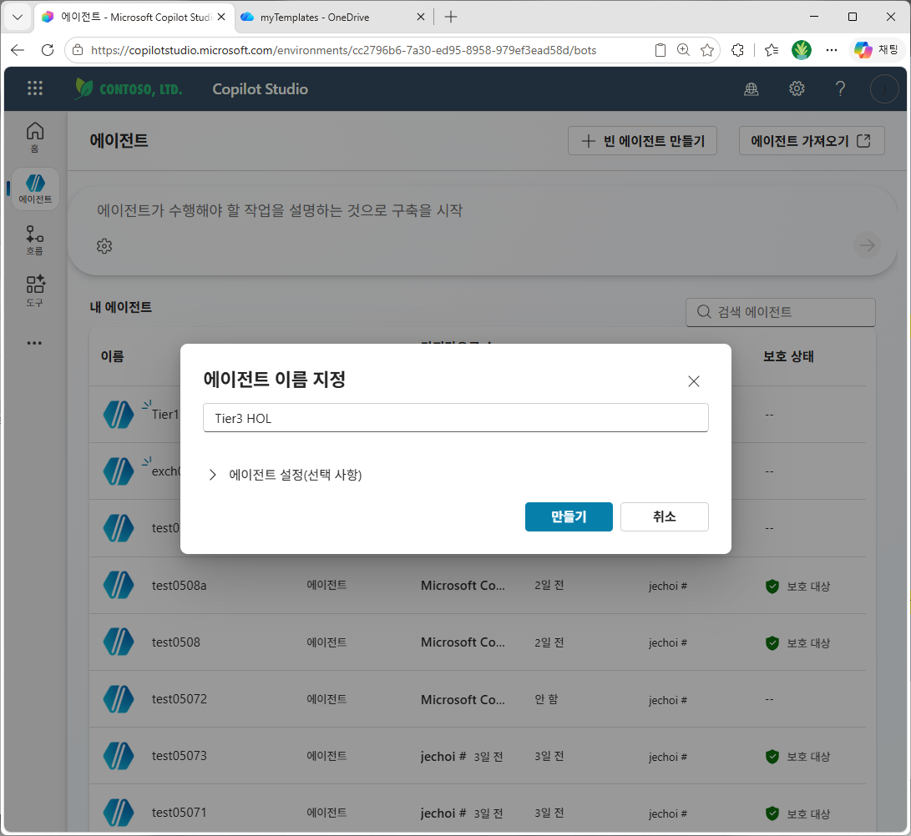

생성된 에이전트의 개요 화면에서 **에이전트의 모델 선택** 을 `Claude Sonnet 4.6` 로 두고, **지침** 박스 우측의 **편집** 클릭:

**② 개요 — 모델 `Claude Sonnet 4.6` 확인 / 지침 `편집`**

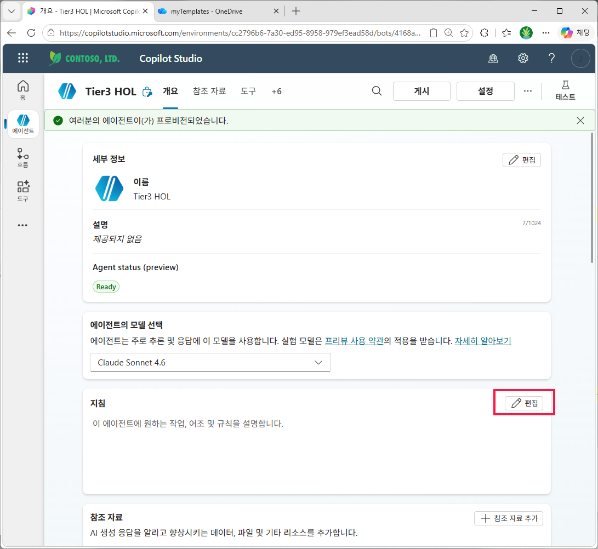

지침 입력란에 아래 추출 전용 지침을 붙여넣고 **저장**:

```
당신은 회의록 추출 에이전트입니다.
사용자가 회의록 PDF 를 첨부하고 표준화/Word 변환을 요청하면 다음을 수행하세요.

1. PDF 본문에서 아래 항목을 추출합니다 (없으면 빈 값, 추측 금지):
   - title (회의 제목)
   - meetingDate (일시. "2026-05-09 14:00" 형식)
   - location (장소)
   - attendees (참석자. 쉼표로 연결한 문자열)
   - agenda (안건. 줄바꿈으로 구분한 문자열)
   - decisions (결정 사항. 줄바꿈으로 구분한 문자열)
   - nextMeeting (다음 회의 일정)
   - actionItemsJson (액션 아이템. 아래 형식의 **JSON 문자열**)
     ```
     [{"owner":"홍길동","dueDate":"2026-05-15","task":"초안 작성"}, ...]
     ```
     — 반드시 대괄호로 시작하는 유효한 JSON. 이스케이프되지 않은 큰따옴표 사용. 액션 아이템이 없으면 `[]`.

2. 추출 결과를 흐름 "회의록_생성_흐름_Tier3" 에 매개변수로 그대로 전달합니다.

3. 흐름 결과의 다운로드 링크를 사용자에게 한 줄로 안내합니다.
   "회의록 저장 완료: <다운로드 링크>"

PDF 가 아닌 파일이 들어오면 회의록 PDF 를 요청하세요.
원본에 없는 정보는 절대 추측하지 마세요.
```

**③ 지침 본문 입력 (8개 추출 필드 + actionItemsJson) → `저장`**

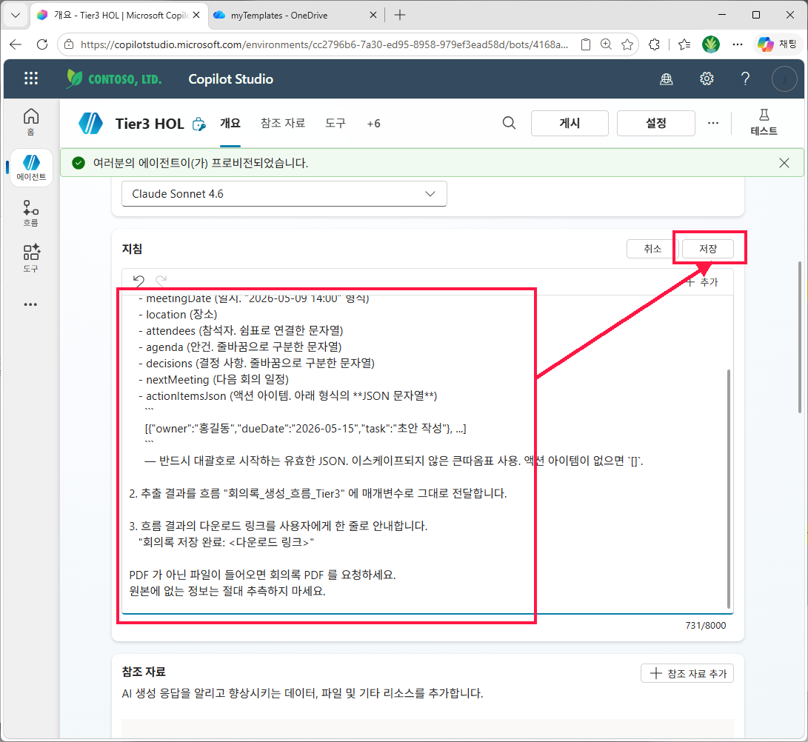

지침 분량 약 500자 — Tier 2 의 1/15 입니다.

---

## Step 3-4. 토픽·도구 연결

- 흐름 `회의록_생성_흐름_Tier3` 을 도구로 추가 → 입력 매핑은 모델 자동 채움
- PDF 첨부는 채팅에서 자동 처리 (Excel 과 달리 별도 토픽 불필요)

상단 탭 **도구** → **+ 도구 추가** 클릭:

**① 도구 탭 빈 상태에서 `+ 도구 추가`**

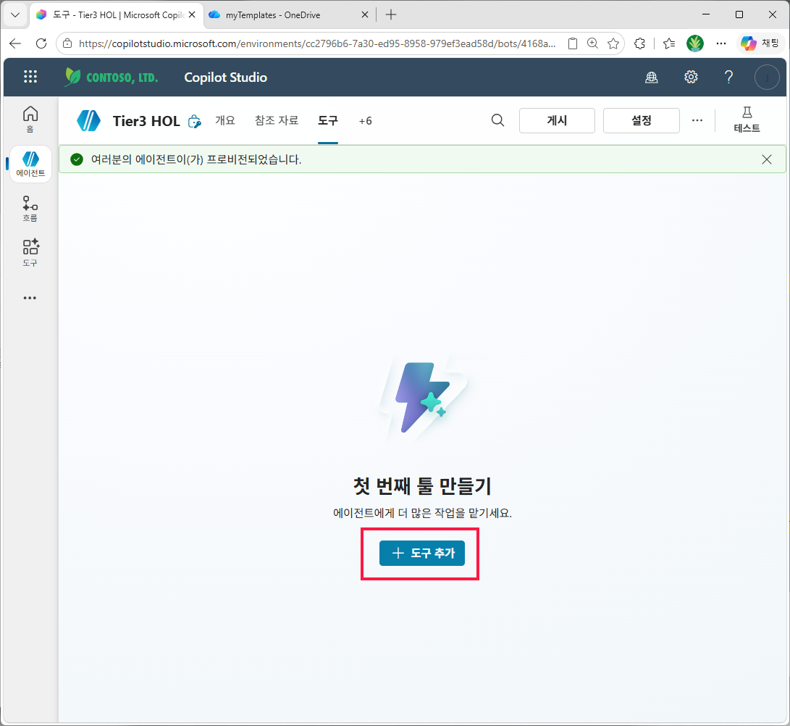

도구 추가 패널에서 **흐름** 카테고리 → 위에서 게시한 흐름 (예: `meetingnote_template`) 선택:

**② `흐름` 탭 → `meetingnote_template` 선택**

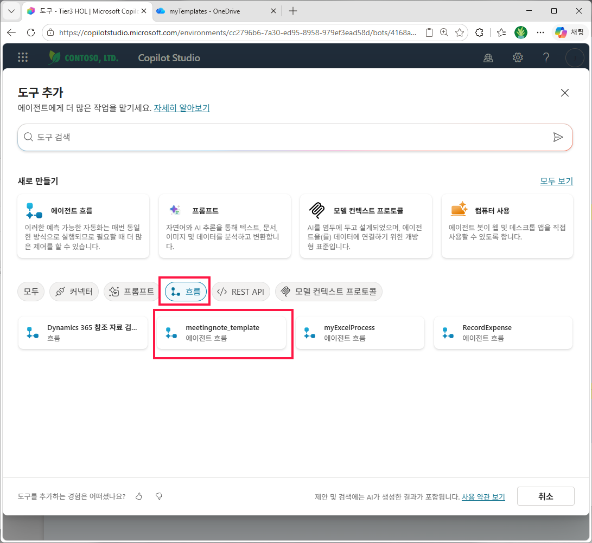

미리보기 화면에서 **추가 및 구성** 클릭:

**③ 도구 미리보기 → `추가 및 구성`**

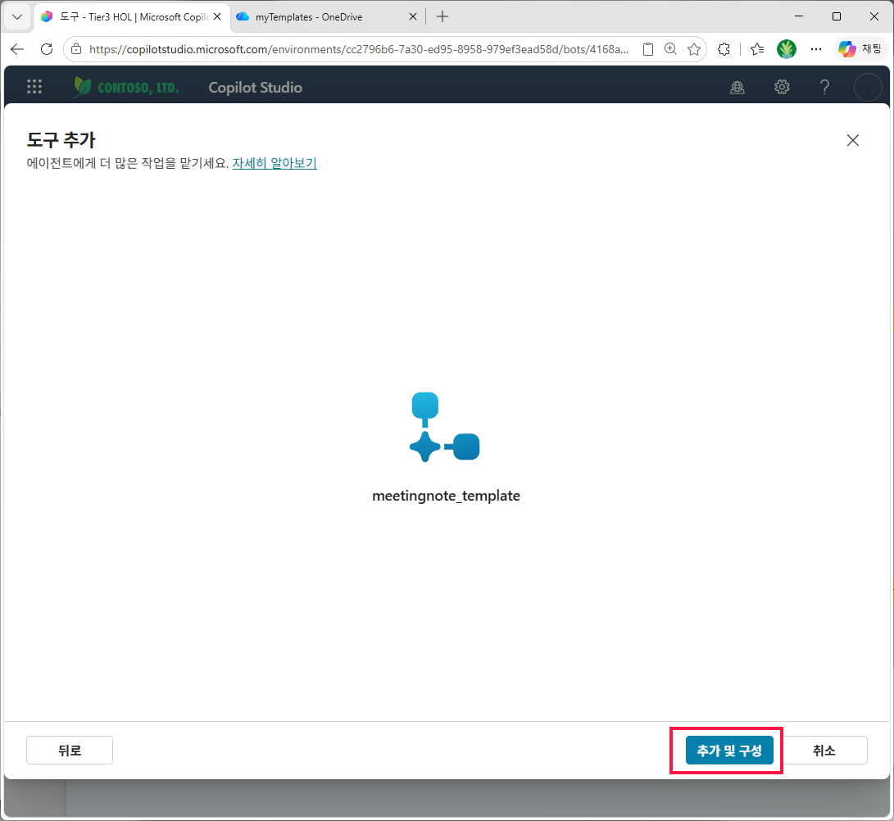

세부 정보 패널 — 이름·설명을 모두 `회의록_생성_흐름_Tier3` 으로 입력하고 **저장**:

**④ 도구 이름·설명 입력 → `저장`**

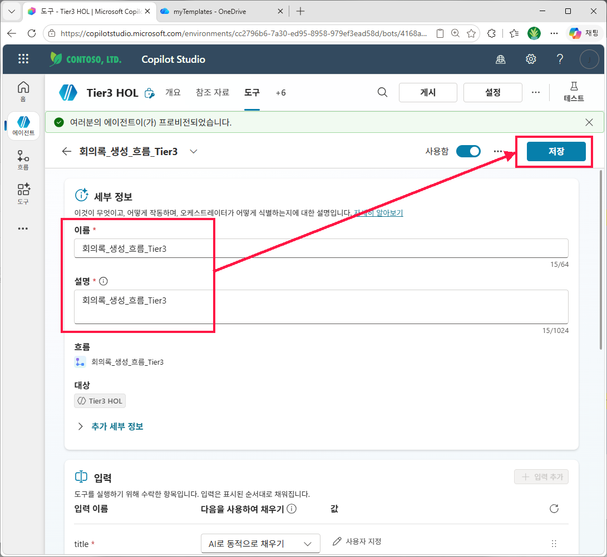

다시 개요 → 지침 편집으로 돌아가, "**2. 추출 결과를 흐름**" 다음 위치에 **흐름 칩** 을 삽입합니다 (평문 텍스트 `회의록_생성_흐름_Tier3` 대신 도구 픽커로 칩 삽입). **저장**:

**⑤ 지침에 `/회의록_생성_흐름_Tier3` 흐름 칩 삽입 → `저장`**

![지침에 흐름 칩 삽입 — "흐름 [회의록_생성_흐름_Tier3] 에 매개변수로 그대로 전달" → 저장](../assets/images/s01-3/043_click.png)

> **포인트**: 지침 안에서 흐름 이름을 텍스트로만 적어두면 모델이 어떤 도구를 부를지 정확히 모를 수 있습니다. **칩** 으로 삽입해야 모델이 이 도구의 입력 스키마를 정확히 인식합니다.

---

## Step 3-5. 테스트

오른쪽 **테스트** 패널을 열고, **첨부 (📎)** 로 회의록 샘플 PDF (예: `회의록_샘플1_줄글형식.pdf`) 를 첨부 + 프롬프트:

```
이 메모를 보고 회의록 작성해줘
```

**① 새 테스트 세션 → 메시지 + PDF 첨부**

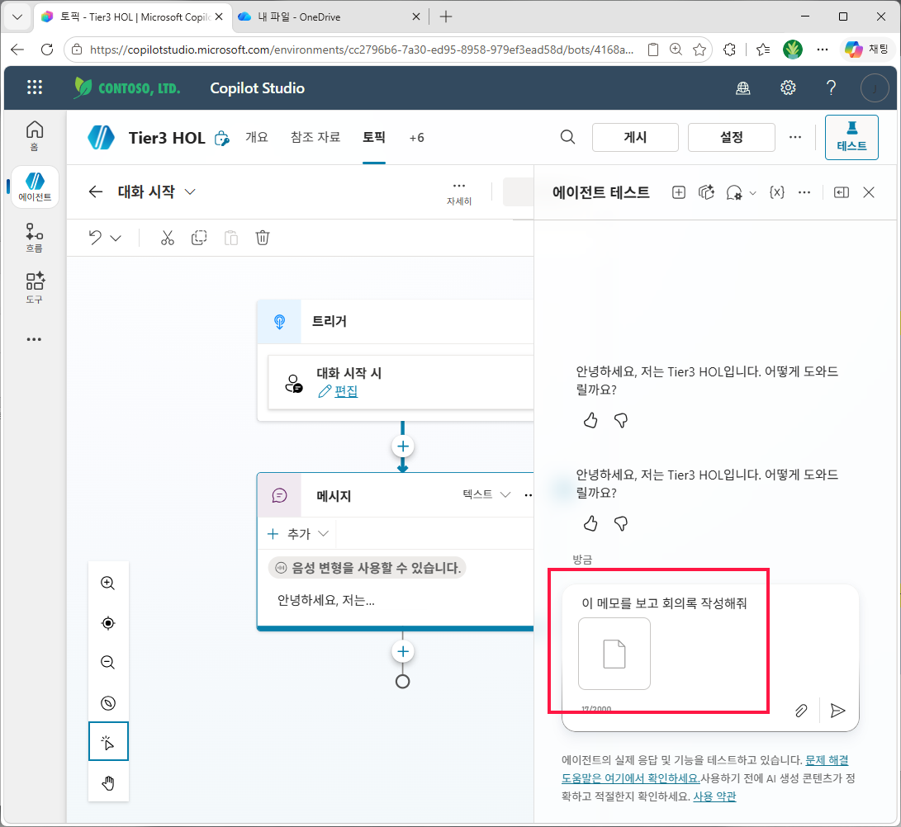

흐름이 호출되어 **작업 중** 상태 — 활동 패널에서 추출된 입력 매개변수 미리보기 (`nextMeeting`, `attendees`, `decisions`, `location`):

**② 흐름 작업 중 — 입력 매개변수 추출 결과 미리보기**

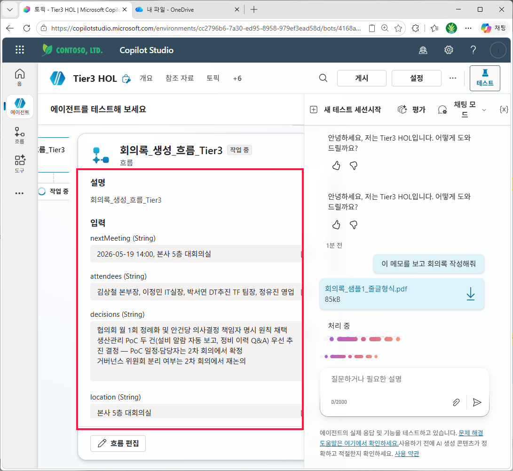

흐름 **완료** → 응답에 다운로드 링크가 한 줄로 안내됨:

**③ 응답 — `회의록 저장 완료: <SharePoint URL>` + 요약 표**

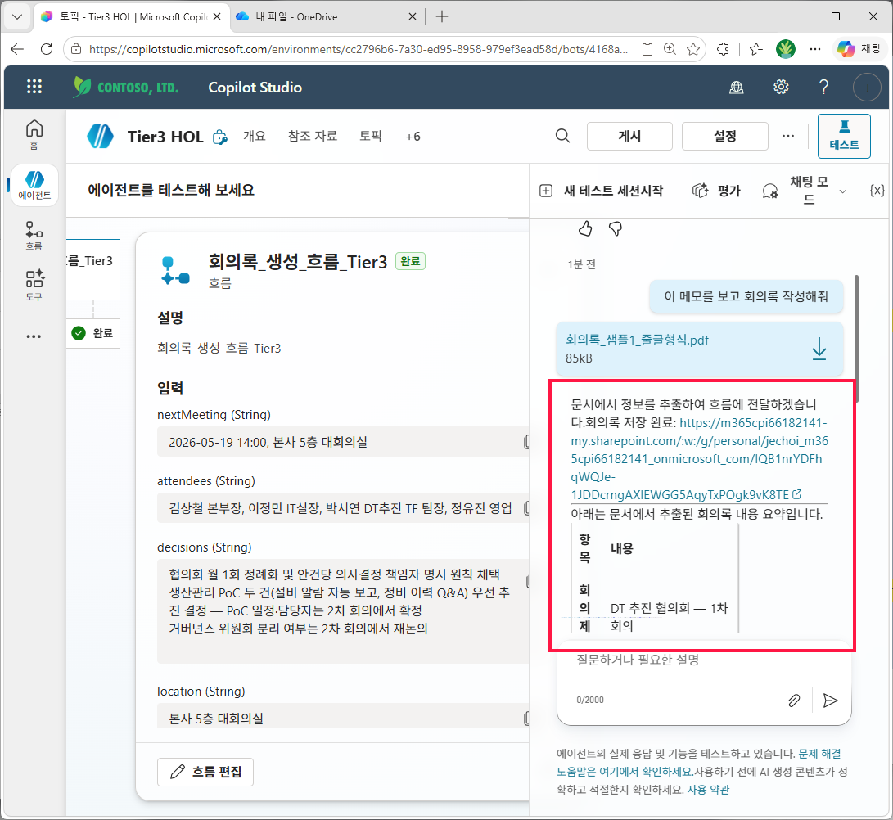

OneDrive 의 **내 파일** 에서 새 파일 (예: `템플릿회의록_2026-05-10T...docx`) 확인:

**④ OneDrive 에 새 .docx 생성 확인**

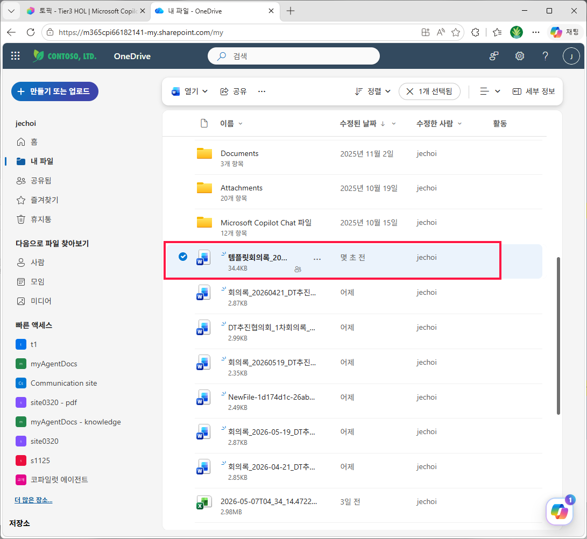

Word Online 으로 열어 1 페이지 — 회의 제목·일시·장소·참석자·안건·결정 사항이 모두 정확히 들어갔는지 확인:

**⑤ Word 1페이지 — 기본 정보·참석자·안건·결정 사항**

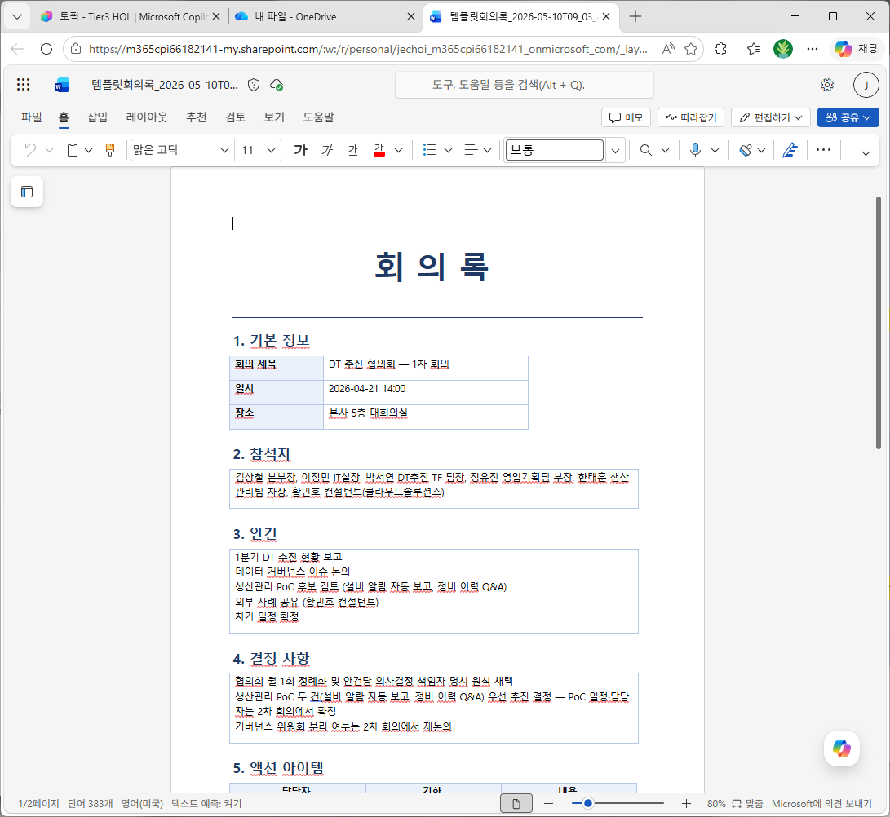

2 페이지 — **액션 아이템 표가 행 4 줄로 반복 출력** + 다음 회의 일정:

**⑥ Word 2페이지 — 액션 아이템 4행 (반복 섹션 정상) + 다음 회의**

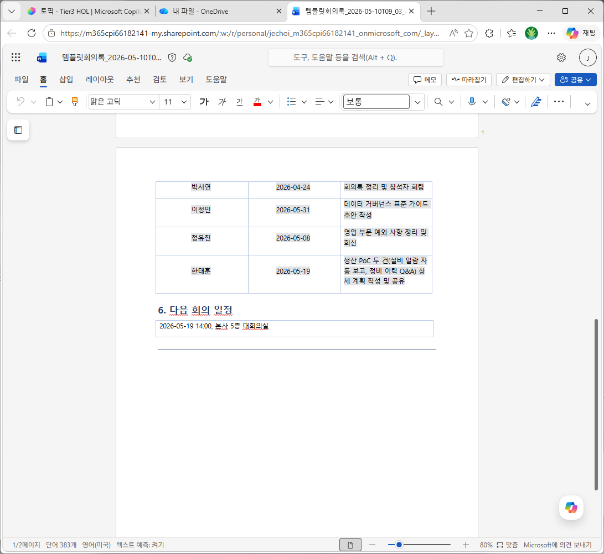

> **검증 포인트**: 액션 아이템이 PDF 의 항목 수만큼 모두 행으로 들어갔으면 반복 섹션 컨트롤 + 전체 배열 입력 모드 + Parse JSON 스키마가 모두 올바르게 연결된 것입니다. 한 줄만 나오면 Step 3-2 의 ActionItems 입력 모드를 다시 점검하세요.

## 완료 체크

- 흐름 입력 8개가 모두 텍스트로 생성됨
- `actionItemsJson` 이 Parse JSON 을 거쳐 배열 Body 로 인식됨
- Word 템플릿의 `ActionItems` 가 전체 배열 입력 모드로 전환됨
- 결과 Word 문서가 1개만 생성되고, 액션 아이템은 문서 안에서 여러 행으로 반복됨

---

## 결과 — 깔끔하게 분리됐다. 그런데 AI 빌더가 안 쓰였다

분리는 깔끔합니다. 회사 표준이 바뀌면 .docx 만 다시 디자인. 추출 로직이 바뀌면 지침만 수정. 책임이 명확합니다.

다만 — 이 세션의 본래 주제가 **AI 빌더** 였습니다. 그런데 Tier 3 까지 와도 AI 빌더는 한 번도 등장하지 않았습니다. **"AI 빌더의 진짜 강점은 어디서 쓰지?"** — 이 질문이 Tier 4 로 가는 동기입니다.

---

## 다음 페이지

[실습④ — Tier 4: AI 빌더 문서 출력](s01-4a-tier4-aibuilder)

<!-- build-trigger: 2026-05-11 -->
