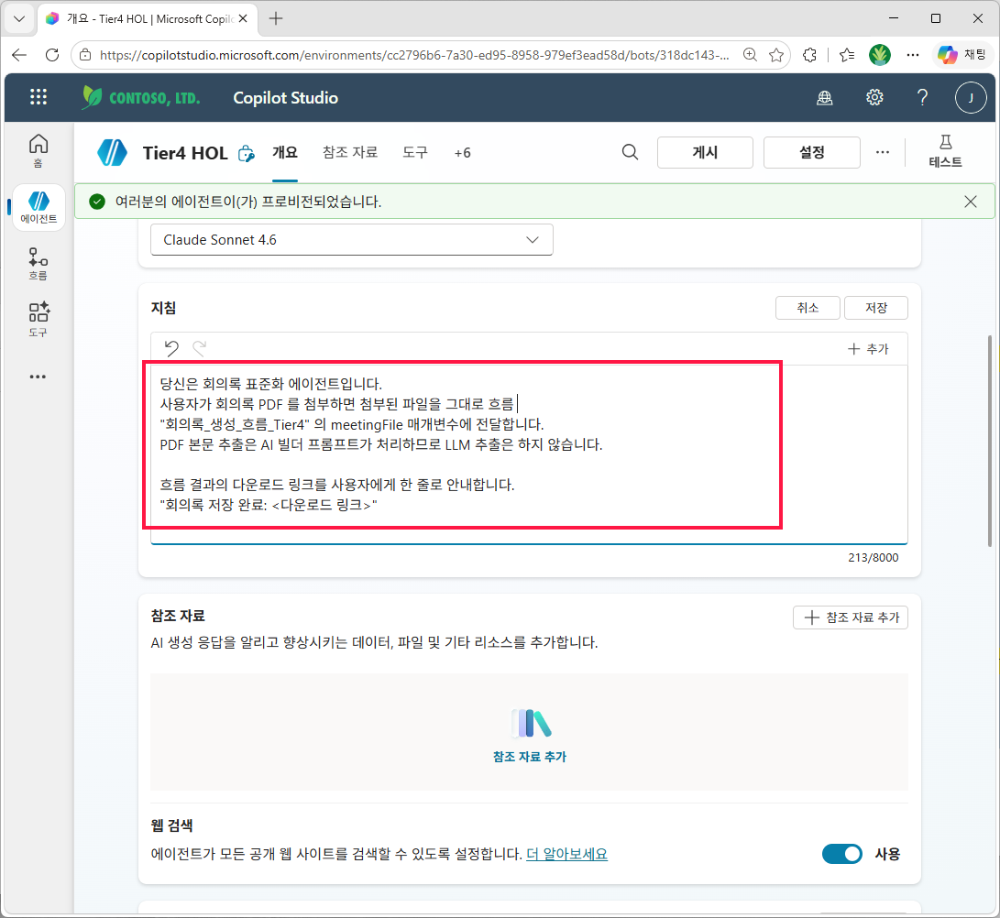

# 실습 ④: Tier 4 — 파일 → 흐름 → AI 빌더 프롬프트 (문서 출력)
{: .no_toc }

| 시간 | 소요 | 수강생 역할 |
|:-----|:-----|:-----------|
| 10:20 | 4분 | 🟡 따라보기 |

## 목차
{: .no_toc .text-delta }

1. TOC
{:toc}

---


## 핵심 아이디어

AI 빌더 프롬프트의 **"문서 출력 (Document output, 미리 보기)"** 기능을 사용합니다. 이 기능은:

- **입력**: 텍스트 또는 파일 (PDF · 이미지 등)
- **양식**: 미리 업로드한 Word 양식 (`{{필드명}}` 텍스트 플레이스홀더)
- **동작**: AI 가 입력에서 정보를 추출 + 양식의 `{{}}` 자리를 채움 (한 번의 호출)
- **출력**: `Document Output Content Bytes` (완성된 .docx 바이너리)

Tier 3 에서는 **에이전트가 추출 → 흐름이 채우기** 의 두 단계였는데, Tier 4 에서는 **흐름이 AI 빌더 프롬프트 한 번 호출하면** 추출+채우기가 동시에 일어납니다. 흐름이 더 단순해집니다.

```
[사용자] PDF 첨부 + "표준 회의록으로 만들어줘"
   ↓
[에이전트] 첨부 파일을 흐름에 그대로 넘김 (추출은 안 함)
   ↓
[흐름]  AI 빌더: 프롬프트 실행 (입력=파일, 양식=Word 템플릿)
        → OneDrive: 새 파일 만들기 (콘텐츠 = Document Output Content Bytes)
        → 공유 링크 반환
   ↓
[응답] 다운로드 링크 안내
```

> **참고 문서**: [Generate document output from a prompt — Microsoft Learn](https://learn.microsoft.com/en-us/microsoft-copilot-studio/generate-document-output-prompt)

---

## Step 4-1. Word 템플릿 — `회의록_템플릿_Tier4.docx`

{: .tip }
> 미리 만들어 둔 템플릿: [회의록_템플릿_Tier4.docx 다운로드](../assets/files/회의록_템플릿_Tier4.docx). Tier 3 와 호환되지 않으니 반드시 이 파일을 사용하세요.

**Tier 3 와 디자인은 같지만 자리표시자 형식이 다릅니다.**

| | Tier 3 (Word Online 채우기) | Tier 4 (AI 빌더 문서 출력) |
|---|---|---|
| 자리표시자 형식 | **콘텐츠 컨트롤** (SDT, 태그 = 변수명) | **`{{필드명}}` 텍스트** |
| 반복 섹션 | 반복 섹션 컨트롤 | 표 셀에 `{{actionItems.owner}}` 형식 |

> 두 양식은 **호환되지 않습니다.** Tier 3 에 Tier 4 양식을 넣으면 빈 .docx 가 떨어지고, 그 반대도 마찬가지. 반드시 두 파일을 따로 둡니다.

직접 만들 때 순서 (Tier 4):

1. Word 데스크톱에서 새 문서 → V3 디자인으로 양식 작성
2. 각 자리에 **그냥 텍스트로** `{{title}}`, `{{meetingDate}}`, ... 입력 (콘텐츠 컨트롤 아님)
3. 액션 아이템 표는 한 행만 두고, 셀에 `{{actionItems.owner}}` `{{actionItems.dueDate}}` `{{actionItems.task}}` 입력
4. 저장 → 20MB 이하 (한도)

**① Word Online 에서 양식 내용 확인 — `{{}}` 가 그냥 텍스트로 박혀 있어야 함**


---

## Step 4-2. AI 빌더 프롬프트 — `회의록_표준화_프롬프트`

1. Power Apps · Power Automate 화면 좌측 **AI 허브 → 프롬프트 → 새 프롬프트**
2. 프롬프트 본문 입력:
   ```
   첨부된 회의록 PDF 에서 정보를 추출해 회의록 양식을 채워주세요.
   - 원본에 없는 정보는 추측하지 말고 빈 칸으로 두세요.
   - 일시는 "YYYY-MM-DD HH:mm" 형식으로 정리.
   - 액션 아이템은 담당자/기한/내용으로 분리.
   ```
3. **입력 추가** → 종류: **파일** → 이름: `meetingFile`
4. **출력 형식** → **문서 (Document)** 선택
5. **양식 업로드** → Step 4-1 의 `회의록_템플릿_Tier4.docx` 업로드
6. **테스트** 탭에서 회의록 PDF 한 번 올려 동작 확인 → 저장

> **제약**: 솔루션 이동 시 양식 재업로드 필요. 5MB 이상 양식은 저장-재오픈 후에야 테스트 가능.

{: .tip }
> 프롬프트는 AI 허브에서 별도로 만들어도 되지만, **흐름의 `프롬프트 실행` 액션 매개 변수 드롭다운에서 `+ 새 사용자 지정 프롬프트`** 를 눌러 그 자리에서 만들어도 됩니다. 아래 캡처는 흐름 안에서 만든 경로입니다.

**① 새 프롬프트 편집기 열기**


**② 이름·모델 설정**


**① 빈 편집기 레이아웃 확인**


**② 추출 규칙 지침 + `문서 입력` 변수 추가**


**① 출력 형식 `텍스트` → `문서`**


**② `문서 설정` 패널 열기**


**③ Tier 4 양식 업로드 → 필드 자동 인식 확인**


**① 샘플 PDF 올리고 `테스트` 실행**


**② 출력 검증 — .docx 다운로드 + 필드 치환 확인**


**③ `저장` 으로 프롬프트 확정**


---

## Step 4-3. Power Automate 흐름 — `meetingnote_AI`

흐름은 최종적으로 **5개 노드** 로 구성됩니다: 트리거 → 프롬프트 실행 → OneDrive 파일 만들기 → OneDrive 공유 링크 만들기 → 에이전트에게 응답. 시작·끝 노드 먼저 놓고 중간에 차례로 끼워 넣는 순서로 진행합니다.

### 1) 흐름 생성 · 트리거 선택 · 응답 노드 자리 잡기

Copilot Studio 좌측 메뉴의 에이전트 흐름 목록에서 새 흐름을 시작하고, 트리거는 에이전트 호출에 맞춘 V2 트리거를 고릅니다. 마지막에 놓을 응답 노드(`에이전트에게 응답`)를 먼저 올려두고, 중간의 ⊕ 를 활용해 프롬프트·파일 저장·링크 액션을 차례로 끼워 넣을 계획입니다.

**① 새 에이전트 흐름 만들기**


**② 트리거 `에이전트가 흐름을 호출할 때` 선택**


**③ 빈 캔버스 — ⊕ 로 첫 작업 추가**


**④ 마지막 응답 노드(`에이전트에게 응답`) 먼저 자리 잡기**


### 2) `프롬프트 실행` 액션 끼워 넣기

트리거와 응답 노드 사이의 ⊕ 를 눌러 **AI 기능 → 프롬프트 실행** 을 넣습니다. 이 액션이 Step 4-2 에서 만든 `meetingnote_AI` 프롬프트를 호출해 "추출 + 양식 채우기" 를 **한 번에** 처리합니다.

**① 트리거-응답 사이의 ⊕ 클릭**


**② `AI 기능 → 프롬프트 실행` 선택**


### 3) 트리거 입력 `meetingfile` 정의

프롬프트에 넘겨줄 파일을 에이전트로부터 받기 위해 트리거 노드를 다시 열고 **입력 추가** 로 `meetingfile` 파일 매개변수를 만듭니다. 타입은 `파일 또는 이미지`.

**① 트리거 노드 다시 열기**


**② 입력 `meetingfile` (파일 또는 이미지) 추가**


### 4) `프롬프트 실행` 매개 변수 연결

프롬프트 실행 노드를 열고 `meetingnote_AI` 선택, `문서 입력` 칸에는 트리거의 `meetingfile contentBytes` 동적 콘텐츠를 넘겨줍니다.

**① 프롬프트 실행 노드 클릭**


**② 프롬프트 `meetingnote_AI` + `문서 입력` ← `meetingfile contentBytes`**


**③ 매개 변수 연결 완성**


### 5) OneDrive `파일 만들기` 추가

프롬프트의 `Document Output Content Bytes` 가 완성된 .docx 바이너리입니다. 이걸 OneDrive 에 저장하는 게 다음 단계. 프롬프트 실행과 응답 노드 사이 ⊕ 에 `파일 만들기` 액션을 끼워 넣습니다.

**① 프롬프트 실행-응답 사이 ⊕**


**② `파일 만들기` (비즈니스용 OneDrive) 선택**


**③ `파일 콘텐츠` ← `Document Output Content Bytes`**


**④ 폴더·파일 이름·콘텐츠 세 필드 완성**


### 6) `공유 링크 만들기` 추가

저장된 파일의 공유 가능한 URL 을 받아서 에이전트 응답에 넘길 차례. 다시 ⊕ 로 다음 액션을 끼워 넣습니다.

**① 파일 만들기-응답 사이 ⊕**


**② `공유 링크 만들기` (비즈니스용 OneDrive) 선택**


**③ `파일` ← 파일 만들기 액션의 `ID`**


**④ 링크 유형 `Edit` · 범위 `Anonymous` 로 완성**


### 7) 응답 노드 출력 연결 · 게시 · 흐름 이름 저장

마지막으로 `에이전트에게 응답` 노드에 출력 2개를 매답니다 — 파일 이름과 공유 링크. 이걸 연결하기 전에는 응답 노드에 `⚠ 잘못된 매개 변수` 경고가 떠 있습니다.

**① 응답 노드의 `⚠ 잘못된 매개 변수` 경고**


**② 출력 `파일이름` · `파일링크` 두 개 추가**


경고가 사라지면 5개 노드가 모두 그린 체크 상태로 돌아옵니다. 게시 후 흐름 이름을 `meetingnote_AI` 로 확정합니다.

**③ 5개 노드 완성 → `게시`**


**④ 흐름 이름 `meetingnote_AI` 로 저장**


---

## Step 4-4. 에이전트에 도구 등록 · 지침 작성

이제 흐름을 에이전트에서 부를 수 있게 도구로 등록하고, 언제 어떻게 호출할지는 지침으로 알려줍니다.

### 1) 도구 추가 · 입력 조사 · 저장

에이전트 `Tier4 HOL` 의 도구 탭에서 조금 전 만들어 저장한 `meetingnote_AI` 흐름을 골라 추가하고, 입력은 흐름 트리거와 맞추어 `contentBytes (File)` · `name (String)` 을 조사합니다.

**① 도구 탭 빈 상태에서 `+ 도구 추가`**


**② `흐름` 탭 → `meetingnote_AI` 선택**


**③ `추가 및 구성` 클릭**


**④ 입력 `contentBytes (File)` · `name (String)` 추가**


**⑤ `AI로 동적으로 채우기` 확인 후 `저장`**


### 2) 지침 편집 — 도구를 직접 언급해라

에이전트가 PDF 를 보면 "내가 추출하지 말고 `meetingnote_AI` 흐름에 파일 그대로 넘겨라" 고 명시적으로 알려주는 게 해심입니다. 아래 코드 블록 의 지침을 그대로 붙여넣고, 중간의 `흐름 ` 다음에는 `/` 를 입력해 제안 패널에서 `meetingnote_AI` 도구를 직접 링크합니다.

```
당신은 회의록 표준화 에이전트입니다.
사용자가 회의록 PDF 를 첨부하면 첨부된 파일을 그대로 흐름 /meetingnote_AI 의 meetingFile 매개변수에 전달합니다.
PDF 본문 추출은 AI 빌더 프롬프트가 처리하므로 LLM 추출은 하지 않습니다.

흐름 결과의 다운로드 링크를 사용자에게 한 줄로 안내합니다.
"회의록 저장 완료: <다운로드 링크>"
```

> **포인트**: 추출 책임이 LLM(에이전트) 에서 **AI 빌더 프롬프트** 로 옮겨졌습니다. 같은 프롬프트를 다른 부서·다른 흐름에서도 재사용할 수 있는 추출 자산이 됩니다.

**① 지침 섹션 `✏ 편집` 클릭**


**② 지침 본문 붙여넣기 (213/8000 글자)**



**③ `흐름 ` + `/` 로 도구 자동 완성 → `meetingnote_AI` 선택**


**④ 도구 칩 삽입 확인 후 `저장`**


---

## Step 4-5. 에이전트 테스트 — 샘플 PDF 올리고 다운로드 링크 받기

우측 상단 `테스트` 패널 열기 → 새 테스트 세션 시작 → 샘플 PDF 파일을 첨부하고 `이 파일로 회의록 만들어요` 메시지로 실행합니다.

**① 새 테스트 세션 → 메시지 + 샘플 PDF 첨부**


**② OneDrive for Business 자격 증명 `허용`**


**③ 흐름 실행 완료 — 채팅에 다운로드 링크 응답**


**④ OneDrive `내 파일` 에서 새 .docx 확인**


**⑤ Word Online 으로 결과 열기 — 모든 필드 채워진 회의록**


> **검증 포인트**: AI 빌더 프롬프트가 PDF 추출 + Word 양식 채우기를 한 번에 처리해 OneDrive 에 저장되었습니다. Tier 3 (에이전트 추출 + 흐름 채우기 두 단계) 와 비교하면 흐름이 단순해지고, 같은 프롬프트를 다른 흐름·다른 부서에서도 그대로 재사용할 수 있는 **추출 자산** 으로 분리됩니다.

---

## 결과 — AI 빌더가 진짜 일을 한다

이제 AI 빌더 프롬프트가 추출+채우기를 한 번에 처리합니다. 부수 효과:

- 프롬프트가 **추출 자산** 으로 독립 — 다른 흐름·다른 부서에서도 재사용
- 양식 변경 시 .docx 만 다시 업로드
- 흐름이 단순해짐 (AI 빌더 한 번 호출 + OneDrive 저장)

이걸로 이 세션의 4-Tier 진화가 마무리됩니다 — Tier 1 의 5분 빌트인 경로부터 Tier 4 의 AI 빌더 추출 자산까지, 같은 시나리오에 적용 가능한 4 가지 패턴을 손에 쥐었습니다.

---

## 다음 페이지

[실습 1 본 페이지로 돌아가기](s01-pdf-word)
