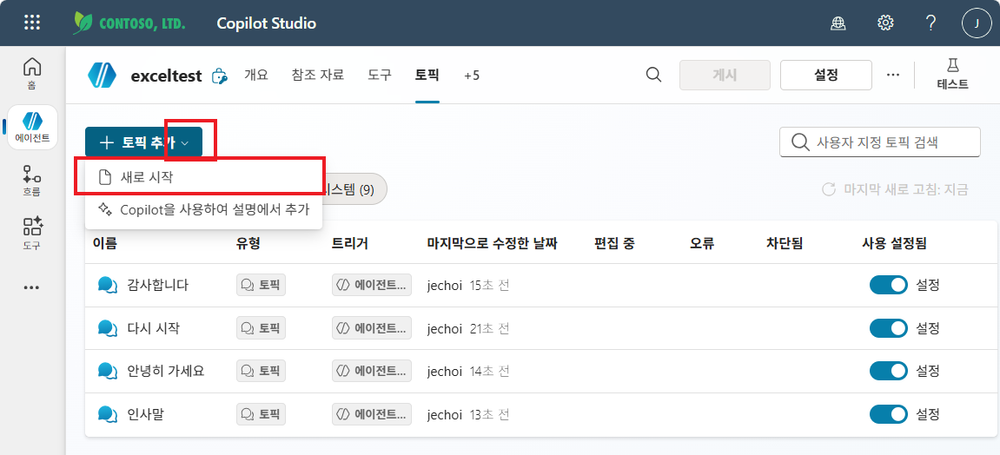
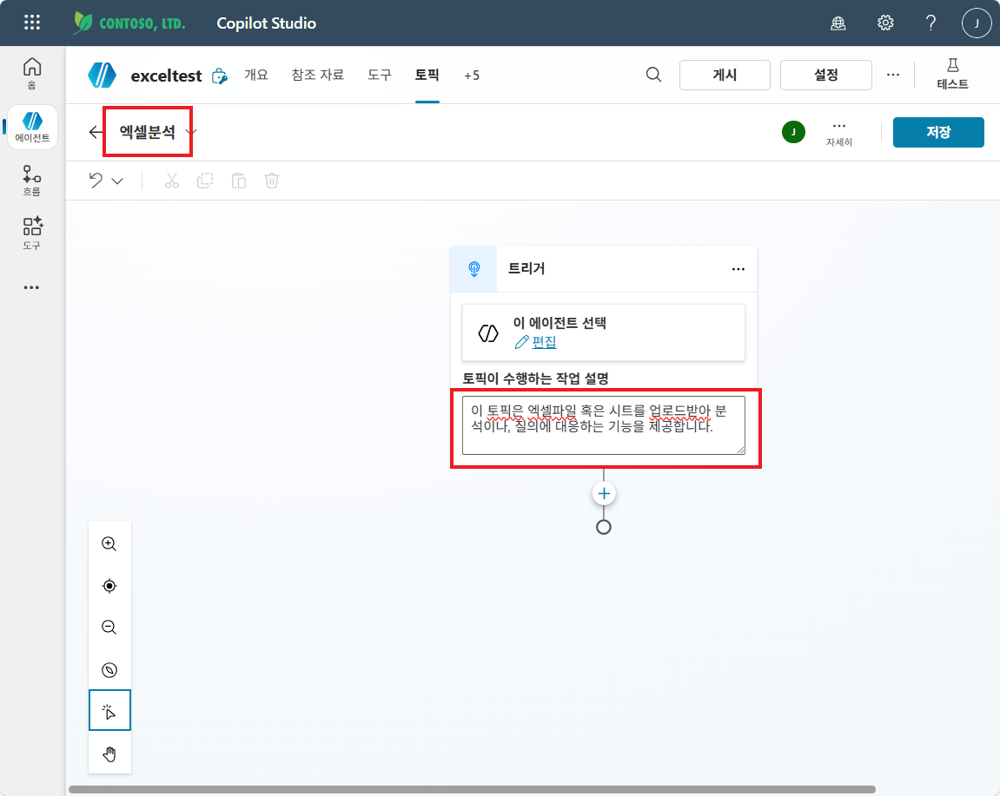
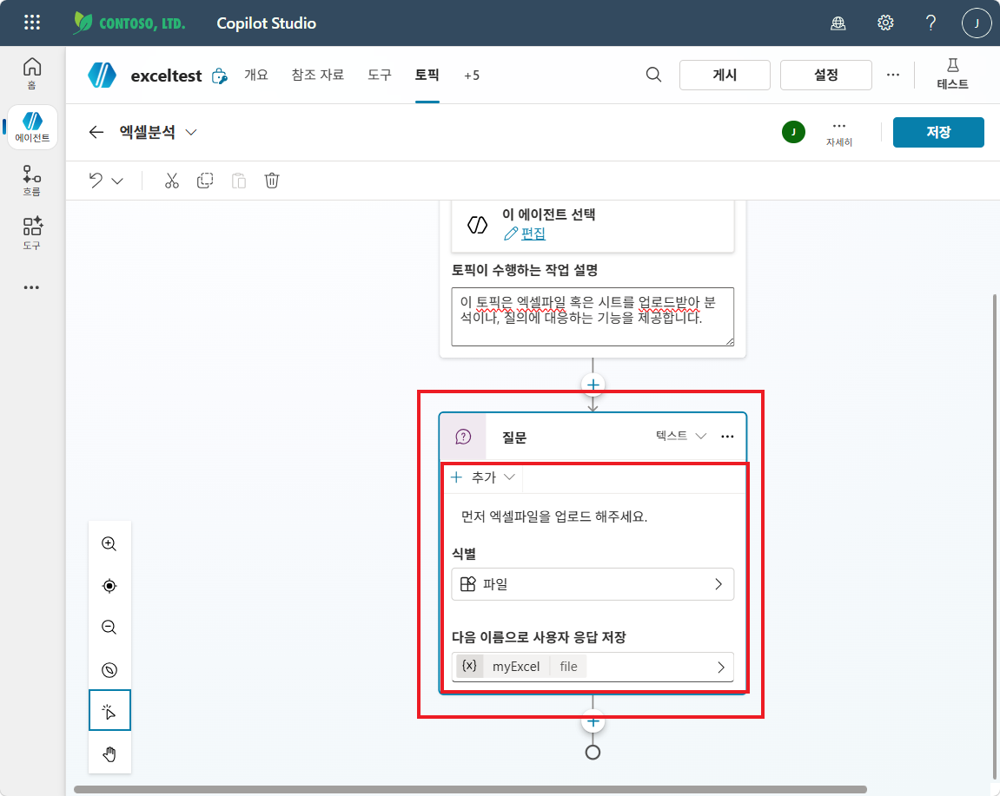
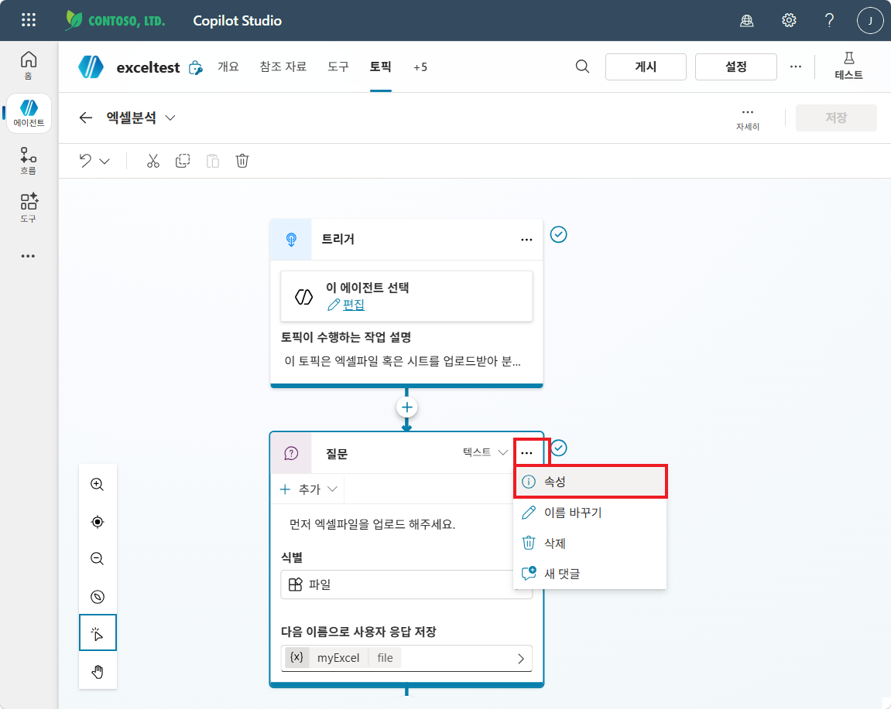
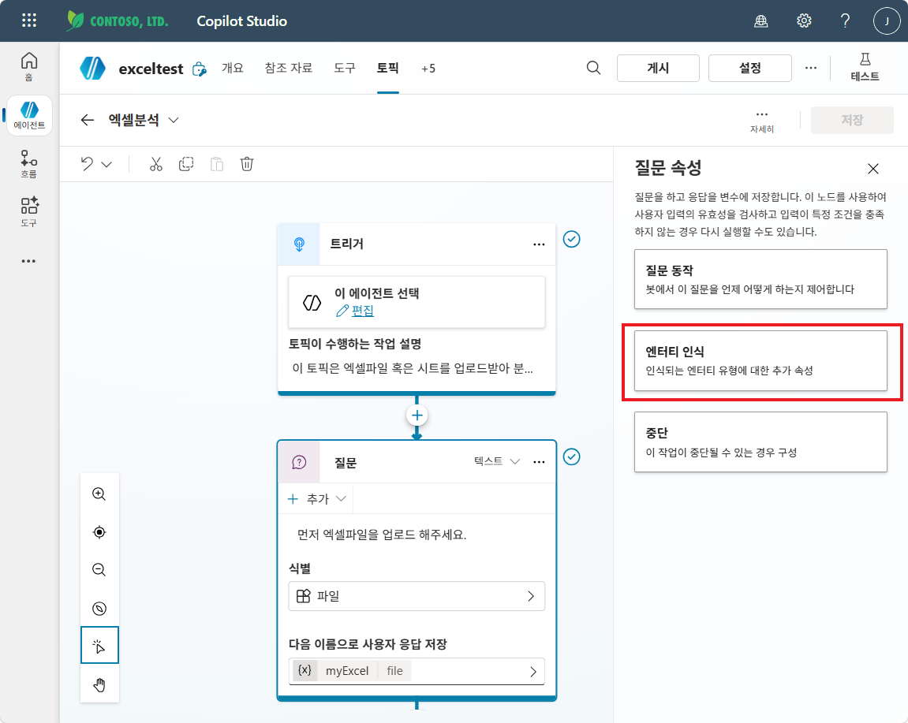
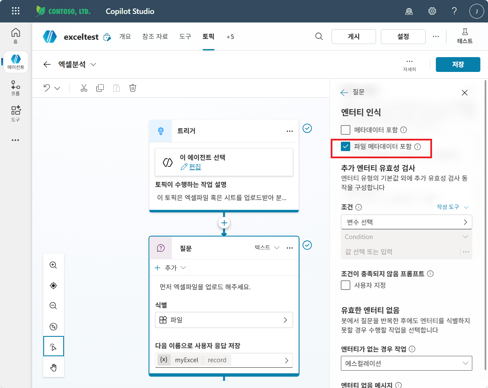
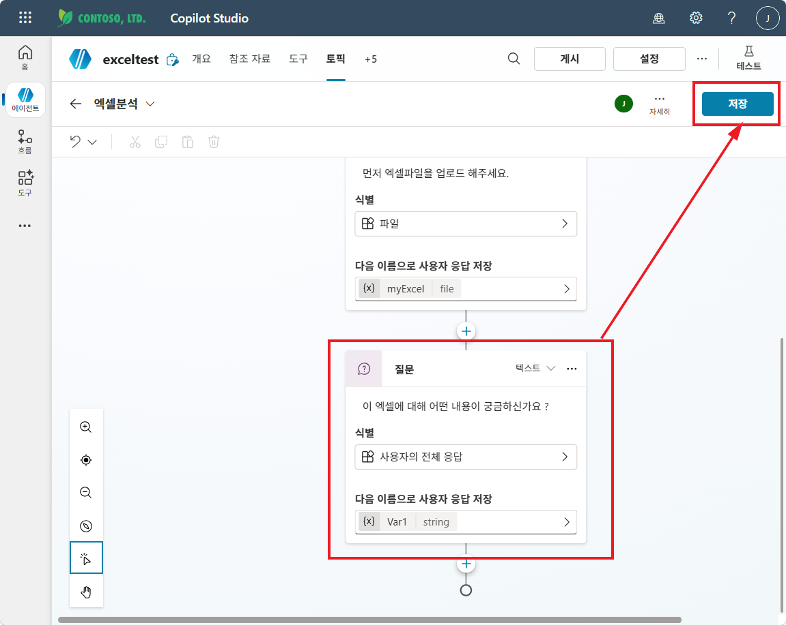
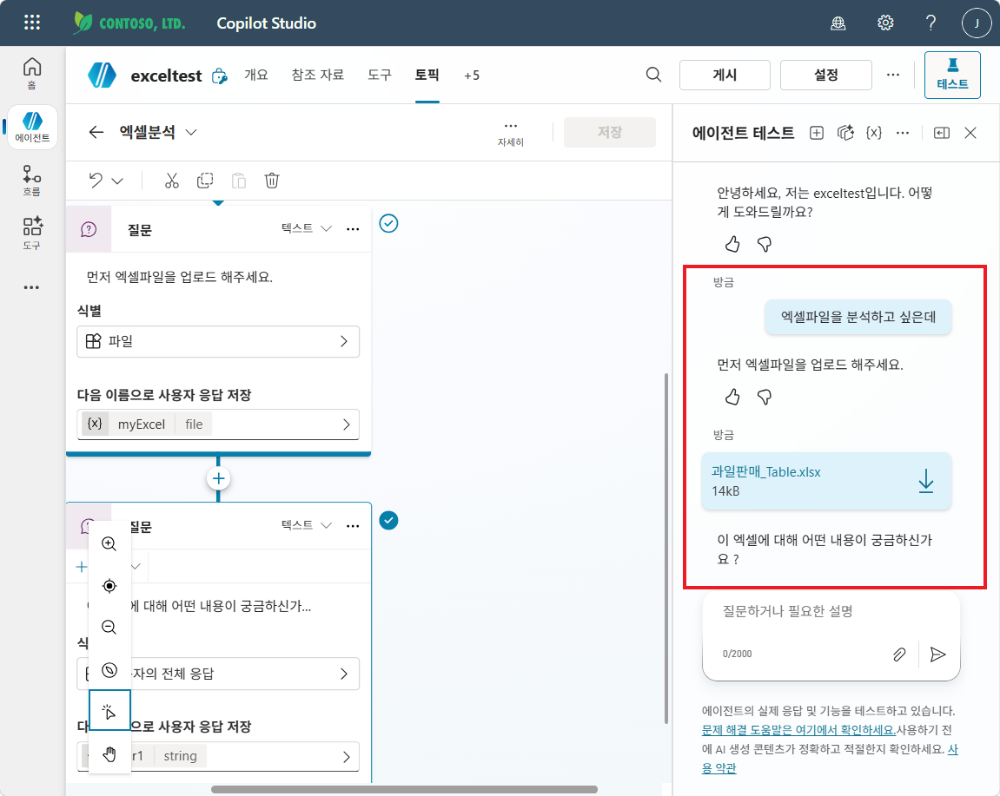
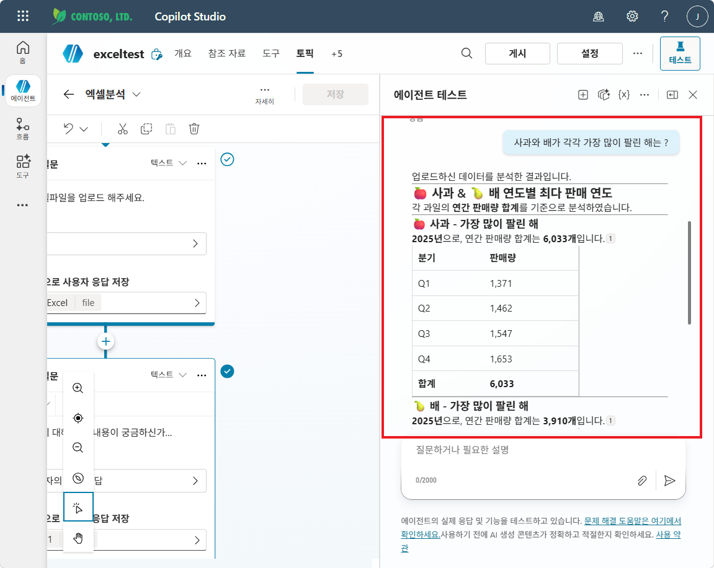

# 실습 ①: 질문 노드 + Excel Table = 끝
{: .no_toc }

| 시간 | 소요 | 수강생 역할 |
|:-----|:-----|:-----------|
| 10:24 | 12분 | 🟡 따라보기 |

이번 실습은 **흐름도, Office Script도, AI 프롬프트도 사용하지 않습니다.** 단지 토픽 안에 질문 노드를 두어 파일을 받기만 하고, 그 다음은 오케스트레이터에게 맡깁니다. 두 개의 Excel 파일을 차례로 첨부해 답변이 어떻게 달라지는지 직접 확인합니다.

## 목차
{: .no_toc .text-delta }

1. TOC
{:toc}

---

## Step 1. 두 샘플 파일 확보

- [과일판매_Table.xlsx](../assets/files/과일판매_Table.xlsx) — **Excel Table 적용** (`FruitSales`, `A1:D193`)
- [과일판매_raw.xlsx](../assets/files/과일판매_raw.xlsx) — **단순 셀** (테이블 미적용)

두 파일은 데이터가 **완전히 동일** 합니다. 차이는 오직 "Excel Table로 등록됐는가" 하나뿐입니다. 이 차이가 답변 품질을 가르는지 직접 확인해봅니다.

> **💡 Ctrl+T 한 번의 위력**: raw 파일을 열어 데이터 영역(A1:D193) 선택 → Ctrl+T → "머리글 포함" → 확인. 외형은 거의 바뀌지 않지만, LLM이 이 파일을 보는 시야는 완전히 달라집니다.

---

## Step 2. 에이전트 + 토픽 만들기

1. [copilotstudio.microsoft.com](https://copilotstudio.microsoft.com) 접속
2. 새 에이전트: `엑셀 분석 에이전트` (기존 학습용 에이전트를 재사용해도 무방. 예시 캡처는 `exceltest` 에이전트)
3. **토픽** 탭 → **+ 토픽 추가** → **새로 시작**

   

4. 토픽 이름: `엑셀분석`
5. 트리거의 **토픽이 수행하는 작업 설명** 에 다음 내용을 입력합니다 (오케스트레이터가 트리거 구문 없이도 토픽을 호출하는 데 사용).

   > 이 토픽은 엑셀파일 혹은 시트를 업로드받아 분석이나, 질의에 대응하는 기능을 제공합니다.

   

> **포인트**: 작업 설명만 잘 적어두면 별도의 트리거 구문 없이도 "엑셀 분석하고 싶어요", "이 시트 좀 봐줘" 같은 다양한 표현이 자동으로 이 토픽을 호출합니다. 트리거 구문은 보강 용도로만 두면 충분합니다.

---

## Step 3. 질문 노드 ① — 파일 받기 (메타데이터 활성화 ⭐)

1. 트리거 아래 **+** → **질문 (Question)** 노드 추가
2. 메시지: `먼저 엑셀파일을 업로드 해주세요.`
3. 식별 (Identify): **파일** (File)
4. 다음 이름으로 사용자 응답 저장: `myExcel`

   

5. 질문 노드 우측 상단 **`…` → 속성** 클릭

   

6. 질문 속성 패널에서 **엔터티 인식** 클릭

   

7. **파일 메타데이터 포함** 을 체크합니다.

   

> **포인트**: "파일 메타데이터 포함"을 켜야 파일의 콘텐츠/이름/MIME 타입이 변수에 들어오고, **오케스트레이터가 동일 대화 컨텍스트 안에서 이 파일을 참조** 할 수 있게 됩니다. 본 실습에서 흐름으로 전달하진 않지만, 실습 ②에서 이 토픽을 그대로 확장할 때 다시 필요합니다.

---

## Step 4. 질문 노드 ② — 후속 질의 받기

질문 노드 ① 아래 **+** → **질문 (Question)** 노드를 한 번 더 추가합니다. 메시지 노드 대신 질문 노드를 쓰는 이유는, 사용자의 자연어 질의를 명시적으로 받아 대화 컨텍스트(첨부 파일 + 사용자 질문)를 한 번에 오케스트레이터로 넘기기 위함입니다.

- 메시지: `이 엑셀에 대해 어떤 내용이 궁금하신가요?`
- 식별 (Identify): **사용자의 전체 응답** (User's entire response)
- 다음 이름으로 사용자 응답 저장: `Var1`

설정 후 우측 상단 **저장** 을 누릅니다.

토픽 안에서 직접 분석하지 않고, **토픽 종료 후 사용자의 자연어 질의를 오케스트레이터에게 맡깁니다.** 토픽이 끝난 시점에 첨부 파일과 사용자 질문이 모두 컨텍스트에 남아 있고, Excel Table로 등록돼 있다면 오케스트레이터가 이를 데이터 소스로 인식합니다.

저장이 끝나면 **게시 (Publish)** 까지 진행합니다.

> **포인트**: "토픽 안에서 답변까지 다 하려 하지 말 것." 토픽은 **입구** 역할에만 충실하고, 답변은 오케스트레이터의 자연어 처리에 위임 — 이게 가장 적은 노력으로 가장 강력한 분석을 얻는 패턴입니다.

---

## Step 5. A/B 테스트 — 결정적인 비교

우측 **테스트** 패널에서 **새 대화 시작** 후 다음을 차례로 실행합니다.

### A. raw 파일 (테이블 미적용)

1. 입력: `엑셀파일을 분석하고 싶은데` (또는 `엑셀 분석`)
2. "먼저 엑셀파일을 업로드 해주세요." → **`과일판매_raw.xlsx`** 첨부
3. "이 엑셀에 대해 어떤 내용이 궁금하신가요?" → `사과의 연도별 평균 판매량을 알려줘`
4. 답변 관찰

> 예상 결과: "데이터를 확인할 수 없습니다" / 또는 데이터를 보지 않고 일반론만 나열 / 또는 컬럼명만 추측하고 숫자는 막연한 답변

### B. Table 파일 (테이블 적용) — **새 대화 시작**

1. 좌측 패널에서 **새 대화 시작** (이전 컨텍스트 초기화)
2. 입력: `엑셀파일을 분석하고 싶은데`
3. "먼저 엑셀파일을 업로드 해주세요." → **`과일판매_Table.xlsx`** 첨부
4. "이 엑셀에 대해 어떤 내용이 궁금하신가요?" 가 표시되는 것까지 확인

   

5. 이어서 자연어 질의: `사과와 배가 각각 가장 많이 팔린 해는?` (또는 `사과의 연도별 평균 판매량을 알려줘`)
6. 답변 관찰

   

> 예상 결과: 실제 192행 데이터를 근거로 한 정확한 연도/분기별 수치 (예: 사과 2025년 합계 6,033 / Q1 1,371 · Q2 1,462 · Q3 1,547 · Q4 1,653). 추가로 "사과 외에 배·감 데이터도 있다"는 식의 컨텍스트 인식까지.

### 더 던져볼 만한 후속 질문 (Table 파일에서)

- `가장 많이 팔린 과일 TOP 3는?`
- `2020년 판매량이 다른 해와 어떻게 다른가?`
- `사과의 Q3·Q4 vs Q1·Q2 평균을 비교해줘`
- `감은 언제부터 데이터에 등장하는가?`

---

## Step 6. 비교 정리 — 무엇이 달라졌나

| 항목 | raw 파일 | Table 파일 |
|:--|:--|:--|
| 첨부 자체 | 성공 | 성공 |
| 데이터 인식 | ❌ | ✅ |
| 자연어 분석 | ❌ / 일반론 | ✅ 정확한 수치 |
| 추가 흐름 필요 | — | **불필요** |

차이는 **단 하나** — 데이터 범위가 Excel Table로 정의돼 있는가. 별도 흐름·스크립트·AI 프롬프트 없이도 토픽 + 질문 노드만으로 가장 보편적이고 강력한 엑셀 분석 입구가 완성됩니다.

> **💡 현장 팁**: 실제 업무 엑셀을 다루기 전 "데이터 범위 선택 → Ctrl+T" 한 번이면 충분합니다. 이 한 동작이 LLM 분석 가능성을 결정적으로 바꿉니다. 업무 엑셀이 다듬어지지 않은 raw 상태라면, 사용자에게 "Table로 변환 후 업로드"를 안내하는 것이 흐름을 새로 짜는 것보다 훨씬 효율적입니다.

---

## 7. 알아두면 좋은 한계

이 실습으로 충분한 경우가 압도적으로 많지만, 다음 경우엔 한계가 있습니다.

- **데이터를 특정 조건으로 세부화해 분석하고 싶을 때** — 코드 없이도 OData 필터로 가능 → [실습 ② — 흐름 + 커넥터](s02-2-excel-connector)
- **결과를 이메일·Teams·SharePoint로 송출** 해야 하거나 후속 자동화가 필요 → [실습 ②](s02-2-excel-connector)
- **데이터가 매우 큰 경우** (5,000행 초과) 또는 컬럼 변환·피벗이 필요한 경우 → [실습 ③ — 흐름 + Office Script](s02-3-excel-flow-advanced)
- **반복적·결정적 리포트가 필요** → 실습 ② 또는 실습 ③

이런 경우는 [실습 ②](s02-2-excel-connector) 또는 [실습 ③](s02-3-excel-flow-advanced) 로 가서 흐름 패턴과 그 함정까지 함께 확인합니다.

<!-- build-trigger: 2026-05-13 s02-1 screenshots added -->
