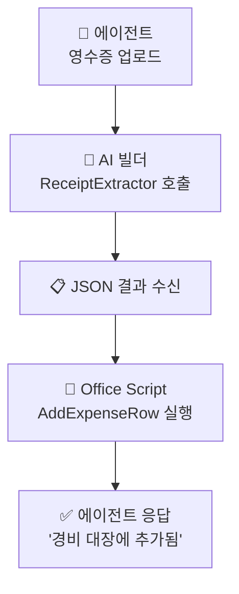

# 실습 ②: Office Script + Power Automate 흐름
{: .no_toc }

| 시간 | 소요 | 수강생 역할 |
|:-----|:-----|:-----------|
| 10:20 | 20분 | 🟢 직접 실습 |

## 목차
{: .no_toc .text-delta }

1. TOC
{:toc}

---

## 이 실습의 목표

- 실습 ①에서 만든 프롬프트의 **JSON 출력**을 받아
- **Office Script**로 Excel 경비 대장에 행을 추가하고
- **Power Automate 흐름**으로 에이전트 ↔ AI 빌더 ↔ Excel을 잇는다

---

## 1. Excel 경비 대장 준비

OneDrive 또는 SharePoint에 Excel 파일을 만들고, 다음 구조의 **테이블**(`ExpenseTable`)을 정의합니다.

| 날짜 | 가맹점 | 항목 | 금액 |
|:-----|:------|:-----|:-----|
| (빈칸) | (빈칸) | (빈칸) | (빈칸) |

{: .note }
> 머리글 한 줄을 만들고 **삽입 → 표**로 변환한 뒤 표 이름을 `ExpenseTable`로 지정하세요.

---

## 2. Office Script 작성

Excel Online → **자동화 → 새 스크립트**

```typescript
function main(
  workbook: ExcelScript.Workbook,
  receiptJson: string
): string {
  // 1. AI가 만든 JSON 파싱
  const r = JSON.parse(receiptJson) as {
    날짜: string;
    가맹점: string;
    항목: string;
    금액: number;
  };

  // 2. 경비 대장 테이블에 행 추가
  const table = workbook.getTable("ExpenseTable");
  table.addRow(-1, [r.날짜, r.가맹점, r.항목, r.금액]);

  // 3. 호출자에게 결과 반환
  return JSON.stringify({
    ok: true,
    addedRow: r,
  });
}
```

스크립트 이름: `AddExpenseRow`

---

## 3. Power Automate 흐름 만들기

Copilot Studio → 도구 → 흐름 → **새 에이전트 흐름**

### 트리거

| 항목 | 설정 |
|:-----|:-----|
| 트리거 | 에이전트에서 흐름 실행 |
| 입력 | `receiptImage` (파일 형식) |

### 액션 ① — AI 빌더 프롬프트 호출

| 항목 | 값 |
|:-----|:---|
| 액션 | AI 빌더 → **프롬프트 실행** |
| 프롬프트 | `ReceiptExtractor` |
| `receiptImage` | 트리거의 `receiptImage` |

출력: `Text` (프롬프트 결과 = JSON 문자열)

### 액션 ② — Office Script 실행

| 항목 | 값 |
|:-----|:---|
| 액션 | Excel Online (Business) → **스크립트 실행** |
| 위치 | 경비 대장 Excel 파일 |
| 스크립트 | `AddExpenseRow` |
| `receiptJson` | ① 단계의 `Text` 출력 |

### 액션 ③ — 에이전트에게 응답

| 항목 | 값 |
|:-----|:---|
| 액션 | 에이전트에게 응답 |
| `message` | `"경비 대장에 추가했습니다: " + r.가맹점 + " / " + r.금액 + "원"` |

---

## 4. 흐름 시각화



---

## 5. 에이전트에 도구로 등록

Copilot Studio → 에이전트 → **도구 → + 도구 추가 → 흐름**

| 항목 | 값 |
|:-----|:---|
| 도구 이름 | `RecordExpense` |
| 설명 | 영수증 이미지를 받아 경비 대장에 자동 기록합니다 |

지침에 한 줄 추가:

```
영수증 이미지가 첨부되면 RecordExpense 도구를 호출해서 경비 대장에 기록하세요.
```

---

## 6. 테스트

테스트 패널에서:

1. **영수증 사진을 끌어다 놓고** "이거 경비처리 해줘"
2. 흐름이 실행되며 AI 빌더 → Excel 행 추가까지 진행
3. Excel 파일을 열어 마지막 행에 데이터가 들어왔는지 확인

| 발화 | 기대 동작 |
|:-----|:---------|
| 사진 첨부 + "경비처리" | 행 추가 → "경비 대장에 추가했습니다…" |
| 사진 없이 "경비처리" | 에이전트가 사진 요청 |

---

## 자주 나오는 문제

| 증상 | 원인 | 대응 |
|:-----|:-----|:-----|
| `JSON.parse` 에러 | 프롬프트가 JSON 외 텍스트도 출력 | 실습 ①의 프롬프트 본문 점검 |
| `addRow` 에러 | 테이블 이름·컬럼 수 불일치 | `ExpenseTable` 이름·4열 확인 |
| 도구가 채택되지 않음 | 도구 설명 또는 지침이 모호 | 지침에 "영수증 이미지가 첨부되면…" 추가 |

---

## 체크리스트

- [ ] Excel `ExpenseTable` 테이블 준비
- [ ] `AddExpenseRow` Office Script 작성
- [ ] AI 빌더 → Office Script로 잇는 흐름 완성
- [ ] 에이전트에 `RecordExpense` 도구 등록
- [ ] 영수증 사진 한 장으로 끝까지 동작 확인

---

## 정리 — 두 실습 합치면

| 실습 | 학습 포인트 |
|:----|:---------|
| ① | AI 빌더 멀티모달 프롬프트 = **이미지를 정형 JSON으로 변환하는 “눈”** |
| ② | Office Script + 흐름 = **JSON을 다른 시스템(Excel)에 흘려보내는 “손”** |

> 같은 패턴(이미지 → JSON → 다른 시스템)을 명함·청구서·송장 등에 그대로 응용할 수 있습니다.

---

다음 모듈: [S3. PDF → Word](s03-pdf-word)
