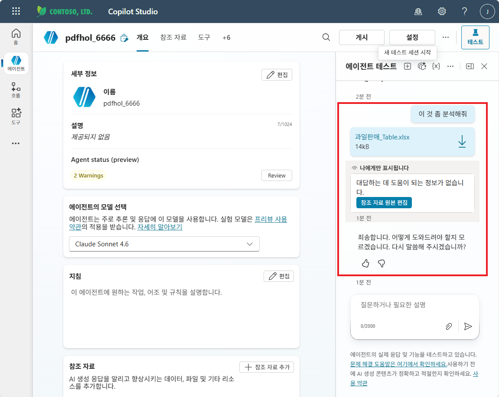

# S2. 엑셀 업로드 활용 실습 — 질문 노드의 힘과 흐름의 함정
{: .no_toc }

| 시간 | 소요 | 수강생 역할 |
|:-----|:-----|:-----------|
| 10:20 | 40분 | 🟡 따라보기 |

## 목차
{: .no_toc .text-delta }

1. TOC
{:toc}

---

## 1. 일상의 관찰 — PDF는 되는데 Excel은 안 된다

Copilot Studio 에이전트는 흥미롭게도 **채팅창에 첨부된 PDF·Word·이미지 같은 일반 문서는 오케스트레이터가 알아서 받아 잘 처리**합니다. 별도 토픽이나 흐름 없이도 "이거 요약해줘"라고만 하면 동작합니다. 이 흐름은 앞 세션 [S1 — 문서 업로드 활용 실습](s01-pdf-word) 에서 본격적으로 정교하게 다뤘습니다.

그런데 자연스러운 다음 질문은 이것입니다.

> "그럼 Excel은? 엑셀도 채팅에 그냥 첨부하면 되지 않을까?"

직접 해봅시다. 같은 에이전트에 `과일판매_Table.xlsx`를 첨부하고 "이 데이터 좀 분석해줘"라고 입력해 보세요.

> 사용자: *(과일판매_Table.xlsx 첨부)* "이 데이터 좀 분석해줘"
>
> 에이전트: 첨부하신 파일의 내용을 확인할 수 없습니다. / (또는 데이터를 보지 않고 일반론만 늘어놓음)

**안 됩니다.** 같은 채팅창인데 PDF는 되고 Excel은 안 됩니다. 왜 그럴까요?

---

## 2. 왜 Excel은 다른가 — 두 가지 벽

### 벽 ①: 오케스트레이터가 받지 않는다

현재 시점 기준으로 **Excel 파일은 오케스트레이터의 기본 처리 대상에서 빠져 있습니다.** PDF·Word·이미지처럼 자동으로 텍스트 추출이 일어나지 않아, 첨부 자체는 받지만 내용은 보지 못합니다.

### 벽 ②: 우회로마저 채널마다 다르다

"코드로 직접 첨부 파일을 끄집어내면 되지 않을까?" 라는 우회로도 있습니다 (`System.Attachments.Table` 등). 그런데 여기서 두 번째 문제가 등장합니다.

| 환경 | 첨부 파일 처리 방식 |
|:--|:--|
| Microsoft Teams | `System.Attachments`에 파일 메타가 들어옴 — 코드로 접근 가능 |
| Microsoft 365 Copilot · 그 외 채널 | `System.Attachments`에 들어오지 **않음** |

Teams 한쪽만 동작하는 우회로를 짤 수는 있지만, **양쪽 채널에서 동일하게 동작하는 것을 보장하기는 어렵습니다.** 그래서 활용성이 떨어집니다.

---

## 3. 답은 의외로 단순했다 — 질문 노드 + Excel Table

세션 1에서는 오케스트레이터에게 "알아서 처리해줘"라고 맡겼지만, 엑셀에는 통하지 않습니다. 그래서 우리가 **토픽으로 직접 받는 길**로 갑니다. 그런데 막상 해보면 더 놀라운 사실 하나를 만나게 됩니다.

> **Excel 파일이 "Table" 형식으로 저장돼 있기만 하면, 질문 노드로 받은 직후의 자연어 질의를 오케스트레이터가 그대로 분석한다.** 추가 흐름·스크립트·AI 프롬프트가 없어도.

즉, 진짜 핵심은 **두 가지** 뿐입니다.

1. **질문 노드(파일)** — 모든 채널에서 동일하게 동작하는 입구
2. **엑셀이 Table 형식** — 시트 안에 Ctrl+T로 정의된 표

이 두 조건이 충족되면 별도 흐름 없이도 후속 자연어 질의를 오케스트레이터가 처리합니다.

---

## 4. 그래도 흐름이 필요한 순간 — 솔직한 비교

물론 더 정교한 시나리오에는 흐름이 필요합니다. 다만 "엑셀 = 무조건 흐름"이라는 통념은 **사실이 아닙니다.** 흐름 패턴은 다음 경우에 진가를 발휘하고, 그 안에서도 **코드 없는 길로 충분한 경우가 많습니다.**

| 시나리오 | 실습 ① 질문 노드 단독 | 실습 ② 흐름+커넥터 | 실습 ③ 흐름+Office Script |
|:--|:--|:--|:--|
| 일회성 자연어 분석 | ✅ 충분 | 과도 | 과도 |
| 엑셀 이메일·Teams 송출 필요 | ❌ | ✅ | ✅ |
| 읽을 데이터를 단순 조건으로 세부화 | ❌ | ✅ OData $filter | ✅ 스크립트로 |
| 5,000행 이상·컴럼 변환·피벗 | ❌ | ❌ 커넥터 한계 | ✅ Office Script |
| 반복적·결정적 월간 리포트 | △ | ✅ | ✅ |

흐름 패턴에도 **함정**이 있습니다 — AI 프롬프트의 코드 인터프리터는 데이터 구조를 자세히 설명해주지 않으면 자주 실패하고, 모델·요청에 따라 끄는 게 오히려 답변이 깔끔한 경우도 있습니다. 이 부분은 실습 ②·③ 에서 정직하게 확인합니다.

---

## 5. 완성된 모습 (세 가지 시나리오)

### 시나리오 A — 실습 ①의 결과

> 사용자: "엑셀 분석"
>
> 에이전트: 분석할 Excel 파일을 첨부해주세요.
>
> 사용자: *(과일판매_Table.xlsx 첨부)*
>
> 에이전트: 파일을 받았습니다. 무엇을 분석해드릴까요?
>
> 사용자: "사과의 연도별 평균 판매량은?"
>
> 에이전트: *(오케스트레이터가 첨부 파일을 직접 분석)* 사과의 연도별 평균 판매량은 2023년 1,250개, 2024년 1,420개, 2025년 1,510개입니다. 2024→2025년 증가율은 6.3%입니다.

### 시나리오 B — 실습 ②의 결과

같은 입력이되, 흐름 안에서 **테이블 행 가져오기**가 OData 필터 `연도 ge 2024` 로 데이터를 미리 좁힌 후 AI 프롬프트가 분석. **코드 없이** 토큰을 절약하고, 마지막에 Teams·이메일로 송출하는 파이프라인을 쉽게 붙일 수 있습니다.

### 시나리오 C — 실습 ③의 결과

같은 결과이되, 흐름 안에서 Office Script로 시트를 JSON으로 변환하고 AI 프롬프트가 코드 인터프리터로 계산. **컰럼 변환·피벗·큰 데이터** 에 강합니다.

---

## 6. 본 세션의 세 실습

| 페이지 | 다루는 단계 | 한 줄 요약 |
|:---|:---|:---|
| [실습① — 질문 노드만으로 (메인)](s02-1-excel-question) | 토픽 + 질문 노드(파일) + A/B 체험 | **Table** 에셀 / **raw** 에셀 두 파일을 같은 토픽에 넣고 답변 품질 차이를 직접 확인 |
| [실습② — 흐름 + 커넥터 (코드 없이)](s02-2-excel-connector) | 흐름 + 테이블 행 가져오기 + OData 필터 + AI 프롬프트 | Office Script 없이도 코드 한 줄 안 쓰고 데이터 슬라이싱이 가능해짐 |
| [실습③ — 흐름 + Office Script (심화·선택)](s02-3-excel-flow-advanced) | 흐름 + Office Script + AI 프롬프트 | 커넥터 한계(5,000행, 단순 필터)를 넘는 시나리오 + 코드 인터프리터 ON/OFF 가이드 |

> **시간 배분 (40분)**: 도입 4 / 실습① 12 / 실습② 12 / 실습③ 10 (시간 부족 시 데모 위주) / 마무리 2

---

## 7. 사전 준비 — 두 가지 샘플 Excel

| 파일 | 형식 | 용도 |
|:--|:--|:--|
| [과일판매_Table.xlsx](../assets/files/과일판매_Table.xlsx) | Excel **Table** 적용 (`FruitSales`) | 실습 ① "되는" 케이스 |
| [과일판매_raw.xlsx](../assets/files/과일판매_raw.xlsx) | 단순 셀 데이터 (테이블 없음) | 실습 ① "안 되는" 케이스 |

두 파일은 **데이터가 완전히 동일** 합니다. 차이는 오직 "Excel Table로 등록됐는가" 하나입니다.

- 컬럼: `연도`, `분기`, `과일`, `판매량` (헤더 1행 + 192행)
- 데이터 범위: 사과·배 2006~2025 전 분기 + 감 2018~2025
- 분석 거리: 장기 성장, 계절성(Q3·Q4 강세), 2020년 COVID 일시 하락, 신규 품목(감) 등장 등

> **💡 직접 변환해보기**: raw 파일을 Excel에서 열고 데이터 범위 선택 → **Ctrl+T** → "머리글 포함" 체크 → 확인. 한 번의 단축키가 LLM 분석 가능성을 결정적으로 바꿉니다.

<!-- build-trigger: 2026-05-12 -->
