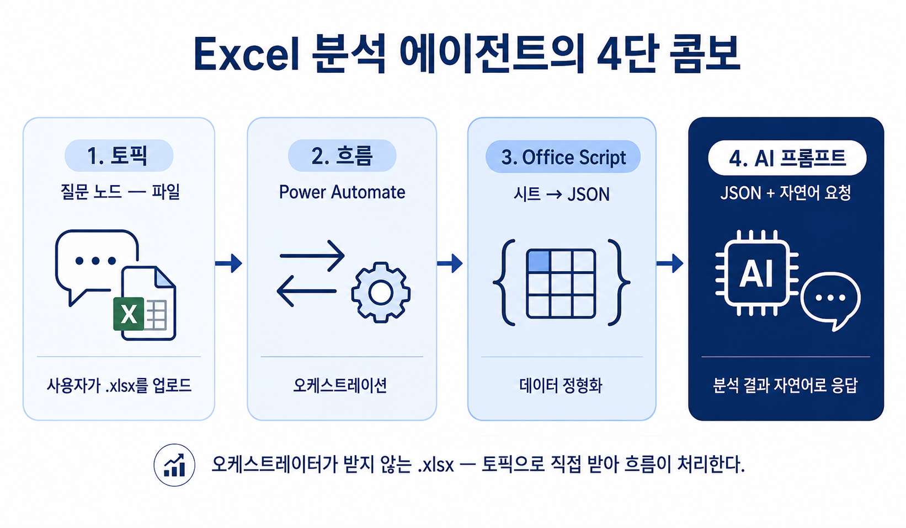

# S2. 엑셀 업로드 활용 실습 — Excel 첨부부터 AI 요약까지
{: .no_toc }

| 시간 | 소요 | 수강생 역할 |
|:-----|:-----|:-----------|
| 10:30 | 30분 | 🟡 따라보기 |


## 목차
{: .no_toc .text-delta }

1. TOC
{:toc}

---

## 1. 일상의 관찰 — PDF는 되는데 Excel은 안 된다

Copilot Studio 에이전트는 흥미롭게도 **채팅창에 첨부된 PDF·Word·이미지 같은 일반 문서는 오케스트레이터가 알아서 받아 잘 처리**합니다. 별도 토픽이나 흐름 없이도 "이거 요약해줘"라고만 하면 동작합니다. 이 흐름은 앞 세션 [S1 — 문서 업로드 활용 실습](s01-pdf-word) 에서 본격적으로 정교하게 다뤄봤습니다.

그런데 자연스러운 다음 질문은 이것입니다.

> "그럼 Excel은? 엑셀도 채팅에 그냥 첨부하면 되지 않을까?"

직접 해봅시다. 같은 에이전트에 `과일판매.xlsx`를 첨부하고 "이 데이터 좀 분석해줘"라고 입력해 보세요.

> 사용자: *(과일판매.xlsx 첨부)* "이 데이터 좀 분석해줘"
>
> 에이전트: 첨부하신 파일의 내용을 확인할 수 없습니다. / (또는 데이터를 보지 않고 일반론만 늘어놓음)

**안 됩니다.** 같은 채팅창인데 PDF는 되고 Excel은 안 됩니다. 왜 그럴까요?

---

## 2. 왜 Excel은 다른가 — 두 가지 벽

### 벽 ①: 오케스트레이터가 받지 않는다

현재 시점 기준으로 **Excel 파일은 오케스트레이터의 기본 처리 대상에서 빠져 있습니다.** PDF·Word·이미지처럼 자동으로 텍스트 추출이 일어나지 않아, 첨부 자체는 받지만 내용은 보지 못합니다.

> 💡 직접 한 번 테스트해 보세요. 같은 에이전트에 PDF를 첨부하면 답이 나오지만 xlsx를 첨부하면 일반론만 나옵니다.

### 벽 ②: 환경별로 처리 방식이 다르다

"코드로 직접 첨부 파일을 끄집어내면 되지 않을까?" 라는 우회로도 있습니다. 그런데 여기서 두 번째 문제가 등장합니다.

| 환경 | 첨부 파일 처리 방식 |
|:--|:--|
| Microsoft Teams | `activity.attachments`에 파일 메타가 들어옴 — 코드로 접근 가능 |
| Microsoft 365 Copilot | `activity.attachments`에 들어오지 **않음** |

Teams 한쪽만 동작하는 우회로를 짤 수는 있지만, **양쪽 환경에서 동일하게 동작하는 것을 보장하기는 어렵습니다.**

---

## 3. 해결 방향 — 토픽으로 직접 받기

벽이 둘이지만 답은 하나로 모입니다.

> **현 시점에서 Teams와 Copilot 어느 쪽에서도 동일하게 파일을 다루는 유일한 방법** — 토픽을 만들고, 토픽 안에 **"파일" 유형의 질문 노드**를 두는 것.

세션 1에서는 오케스트레이터에게 "알아서 처리해줘"라고 맡겼지만, **세션 2에서는 우리가 토픽으로 직접 받아 흐름에 넘기는 방식**을 씁니다. 받아 넘긴 후에는 또 한 가지 결정이 남습니다 — Excel 안의 데이터를 어떻게 LLM이 읽을 수 있는 형태로 바꾸느냐. 이건 **Office Script**로 시트를 JSON으로 변환해 해결합니다.

전체 조합:

- 토픽 (질문 노드 — 파일)
- → 흐름 (Power Automate)
- → Office Script (시트 → JSON)
- → AI 프롬프트 (JSON + 요청문 → 분석 결과)

이번 세션은 이 4단 콤보로 **사용자가 Excel을 첨부하면 자연어로 분석해주는 에이전트**를 만듭니다.

---

## 4. 완성된 모습 (시나리오)

> 사용자: "엑셀 분석"
>
> 에이전트: 분석할 Excel 파일을 첨부해주세요.
>
> 사용자: *(과일 판매 데이터 Excel 첨부)*
>
> 에이전트: 무엇을 알고 싶으신가요?
>
> 사용자: "사과의 연도별 평균 판매량을 알려줘"
>
> 에이전트: 사과의 연도별 평균 판매량은 다음과 같습니다 — 2023년 1,250개, 2024년 1,420개, 2025년 1,510개. 2024→2025년 증가율은 6.3%입니다.

---

## 5. 아키텍처 한눈에 보기



```
[사용자]
   ↓ 트리거: "엑셀분석"
[토픽] (Copilot Studio)
   ├ 질문 노드 ① — 요청문
   ├ 질문 노드 ② — 파일 (파일 메타 활성화)
   ↓ 흐름 호출 (입력: 요청문 + 파일 record)
[Power Automate 흐름]
   ├ ① OneDrive에 임시 저장
   ├ ② Office Script 실행 (시트 → JSON)
   ├ ③ AI 프롬프트 실행 (JSON + 요청문 → 분석 결과)
   ↓ 결과 텍스트 반환
[토픽 메시지 노드]
   ↓
[사용자에게 응답]
```

---

## 6. 17단계 핸즈온 — 두 페이지로 나눠 진행

본 세션은 17단계 핸즈온을 **두 페이지로 나눠** 진행합니다. 첫 페이지는 흐름(Backend)을 완성하고, 두 번째 페이지는 토픽(Frontend)으로 사용자 입구를 만듭니다.

| 페이지 | 다루는 단계 | 한 줄 요약 |
|:---|:---|:---|
| [실습① — 흐름 완성 (Step 1~12)](s02-1-excel-flow) | 흐름 골격 + Office Script + AI 프롬프트 | Excel을 받아 분석 결과 텍스트를 돌려주는 백엔드를 완성한다 |
| [실습② — 토픽 연결 (Step 13~17)](s02-2-excel-topic) | 토픽 + 질문 노드 + 흐름 호출 | 사용자가 "엑셀분석"이라고 부르면 흐름을 호출하는 입구를 만든다 |

> **시간 배분 (30분)**: 도입·아키텍처 5 / 실습① 흐름 완성 15 / 실습② 토픽 연결 8 / 마무리 2

---

## 7. 사전 준비 — 샘플 Excel

샘플 파일을 받아 OneDrive 작업 폴더에 업로드해두세요 — [과일판매.xlsx](../assets/files/과일판매.xlsx) (분기별 192행).

- 컬럼: `연도`, `분기`, `과일`, `판매량`
- 데이터: 192행 (사과·배 2006~2025 전 분기 + 감 2018~2025)
- 분석 거리: 장기 성장, 계절성(Q3·Q4 강세), 2020년 COVID 일시 하락, 신규 품목(감) 등장 등

> **포인트**: 이 단계에서는 "교육용 샘플"이지만, 실제 적용 시에는 **컬럼명이 깔끔한지 / 빈 행이 없는지 / 시트가 하나로 정리됐는지**가 정확도를 좌우합니다.

<!-- build-trigger: 2026-05-10 -->
