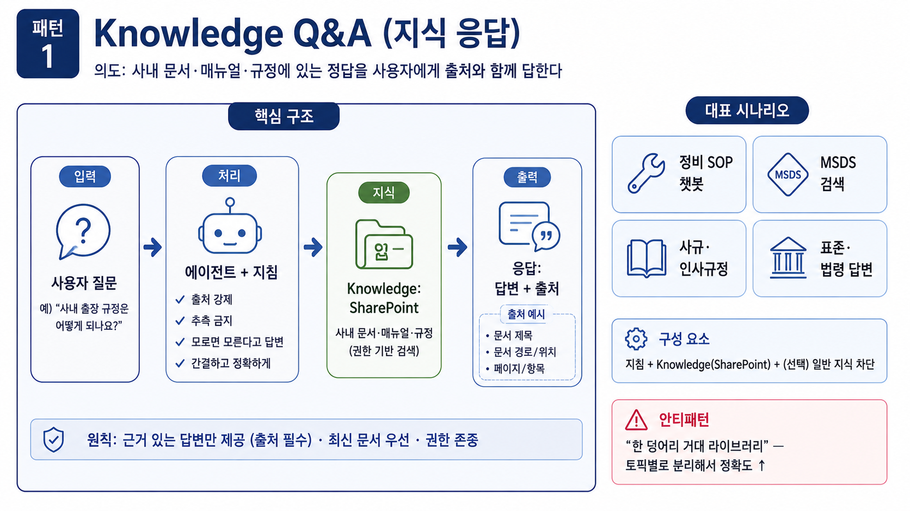
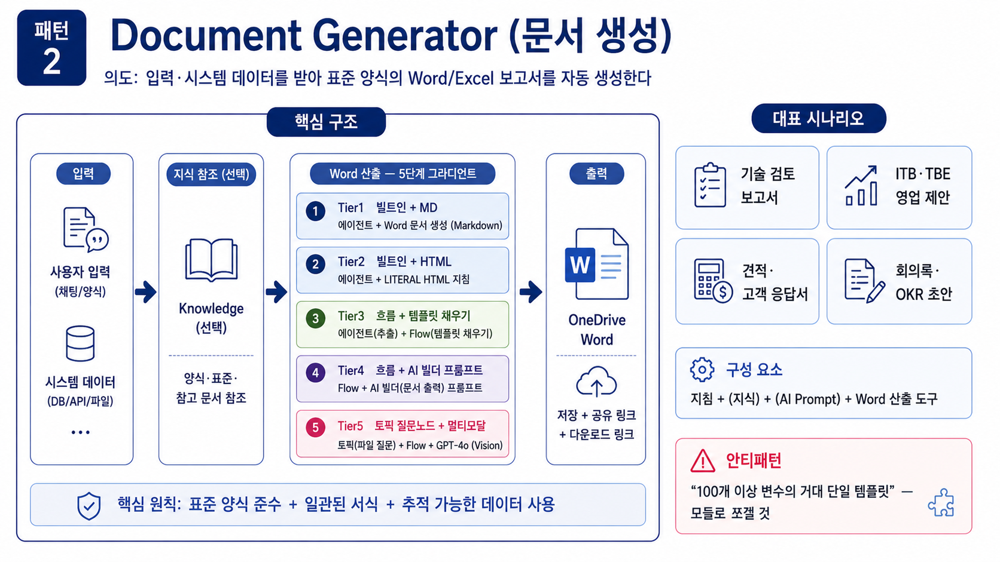
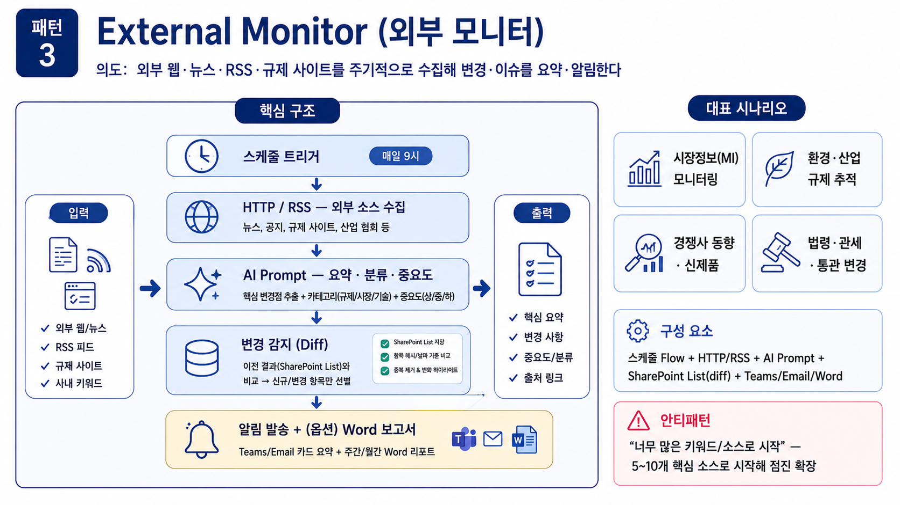
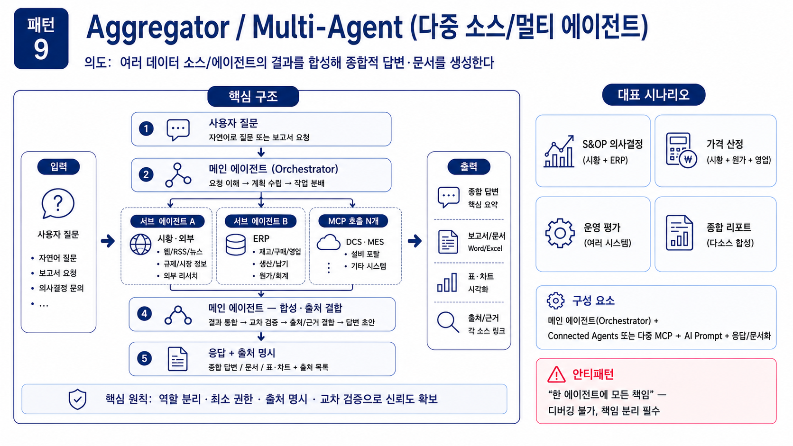

---
title: "A. Inform 그룹 (패턴 1·2·3·9)"
parent: "S3. 12 패턴 카탈로그"
grand_parent: "📗 심화과정"
nav_order: 1
---

# A. 정보 응답형 (Inform) 그룹
{: .no_toc }

사용자에게 정보를 제공하는 에이전트들. 답이 **이미 어딘가에 있고**, 에이전트는 그것을 찾아·합성해 보여줍니다.

## 목차
{: .no_toc .text-delta }

1. TOC
{:toc}

---

## 패턴 1. Knowledge Q&A (지식 응답)



**의도**: SharePoint·문서 라이브러리에 있는 내부 자료를 근거로 사용자 질문에 답한다.

**적용 상황**: 사규·매뉴얼·표준·MSDS 등 "정답이 문서 안에 이미 있는" 경우.

**구조**:

```
[사용자 질문]
   ↓
[에이전트 지침] (출처 인용 강제, 추측 금지)
   ↓
[Knowledge: SharePoint] → 관련 청크 검색
   ↓
[응답] 답변 + 출처
```

**구성 요소**: 지침 + Knowledge(SharePoint) + (선택) 일반 지식 차단

**자주 등장하는 적용**:

- 정비 SOP·절차 안내, 작업 매뉴얼 챗봇
- 외부 표준 문서 응답 (ISO·IEC·KOSHA 등)
- MSDS·화학물질 정보 검색
- 연구자산·논문·특허 검색
- 규제·법령 답변
- 사규·인사규정 챗봇

**핵심 주의점**:

- **출처 인용을 지침에 강제** — 환각 방지
- 최신 버전 관리 — 개정 이력이 있는 문서는 최신본만 노출
- 일반 지식 답변 차단 (필요 시) — "내부 문서에 없으면 모른다고 답하라"

**안티패턴**: 너무 광범위한 지식 라이브러리 한 덩어리. 토픽별로 분리해 정확도를 올린다.

---

## 패턴 2. Document Generator (문서 생성)



**의도**: 사용자 입력 또는 시스템 데이터를 받아 표준 양식의 Word/Excel 보고서를 자동 생성한다.

**적용 상황**: 정형 보고서, 견적서, ITB/TBE, 영업 제안서, 회의록 등.

**구조 (5단계 그라디언트)**:

```
[입력 (사용자/시스템)]
   ↓
[지식 참조] (가이드·과거 사례) — 선택
   ↓
[Word 산출 — 5가지 방식 중 시나리오에 맞는 것]
   ├ Tier 1: 빌트인 도구 + Markdown
   ├ Tier 2: 빌트인 도구 + HTML 인라인 CSS
   ├ Tier 3: 에이전트 추출 → 흐름 → Word 템플릿(콘텐츠 컨트롤) 채우기
   ├ Tier 4: 흐름 → AI 빌더 프롬프트(문서 출력)
   └ Tier 5: 토픽 질문 노드 → 흐름 → 멀티모달 프롬프트(문서 출력)
   ↓
[OneDrive 저장 + 다운로드 링크]
```

> **S1** 의 5-Tier 그라디언트가 이 패턴의 표준 구현입니다. [S1 — 문서 자동화 5-Tier](s01-pdf-word) 참조.

**구성 요소**: 지침 + (지식) + (AI Prompt) + Word 산출 도구

**자주 등장하는 적용**:

- 기술 검토·설계 검토 보고서
- ITB·TBE 등 영업 제안 문서
- 견적서·고객 응답서·무역 문서 (Tech Support Letter, 선적 서류 등)
- 회의록·OKR 초안·일일 보고
- 특허·법령 영향 보고
- 표준 양식의 사내 결재 보고서

**Tier 선택 기준**:

- **자유 본문, 빠르게 시작** → Tier 1
- **디자인이 중요, 흐름은 부담** → Tier 2
- **회사 표준 양식 고정 + 추출 결과 재사용** → Tier 3
- **양식과 추출이 한 자산으로 묶임** → Tier 4
- **스캔본·도장·결재서 + 결정적 폼 UX** → Tier 5

**안티패턴**: 한 번에 너무 많은 변수가 들어간 거대한 템플릿. 100개 이상 컨트롤이면 모듈로 쪼갤 것.

---

## 패턴 3. External Monitor (외부 모니터)



**의도**: 외부 웹/뉴스/RSS·규제 사이트를 주기적으로 수집해 변경·이슈를 요약·알림한다.

**적용 상황**: 규제 모니터링, 시황 추적, 경쟁사 동향, MI 보고.

**구조**:

```
[스케줄 트리거 (매일 9시 등)]
   ↓
[HTTP / RSS] 외부 소스 수집
   ↓
[AI Prompt] 요약·분류·중요도 판정
   ↓
[변경 감지] (이전 결과와 비교)
   ↓
[Teams/Email 발송] + (옵션) Word 보고서
```

**구성 요소**: 스케줄 Flow + HTTP/RSS + AI Prompt + 알림/Word

**자주 등장하는 적용**:

- 시장 정보(MI) 자동 모니터링
- 환경·안전·산업 규제 추적
- 경쟁사 동향·신제품 출시 추적
- ESG·그린워싱 점검
- 법령 개정·관세·통관 정책 모니터링

**핵심 주의점**:

- **변경 감지 로직** — 매일 똑같은 알림이 가지 않도록 SharePoint List에 마지막 결과 저장 → diff
- **신뢰 가능한 소스만** — 가짜뉴스 방지, RSS는 공식 사이트만
- 출처 URL을 결과에 항상 포함

**안티패턴**: 너무 많은 키워드/소스로 시작 → 노이즈만 늘어남. 5~10개 핵심 소스로 시작해 점진 확장.

---

## 패턴 9. Aggregator / Multi-Agent (다중 소스/멀티 에이전트)



| 항목 | 내용 |
|:--|:--|
| 의도 | 여러 데이터 소스/에이전트의 결과를 합성해 종합적 답변/문서 생성 |
| 구성 | 메인 에이전트 + 서브 에이전트(Connected Agents) 또는 다중 MCP 호출 |
| 자주 등장하는 적용 | S&OP 의사결정(외부 시황 + ERP), 가격 산정(시황 + 원가 + 영업 데이터), 운영 평가(여러 시스템 합성) |
| 주의 | 컨텍스트 결합 시 출처 명시, 한 에이전트 책임은 단일 |
| 안티패턴 | 모든 책임을 한 에이전트에 — 디버깅 불가 |

**구조**:

```
[사용자 질문]
   ↓
[메인 에이전트 / 오케스트레이터]
   ├ 서브 에이전트 1 (또는 MCP 1) — 시황
   ├ 서브 에이전트 2 (또는 MCP 2) — ERP
   └ 서브 에이전트 3 (또는 MCP 3) — 원가
   ↓
[AI Prompt] 결과 합성 + 출처 명시
   ↓
[응답]
```

> **현장 팁**: 서브 에이전트 책임을 좁게 정의(한 시스템·한 도메인)할수록 디버깅·재사용이 쉬워집니다.

---

## 다음 페이지

[B. Act 그룹 (패턴 4·5·6·10)](s03-2-act)
