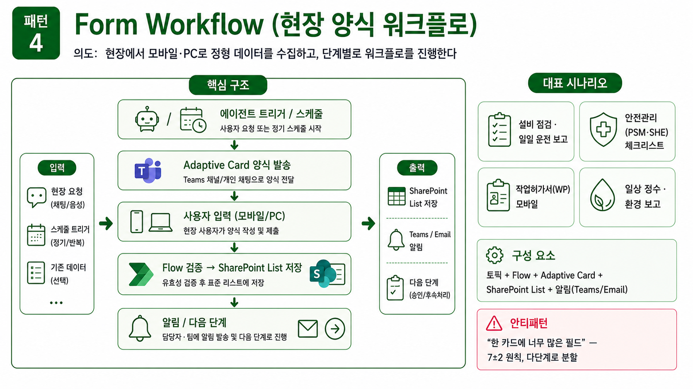
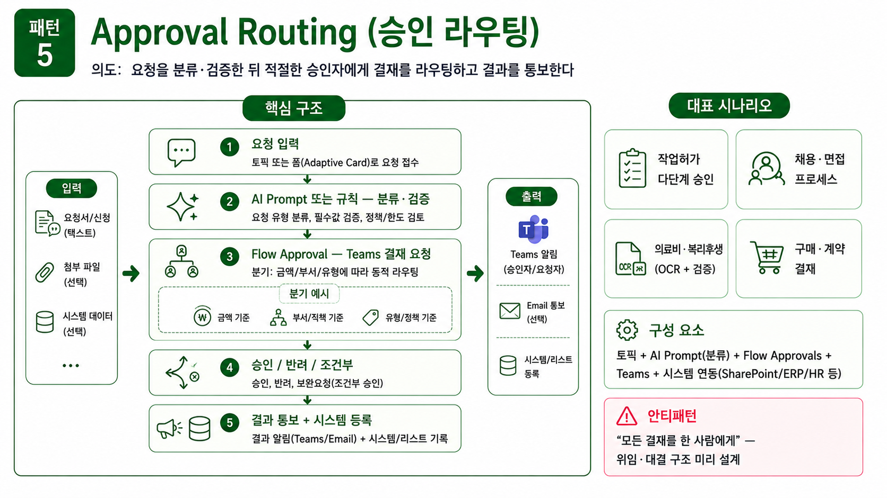
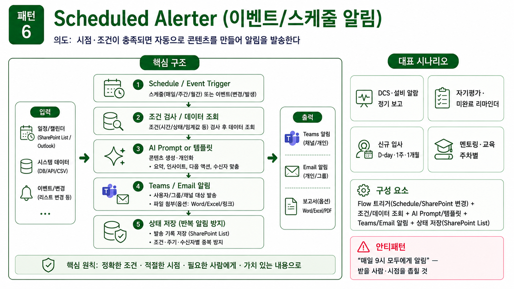
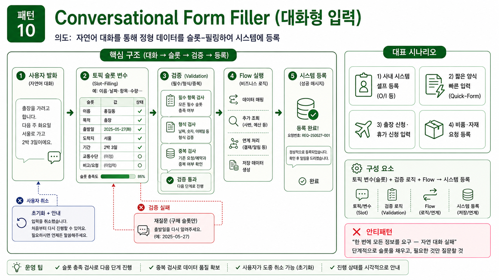

---
title: "B. Act 그룹 (패턴 4·5·6·10)"
parent: "S3. 12 패턴 카탈로그"
grand_parent: "📗 심화과정"
nav_order: 2
---

# B. 프로세스형 (Act) 그룹
{: .no_toc }

업무 프로세스를 실행·촉진하는 에이전트들. 답을 주는 것이 아니라 **무언가를 시키는** 시나리오입니다.

## 목차
{: .no_toc .text-delta }

1. TOC
{:toc}

---

## 패턴 4. Form Workflow (현장 양식 워크플로)



**의도**: 현장에서 모바일·PC로 정형 데이터를 수집하고, 단계별로 워크플로를 진행한다.

**적용 상황**: 점검·체크리스트·작업허가·일일 보고.

**구조**:

```
[에이전트 트리거 / 스케줄]
   ↓
[Adaptive Card] 양식 발송 (Teams)
   ↓
[사용자 입력]
   ↓
[Flow] 검증 → SharePoint List 저장
   ↓
[알림 / 다음 단계]
```

**구성 요소**: 토픽 + Flow + Adaptive Card + SharePoint List + 알림

**자주 등장하는 적용**:

- 설비 점검·일일 운전 보고
- 안전관리(PSM·SHE) 체크리스트 수검
- 작업허가서(WP) 모바일 발급·이행
- 일상 정수·환경관리 수행 보고
- 사내 활동(연수·세미나·독서모임) 후기 추적

**핵심 주의점**:

- Adaptive Card는 **Teams에서 가장 자연**스럽고, Copilot에서는 일부 컨트롤만 지원
- **검증 로직**을 Flow에 넣을 것 (필수 항목, 형식, 범위)
- 감사 추적용 로그 SharePoint List에 별도 저장 권장

**안티패턴**: Adaptive Card 안에 너무 많은 필드. 7±2개 원칙. 많아지면 다단계로 분할.

---

## 패턴 5. Approval Routing (승인 라우팅)



**의도**: 요청을 분류·검증한 뒤 적절한 승인자에게 결재를 라우팅하고 결과를 통보한다.

**적용 상황**: 채용·구매·의료비·작업허가·기안.

**구조**:

```
[요청 입력]
   ↓
[AI Prompt 또는 규칙] 분류·검증
   ↓
[Flow Approval] 결재 요청 (Teams)
   ↓
[승인/반려/조건부]
   ↓
[결과 통보 + 시스템 등록]
```

**구성 요소**: 토픽 + AI Prompt(분류) + Flow Approvals + Teams + 시스템 연동

**자주 등장하는 적용**:

- 작업허가 다단계 승인
- 채용·면접 프로세스 자동화
- 의료비·복리후생 신청 (OCR + 검증 + 승인)
- 구매·계약 결재 라우팅

**핵심 주의점**:

- **결재선이 동적**일 때 — 금액·부서·유형에 따라 라우팅 분기
- **반려 시 처리** 흐름 명확히 — 사용자에게 사유 전달
- SLA(처리 기한) 모니터링 — 미응답 알림

**안티패턴**: 모든 결재를 한 사람에게. 위임·대결 구조 미리 설계.

---

## 패턴 6. Scheduled Alerter (이벤트/스케줄 알림)



**의도**: 시점·조건이 충족되면 자동으로 콘텐츠를 만들어 알림을 발송한다.

**적용 상황**: 입사일 기반 온보딩, 미완료 추적, 정기 리포트, DCS 알람 보고.

**구조**:

```
[Schedule / Event Trigger]
   ↓
[조건 검사 / 데이터 조회]
   ↓
[AI Prompt or 템플릿] 콘텐츠 생성
   ↓
[Teams/Email 알림]
```

**구성 요소**: Flow 트리거(Schedule/SharePoint 변경 등) + AI Prompt + 알림

**자주 등장하는 적용**:

- DCS·설비 알람 정기 보고
- 자기평가·미완료 항목 리마인더
- 신규 입사자 온보딩 (D-day, 1주, 1개월 알림)
- 멘토링·교육 주차별 알림
- 사내 활동 미작성자 리마인더

**핵심 주의점**:

- **소음 방지** — 같은 알림이 반복되지 않도록 상태 저장
- **개인화** — 받는 사람 이름·역할에 맞춘 메시지
- **언제 끄나** — 종료 조건을 반드시 명시 (예: 입사 90일 후 온보딩 종료)

**안티패턴**: "매일 9시에 모두에게 알림" — 곧바로 무시당함. 받을 사람·시점을 좁혀라.

---

## 패턴 10. Conversational Form Filler (대화형 입력)



| 항목 | 내용 |
|:--|:--|
| 의도 | 자연어 대화를 통해 정형 데이터를 슬롯-필링하여 시스템에 등록 |
| 구성 | 토픽 변수 + 검증 로직 + Flow → 시스템 등록 |
| 자주 등장하는 적용 | 사내 시스템 셀프 등록(O/I 등), 짧은 양식 빠른 입력(Quick-Form) |
| 주의 | 슬롯 충족 검사, 중복 검사, 사용자가 도중 취소할 수 있게 |
| 안티패턴 | 한 번에 모든 정보 요구 — 자연 대화 실패 |

**구조**:

```
[사용자 진입]
   ↓
[토픽 — 슬롯 1 질문]  →  변수 1
[토픽 — 슬롯 2 질문]  →  변수 2  ← 자연어 응답에서 여러 슬롯 동시 추출 가능
   ...
   ↓
[검증 / 중복 검사]
   ↓
[Flow] 시스템 등록
   ↓
[확인 응답]
```

> **Form Workflow (패턴 4) 와의 차이**: Form Workflow 는 Adaptive Card 양식이 한 번에 떠서 사용자가 채우는 결정적 입력. Conversational Form 은 토픽 대화로 한 슬롯씩 받아 자연 대화 흐름. 상황에 맞는 것을 선택하세요.

---

## 다음 페이지

[C. Integrate 그룹 (패턴 7·8·11·12)](s03-3-integrate)
