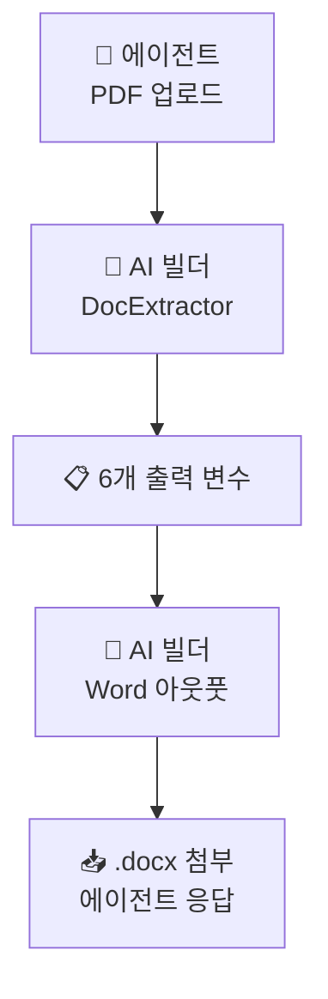

# 실습 ②: Word 아웃풋 + 흐름 연결
{: .no_toc }

| 시간 | 소요 | 수강생 역할 |
|:-----|:-----|:-----------|
| 11:10 | 20분 | 🟢 직접 실습 |

## 목차
{: .no_toc .text-delta }

1. TOC
{:toc}

---

## 이 실습의 목표

- 실습 ①에서 만든 `DocExtractor` 출력을 받아
- **Word 템플릿 + AI 빌더 Word 아웃풋**으로 .docx 보고서를 생성
- **Power Automate 흐름**으로 에이전트 ↔ AI 빌더 ↔ Word를 잇는다

---

## 1. Word 템플릿 만들기

새 Word 문서를 만들고 **자리표시자**를 넣어둡니다.

```
┌─────────────────────────────┐
│       📋 문서 요약 보고서      │
│                              │
│  문서 제목: {title}           │
│  작성자: {author}             │
│  작성일: {writtenDate}        │
│                              │
│  ■ 핵심 요약                  │
│  {summary}                   │
│                              │
│  ■ 주요 항목                  │
│  {items}                     │
│                              │
│  ■ 특이사항                   │
│  {notes}                     │
│                              │
│  생성일: 2026-05-02           │
└─────────────────────────────┘
```

### 자리표시자 삽입 방법

Word에서 **개발 도구 → 콘텐츠 컨트롤 → 일반 텍스트** 로 각 자리에 자리표시자를 만들고, 각 컨트롤의 **태그(또는 제목)**를 다음과 같이 설정합니다.

| Word 콘텐츠 컨트롤 태그 | 매핑할 출력 변수 |
|:-----|:-----|
| `title` | `DocExtractor.title` |
| `author` | `DocExtractor.author` |
| `writtenDate` | `DocExtractor.writtenDate` |
| `summary` | `DocExtractor.summary` |
| `items` | `DocExtractor.items` |
| `notes` | `DocExtractor.notes` |

파일명: `보고서_템플릿.docx` — 솔루션 폴더(또는 SharePoint 라이브러리)에 저장.

---

## 2. AI 빌더 Word 아웃풋 (개념)

| 항목 | 설명 |
|:-----|:-----|
| 입력 | Word 템플릿 + 자리표시자별 텍스트 값 |
| 처리 | 자리표시자에 값 매핑 |
| 출력 | **새 .docx 파일** (이진 데이터) |

{: .note }
> Word 아웃풋은 “템플릿 + 값 → 완성된 .docx 파일”을 만들어주는 액션입니다. AI가 새로 글을 쓰는 게 아니라 **자리만 채워주는 것**이라 결과가 일관됩니다.

---

## 3. Power Automate 흐름

Copilot Studio → 도구 → 흐름 → **새 에이전트 흐름**

### 트리거

| 항목 | 설정 |
|:-----|:-----|
| 트리거 | 에이전트에서 흐름 실행 |
| 입력 | `sourceDoc` (파일 형식) |

### 액션 ① — `DocExtractor` 호출

| 항목 | 값 |
|:-----|:---|
| 액션 | AI 빌더 → 프롬프트 실행 |
| 프롬프트 | `DocExtractor` |
| `sourceDoc` | 트리거의 `sourceDoc` |

출력: 6개 변수 (`title`, `author`, `writtenDate`, `summary`, `items`, `notes`)

### 액션 ② — Word 아웃풋

| 항목 | 값 |
|:-----|:---|
| 액션 | AI 빌더 → **Word로 정보 작성** |
| 템플릿 | `보고서_템플릿.docx` |
| 자리표시자 매핑 | `title` → `DocExtractor.title` … (6개 모두) |

출력: `outputDoc` (이진 .docx 파일)

### 액션 ③ — 에이전트에게 응답

| 항목 | 값 |
|:-----|:---|
| 액션 | 에이전트에게 응답 |
| 메시지 | `"보고서를 생성했습니다: " + DocExtractor.title` |
| 첨부 | `outputDoc` (.docx) |

---

## 4. 흐름 시각화



---

## 5. 에이전트에 도구로 등록

Copilot Studio → 에이전트 → **도구 → + 도구 추가 → 흐름**

| 항목 | 값 |
|:-----|:---|
| 도구 이름 | `SummarizeDoc` |
| 설명 | PDF 문서를 요약 보고서(.docx)로 변환합니다 |

지침에 한 줄 추가:

```
PDF 문서가 첨부되면 SummarizeDoc 도구로 요약 보고서를 생성하세요.
```

---

## 6. 테스트

테스트 패널에서:

1. **PDF를 끌어다 놓고** "이 문서 요약 보고서로 만들어줘"
2. AI 빌더 → Word 아웃풋이 순서대로 실행
3. 채팅창에 .docx 첨부가 답변으로 표시되는지 확인
4. 다운로드해서 자리표시자가 모두 채워졌는지 확인

| 발화 | 기대 동작 |
|:-----|:---------|
| PDF 첨부 + "요약 보고서" | .docx 첨부 응답 |
| PDF 없이 "요약 보고서" | 에이전트가 PDF 요청 |

---

## 자주 나오는 문제

| 증상 | 원인 | 대응 |
|:-----|:-----|:-----|
| 자리표시자가 그대로 남음 (`{title}`) | Word 콘텐츠 컨트롤 태그 불일치 | 컨트롤 태그명 확인 |
| `items`가 한 줄 텍스트로 들어감 | Word는 줄바꿈을 그대로 유지 — 출력에서 줄바꿈 포함되었는지 | 프롬프트의 `items` 형식 점검 |
| .docx가 채팅에 안 보임 | 응답에서 첨부 누락 | "응답"의 첨부 항목 확인 |

---

## 체크리스트

- [ ] `보고서_템플릿.docx` (자리표시자 6개) 준비
- [ ] AI 빌더 Word 아웃풋 액션 추가
- [ ] 흐름이 PDF → DocExtractor → Word 아웃풋으로 흘러감
- [ ] 에이전트에 `SummarizeDoc` 도구 등록
- [ ] 강의용 PDF로 끝까지 동작 확인

---

## 정리 — 두 실습 합치면

| 실습 | 학습 포인트 |
|:----|:---------|
| ① | AI 빌더 텍스트 프롬프트(파일 입력) = **문서를 정해진 포맷의 정형 텍스트로 변환** |
| ② | Word 아웃풋 + 흐름 = **정형 텍스트를 동일한 모양의 .docx로 양산** |

> 추출 프롬프트와 Word 템플릿만 바꾸면 **계약서 정리·회의록 정리·경쟁사 분석 보고서** 등으로 무한히 응용 가능합니다.

---

다음 모듈: [S4. 커스텀 커넥터](s04-custom-connector)
