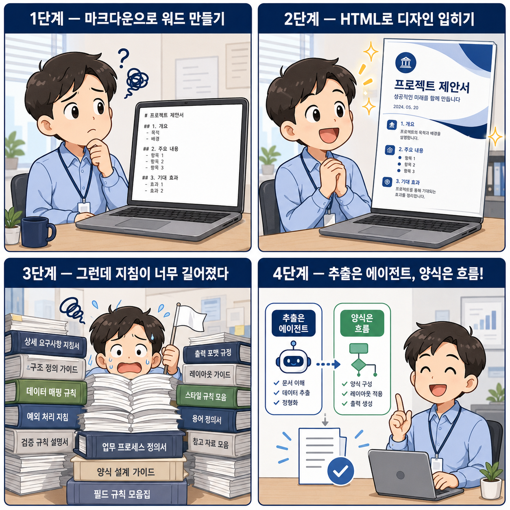
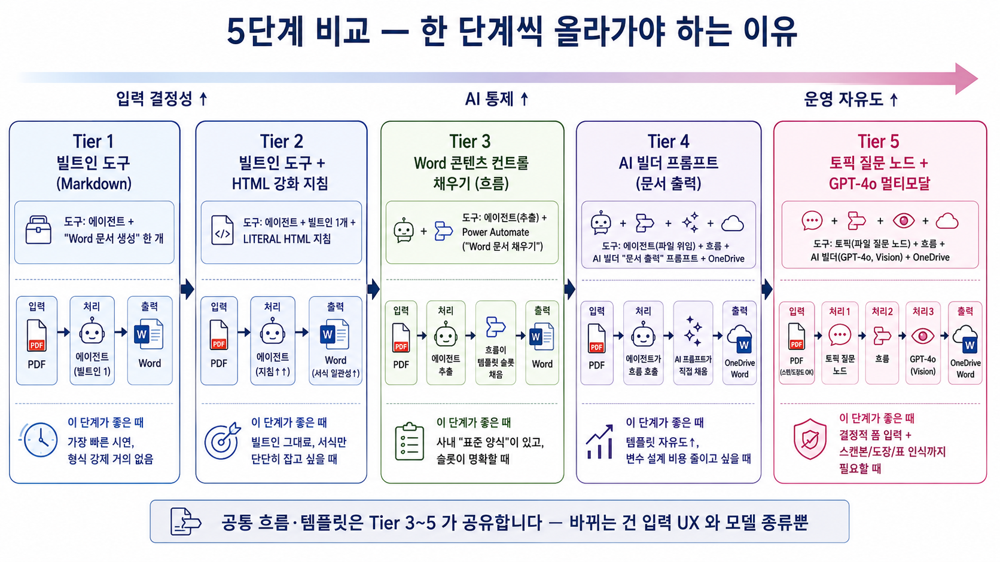

# S3. 문서 자동화 — 빌트인 도구부터 멀티모달 AI 빌더까지
{: .no_toc }

| 시간 | 소요 | 수강생 역할 |
|:-----|:-----|:-----------|
| 10:00 | 60분 | 🟢 직접 실습 (Tier 1·2) + 🟡 따라보기 (Tier 3·4·5) |

## 목차
{: .no_toc .text-delta }

1. TOC
{:toc}

---

## 1. 들어가며 — 회의록 정리에 시간을 빼앗기는 문제

여러분 회사에서는 회의가 끝나면 누가 회의록을 정리하나요? 그리고 그 회의록은 사람마다·부서마다 양식이 제각각이지 않으신가요?

- 어떤 회의록은 줄글로 가득 찬 노트
- 어떤 회의록은 표 형식
- 또 어떤 PM은 PPT 한 장으로 정리

이걸 회사 표준 양식의 회의록으로 다시 정리하는 일이 1차로 사람의 시간을 잡아먹습니다. 그리고 이런 "양식 변환" 작업은 회의록뿐이 아닙니다 — **계약서·견적서·평가 보고서·인증 문서·영수증 정리…** 어떤 양식의 PDF를 받아 회사 표준 양식의 Word로 떨어뜨리는 일은 거의 모든 부서에 존재합니다.

이 반복 작업을 에이전트가 대신 하게 할 수 있다면, 사람은 검토와 의사결정에만 집중할 수 있습니다.

> **이 세션의 목표** — "임의 양식의 PDF" 를 받아 "회사 표준 양식의 Word" 로 떨어뜨리는 에이전트를 **5가지 방식**으로 단계적으로 만들어 봅니다.

---

## 2. 시나리오 — 회의록 표준화 에이전트

이번에 함께 만들 에이전트의 완성된 모습:

> 사용자: *(임의 형식의 회의록 PDF 첨부)* "이거 우리 회사 표준 회의록으로 만들어줘"
>
> 에이전트: 추출했습니다. 표준 회의록 Word 파일을 OneDrive에 저장했습니다 — [다운로드 링크]

목표 출력 항목 (출력 스키마):

- 회의 제목 (`title`), 일시 (`meetingDate`), 장소 (`location`)
- 참석자 (`attendees`)
- 안건 (`agenda`)
- 결정 사항 (`decisions`)
- 액션 아이템 (`actionItems` — 각 항목: `owner`, `dueDate`, `task`)
- 다음 회의 일정 (`nextMeeting`)

---

## 3. 한 가지 자연스러운 의문 — "그냥 채팅에 PDF 붙이면 안 되나?"

> "Copilot Studio 에이전트는 채팅창에 PDF를 던져주면 자동으로 읽어주잖아. 굳이 흐름을 따로 만들 필요가 있어?"

맞습니다. **Copilot Studio의 오케스트레이터는 PDF · Word · 이미지 같은 일반 문서를 채팅에 첨부만 해도 잘 처리**합니다. 앞서 [S2 — Excel 분석 17단계](s02-receipt-excel) 에서 확인했듯 Excel은 이 경로가 막혀있었지만, 일반 문서는 그냥 채팅 첨부만으로도 속시원하게 읽힌다는 뜻입니다.

그러나 현업에서는 다음 두 가지 요구가 거의 항상 따라붙습니다.

1. **출력 형식이 매번 같아야 한다** — 자유 답변이 아니라 **회사 표준 양식**의 정해진 항목·정해진 순서
2. **결과를 Word 파일로 받고 싶다** — 채팅 응답 텍스트가 아니라 다운로드해 메일에 첨부할 수 있는 .docx

이 두 가지 때문에 "채팅에 붙이고 끝"이 아니라 한 단계 더 가야 합니다. 이번 세션은 PDF 분해 자체에 시간을 들이지 않고, 다음 두 가지에 집중합니다.

1. **지침(또는 프롬프트)으로 출력 스키마 고정** — PDF에서 무엇을, 어떤 구조로 뽑을지를 박아넣어 일관성을 만든다
2. **Word 산출** — 추출한 내용을 사람이 받아볼 수 있는 .docx 보고서로 떨군다

---

## 4. 5단계 그라디언트 — 같은 시나리오, 점점 정교해지는 방식

같은 시나리오(회의록 PDF → 표준 Word)를 **5가지 방식**으로 단계적으로 만들어 봅니다. 각 단계는 직전 단계의 부족한 점을 채워가며, 결국 회사 어떤 시나리오에도 적용할 수 있는 5가지 패턴을 손에 쥐는 것이 이 세션의 목표입니다.

| # | 방식 | 학습 포인트 | 다음 단계로 가는 동기 |
|---|---|---|---|
| **Tier 1** | Markdown + 빌트인 도구 | 가장 쉬운 5분 경로 | "한국 비즈니스 양식 느낌이 안 나" |
| **Tier 2** | HTML(인라인 CSS) + 빌트인 도구 | 디자인을 LITERAL로 박기 | "지침이 너무 크고 무겁다" |
| **Tier 3** | 에이전트 추출 → 흐름 → Word 템플릿 채우기 | 책임 분리·오케스트레이션 | "AI 빌더가 안 쓰였네" |
| **Tier 4** | 파일 → 흐름 → AI 빌더 프롬프트 (문서 출력) | AI 빌더 본격 활용 | "채팅 첨부 의존 + 텍스트 위주 추출" |
| **Tier 5** | 토픽 질문 노드 → 흐름 → 멀티모달 프롬프트 (문서 출력) | 결정적 폼 + 비전 | (이번 세션 완성) |

### 5단계 비교표

| 항목 | Tier 1 | Tier 2 | Tier 3 | Tier 4 | Tier 5 |
|---|---|---|---|---|---|
| 사전 작업 | 없음 | 없음 (지침만) | Word 템플릿 (콘텐츠 컨트롤) | Word 템플릿 (`{{}}`) + AI 빌더 프롬프트 | 좌동 + 토픽 질문 노드 |
| Power Automate 흐름 | 불필요 | 불필요 | 필요 | 필요 | 필요 |
| AI Builder 프롬프트 | 불필요 | 불필요 | 불필요 | **필수** | **필수 (멀티모달)** |
| 추가 라이선스 | 없음 | 없음 | Premium | Premium + AI Builder 크레딧 | Premium + AI Builder 크레딧 |
| 디자인 자유도 | 낮음 | **높음** | 중간 (템플릿) | 중간 (템플릿) | 중간 (템플릿) |
| 결과 일관성 | ★★ | ★★★ | ★★★★★ | ★★★★ | ★★★★★ |
| PDF 처리 깊이 | 텍스트 | 텍스트 | 텍스트 | 텍스트 | **비전 (스캔·표·도장)** |
| 파일 받는 UX | 채팅 첨부 | 채팅 첨부 | 채팅 첨부 | 채팅 첨부 | **질문 노드 (결정적 폼)** |
| 지침/프롬프트 분량 | 짧음 | **김** | 짧음 | 짧음 | 짧음 |
| 만드는 시간 | 5분 | 15분 | 30분 | 25분 | 10분 (Tier 4 변형) |
| 적합 시나리오 | 자유 보고서 | 디자인 중요 보고서 | 정형 보고서 | 대량·재사용 추출 자산 | 스캔본·도장 결재서·표 위주 PDF |

> **읽는 법**: 위에서 아래로 갈수록 사전 작업과 라이선스 비용이 늘지만, 결과의 일관성과 재사용성이 올라갑니다. 본 세션에서는 **Tier 1 → Tier 5 순서로 같은 시나리오를 5번 만듭니다.** 각 단계의 끝에서 "이게 부족해서 다음 단계로 간다"는 동기를 자연스럽게 느끼는 것이 핵심입니다.

> **시간 배분 (60분)**: 도입 5 / Tier 1 8 / Tier 2 15 / Tier 3 22 / Tier 4·5 묶음 8 / 마무리 2

---

## 5. 다음 페이지로

이제 5-Tier를 차례대로 실습합니다. 각 단계의 마지막에 "이게 부족해서 다음 단계로 간다"는 동기를 꼭 짚으면서 진행하세요.

| 페이지 | 다루는 Tier |
|:---|:---|
| [실습① — Tier 1·2: 빌트인 도구 (Markdown / HTML)](s03-1-pdf-extract) | 흐름 없이 5분에 만드는 Tier 1, 인라인 CSS로 한국 비즈니스 양식을 입히는 Tier 2 |
| [실습② — Tier 3: 책임 분리 + Word 콘텐츠 컨트롤](s03-2-word-output) | LLM은 추출만, 흐름이 Word 템플릿을 채운다 |
| [실습③ — Tier 4·5: AI 빌더 문서 출력 + 멀티모달](s03-3-tier4-aibuilder) | AI 빌더 프롬프트의 문서 출력 + 토픽 질문 노드로 결정적 폼 만들기 |
