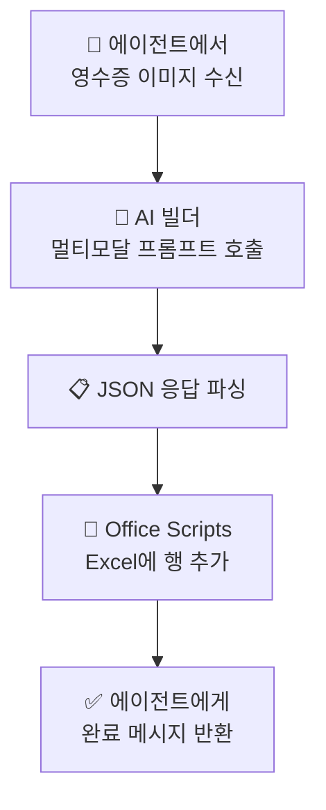

# AI 빌더 — 영수증 → 엑셀 자동 저장
{: .no_toc }

| 시간 | 소요 | 수강생 역할 |
|:-----|:-----|:-----------|
| 14:05 | 45분 | 🟢 직접 실습 |

## 목차
{: .no_toc .text-delta }

1. TOC
{:toc}

---

## 이 모듈에서 배우는 것

- **AI 빌더 멀티모달 프롬프트** — 이미지에서 정보를 추출하는 AI 프롬프트 구축
- **JSON 구조화 출력** — AI가 추출한 정보를 정해진 형식으로 받기
- **Office Scripts** — Excel에 데이터를 자동으로 저장하는 스크립트
- **전체 파이프라인** — 영수증 사진 → AI 분석 → JSON → Excel 저장

---

## 전체 흐름

```
📸 영수증 사진 업로드 (에이전트 대화)
    ↓
🤖 AI 빌더 멀티모달 프롬프트
   "이미지에서 날짜, 가맹점, 항목, 금액을 추출하세요"
    ↓
📋 JSON 출력
   { "날짜": "2026-04-01", "가맹점": "스타벅스", "항목": "식비", "금액": 15000 }
    ↓
⚡ Power Automate 흐름
    ↓
📝 Office Scripts 호출
    ↓
📊 Excel 경비 대장에 행 추가
```

---

## 왜 이 조합인가?

| 기술 | 역할 | 비유 |
|:-----|:-----|:-----|
| AI 빌더 멀티모달 | 영수증을 읽고 이해 | 👀 눈 |
| JSON 출력 | 정보를 정리된 형태로 변환 | 📋 정리 |
| Office Scripts | Excel에 데이터를 기록 | ✍️ 손 |

{: .highlight }
> 기본과정에서는 **텍스트 대화 내용**을 Excel에 저장했습니다(M11). 심화과정에서는 **이미지를 AI가 분석**해서 저장합니다.

---

## Step 1: AI 빌더 멀티모달 프롬프트

### 멀티모달이란?

**텍스트 + 이미지**를 함께 입력받는 AI 프롬프트입니다.

| AI 프롬프트 유형 | 입력 | 출력 |
|:----------------|:-----|:-----|
| 텍스트 프롬프트 | 텍스트 | 텍스트 |
| **멀티모달 프롬프트** | **텍스트 + 이미지** | 텍스트 |

### 프롬프트 설계

```
[시스템 프롬프트]
영수증 이미지에서 다음 정보를 추출하여 JSON으로 반환하세요:
- 날짜 (YYYY-MM-DD 형식)
- 가맹점명
- 항목 (교통비/숙박비/식비/기타 중 분류)
- 금액 (숫자만, 원 단위)

반드시 아래 JSON 형식으로만 응답하세요:
{"날짜": "", "가맹점": "", "항목": "", "금액": 0}
```

{: .note }
> JSON 형식을 **엄격하게 지정**하는 것이 핵심입니다. 후속 처리(Scripts)에서 파싱이 가능해야 합니다.

---

## Step 2: JSON 이해하기

JSON은 데이터를 **이름: 값** 쌍으로 정리하는 형식입니다.

```json
{
  "날짜": "2026-04-01",
  "가맹점": "스타벅스 광화문점",
  "항목": "식비",
  "금액": 15000
}
```

| 이름 | 값 | Excel 컬럼 |
|:-----|:---|:----------|
| 날짜 | 2026-04-01 | A열 |
| 가맹점 | 스타벅스 광화문점 | B열 |
| 항목 | 식비 | C열 |
| 금액 | 15000 | D열 |

{: .tip }
> JSON은 **컴퓨터가 읽기 쉬운 표** 정도로 이해하면 됩니다.

---

## Step 3: Office Scripts

Office Scripts는 Excel에서 반복 작업을 자동화하는 도구입니다.

### 스크립트 역할

```
JSON 데이터 수신 → 파싱 → Excel 테이블 마지막 행에 추가
```

### Excel 경비 대장 구조

| 날짜 | 가맹점 | 항목 | 금액 |
|:-----|:------|:-----|:-----|
| 2026-04-01 | 스타벅스 광화문점 | 식비 | 15,000 |
| 2026-04-01 | 서울역 KTX | 교통비 | 59,800 |
| ... | ... | ... | ... |

---

## Step 4: Power Automate로 연결

전체를 Power Automate 흐름으로 엮습니다.



---

## 기본과정 vs 심화과정 — 데이터 저장

| | 기본과정 (M11) | 심화과정 (S4) |
|:--|:--------------|:-------------|
| 입력 | 텍스트 대화 | **이미지 (영수증)** |
| 처리 | 없음 (그대로 저장) | **AI 멀티모달 분석** |
| 형식 | 시스템 변수 그대로 | **JSON 구조화** |
| 저장 | Excel 행 추가 커넥터 | **Office Scripts** |
| 활용 | 대화 로그 | **경비 대장 자동화** |
