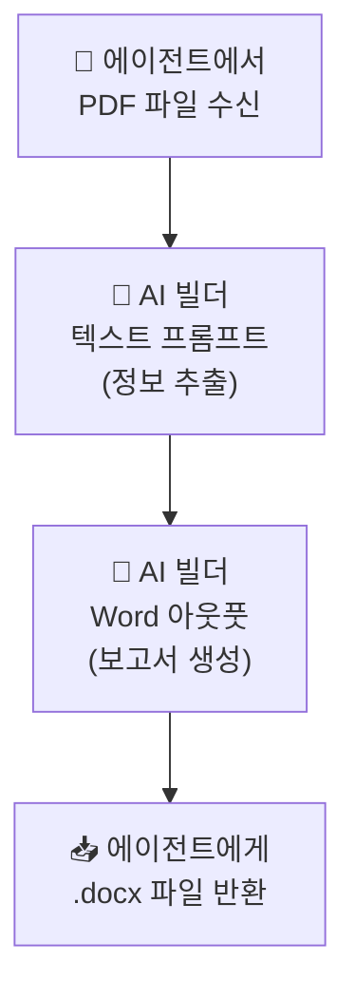

# AI 빌더 — PDF → Word 보고서 자동 생성
{: .no_toc }

| 시간 | 소요 | 수강생 역할 |
|:-----|:-----|:-----------|
| 15:35 | 40분 | 🟢 직접 실습 |

## 목차
{: .no_toc .text-delta }

1. TOC
{:toc}

---

## 이 모듈에서 배우는 것

- **파일 첨부 처리** — 에이전트가 대화 중 업로드된 PDF를 읽는 방법
- **AI 빌더 텍스트 프롬프트** — 정해진 포맷에 따라 핵심 정보 추출
- **AI 빌더 Word 아웃풋** — 추출 결과를 Word 템플릿에 넣어 .docx 생성
- **문서 → 문서 파이프라인** — PDF 입력부터 Word 출력까지 전체 흐름

---

## 전체 흐름

```
📄 PDF 문서 업로드 (예: 제안서, 계약서)
    ↓
🤖 AI 빌더 텍스트 프롬프트
   "정해진 포맷에 따라 핵심 정보를 추출하세요"
    ↓
📋 추출 결과
   - 문서 제목
   - 작성자 / 작성일
   - 핵심 요약 (3줄)
   - 주요 항목 (표)
   - 특이사항
    ↓
📝 AI 빌더 Word 아웃풋
   Word 템플릿에 추출 결과 매핑
    ↓
📥 .docx 파일 다운로드
```

---

## S6과의 비교

| | S6 (영수증 → 엑셀) | S7 (PDF → Word) |
|:--|:------------------|:----------------|
| 입력 | 이미지 | **PDF 문서** |
| AI 유형 | 멀티모달 프롬프트 | **텍스트 프롬프트** |
| 출력 형식 | JSON → Excel | **Word 문서(.docx)** |
| 시나리오 | 영수증 경비 처리 | **문서 요약 보고서** |

{: .highlight }
> S6에서는 AI가 **이미지를 보고** 데이터를 뽑았고, S7에서는 AI가 **문서를 읽고** 보고서를 만듭니다. 입력과 출력이 모두 **파일**인 것이 핵심입니다.

---

## Step 1: PDF 파일 수신 설정

에이전트가 대화 중 파일 첨부를 받을 수 있도록 설정합니다.

### 지원 파일 형식

| 형식 | 설명 |
|:-----|:-----|
| PDF | 제안서, 계약서, 보고서 |
| DOCX | Word 문서 |
| PPTX | 프레젠테이션 |
| TXT | 텍스트 파일 |

---

## Step 2: 정보 추출 프롬프트

### 추출 포맷 정의

```
[시스템 프롬프트]
첨부된 문서에서 아래 항목을 추출하여 정리하세요:

1. 문서 제목
2. 작성자 (없으면 "미상")
3. 작성일 (없으면 "미상")
4. 핵심 요약 (3문장 이내)
5. 주요 항목 (항목명 + 설명, 최대 5개)
6. 특이사항 또는 주의점 (있는 경우만)

각 항목은 명확하게 구분하여 출력하세요.
```

{: .note }
> 추출 포맷을 **명확하게 정의**하는 것이 품질의 핵심입니다. 포맷이 모호하면 AI 출력도 들쑥날쑥합니다.

### 예시 출력

```
1. 문서 제목: 2026년 상반기 사내 복지 개선안
2. 작성자: 총무팀 김지원
3. 작성일: 2026-03-15
4. 핵심 요약:
   - 건강검진 항목을 확대하고 가족 동반 옵션을 추가합니다.
   - 원격 근무 지원금을 월 10만원에서 15만원으로 인상합니다.
   - 사내 동호회 지원 예산을 연 200만원으로 통일합니다.
5. 주요 항목:
   - 건강검진 확대: 기존 기본검진 → 종합검진 + 가족 옵션
   - 원격 근무 지원금: 10만원 → 15만원/월
   - 동호회 지원: 팀별 차등 → 연 200만원 통일
   - 교육 포인트: 신규 도입, 연 50만 포인트
   - 휴게공간 리모델링: 3층 라운지 확대
6. 특이사항: 건강검진 확대는 4월부터, 나머지는 7월부터 적용
```

---

## Step 3: Word 아웃풋

### Word 아웃풋이란?

AI 빌더의 **Word 아웃풋**은 추출 결과를 **Word 템플릿에 채워 넣어 .docx 파일을 생성**하는 기능입니다.

### AI 빌더 프롬프트 4가지 유형

| 유형 | 입력 | 출력 | 사용한 모듈 |
|:-----|:-----|:-----|:-----------|
| 텍스트 프롬프트 | 텍스트 | 텍스트 | M14(기본), S7 |
| 멀티모달 프롬프트 | 텍스트 + 이미지 | 텍스트 | **S6** |
| 코드 인터프리터 | 데이터 | 텍스트 + 차트 | — |
| **Word 아웃풋** | 텍스트 | **.docx 파일** | **S7** |

### Word 템플릿 구조

```
┌─────────────────────────────┐
│         📋 문서 요약 보고서    │
│                              │
│  문서 제목: [제목]            │
│  작성자: [작성자]  작성일: [날짜]│
│                              │
│  ■ 핵심 요약                  │
│  [요약 내용]                  │
│                              │
│  ■ 주요 항목                  │
│  ┌────────────┬──────────┐  │
│  │ 항목       │ 설명      │  │
│  ├────────────┼──────────┤  │
│  │ [항목1]    │ [설명1]   │  │
│  │ [항목2]    │ [설명2]   │  │
│  └────────────┴──────────┘  │
│                              │
│  ■ 특이사항                   │
│  [특이사항 내용]              │
│                              │
│  생성일: [자동]               │
└─────────────────────────────┘
```

---

## Step 4: Power Automate로 연결



---

## 활용 시나리오

| 시나리오 | PDF 입력 | Word 출력 |
|:---------|:---------|:----------|
| 제안서 검토 | 제안서 원문 | 핵심 요약 보고서 |
| 계약서 분석 | 계약서 PDF | 주요 조항 정리서 |
| 회의록 작성 | 회의 메모/녹취 | 공식 회의록 |
| 경쟁사 분석 | 경쟁사 보도자료 | 분석 요약서 |

{: .tip }
> **프롬프트(추출 포맷)만 바꾸면** 같은 구조로 다양한 문서 변환에 활용할 수 있습니다.
