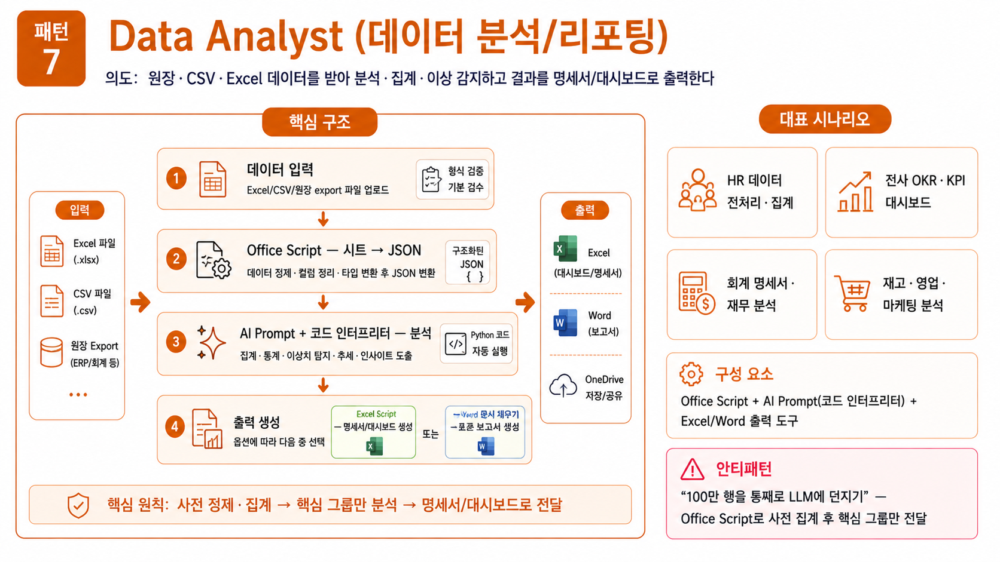
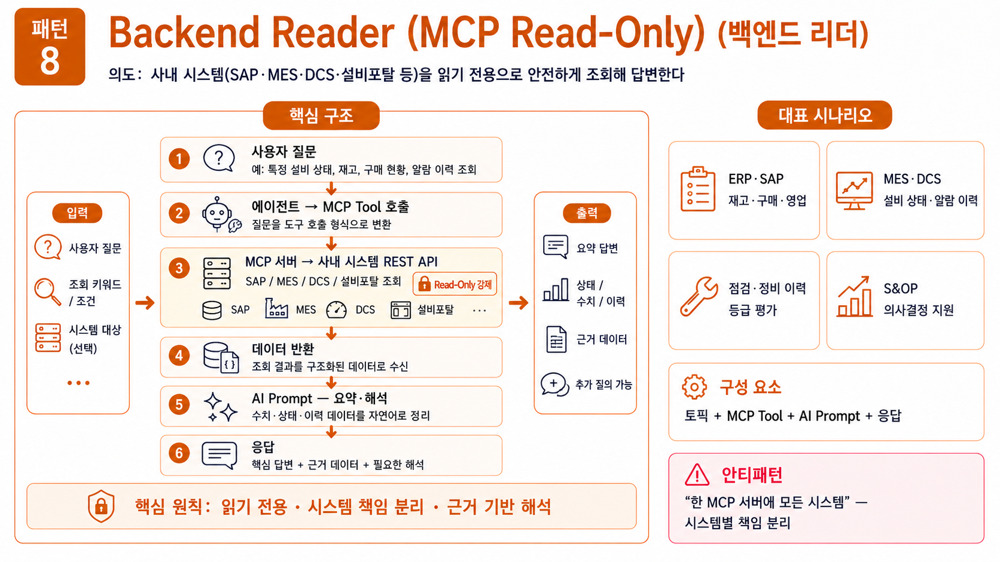
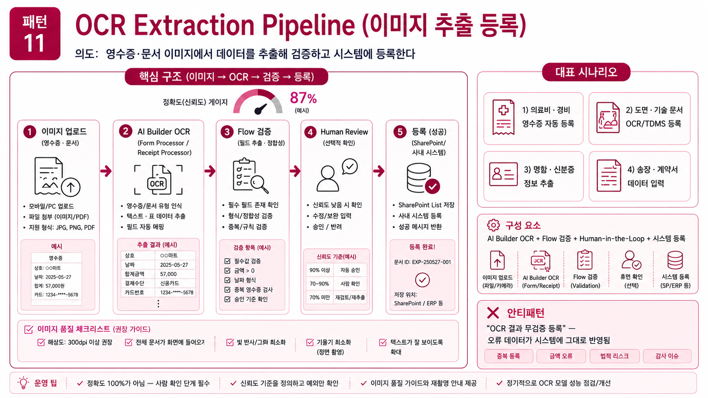
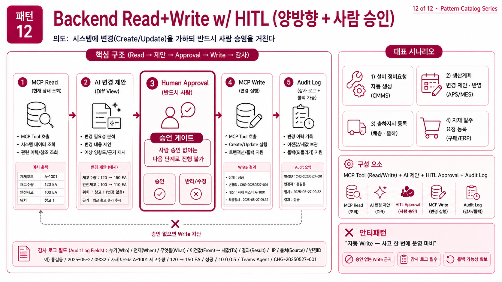

# C. 데이터·시스템형 (Integrate) 그룹
{: .no_toc }

데이터·외부 시스템과 직접 연결해 일하는 에이전트들. **사내 시스템·정형 데이터·이미지** 가 등장하면 이 그룹입니다.

## 목차
{: .no_toc .text-delta }

1. TOC
{:toc}

---

## 패턴 7. Data Analyst (데이터 분석/리포팅)



**의도**: 원장·CSV·Excel 데이터를 받아 분석·집계·이상 감지하고 결과를 명세서/대시보드로 출력한다.

**적용 상황**: 회계 명세서, HR 분석, 재고 분석, KPI 대시보드.

**구조**:

```
[데이터 입력 (Excel/CSV/원장 export)]
   ↓
[Office Script] 시트 → JSON
   ↓
[AI Prompt + 코드 인터프리터] 분석
   ↓
[Excel Script] 명세서 생성
또는
[Word 문서 채우기]
```

**구성 요소**: Office Script + AI Prompt(코드 인터프리터) + Excel/Word 출력

> **세션 2** 의 핸즈온이 이 패턴의 기본형입니다. [S2](s02-receipt-excel) 참조.

**자주 등장하는 적용**:

- HR 데이터 전처리·집계
- 전사 OKR/KPI 대시보드
- 회계 명세서·재무 분석 (리스·세액공제·매출 주석·특수관계자 등)
- 재고·영업·마케팅 분석

**핵심 주의점**:

- **코드 인터프리터 ON 필수** — 숫자 정확성
- **데이터 토큰 한도** — 큰 시트는 사전 집계/필터링
- **개인정보·재무 데이터** — DLP, 마스킹 정책 확인

**안티패턴**: 100만 행을 통째로 LLM에 던지기. Office Script로 사전 집계해 핵심 그룹만 LLM에 보낸다.

---

## 패턴 8. Backend Reader (MCP Read-Only)



**의도**: 사내 시스템(SAP·MES·DCS·설비포탈 등)을 **읽기 전용**으로 안전하게 조회해 답변한다.

**적용 상황**: 재고 현황, 설비 이력, 알람 현황, 운영 실적, 인사 정보 조회.

**구조**:

```
[사용자 질문]
   ↓
[에이전트] → MCP Tool 호출
   ↓
[MCP 서버] → 사내 시스템 REST API
   ↓
[데이터 반환]
   ↓
[AI Prompt] 요약·해석
   ↓
[응답]
```

**구성 요소**: 토픽 + MCP Tool + AI Prompt + 응답

**자주 등장하는 적용**:

- ERP·SAP 재고·구매·영업 조회
- MES·DCS 설비 상태·알람 이력 조회
- 점검·정비 이력 등급 평가
- 검사 계획 수립 보조
- S&OP 의사결정 지원
- 시황·가격 예측 지원

**핵심 주의점**:

- **Read-Only 강제** — Write 엔드포인트는 노출하지 않음
- **인증·권한** — OAuth 2.0, RLS, GDPR 마스킹
- **MCP 서버 클러스터링** — 시스템별 분리 (SAP / 공정·설비 / 외부시황 / 특허 / SHE)
- **응답 시간** — 캐싱 또는 비동기

**안티패턴**: 한 MCP 서버에 모든 시스템을 다 넣기. 시스템별 책임 분리.

---

## 패턴 11. OCR Extraction Pipeline



| 항목 | 내용 |
|:--|:--|
| 의도 | 영수증·문서 이미지에서 데이터를 추출해 검증/등록 |
| 구성 | AI Builder OCR → Flow 검증 → SharePoint/시스템 등록 |
| 자주 등장하는 적용 | 의료비·경비 영수증 자동 등록, 도면·기술 문서 OCR/TDMS |
| 주의 | 정확도 100%가 아님 — **사람 확인 단계** 필수, 이미지 품질 가이드 |
| 안티패턴 | OCR 결과를 무검증으로 시스템 등록 |

**구조**:

```
[이미지 입력]
   ↓
[AI Builder OCR / 멀티모달 프롬프트] 추출
   ↓
[Flow 검증] (필수 항목, 형식, 범위)
   ↓
[사람 확인 단계] (Adaptive Card or 승인)
   ↓
[SharePoint/시스템 등록]
```

> **세션 1 Tier 5** 의 멀티모달 변형이 이 패턴의 진화형입니다. 도장·표 위주 PDF, 스캔본까지 비전으로 처리.

---

## 패턴 12. Backend Read+Write w/ HITL (양방향 + 사람 승인)



| 항목 | 내용 |
|:--|:--|
| 의도 | 시스템에 변경(Create/Update)을 가하되 반드시 사람 승인을 거침 |
| 구성 | MCP Read → 변경 제안 → Approval → MCP Write → 감사 로그 |
| 자주 등장하는 적용 | 설비 정비요청 자동 생성, 생산계획 변경, 출하지시 등록 |
| 주의 | **승인 없는 Write 금지**, 감사 로그 필수, 롤백 가능성 |
| 안티패턴 | 자동 Write — 사고 한 번에 운영 마비 |

**구조**:

```
[사용자 요청]
   ↓
[MCP Read] 현재 상태 조회
   ↓
[AI Prompt] 변경 제안서 생성 (이전/이후 비교)
   ↓
[Flow Approval] 사람 승인 (Teams)  ← HITL 필수
   ↓
[MCP Write] 시스템 변경
   ↓
[감사 로그] (SharePoint List or 시스템 로그)
   ↓
[결과 통보]
```

> **HITL = Human-In-The-Loop**. Read+Write 자동화는 매력적이지만 사고 한 번에 운영이 마비됩니다. 승인을 강제로 끼워 넣는 패턴이 안전합니다.

---

## 마무리 — 12 패턴을 손에 쥐고

오늘 본 12개 패턴은 **에이전트 설계의 어휘**입니다. 새 시나리오를 받으면:

1. [부모 페이지의 결정 트리](s09-design-patterns) 로 패턴 후보 1~3 선택
2. 안티 영역 6개에 해당하지 않는지 점검
3. 4단계 워크북으로 한 줄 의도 → 도구 목록 → 분리 결정

이 프로세스를 거친 에이전트만 실제 개발에 들어가면, **PoC 후 폐기되는 비율이 크게 줄어듭니다.**

> **점심 후** [S4 커스텀 커넥터](s04-custom-connector) 에서 패턴 8·12 의 기반인 **외부 REST API → 도구화** 를 직접 다룹니다.
