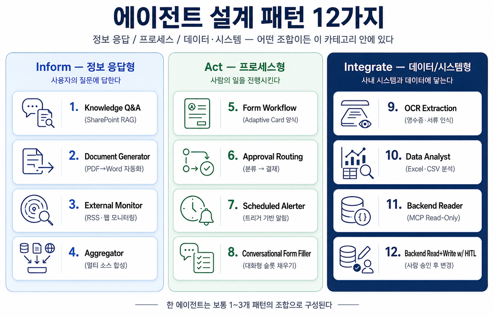
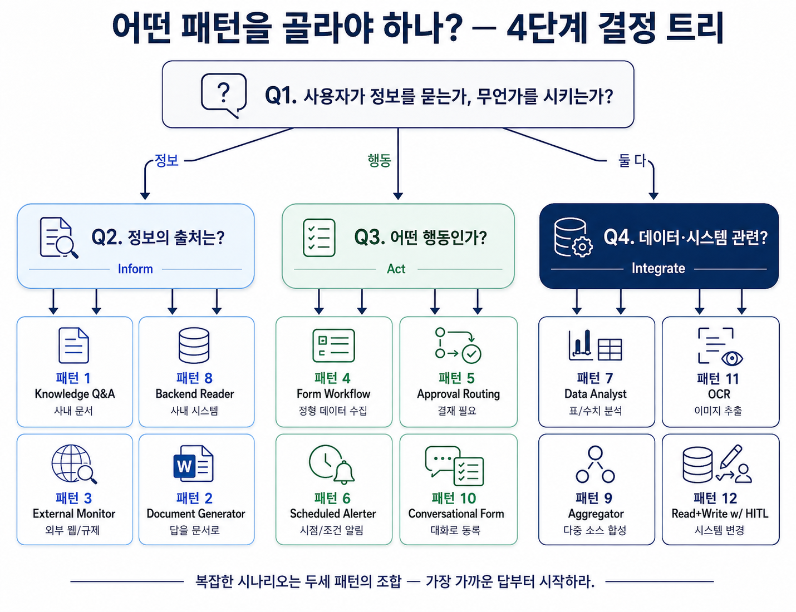
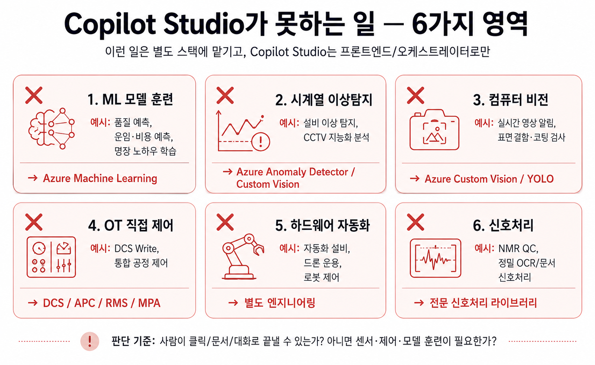

# 세션 3 — 에이전트 설계 패턴 카탈로그
{: .no_toc }

| 시간 | 소요 | 수강생 역할 |
|:-----|:-----|:-----------|
| 11:00 | 30분 | 🟡 강의 + 토론 |

## 목차
{: .no_toc .text-delta }

1. TOC
{:toc}

---

## 1. 왜 패턴이 필요한가

지금까지 여러 산업·업무에서 Copilot Studio 에이전트 사례를 수십~수백 건 살펴본 경험으로 보면, **체감상 70~80%의 시나리오가 Copilot Studio 단독 또는 MCP 연계로 구현 가능**합니다. 그리고 그 구현 가능한 사례를 다시 들여다보면 거의 모든 에이전트가 **소수의 반복되는 구조**로 환원됩니다.

| 도구 | 등장 빈도 | 주 용도 |
|:--|:--|:--|
| Knowledge(SharePoint) | 매우 자주 | 지침·매뉴얼 RAG |
| AI Prompt | 매우 자주 | 요약·분류·초안 |
| Flow 알림 | 자주 | 이벤트 알림 |
| Word 출력 | 자주 | 보고서·문서 |
| Flow 승인 | 종종 | 결재 자동화 |
| Excel/Office Script | 종종 | 데이터 집계 |
| HTTP/RSS | 종종 | 외부 모니터링 |
| Adaptive Card | 가끔 | 현장 입력 |
| AI Builder OCR | 가끔 | 영수증·이미지 |

이 도구들이 결합되는 **방식**을 정리한 것이 패턴입니다. 패턴을 알고 있으면:

1. 새 요청을 들었을 때 "이건 ◯◯ 패턴이네" 하고 빠르게 분류 가능
2. 비슷한 에이전트를 재사용하면서 변형
3. "이건 Copilot Studio로 안 되는 ❌ 영역"을 즉시 판단 가능

---

## 2. 데이터 × 지식·도구 매트릭스 (선행 개념)

패턴 카탈로그로 들어가기 전에 한 가지 사고 프레임을 짚고 갑니다 — **데이터의 정형/비정형** × **지식/도구**.

| | 정형 데이터 | 비정형 데이터 |
|:--|:--|:--|
| **지식 (Knowledge)** 으로 노출 | 마스터·코드·룩업 테이블 (SharePoint List/Excel as Knowledge) | 매뉴얼·SOP·표준 (SharePoint 문서) |
| **도구 (Tool)** 로 호출 | Excel/CSV/DB API (Office Script · HTTP · MCP) | 파일 입력형 AI 빌더 프롬프트, 멀티모달 |

읽는 법:

- **정보를 사용자가 자유롭게 묻는다 → 지식**
- **정보가 매번 정해진 형식으로 가공/계산되어야 한다 → 도구**
- **정형 데이터를 자유 검색하려면** 지식 칸 (예: 부서 마스터)
- **비정형 데이터를 정형 결과로 가공하려면** 도구 칸 (예: 회의록 PDF → Word 회의록)

> **중요**: 같은 데이터라도 **목적이 자유 검색이냐 정형 가공이냐** 에 따라 칸이 달라집니다. 한 데이터를 두 칸에 동시에 둘 수도 있습니다 (예: 회의록 모음을 매뉴얼로는 지식, 표준화는 도구).

이 매트릭스로 분류한 다음, 아래 12 패턴 중 어떤 결합인지 본격적으로 골라가는 흐름입니다.

---

## 3. 분류 축 — 12 패턴

본 카탈로그는 에이전트의 **목적**을 기준으로 3그룹으로 나눕니다.



| 그룹 | 목적 | 패턴 수 |
|:--|:--|:--|
| **A. 정보 응답형 (Inform)** | 사용자에게 정보를 제공 | 4 |
| **B. 프로세스형 (Act)** | 업무 프로세스를 실행/촉진 | 4 |
| **C. 데이터·시스템형 (Integrate)** | 데이터·외부 시스템과 연결 | 4 |
| | | **총 12** |

### 12 패턴 한눈에 보기

| # | 그룹 | 패턴 | 한 문장 의도 |
|:--|:--|:--|:--|
| 1 | Inform | Knowledge Q&A | 사내 문서 RAG로 답변 |
| 2 | Inform | Document Generator | 표준 양식 문서 자동 생성 (5-Tier) |
| 3 | Inform | External Monitor | 외부 웹/규제 주기 수집·요약 |
| 9 | Inform | Aggregator/Multi-Agent | 다중 소스 합성 종합 답변 |
| 4 | Act | Form Workflow | 현장 정형 입력 → 워크플로 |
| 5 | Act | Approval Routing | 분류·검증 → 결재 라우팅 |
| 6 | Act | Scheduled Alerter | 시점·조건 충족 시 자동 알림 |
| 10 | Act | Conversational Form Filler | 대화로 슬롯 필링 → 시스템 등록 |
| 7 | Integrate | Data Analyst | Excel/CSV 분석 → 명세서/대시보드 |
| 8 | Integrate | Backend Reader (MCP RO) | 사내 시스템 읽기 전용 조회 |
| 11 | Integrate | OCR Extraction Pipeline | 이미지 추출 → 검증/등록 |
| 12 | Integrate | Backend RW + HITL | 변경은 반드시 사람 승인 |

### 그룹별 자세한 페이지

| 페이지 | 다루는 패턴 |
|:---|:---|
| [A. Inform 그룹 (패턴 1·2·3·9)](s09-1-inform) | Knowledge Q&A · Document Generator · External Monitor · Aggregator |
| [B. Act 그룹 (패턴 4·5·6·10)](s09-2-act) | Form Workflow · Approval Routing · Scheduled Alerter · Conversational Form |
| [C. Integrate 그룹 (패턴 7·8·11·12)](s09-3-integrate) | Data Analyst · Backend Reader · OCR · Backend RW+HITL |

---

## 4. 패턴 선택 가이드 (결정 트리)

새 시나리오를 받았을 때 다음 순서로 자문해 패턴을 선택합니다.



```
Q1. 사용자가 정보를 묻는가, 무언가를 시키는가?
    ├ 정보 → Q2 (Inform 그룹)
    ├ 행동 → Q3 (Act 그룹)
    └ 둘 다 → Q4 (Integrate / 합성)

Q2. 정보의 출처는?
    ├ 사내 문서 → 패턴 1 (Knowledge Q&A)
    ├ 사내 시스템 (SAP/MES 등) → 패턴 8 (Backend Reader)
    ├ 외부 웹/규제 → 패턴 3 (External Monitor)
    └ 답을 "문서로" 주는 게 목적 → 패턴 2 (Document Generator)

Q3. 어떤 행동인가?
    ├ 정형 데이터 수집 → 패턴 4 (Form Workflow)
    ├ 결재가 필요 → 패턴 5 (Approval Routing)
    ├ 시점/조건 알림 → 패턴 6 (Scheduled Alerter)
    └ 대화로 등록 → 패턴 10 (Conversational Form)

Q4. 데이터·시스템 관련?
    ├ 표/수치 분석 → 패턴 7 (Data Analyst)
    ├ 이미지 추출 → 패턴 11 (OCR)
    ├ 다중 소스 합성 → 패턴 9 (Aggregator)
    └ 시스템에 변경 → 패턴 12 (Read+Write w/ HITL)
```

---

## 5. 안티 영역 (Copilot Studio가 못하는 일)



여러 사례를 살펴보면 **약 20~25%는 ❌ "Copilot Studio로 도저히 안 됨"** 영역에 속합니다. 이런 영역은 **Copilot Studio를 프론트엔드/오케스트레이터로만** 쓰고, 실제 처리는 별도 스택에 맡깁니다.

| 영역 | 예시 과제 | 권장 대안 |
|:--|:--|:--|
| ML 모델 훈련 | 품질 예측, 운임·비용 예측, 명장 노하우 학습 | Azure Machine Learning |
| 시계열 이상탐지 | 설비 이상 탐지, CCTV 지능화 분석 | Azure Anomaly Detector / Custom Vision |
| 컴퓨터 비전 | 실시간 영상 알림, 표면 결함·코팅 검사 | Azure Custom Vision / YOLO |
| OT 직접 제어 | DCS Write, 통합 공정 제어 | DCS / APC / RMS / MPA |
| 하드웨어 자동화 | 자동화 설비, 드론 운용, 로봇 제어 | 별도 엔지니어링 |
| 신호처리 | NMR QC, 정밀 OCR/문서 신호처리 | 전문 신호처리 라이브러리 |

**판단 기준**: "이걸 사람이 하려면 클릭/문서/대화로 충분한가, 아니면 센서·제어·모델 훈련이 필요한가?" 후자라면 ❌.

---

## 6. 4단계 설계 워크북

새 에이전트를 설계할 때 다음 4단계 워크북을 사용하세요.

| 단계 | 질문 | 산출물 |
|:--|:--|:--|
| 1 | **무엇을 하는 에이전트인가?** (한 문장) | 한 줄 의도 |
| 2 | **결정 트리(§4)로 패턴 선택** | 1~3개 후보 패턴 |
| 3 | **데이터 소스/도구 정의** | 지식·MCP·Flow·AI Prompt 목록 |
| 4 | **❌ 영역 점검** (§5 표 대조) | "안 되는 부분 분리" 결정 |

이 워크북을 통과한 에이전트만 실제 개발에 들어가면, **PoC 후 폐기되는 에이전트의 비율이 크게 줄어듭니다.**

---

## 7. 다음 세션으로 — 점심 후 외부 연결

오전의 3세션(S3 5-Tier · S2 Excel · S9 12 패턴)으로 "오늘 무엇을 만들 수 있는지" 와 "어떻게 분류·선택하는지" 의 큰 그림이 잡혔습니다.

점심 후 [S4 커스텀 커넥터](s04-custom-connector) 부터는 외부 연결의 폭을 넓힙니다.
